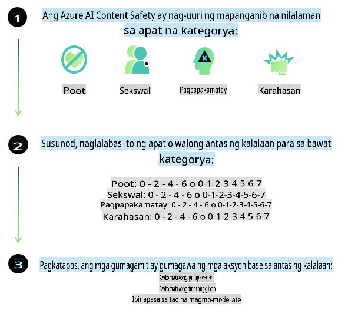
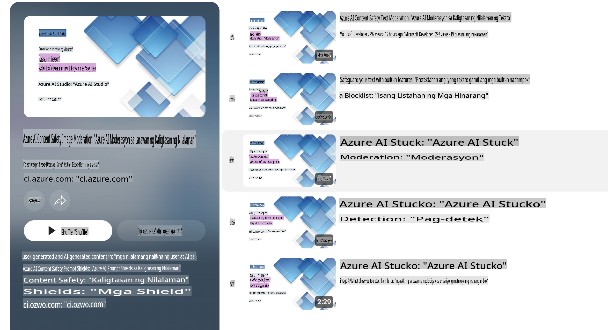

# Kaligtasan ng AI para sa mga Phi na modelo  
Ang Phi na pamilya ng mga modelo ay binuo alinsunod sa [Microsoft Responsible AI Standard](https://query.prod.cms.rt.microsoft.com/cms/api/am/binary/RE5cmFl), na isang pangkalahatang hanay ng mga kinakailangan ng kumpanya batay sa sumusunod na anim na prinsipyo: pananagutan, transparency, katarungan, pagiging maaasahan at kaligtasan, privacy at seguridad, at pagiging inklusibo na bumubuo sa [Mga Prinsipyo ng Responsible AI ng Microsoft](https://www.microsoft.com/ai/responsible-ai).  

Tulad ng mga naunang Phi na modelo, ginamit ang multi-faceted na pagsusuri sa kaligtasan at post-training approach, na may karagdagang hakbang para sa mga multi-lingual na kakayahan ng release na ito. Ang aming paraan sa safety training at mga pagsusuri, kabilang ang pagsubok sa iba't ibang wika at mga kategorya ng panganib, ay nakadetalye sa [Phi Safety Post-Training Paper](https://arxiv.org/abs/2407.13833). Bagamat nakikinabang ang mga Phi na modelo mula sa pamamaraang ito, dapat ipatupad ng mga developer ang pinakamahusay na praktis sa responsible AI, kabilang ang pagma-mapa, pagsukat, at pagbawas ng mga panganib na kaugnay ng kanilang partikular na paggamit at kontekstong kultural at lingguwistiko.  

## Mga Pinakamahusay na Praktis  

Tulad ng iba pang mga modelo, ang Phi na pamilya ng mga modelo ay maaaring magpakita ng mga pag-uugali na hindi patas, hindi maaasahan, o nakakasakit.  

Ang ilan sa mga limitasyon ng SLM at LLM na dapat mong malaman ay:  

- **Kalidad ng Serbisyo:** Ang Phi na mga modelo ay pangunahing sinanay sa mga tekstong Ingles. Ang mga wika maliban sa Ingles ay makakaranas ng mas mababang performance. Ang mga baryasyon ng wikang Ingles na may mas kaunting representasyon sa training data ay maaaring makaranas ng mas mababang performance kumpara sa standard na American English.  
- **Representasyon ng Mga Panganib at Pagpapatuloy ng Stereotypes:** Ang mga modelong ito ay maaaring mag-over o mag-under-represent ng mga grupo ng tao, burahin ang representasyon ng ilang grupo, o magpatibay ng mga nakaka-degrade o negatibong stereotypes. Sa kabila ng safety post-training, maaaring naroroon pa rin ang mga limitasyong ito dahil sa magkakaibang antas ng representasyon ng iba't ibang grupo o dami ng mga halimbawa ng negatibong stereotypes sa training data na sumasalamin sa mga tunay na pattern at bias sa lipunan.  
- **Hindi Angkop o Nakakasakit na Nilalaman:** Ang mga modelong ito ay maaaring lumikha ng iba pang uri ng hindi angkop o nakakasakit na nilalaman, na maaaring hindi angkop para sa mga sensitibong konteksto nang walang karagdagang mitigations na naaangkop sa partikular na kaso ng paggamit.  
- **Pagiging Maaasahan ng Impormasyon:** Ang mga language model ay maaaring bumuo ng mga walang kwentang nilalaman o mag-imbento ng nilalaman na maaaring tunog makatwiran ngunit hindi tama o lipas na.  
- **Limitadong Saklaw para sa Code:** Ang karamihan ng Phi-3 na training data ay nakabatay sa Python at gumagamit ng mga karaniwang package tulad ng "typing, math, random, collections, datetime, itertools". Kung ang modelo ay bumuo ng mga Python script na gumagamit ng ibang mga package o mga script sa ibang mga wika, mariing inirerekomenda namin sa mga gumagamit na manu-manong i-verify ang lahat ng paggamit ng API.  

Dapat ipatupad ng mga developer ang pinakamahusay na praktis sa responsible AI at may pananagutan sa pagtiyak na ang isang partikular na kaso ng paggamit ay sumusunod sa mga kaugnay na batas at regulasyon (hal. privacy, kalakalan, atbp.).  

## Mga Pagsasaalang-alang sa Responsible AI  

Tulad ng iba pang mga language model, ang mga modelo ng serye ng Phi ay maaaring magpakita ng mga pag-uugali na hindi patas, hindi maaasahan, o nakakasakit. Ang ilan sa mga limitasyong dapat mong malaman ay:  

**Kalidad ng Serbisyo:** Ang Phi na mga modelo ay pangunahing sinanay sa mga tekstong Ingles. Ang mga wika maliban sa Ingles ay makakaranas ng mas mababang performance. Ang mga baryasyon ng wikang Ingles na may mas kaunting representasyon sa training data ay maaaring makaranas ng mas mababang performance kumpara sa standard na American English.  

**Representasyon ng Mga Panganib at Pagpapatuloy ng Stereotypes:** Ang mga modelong ito ay maaaring mag-over o mag-under-represent ng mga grupo ng tao, burahin ang representasyon ng ilang grupo, o magpatibay ng mga nakaka-degrade o negatibong stereotypes. Sa kabila ng safety post-training, maaaring naroroon pa rin ang mga limitasyong ito dahil sa magkakaibang antas ng representasyon ng iba't ibang grupo o dami ng mga halimbawa ng negatibong stereotypes sa training data na sumasalamin sa mga tunay na pattern at bias sa lipunan.  

**Hindi Angkop o Nakakasakit na Nilalaman:** Ang mga modelong ito ay maaaring lumikha ng iba pang uri ng hindi angkop o nakakasakit na nilalaman, na maaaring hindi angkop para sa mga sensitibong konteksto nang walang karagdagang mitigations na naaangkop sa partikular na kaso ng paggamit.  

**Pagiging Maaasahan ng Impormasyon:** Ang mga language model ay maaaring bumuo ng mga walang kwentang nilalaman o mag-imbento ng nilalaman na maaaring tunog makatwiran ngunit hindi tama o lipas na.  

**Limitadong Saklaw para sa Code:** Ang karamihan ng Phi-3 na training data ay nakabatay sa Python at gumagamit ng mga karaniwang package tulad ng "typing, math, random, collections, datetime, itertools". Kung ang modelo ay bumuo ng mga Python script na gumagamit ng ibang mga package o mga script sa ibang mga wika, mariing inirerekomenda namin sa mga gumagamit na manu-manong i-verify ang lahat ng paggamit ng API.  

Dapat ipatupad ng mga developer ang pinakamahusay na praktis sa responsible AI at may pananagutan sa pagtiyak na ang isang partikular na kaso ng paggamit ay sumusunod sa mga kaugnay na batas at regulasyon (hal. privacy, kalakalan, atbp.). Mahahalagang lugar na dapat isaalang-alang ay:  

**Paglalaan:** Maaaring hindi angkop ang mga modelo para sa mga senaryo na maaaring magkaroon ng mahalagang epekto sa legal na katayuan o paglalaan ng mga mapagkukunan o pagkakataon sa buhay (hal. pabahay, trabaho, kredito, atbp.) nang walang karagdagang mga pagsusuri at mga karagdagang teknik sa pagbawas ng bias.  

**Mataas na Panganib na Mga Senaryo:** Dapat suriin ng mga developer ang pagiging angkop ng paggamit ng mga modelo sa mga mataas na panganib na senaryo kung saan ang hindi patas, hindi maaasahan, o nakakasakit na mga output ay maaaring magdulot ng malaking gastos o magresulta sa pinsala. Kasama dito ang pagbibigay ng payo sa mga sensitibo o eksperto na domain kung saan ang kawastuhan at pagiging maaasahan ay kritikal (hal. legal o medikal na payo). Dapat ipatupad ang karagdagang mga proteksyon sa antas ng aplikasyon ayon sa konteksto ng deployment.  

**Maling Impormasyon:** Maaaring lumikha ang mga modelo ng hindi tamang impormasyon. Dapat sundin ng mga developer ang pinakamahusay na praktis sa transparency at ipaalam sa mga end-user na sila ay nakikipag-ugnayan sa isang AI system. Sa antas ng aplikasyon, maaaring bumuo ang mga developer ng mga mekanismo ng feedback at mga pipeline upang ma-ground ang mga tugon sa partikular na impormasyon ng kaso ng paggamit, isang teknik na kilala bilang Retrieval Augmented Generation (RAG).  

**Pagbuo ng Mapanganib na Nilalaman:** Dapat suriin ng mga developer ang mga output ayon sa kanilang konteksto at gamitin ang mga available na safety classifier o mga custom na solusyon na naaangkop para sa kanilang kaso ng paggamit.  

**Panggamit sa Masamang Paraan:** Ang iba pang anyo ng maling paggamit tulad ng pandaraya, spam, o paggawa ng malware ay maaaring mangyari, at dapat tiyakin ng mga developer na ang kanilang mga aplikasyon ay hindi lumalabag sa mga naaangkop na batas at regulasyon.  

### Finetuning at Kaligtasan ng Nilalaman ng AI  

Matapos i-finetune ang isang modelo, mariing inirerekomenda namin ang paggamit ng [Azure AI Content Safety](https://learn.microsoft.com/azure/ai-services/content-safety/overview) upang subaybayan ang nilalamang nabuo ng mga modelo, tukuyin at harangin ang mga potensyal na panganib, banta, at isyu sa kalidad.  

  

Sinusuportahan ng [Azure AI Content Safety](https://learn.microsoft.com/azure/ai-services/content-safety/overview) ang parehong text at image content. Maaari itong i-deploy sa cloud, disconnected containers, at sa edge/embedded na mga device.  

## Pangkalahatang-ideya ng Azure AI Content Safety  

Ang Azure AI Content Safety ay hindi isang solusyong akma sa lahat; maaari itong i-customize upang umayon sa partikular na mga polisiya ng negosyo. Bukod pa rito, ang mga multi-lingual na modelo nito ay nagbibigay-daan dito na maunawaan ang maraming wika nang sabay-sabay.  

  

- **Azure AI Content Safety**  
- **Microsoft Developer**  
- **5 videos**  

Ang serbisyo ng Azure AI Content Safety ay nakakatuklas ng mapanganib na user-generated at AI-generated na nilalaman sa mga aplikasyon at serbisyo. Kabilang dito ang mga text at image API na nagbibigay-daan sa iyo na matukoy ang mapanganib o hindi angkop na materyal.  

[AI Content Safety Playlist](https://www.youtube.com/playlist?list=PLlrxD0HtieHjaQ9bJjyp1T7FeCbmVcPkQ)  

**Paunawa**:  
Ang dokumentong ito ay isinalin gamit ang mga serbisyo ng AI na nakabatay sa makina. Habang sinisikap naming maging wasto, pakitandaan na ang mga awtomatikong salin ay maaaring maglaman ng mga pagkakamali o hindi tumpak na impormasyon. Ang orihinal na dokumento sa kanyang katutubong wika ang dapat ituring na opisyal na pinagmulan. Para sa mahalagang impormasyon, inirerekomenda ang propesyonal na pagsasalin ng tao. Hindi kami mananagot sa anumang hindi pagkakaunawaan o maling interpretasyon na dulot ng paggamit ng salin na ito.