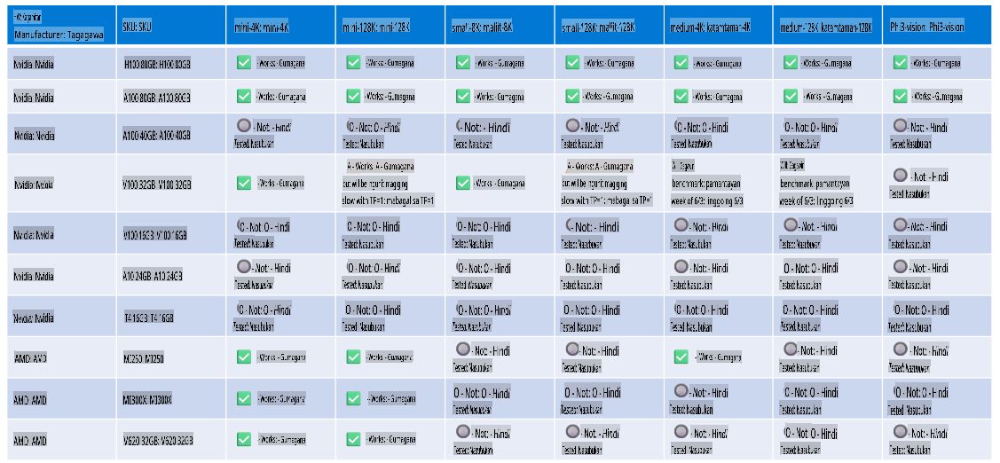

# Suporta sa Hardware ng Phi

Ang Microsoft Phi ay na-optimize para sa ONNX Runtime at sumusuporta sa Windows DirectML. Epektibo itong gumagana sa iba't ibang uri ng hardware, kabilang ang GPUs, CPUs, at maging sa mga mobile device.

## Hardware ng Device
Partikular na sinusuportahang hardware ay kinabibilangan ng:

- GPU SKU: RTX 4090 (DirectML)
- GPU SKU: 1 A100 80GB (CUDA)
- CPU SKU: Standard F64s v2 (64 vCPUs, 128 GiB memory)

## Mobile SKU

- Android - Samsung Galaxy S21
- Apple iPhone 14 o mas mataas na may A16/A17 Processor

## Detalye ng Hardware ng Phi

- Minimum na Kinakailangang Konfigurasyon:
- Windows: GPU na may kakayahang DirectX 12 at hindi bababa sa 4GB ng pinagsamang RAM

CUDA: NVIDIA GPU na may Compute Capability >= 7.02



## Pagpapatakbo ng onnxruntime sa maraming GPU

Sa kasalukuyan, ang mga Phi ONNX model na magagamit ay para lamang sa 1 GPU. Posibleng suportahan ang multi-GPU para sa Phi model, ngunit ang ORT na may 2 GPU ay hindi ginagarantiyahan na magbibigay ito ng mas mataas na throughput kumpara sa 2 instance ng ORT. Mangyaring tingnan ang [ONNX Runtime](https://onnxruntime.ai/) para sa pinakabagong mga update.

Sa [Build 2024 ng GenAI ONNX Team](https://youtu.be/WLW4SE8M9i8?si=EtG04UwDvcjunyfC), inihayag nila na kanilang na-enable ang multi-instance sa halip na multi-GPU para sa mga Phi model.

Sa kasalukuyan, pinapayagan ka nitong magpatakbo ng isang onnxruntime o onnxruntime-genai instance gamit ang CUDA_VISIBLE_DEVICES environment variable tulad nito:

```Python
CUDA_VISIBLE_DEVICES=0 python infer.py
CUDA_VISIBLE_DEVICES=1 python infer.py
```

Huwag mag-atubiling tuklasin pa ang Phi sa [Azure AI Foundry](https://ai.azure.com)

**Paunawa**:  
Ang dokumentong ito ay isinalin gamit ang mga serbisyo ng AI na nakabatay sa makina. Bagama't sinisikap naming maging tumpak, pakitandaan na ang mga awtomatikong pagsasalin ay maaaring maglaman ng mga pagkakamali o hindi pagiging wasto. Ang orihinal na dokumento sa sariling wika nito ang dapat ituring na mapagkakatiwalaang pinagmulan. Para sa mahalagang impormasyon, inirerekomenda ang propesyonal na pagsasalin ng tao. Hindi kami mananagot para sa anumang hindi pagkakaunawaan o maling interpretasyon na dulot ng paggamit ng pagsasaling ito.