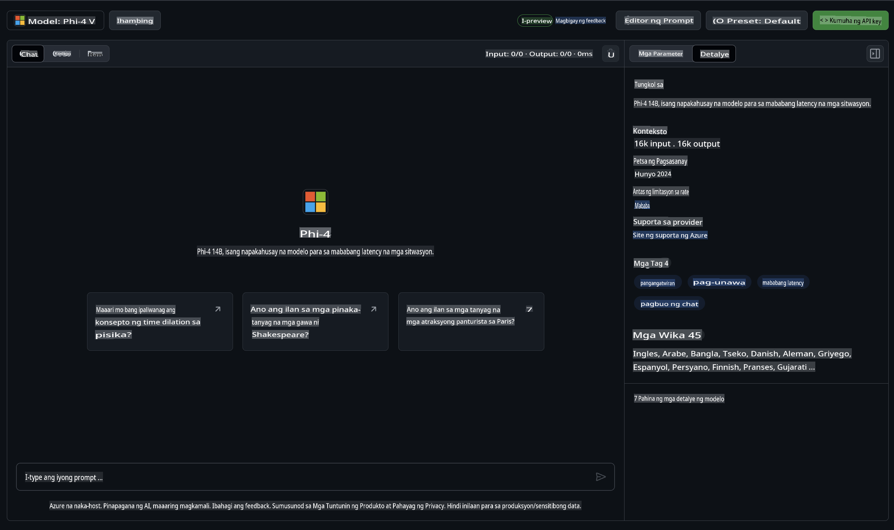

## Phi Family sa GitHub Models

Maligayang pagdating sa [GitHub Models](https://github.com/marketplace/models)! Nakaayos na ang lahat para masimulan mong tuklasin ang mga AI Models na naka-host sa Azure AI.


Para sa karagdagang impormasyon tungkol sa mga Models na makikita sa GitHub Models, bisitahin ang [GitHub Model Marketplace](https://github.com/marketplace/models).

## Mga Modelong Magagamit

Ang bawat modelo ay may nakalaang playground at sample code.



### Phi Family sa GitHub Model Catalog

- [Phi-4](https://github.com/marketplace/models/azureml/Phi-4)

- [Phi-3.5-MoE instruct (128k)](https://github.com/marketplace/models/azureml/Phi-3-5-MoE-instruct)

- [Phi-3.5-vision instruct (128k)](https://github.com/marketplace/models/azureml/Phi-3-5-vision-instruct)

- [Phi-3.5-mini instruct (128k)](https://github.com/marketplace/models/azureml/Phi-3-5-mini-instruct)

- [Phi-3-Medium-128k-Instruct](https://github.com/marketplace/models/azureml/Phi-3-medium-128k-instruct)

- [Phi-3-medium-4k-instruct](https://github.com/marketplace/models/azureml/Phi-3-medium-4k-instruct)

- [Phi-3-mini-128k-instruct](https://github.com/marketplace/models/azureml/Phi-3-mini-128k-instruct)

- [Phi-3-mini-4k-instruct](https://github.com/marketplace/models/azureml/Phi-3-mini-4k-instruct)

- [Phi-3-small-128k-instruct](https://github.com/marketplace/models/azureml/Phi-3-small-128k-instruct)

- [Phi-3-small-8k-instruct](https://github.com/marketplace/models/azureml/Phi-3-small-8k-instruct)

## Pagsisimula

May ilang pangunahing halimbawa na handa nang patakbuhin. Makikita mo ang mga ito sa samples directory. Kung nais mong direktang pumunta sa paborito mong wika, makikita mo ang mga halimbawa sa mga sumusunod na Wika:

- Python
- JavaScript
- C#
- Java
- cURL

Mayroon ding nakalaang Codespaces Environment para patakbuhin ang mga halimbawa at modelo.


## Sample Code

Narito ang mga halimbawa ng code snippets para sa ilang use cases. Para sa karagdagang impormasyon tungkol sa Azure AI Inference SDK, tingnan ang buong dokumentasyon at mga halimbawa.

## Setup

1. Gumawa ng personal access token  
Hindi mo kailangang magbigay ng anumang mga permiso sa token. Tandaan na ang token ay ipapadala sa isang Microsoft service.

Upang magamit ang mga code snippets sa ibaba, gumawa ng environment variable para itakda ang iyong token bilang key para sa client code.

Kung gumagamit ka ng bash:  
```
export GITHUB_TOKEN="<your-github-token-goes-here>"
```  
Kung nasa powershell ka:  

```
$Env:GITHUB_TOKEN="<your-github-token-goes-here>"
```  

Kung gumagamit ka ng Windows command prompt:  

```
set GITHUB_TOKEN=<your-github-token-goes-here>
```  

## Python Sample

### I-install ang mga kinakailangan  
I-install ang Azure AI Inference SDK gamit ang pip (Kinakailangan: Python >=3.8):  

```
pip install azure-ai-inference
```  

### Patakbuhin ang isang basic na halimbawa ng code  

Ipinapakita ng halimbawa na ito ang isang simpleng tawag sa chat completion API. Ginagamit nito ang GitHub AI model inference endpoint at ang iyong GitHub token. Ang tawag ay synchronous.  

```python
import os
from azure.ai.inference import ChatCompletionsClient
from azure.ai.inference.models import SystemMessage, UserMessage
from azure.core.credentials import AzureKeyCredential

endpoint = "https://models.inference.ai.azure.com"
model_name = "Phi-4"
token = os.environ["GITHUB_TOKEN"]

client = ChatCompletionsClient(
    endpoint=endpoint,
    credential=AzureKeyCredential(token),
)

response = client.complete(
    messages=[
        UserMessage(content="I have $20,000 in my savings account, where I receive a 4% profit per year and payments twice a year. Can you please tell me how long it will take for me to become a millionaire? Also, can you please explain the math step by step as if you were explaining it to an uneducated person?"),
    ],
    temperature=0.4,
    top_p=1.0,
    max_tokens=2048,
    model=model_name
)

print(response.choices[0].message.content)
```  

### Patakbuhin ang isang multi-turn na usapan  

Ipinapakita ng halimbawa na ito ang isang multi-turn na usapan gamit ang chat completion API. Kapag ginagamit ang modelo para sa isang chat application, kakailanganin mong pamahalaan ang history ng usapan at ipadala ang pinakabagong mga mensahe sa modelo.  

```
import os
from azure.ai.inference import ChatCompletionsClient
from azure.ai.inference.models import AssistantMessage, SystemMessage, UserMessage
from azure.core.credentials import AzureKeyCredential

token = os.environ["GITHUB_TOKEN"]
endpoint = "https://models.inference.ai.azure.com"
# Replace Model_Name
model_name = "Phi-4"

client = ChatCompletionsClient(
    endpoint=endpoint,
    credential=AzureKeyCredential(token),
)

messages = [
    SystemMessage(content="You are a helpful assistant."),
    UserMessage(content="What is the capital of France?"),
    AssistantMessage(content="The capital of France is Paris."),
    UserMessage(content="What about Spain?"),
]

response = client.complete(messages=messages, model=model_name)

print(response.choices[0].message.content)
```  

### I-stream ang output  

Para sa mas magandang karanasan ng user, mas mainam na i-stream ang sagot ng modelo upang ang unang token ay lumabas agad at maiwasan ang paghihintay ng matagal na sagot.  

```
import os
from azure.ai.inference import ChatCompletionsClient
from azure.ai.inference.models import SystemMessage, UserMessage
from azure.core.credentials import AzureKeyCredential

token = os.environ["GITHUB_TOKEN"]
endpoint = "https://models.inference.ai.azure.com"
# Replace Model_Name
model_name = "Phi-4"

client = ChatCompletionsClient(
    endpoint=endpoint,
    credential=AzureKeyCredential(token),
)

response = client.complete(
    stream=True,
    messages=[
        SystemMessage(content="You are a helpful assistant."),
        UserMessage(content="Give me 5 good reasons why I should exercise every day."),
    ],
    model=model_name,
)

for update in response:
    if update.choices:
        print(update.choices[0].delta.content or "", end="")

client.close()
```  

## LIBRENG Paggamit at Mga Limitasyon ng Rate para sa GitHub Models  


Ang [mga limitasyon ng rate para sa playground at libreng paggamit ng API](https://docs.github.com/en/github-models/prototyping-with-ai-models#rate-limits) ay idinisenyo upang matulungan kang mag-eksperimento sa mga modelo at mag-prototype ng iyong AI application. Para sa paggamit na lampas sa mga limitasyong ito, at upang ma-scale ang iyong application, kailangan mong maglaan ng mga resources mula sa isang Azure account at mag-authenticate mula doon sa halip na gamitin ang iyong GitHub personal access token. Hindi mo kailangang baguhin ang iba pang bahagi ng iyong code. Gamitin ang link na ito upang matuklasan kung paano lampasan ang mga limitasyon ng libreng tier sa Azure AI.

### Mga Paalala

Tandaan na kapag nakikipag-ugnayan sa isang modelo, ikaw ay nag-eeksperimento sa AI, kaya posible ang mga pagkakamali sa nilalaman.

Ang tampok na ito ay may iba't ibang limitasyon (kabilang ang requests per minute, requests per day, tokens per request, at concurrent requests) at hindi idinisenyo para sa mga production use cases.

Ang GitHub Models ay gumagamit ng Azure AI Content Safety. Ang mga filter na ito ay hindi maaaring i-off bilang bahagi ng karanasan sa GitHub Models. Kung magpapasya kang gamitin ang mga modelo sa pamamagitan ng isang bayad na serbisyo, mangyaring i-configure ang iyong mga content filter upang matugunan ang iyong mga pangangailangan.

Ang serbisyong ito ay nasa ilalim ng Pre-release Terms ng GitHub.

**Paunawa**:  
Ang dokumentong ito ay isinalin gamit ang mga serbisyo ng AI-based na pagsasalin. Bagama't sinisikap naming maging tumpak, pakitandaan na ang mga awtomatikong pagsasalin ay maaaring maglaman ng mga pagkakamali o hindi pagkakatugma. Ang orihinal na dokumento sa orihinal nitong wika ang dapat ituring na pangunahing mapagkukunan. Para sa mahahalagang impormasyon, inirerekomenda ang propesyonal na pagsasalin ng tao. Hindi kami mananagot sa anumang hindi pagkakaunawaan o maling interpretasyon na dulot ng paggamit ng pagsasaling ito.