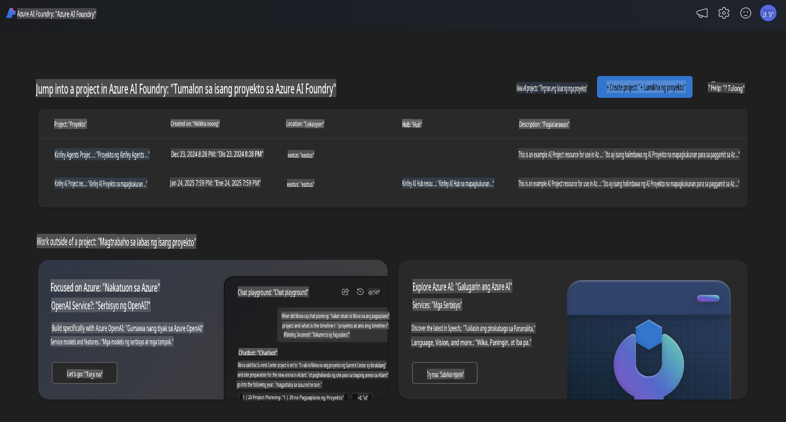
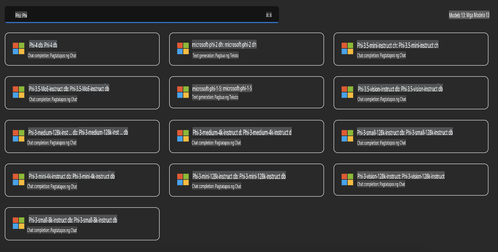
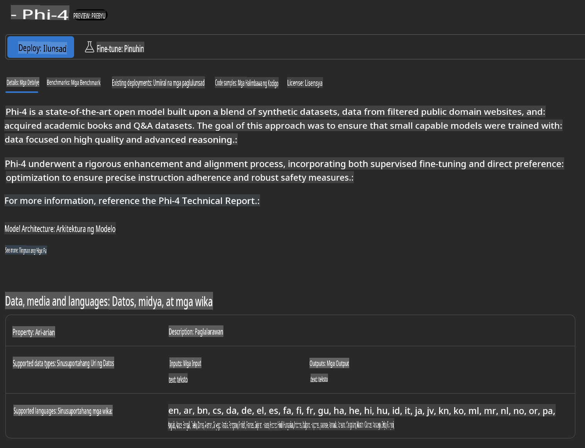
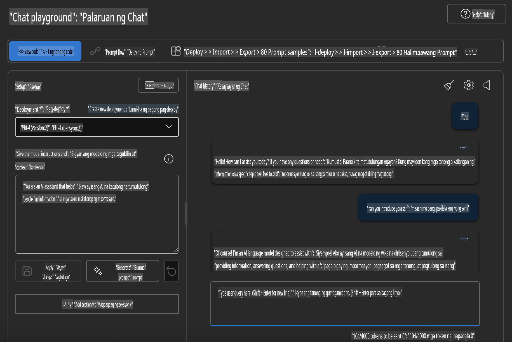

## Ang Pamilya ng Phi sa Azure AI Foundry

[Azure AI Foundry](https://ai.azure.com) ay isang pinagkakatiwalaang plataporma na nagbibigay kapangyarihan sa mga developer na magpasimula ng inobasyon at hubugin ang hinaharap gamit ang AI sa isang ligtas, sigurado, at responsableng paraan.

[Azure AI Foundry](https://ai.azure.com) ay idinisenyo para sa mga developer upang:

- Gumawa ng generative AI applications sa isang enterprise-grade na plataporma.
- Mag-explore, bumuo, mag-test, at mag-deploy gamit ang mga makabagong AI tools at ML models na nakabatay sa responsableng AI practices.
- Makipagtulungan sa isang team para sa buong lifecycle ng application development.

Sa Azure AI Foundry, maaari mong tuklasin ang malawak na hanay ng mga modelo, serbisyo, at kakayahan, at magsimulang bumuo ng AI applications na pinakamahusay na tumutugon sa iyong mga layunin. Ang Azure AI Foundry platform ay nagpapadali ng scalability para gawing ganap na production applications ang mga proof of concepts nang walang kahirap-hirap. Ang tuloy-tuloy na monitoring at refinement ay sumusuporta sa pangmatagalang tagumpay.



Bukod sa paggamit ng Azure AOAI Service sa Azure AI Foundry, maaari mo ring gamitin ang mga third-party na modelo sa Azure AI Foundry Model Catalog. Ito ay isang magandang opsyon kung nais mong gamitin ang Azure AI Foundry bilang iyong AI solution platform.

Maaari nating mabilis na i-deploy ang Phi Family Models sa pamamagitan ng Model Catalog sa Azure AI Foundry.



### **I-deploy ang Phi-4 sa Azure AI Foundry**



### **Subukan ang Phi-4 sa Azure AI Foundry Playground**



### **Pagpapatakbo ng Python Code upang tawagin ang Azure AI Foundry Phi-4**

```python

import os  
import base64
from openai import AzureOpenAI  
from azure.identity import DefaultAzureCredential, get_bearer_token_provider  
        
endpoint = os.getenv("ENDPOINT_URL", "Your Azure AOAI Service Endpoint")  
deployment = os.getenv("DEPLOYMENT_NAME", "Phi-4")  
      
token_provider = get_bearer_token_provider(  
    DefaultAzureCredential(),  
    "https://cognitiveservices.azure.com/.default"  
)  
  
client = AzureOpenAI(  
    azure_endpoint=endpoint,  
    azure_ad_token_provider=token_provider,  
    api_version="2024-05-01-preview",  
)  
  

chat_prompt = [
    {
        "role": "system",
        "content": "You are an AI assistant that helps people find information."
    },
    {
        "role": "user",
        "content": "can you introduce yourself"
    }
] 
    
# Include speech result if speech is enabled  
messages = chat_prompt 

completion = client.chat.completions.create(  
    model=deployment,  
    messages=messages,
    max_tokens=800,  
    temperature=0.7,  
    top_p=0.95,  
    frequency_penalty=0,  
    presence_penalty=0,
    stop=None,  
    stream=False  
)  
  
print(completion.to_json())  

```

**Paunawa**:  
Ang dokumentong ito ay isinalin gamit ang mga serbisyong AI na nakabatay sa makina. Bagamat sinisikap naming maging wasto, pakatandaan na ang mga awtomatikong salin ay maaaring maglaman ng mga pagkakamali o hindi tumpak na impormasyon. Ang orihinal na dokumento sa sariling wika nito ang dapat ituring na opisyal na sanggunian. Para sa mahalagang impormasyon, inirerekomenda ang propesyonal na pagsasalin mula sa tao. Kami ay hindi mananagot para sa anumang hindi pagkakaunawaan o maling interpretasyon na dulot ng paggamit ng salin na ito.