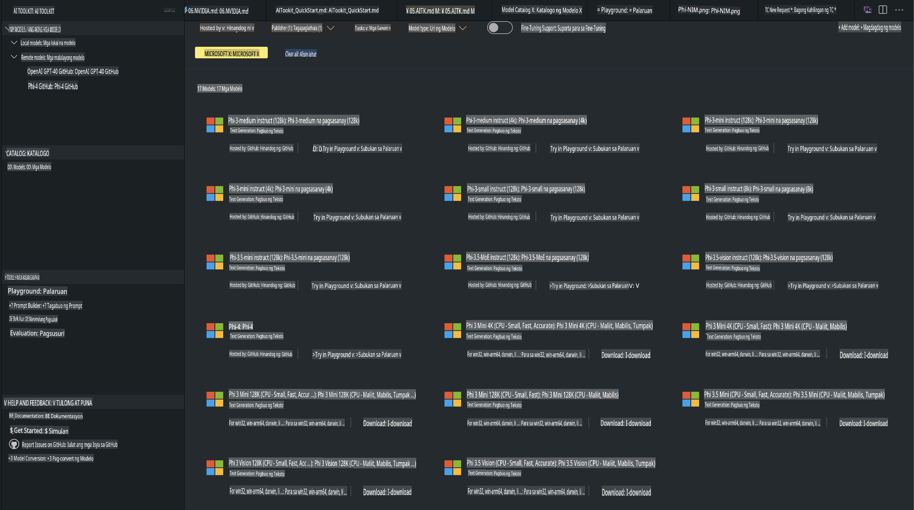
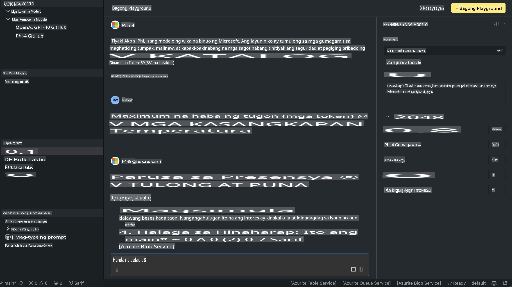

# Ang Pamilya Phi sa AITK

[AI Toolkit para sa VS Code](https://marketplace.visualstudio.com/items?itemName=ms-windows-ai-studio.windows-ai-studio) ay nagpapadali ng pagbuo ng mga generative AI app sa pamamagitan ng pagsasama-sama ng mga makabagong AI development tools at mga modelo mula sa Azure AI Foundry Catalog at iba pang mga katalogo tulad ng Hugging Face. Maaari mong i-browse ang AI models catalog na pinapagana ng GitHub Models at Azure AI Foundry Model Catalogs, i-download ang mga ito nang lokal o remote, i-fine-tune, subukan, at gamitin ang mga ito sa iyong aplikasyon.

Ang AI Toolkit Preview ay tatakbo nang lokal. Ang lokal na inference o fine-tune ay depende sa modelong iyong pinili, maaaring kailanganin mo ng GPU tulad ng NVIDIA CUDA GPU. Maaari mo ring direktang patakbuhin ang GitHub Models gamit ang AITK.

## Pagsisimula

[Alamin kung paano mag-install ng Windows subsystem para sa Linux](https://learn.microsoft.com/windows/wsl/install?WT.mc_id=aiml-137032-kinfeylo)

at [pagbabago ng default distribution](https://learn.microsoft.com/windows/wsl/install#change-the-default-linux-distribution-installed).

[AI Toolkit GitHub Repo](https://github.com/microsoft/vscode-ai-toolkit/)

- Windows, Linux, macOS
  
- Para sa fine-tuning sa parehong Windows at Linux, kailangan mo ng Nvidia GPU. Bukod dito, ang **Windows** ay nangangailangan ng subsystem para sa Linux na may Ubuntu distro 18.4 o mas mataas. [Alamin kung paano mag-install ng Windows subsystem para sa Linux](https://learn.microsoft.com/windows/wsl/install) at [pagbabago ng default distribution](https://learn.microsoft.com/windows/wsl/install#change-the-default-linux-distribution-installed).

### Pag-install ng AI Toolkit

Ang AI Toolkit ay ipinapadala bilang isang [Visual Studio Code Extension](https://code.visualstudio.com/docs/setup/additional-components#_vs-code-extensions), kaya kailangan mong mag-install ng [VS Code](https://code.visualstudio.com/docs/setup/windows?WT.mc_id=aiml-137032-kinfeylo) muna, at i-download ang AI Toolkit mula sa [VS Marketplace](https://marketplace.visualstudio.com/items?itemName=ms-windows-ai-studio.windows-ai-studio).  
Ang [AI Toolkit ay makukuha sa Visual Studio Marketplace](https://marketplace.visualstudio.com/items?itemName=ms-windows-ai-studio.windows-ai-studio) at maaaring i-install tulad ng ibang VS Code extension. 

Kung hindi ka pamilyar sa pag-install ng VS Code extensions, sundin ang mga hakbang na ito:

### Mag-sign In

1. Sa Activity Bar sa VS Code, piliin ang **Extensions**.
2. Sa Extensions Search bar, i-type ang "AI Toolkit".
3. Piliin ang "AI Toolkit for Visual Studio code".
4. Piliin ang **Install**.

Ngayon, handa ka nang gamitin ang extension!

Hihilingin sa iyong mag-sign in sa GitHub, kaya mangyaring i-click ang "Allow" upang magpatuloy. Ire-redirect ka sa GitHub signing page.

Mag-sign in at sundin ang mga hakbang sa proseso. Pagkatapos ng matagumpay na pagkumpleto, ire-redirect ka pabalik sa VS Code.

Kapag na-install na ang extension, makikita mo ang AI Toolkit icon sa iyong Activity Bar.

Tuklasin natin ang mga magagamit na aksyon!

### Mga Magagamit na Aksyon

Ang pangunahing sidebar ng AI Toolkit ay nakaayos sa  

- **Models**
- **Resources**
- **Playground**  
- **Fine-tuning**
- **Evaluation**

Makikita ang mga ito sa seksyon ng Resources. Para magsimula, piliin ang **Model Catalog**.

### Mag-download ng modelo mula sa katalogo

Kapag inilunsad ang AI Toolkit mula sa VS Code side bar, maaari mong piliin ang mga sumusunod na opsyon:



- Maghanap ng suportadong modelo mula sa **Model Catalog** at i-download nang lokal.
- Subukan ang model inference sa **Model Playground**.
- Fine-tune ang modelo nang lokal o remote sa **Model Fine-tuning**.
- I-deploy ang fine-tuned models sa cloud gamit ang command palette para sa AI Toolkit.
- I-evaluate ang mga modelo.

> [!NOTE]
>
> **GPU Vs CPU**
>
> Mapapansin mong ipinapakita ng mga model card ang laki ng modelo, ang platform, at ang uri ng accelerator (CPU, GPU). Para sa optimal na performance sa **Windows devices na may hindi bababa sa isang GPU**, pumili ng mga bersyon ng modelo na nakatuon lamang sa Windows.
>
> Tinitiyak nito na mayroon kang modelong na-optimize para sa DirectML accelerator.
>
> Ang mga pangalan ng modelo ay nasa format na
>
> - `{model_name}-{accelerator}-{quantization}-{format}`.
>
> Upang suriin kung mayroon kang GPU sa iyong Windows device, buksan ang **Task Manager** at piliin ang tab na **Performance**. Kung mayroon kang GPU(s), nakalista ang mga ito sa ilalim ng mga pangalan tulad ng "GPU 0" o "GPU 1".

### Patakbuhin ang modelo sa playground

Kapag naitakda na ang lahat ng mga parameter, i-click ang **Generate Project**.

Kapag na-download na ang iyong modelo, piliin ang **Load in Playground** sa model card sa katalogo:

- Simulan ang pag-download ng modelo.
- I-install ang lahat ng kinakailangang prerequisites at dependencies.
- Gumawa ng VS Code workspace.



### Gamitin ang REST API sa iyong aplikasyon

Ang AI Toolkit ay may kasamang lokal na REST API web server **sa port 5272** na gumagamit ng [OpenAI chat completions format](https://platform.openai.com/docs/api-reference/chat/create). 

Pinapagana nitong subukan ang iyong aplikasyon nang lokal nang hindi umaasa sa isang cloud AI model service. Halimbawa, ang sumusunod na JSON file ay nagpapakita kung paano i-configure ang body ng request:

```json
{
    "model": "Phi-4",
    "messages": [
        {
            "role": "user",
            "content": "what is the golden ratio?"
        }
    ],
    "temperature": 0.7,
    "top_p": 1,
    "top_k": 10,
    "max_tokens": 100,
    "stream": true
}
```

Maaari mong subukan ang REST API gamit ang (halimbawa) [Postman](https://www.postman.com/) o ang CURL (Client URL) utility:

```bash
curl -vX POST http://127.0.0.1:5272/v1/chat/completions -H 'Content-Type: application/json' -d @body.json
```

### Paggamit ng OpenAI client library para sa Python

```python
from openai import OpenAI

client = OpenAI(
    base_url="http://127.0.0.1:5272/v1/", 
    api_key="x" # required for the API but not used
)

chat_completion = client.chat.completions.create(
    messages=[
        {
            "role": "user",
            "content": "what is the golden ratio?",
        }
    ],
    model="Phi-4",
)

print(chat_completion.choices[0].message.content)
```

### Paggamit ng Azure OpenAI client library para sa .NET

Idagdag ang [Azure OpenAI client library para sa .NET](https://www.nuget.org/packages/Azure.AI.OpenAI/) sa iyong proyekto gamit ang NuGet:

```bash
dotnet add {project_name} package Azure.AI.OpenAI --version 1.0.0-beta.17
```

Magdagdag ng isang C# file na tinatawag na **OverridePolicy.cs** sa iyong proyekto at i-paste ang sumusunod na code:

```csharp
// OverridePolicy.cs
using Azure.Core.Pipeline;
using Azure.Core;

internal partial class OverrideRequestUriPolicy(Uri overrideUri)
    : HttpPipelineSynchronousPolicy
{
    private readonly Uri _overrideUri = overrideUri;

    public override void OnSendingRequest(HttpMessage message)
    {
        message.Request.Uri.Reset(_overrideUri);
    }
}
```

Susunod, i-paste ang sumusunod na code sa iyong **Program.cs** file:

```csharp
// Program.cs
using Azure.AI.OpenAI;

Uri localhostUri = new("http://localhost:5272/v1/chat/completions");

OpenAIClientOptions clientOptions = new();
clientOptions.AddPolicy(
    new OverrideRequestUriPolicy(localhostUri),
    Azure.Core.HttpPipelinePosition.BeforeTransport);
OpenAIClient client = new(openAIApiKey: "unused", clientOptions);

ChatCompletionsOptions options = new()
{
    DeploymentName = "Phi-4",
    Messages =
    {
        new ChatRequestSystemMessage("You are a helpful assistant. Be brief and succinct."),
        new ChatRequestUserMessage("What is the golden ratio?"),
    }
};

StreamingResponse<StreamingChatCompletionsUpdate> streamingChatResponse
    = await client.GetChatCompletionsStreamingAsync(options);

await foreach (StreamingChatCompletionsUpdate chatChunk in streamingChatResponse)
{
    Console.Write(chatChunk.ContentUpdate);
}
```

## Fine Tuning gamit ang AI Toolkit

- Magsimula sa model discovery at playground.
- Fine-tuning at inference ng modelo gamit ang lokal na computing resources.
- Remote fine-tuning at inference gamit ang Azure resources.

[Fine Tuning gamit ang AI Toolkit](../../03.FineTuning/Finetuning_VSCodeaitoolkit.md)

## Mga AI Toolkit Q&A Resources

Mangyaring sumangguni sa aming [Q&A page](https://github.com/microsoft/vscode-ai-toolkit/blob/main/archive/QA.md) para sa mga pinakakaraniwang isyu at solusyon.

**Paunawa**:  
Ang dokumentong ito ay isinalin gamit ang mga serbisyo ng AI-based na awtomatikong pagsasalin. Bagama't sinisikap naming maging tumpak, pakatandaan na ang mga awtomatikong pagsasalin ay maaaring maglaman ng mga pagkakamali o hindi wastong salin. Ang orihinal na dokumento sa kanyang katutubong wika ang dapat ituring na opisyal na sanggunian. Para sa mahahalagang impormasyon, inirerekomenda ang propesyonal na pagsasalin ng tao. Hindi kami mananagot sa anumang maling pagkakaunawaan o maling interpretasyon na dulot ng paggamit ng pagsasaling ito.