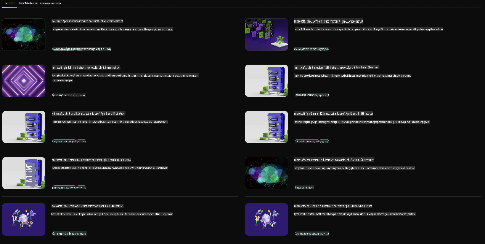

## Phi Family sa NVIDIA NIM

Ang NVIDIA NIM ay isang hanay ng madaling gamitin na mga microservice na dinisenyo upang mapabilis ang pag-deploy ng mga generative AI model sa cloud, data center, at workstations. Ang mga NIM ay inuuri batay sa pamilya ng modelo at sa bawat modelo. Halimbawa, ang NVIDIA NIM para sa malalaking language models (LLMs) ay nagdadala ng kapangyarihan ng mga makabagong LLMs sa mga enterprise application, na nagbibigay ng hindi matatawarang kakayahan sa natural language processing at understanding.

Ginagawang madali ng NIM para sa mga IT at DevOps team na i-host ang malalaking language models (LLMs) sa sarili nilang mga pinamamahalaang environment habang nagbibigay pa rin ng industry standard APIs sa mga developer upang makabuo ng makapangyarihang copilots, chatbots, at AI assistants na maaaring magbago ng kanilang negosyo. Sa paggamit ng cutting-edge na GPU acceleration at scalable deployment ng NVIDIA, nag-aalok ang NIM ng pinakamabilis na landas sa inference na may hindi matatawarang performance.

Puwede mong gamitin ang NVIDIA NIM para mag-inference gamit ang Phi Family Models.



### **Mga Halimbawa - Phi-3-Vision sa NVIDIA NIM**

Isipin na mayroon kang isang imahe (`demo.png`) at nais mong gumawa ng Python code na nagpoproseso ng imaheng ito at nagse-save ng bagong bersyon nito (`phi-3-vision.jpg`). 

Ang code sa itaas ay awtomatikong gumagawa nito sa pamamagitan ng:

1. Pagse-set up ng environment at mga kinakailangang configuration.
2. Paglikha ng prompt na nag-uutos sa modelo na gumawa ng kinakailangang Python code.
3. Pagpapadala ng prompt sa modelo at pagkolekta ng nalikhang code.
4. Pagkuha at pagpapatakbo ng nalikhang code.
5. Pagpapakita ng orihinal at naprosesong mga imahe.

Ang approach na ito ay gumagamit ng kapangyarihan ng AI upang awtomatikong gawin ang mga gawain sa pagpoproseso ng imahe, na ginagawang mas madali at mas mabilis ang pag-abot sa iyong mga layunin.

[Sample Code Solution](../../../../../code/06.E2E/E2E_Nvidia_NIM_Phi3_Vision.ipynb)

Tingnan natin ang bawat hakbang ng code nang detalyado:

1. **Mag-install ng Kinakailangang Package**:
    ```python
    !pip install langchain_nvidia_ai_endpoints -U
    ```
    Ang command na ito ay nag-i-install ng `langchain_nvidia_ai_endpoints` package, na tinitiyak na ito ang pinakabagong bersyon.

2. **I-import ang Mga Kinakailangang Module**:
    ```python
    from langchain_nvidia_ai_endpoints import ChatNVIDIA
    import getpass
    import os
    import base64
    ```
    Ang mga import na ito ay nagdadala ng mga kinakailangang module para makipag-ugnayan sa NVIDIA AI endpoints, ligtas na paghawak ng mga password, pakikipag-ugnayan sa operating system, at pag-encode/pag-decode ng data sa base64 format.

3. **I-set Up ang API Key**:
    ```python
    if not os.getenv("NVIDIA_API_KEY"):
        os.environ["NVIDIA_API_KEY"] = getpass.getpass("Enter your NVIDIA API key: ")
    ```
    Tinitiyak ng code na ito kung ang `NVIDIA_API_KEY` environment variable ay naka-set. Kung hindi, hinihiling nito sa user na ligtas na maglagay ng kanilang API key.

4. **Tukuyin ang Modelo at Path ng Imahe**:
    ```python
    model = 'microsoft/phi-3-vision-128k-instruct'
    chat = ChatNVIDIA(model=model)
    img_path = './imgs/demo.png'
    ```
    Sinet ang modelong gagamitin, lumikha ng isang instance ng `ChatNVIDIA` gamit ang tinukoy na modelo, at itinakda ang path ng image file.

5. **Gumawa ng Text Prompt**:
    ```python
    text = "Please create Python code for image, and use plt to save the new picture under imgs/ and name it phi-3-vision.jpg."
    ```
    Tinukoy nito ang isang text prompt na nag-uutos sa modelo na gumawa ng Python code para sa pagpoproseso ng isang imahe.

6. **I-encode ang Imahe sa Base64**:
    ```python
    with open(img_path, "rb") as f:
        image_b64 = base64.b64encode(f.read()).decode()
    image = f''
    ```
    Binabasa ng code na ito ang image file, ini-encode ito sa base64, at gumagawa ng HTML image tag gamit ang encoded data.

7. **Pagsamahin ang Text at Imahe sa Prompt**:
    ```python
    prompt = f"{text} {image}"
    ```
    Pinagsasama nito ang text prompt at ang HTML image tag sa isang string.

8. **Gumawa ng Code Gamit ang ChatNVIDIA**:
    ```python
    code = ""
    for chunk in chat.stream(prompt):
        print(chunk.content, end="")
        code += chunk.content
    ```
    Ipinapadala ng code na ito ang prompt sa `ChatNVIDIA` model and collects the generated code in chunks, printing and appending each chunk to the `code` string.

9. **Kunin ang Python Code mula sa Generated Content**:
    ```python
    begin = code.index('```python') + 9
    code = code[begin:]
    end = code.index('```')
    code = code[:end]
    ```
    Kinukuha nito ang aktwal na Python code mula sa nalikhang content sa pamamagitan ng pagtanggal ng markdown formatting.

10. **Patakbuhin ang Nalikhang Code**:
    ```python
    import subprocess
    result = subprocess.run(["python", "-c", code], capture_output=True)
    ```
    Pinapatakbo nito ang nakuha na Python code bilang isang subprocess at kinukuha ang output nito.

11. **Ipakita ang Mga Imahe**:
    ```python
    from IPython.display import Image, display
    display(Image(filename='./imgs/phi-3-vision.jpg'))
    display(Image(filename='./imgs/demo.png'))
    ```
    Ang mga linyang ito ay nagpapakita ng mga imahe gamit ang `IPython.display` module.

**Paunawa**:  
Ang dokumentong ito ay isinalin gamit ang mga serbisyo ng AI na nakabatay sa makina. Bagama't pinagsisikapan naming maging tumpak, mangyaring tandaan na ang mga awtomatikong pagsasalin ay maaaring maglaman ng mga pagkakamali o hindi pagkakatumpak. Ang orihinal na dokumento sa sarili nitong wika ang dapat ituring na opisyal na sanggunian. Para sa mahalagang impormasyon, inirerekomenda ang propesyonal na pagsasalin ng tao. Hindi kami mananagot para sa anumang hindi pagkakaunawaan o maling interpretasyon na dulot ng paggamit ng pagsasaling ito.