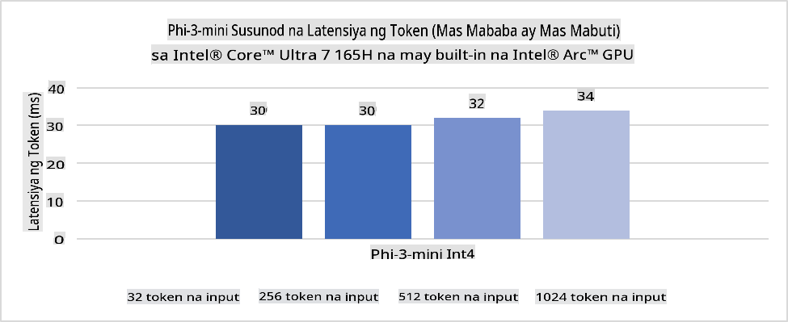
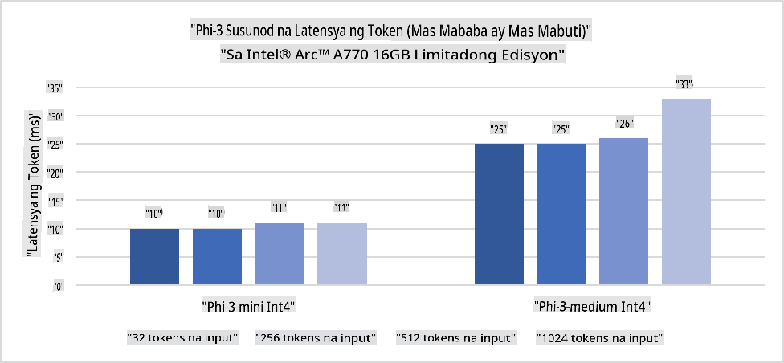
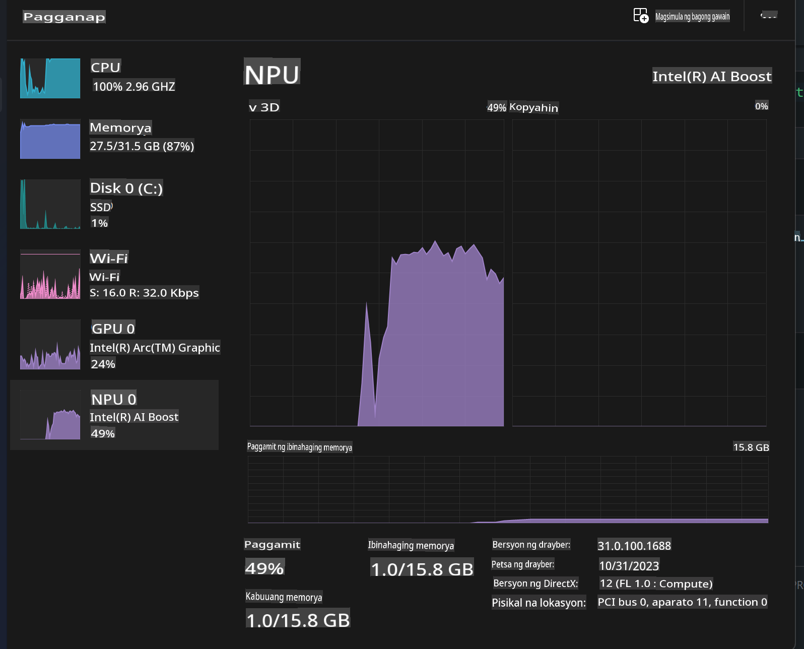
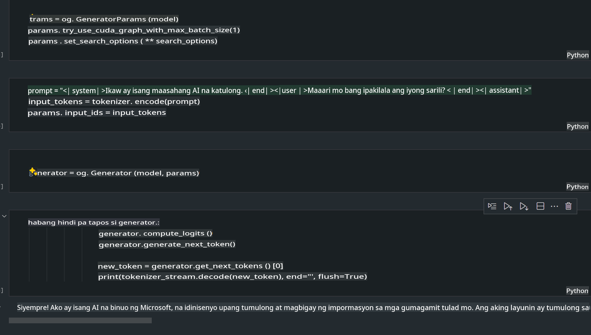
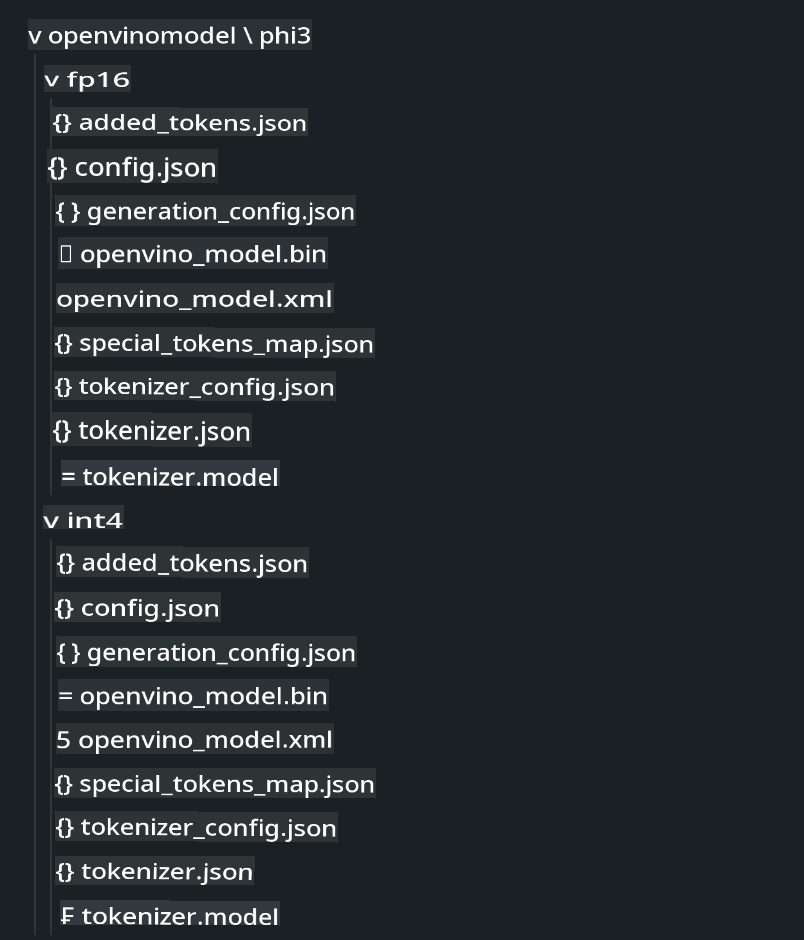
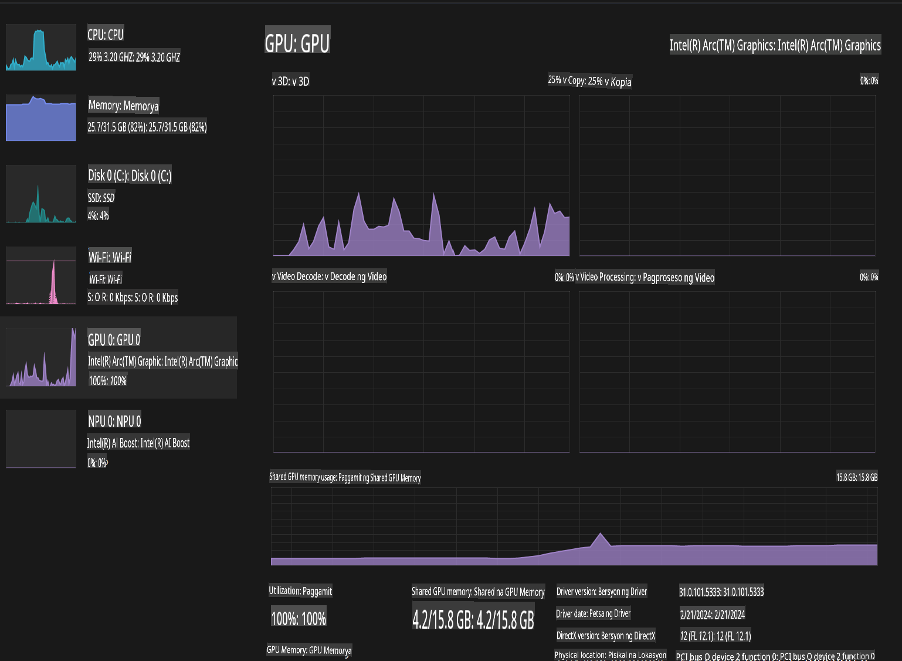

# **Inference Phi-3 sa AI PC**

Sa patuloy na pag-unlad ng generative AI at pagpapahusay ng hardware capabilities ng edge devices, mas maraming generative AI models ang maaaring i-integrate ngayon sa mga Bring Your Own Device (BYOD) ng mga user. Kasama sa mga modelong ito ang AI PCs. Simula 2024, nakipagtulungan ang Intel, AMD, at Qualcomm sa mga PC manufacturers upang ipakilala ang AI PCs na nagbibigay-daan sa pag-deploy ng localized generative AI models gamit ang hardware modifications. Sa talakayang ito, tututukan natin ang Intel AI PCs at kung paano i-deploy ang Phi-3 sa isang Intel AI PC.

### Ano ang NPU

Ang NPU (Neural Processing Unit) ay isang dedikadong processor o processing unit na bahagi ng mas malaking SoC na idinisenyo partikular para sa pagpapabilis ng neural network operations at AI tasks. Hindi tulad ng general-purpose CPUs at GPUs, ang NPUs ay optimized para sa data-driven parallel computing, kaya't napakahusay nito sa pagproseso ng malalaking multimedia data tulad ng videos at images, pati na rin ang data para sa neural networks. Mahusay ito sa mga AI-related tasks tulad ng speech recognition, background blurring sa video calls, at mga proseso sa pag-edit ng larawan o video tulad ng object detection.

## NPU vs GPU

Habang maraming AI at machine learning workloads ang tumatakbo sa GPUs, may mahalagang pagkakaiba sa pagitan ng GPUs at NPUs.  
Ang GPUs ay kilala sa kanilang parallel computing capabilities, ngunit hindi lahat ng GPUs ay kasing episyente sa mga gawain na lampas sa graphics processing. Samantala, ang NPUs ay purpose-built para sa masalimuot na computations na kasangkot sa neural network operations, kaya't ito'y lubos na epektibo para sa AI tasks.

Sa madaling salita, ang NPUs ang mga henyo sa math na nagpapabilis ng AI computations, at sila'y mahalaga sa paparating na panahon ng AI PCs!

***Ang halimbawang ito ay batay sa pinakabagong Intel Core Ultra Processor***

## **1. Gamitin ang NPU para patakbuhin ang Phi-3 model**

Ang Intel® NPU device ay isang AI inference accelerator na naka-integrate sa Intel client CPUs, simula sa Intel® Core™ Ultra generation ng CPUs (dating kilala bilang Meteor Lake). Ito ay nagbibigay-daan sa energy-efficient execution ng artificial neural network tasks.





**Intel NPU Acceleration Library**

Ang Intel NPU Acceleration Library [https://github.com/intel/intel-npu-acceleration-library](https://github.com/intel/intel-npu-acceleration-library) ay isang Python library na idinisenyo upang mapahusay ang kahusayan ng iyong mga application sa pamamagitan ng paggamit ng kapangyarihan ng Intel Neural Processing Unit (NPU) para sa high-speed computations sa compatible hardware.

Halimbawa ng Phi-3-mini sa AI PC na pinapagana ng Intel® Core™ Ultra processors.


I-install ang Python Library gamit ang pip

```bash

   pip install intel-npu-acceleration-library

```

***Tandaan*** Ang proyekto ay nasa ilalim pa ng pag-develop, ngunit ang reference model ay halos kumpleto na.

### **Pagpapatakbo ng Phi-3 gamit ang Intel NPU Acceleration Library**

Sa paggamit ng Intel NPU acceleration, ang library na ito ay hindi naaapektuhan ang tradisyunal na encoding process. Kailangan mo lamang gamitin ang library na ito upang i-quantize ang orihinal na Phi-3 model, tulad ng FP16, INT8, INT4, tulad ng:

```python
from transformers import AutoTokenizer, pipeline,TextStreamer
from intel_npu_acceleration_library import NPUModelForCausalLM, int4
from intel_npu_acceleration_library.compiler import CompilerConfig
import warnings

model_id = "microsoft/Phi-3-mini-4k-instruct"

compiler_conf = CompilerConfig(dtype=int4)
model = NPUModelForCausalLM.from_pretrained(
    model_id, use_cache=True, config=compiler_conf, attn_implementation="sdpa"
).eval()

tokenizer = AutoTokenizer.from_pretrained(model_id)

text_streamer = TextStreamer(tokenizer, skip_prompt=True)
```

Kapag matagumpay ang quantification, ipagpatuloy ang execution upang tawagin ang NPU para patakbuhin ang Phi-3 model.

```python
generation_args = {
   "max_new_tokens": 1024,
   "return_full_text": False,
   "temperature": 0.3,
   "do_sample": False,
   "streamer": text_streamer,
}

pipe = pipeline(
   "text-generation",
   model=model,
   tokenizer=tokenizer,
)

query = "<|system|>You are a helpful AI assistant.<|end|><|user|>Can you introduce yourself?<|end|><|assistant|>"

with warnings.catch_warnings():
    warnings.simplefilter("ignore")
    pipe(query, **generation_args)
```

Habang tumatakbo ang code, maaari nating tingnan ang status ng NPU gamit ang Task Manager.



***Mga Halimbawa*** : [AIPC_NPU_DEMO.ipynb](../../../../../code/03.Inference/AIPC/AIPC_NPU_DEMO.ipynb)

## **2. Gamitin ang DirectML + ONNX Runtime para patakbuhin ang Phi-3 Model**

### **Ano ang DirectML**

Ang [DirectML](https://github.com/microsoft/DirectML) ay isang high-performance, hardware-accelerated DirectX 12 library para sa machine learning. Nagbibigay ang DirectML ng GPU acceleration para sa karaniwang machine learning tasks sa iba't ibang supported hardware at drivers, kabilang ang lahat ng DirectX 12-capable GPUs mula sa mga vendor tulad ng AMD, Intel, NVIDIA, at Qualcomm.

Kapag ginamit nang standalone, ang DirectML API ay isang low-level DirectX 12 library na angkop para sa high-performance, low-latency applications tulad ng frameworks, games, at iba pang real-time applications. Ang seamless interoperability ng DirectML sa Direct3D 12 pati na rin ang mababang overhead at conformance sa iba't ibang hardware ay ginagawang ideal ang DirectML para sa pag-accelerate ng machine learning kapag parehong mataas na performance at reliability ng resulta sa iba't ibang hardware ang kinakailangan.

***Tandaan*** : Ang pinakabagong DirectML ay sumusuporta na sa NPU (https://devblogs.microsoft.com/directx/introducing-neural-processor-unit-npu-support-in-directml-developer-preview/)

###  DirectML at CUDA sa kanilang kakayahan at performance:

**DirectML** ay isang machine learning library na binuo ng Microsoft. Ito ay idinisenyo upang pabilisin ang machine learning workloads sa Windows devices, kabilang ang desktops, laptops, at edge devices.  
- DX12-Based: Ang DirectML ay nakabatay sa DirectX 12 (DX12), na nagbibigay ng malawak na hardware support sa GPUs, kabilang ang NVIDIA at AMD.  
- Mas Malawak na Suporta: Dahil gumagamit ito ng DX12, maaaring gumana ang DirectML sa anumang GPU na sumusuporta sa DX12, kahit na integrated GPUs.  
- Pagproseso ng Imahe: Ang DirectML ay nagpoproseso ng mga imahe at iba pang data gamit ang neural networks, kaya't angkop ito para sa mga gawain tulad ng image recognition, object detection, at iba pa.  
- Madaling I-Setup: Madali ang pag-setup ng DirectML, at hindi nito kinakailangan ang mga partikular na SDKs o libraries mula sa mga GPU manufacturer.  
- Performance: Sa ilang kaso, mahusay ang performance ng DirectML at maaaring mas mabilis pa kaysa sa CUDA, lalo na sa ilang workloads.  
- Limitasyon: Gayunpaman, may mga pagkakataon kung saan mas mabagal ang DirectML, partikular para sa float16 large batch sizes.  

**CUDA** ay ang parallel computing platform at programming model ng NVIDIA. Pinapayagan nito ang mga developer na gamitin ang kapangyarihan ng NVIDIA GPUs para sa general-purpose computing, kabilang ang machine learning at scientific simulations.  
- NVIDIA-Specific: Ang CUDA ay mahigpit na integrated sa NVIDIA GPUs at partikular na idinisenyo para dito.  
- Highly Optimized: Nagbibigay ito ng napakahusay na performance para sa GPU-accelerated tasks, lalo na kapag gumagamit ng NVIDIA GPUs.  
- Malawakang Ginagamit: Maraming machine learning frameworks at libraries (tulad ng TensorFlow at PyTorch) ang may suporta sa CUDA.  
- Customization: Maaaring i-fine-tune ng mga developer ang CUDA settings para sa partikular na gawain, na maaaring magresulta sa optimal na performance.  
- Limitasyon: Gayunpaman, ang dependency ng CUDA sa NVIDIA hardware ay maaaring maging limitasyon kung nais mo ng mas malawak na compatibility sa iba't ibang GPUs.  

### Pagpili sa pagitan ng DirectML at CUDA

Ang pagpili sa pagitan ng DirectML at CUDA ay nakadepende sa iyong partikular na paggamit, available na hardware, at mga kagustuhan.  
Kung naghahanap ka ng mas malawak na compatibility at kadalian sa pag-setup, maaaring magandang pagpipilian ang DirectML. Gayunpaman, kung mayroon kang NVIDIA GPUs at kailangan mo ng highly optimized performance, nananatiling malakas na contender ang CUDA. Sa kabuuan, pareho silang may kani-kaniyang lakas at kahinaan, kaya't isaalang-alang ang iyong mga pangangailangan at available na hardware sa paggawa ng desisyon.

### **Generative AI gamit ang ONNX Runtime**

Sa panahon ng AI, napakahalaga ng portability ng AI models. Ang ONNX Runtime ay madaling mag-deploy ng mga trained models sa iba't ibang devices. Hindi na kailangang pagtuunan ng mga developer ang inference framework at maaaring gumamit ng unified API upang kumpletuhin ang model inference. Sa panahon ng generative AI, ang ONNX Runtime ay nagkaroon din ng code optimization (https://onnxruntime.ai/docs/genai/). Sa pamamagitan ng optimized ONNX Runtime, ang quantized generative AI model ay maaaring i-infer sa iba't ibang terminals. Sa Generative AI gamit ang ONNX Runtime, maaaring mag-infer ng AI model API gamit ang Python, C#, C/C++. Siyempre, ang deployment sa iPhone ay maaaring gumamit ng Generative AI gamit ang ONNX Runtime API ng C++.

[Sample Code](https://github.com/Azure-Samples/Phi-3MiniSamples/tree/main/onnx)

***I-compile ang generative AI gamit ang ONNX Runtime library***

```bash

winget install --id=Kitware.CMake  -e

git clone https://github.com/microsoft/onnxruntime.git

cd .\onnxruntime\

./build.bat --build_shared_lib --skip_tests --parallel --use_dml --config Release

cd ../

git clone https://github.com/microsoft/onnxruntime-genai.git

cd .\onnxruntime-genai\

mkdir ort

cd ort

mkdir include

mkdir lib

copy ..\onnxruntime\include\onnxruntime\core\providers\dml\dml_provider_factory.h ort\include

copy ..\onnxruntime\include\onnxruntime\core\session\onnxruntime_c_api.h ort\include

copy ..\onnxruntime\build\Windows\Release\Release\*.dll ort\lib

copy ..\onnxruntime\build\Windows\Release\Release\onnxruntime.lib ort\lib

python build.py --use_dml


```

**I-install ang library**

```bash

pip install .\onnxruntime_genai_directml-0.3.0.dev0-cp310-cp310-win_amd64.whl

```

Ito ang resulta ng pagpapatakbo



***Mga Halimbawa*** : [AIPC_DirectML_DEMO.ipynb](../../../../../code/03.Inference/AIPC/AIPC_DirectML_DEMO.ipynb)

## **3. Gamitin ang Intel OpenVino para patakbuhin ang Phi-3 Model**

### **Ano ang OpenVINO**

Ang [OpenVINO](https://github.com/openvinotoolkit/openvino) ay isang open-source toolkit para sa pag-optimize at pag-deploy ng deep learning models. Nagbibigay ito ng mas mataas na performance para sa vision, audio, at language models mula sa mga popular na frameworks tulad ng TensorFlow, PyTorch, at iba pa. Simulan ang paggamit ng OpenVINO. Ang OpenVINO ay maaari ring gamitin kasabay ng CPU at GPU upang patakbuhin ang Phi-3 model.

***Tandaan***: Sa kasalukuyan, hindi pa sinusuportahan ng OpenVINO ang NPU.

### **I-install ang OpenVINO Library**

```bash

 pip install git+https://github.com/huggingface/optimum-intel.git

 pip install git+https://github.com/openvinotoolkit/nncf.git

 pip install openvino-nightly

```

### **Pagpapatakbo ng Phi-3 gamit ang OpenVINO**

Katulad ng NPU, ang OpenVINO ay kumukumpleto ng tawag sa generative AI models sa pamamagitan ng pagpapatakbo ng quantitative models. Kailangan nating i-quantize muna ang Phi-3 model at kumpletuhin ang model quantization gamit ang command line sa pamamagitan ng optimum-cli.

**INT4**

```bash

optimum-cli export openvino --model "microsoft/Phi-3-mini-4k-instruct" --task text-generation-with-past --weight-format int4 --group-size 128 --ratio 0.6  --sym  --trust-remote-code ./openvinomodel/phi3/int4

```

**FP16**

```bash

optimum-cli export openvino --model "microsoft/Phi-3-mini-4k-instruct" --task text-generation-with-past --weight-format fp16 --trust-remote-code ./openvinomodel/phi3/fp16

```

Ang na-convert na format, ganito ang hitsura:



I-load ang mga model paths (model_dir), mga kaugnay na configuration (ov_config = {"PERFORMANCE_HINT": "LATENCY", "NUM_STREAMS": "1", "CACHE_DIR": ""}), at hardware-accelerated devices (GPU.0) gamit ang OVModelForCausalLM.

```python

ov_model = OVModelForCausalLM.from_pretrained(
     model_dir,
     device='GPU.0',
     ov_config=ov_config,
     config=AutoConfig.from_pretrained(model_dir, trust_remote_code=True),
     trust_remote_code=True,
)

```

Habang tumatakbo ang code, maaari nating tingnan ang status ng GPU gamit ang Task Manager.



***Mga Halimbawa*** : [AIPC_OpenVino_Demo.ipynb](../../../../../code/03.Inference/AIPC/AIPC_OpenVino_Demo.ipynb)

### ***Tandaan*** : Ang tatlong nabanggit na pamamaraan ay may kani-kaniyang kalamangan, ngunit inirerekomenda ang paggamit ng NPU acceleration para sa AI PC inference.

**Paunawa**:  
Ang dokumentong ito ay isinalin gamit ang mga serbisyong pang-makina na AI para sa pagsasalin. Bagama't pinagsisikapan naming maging tumpak, pakatandaan na ang mga awtomatikong pagsasalin ay maaaring maglaman ng mga pagkakamali o hindi pagiging wasto. Ang orihinal na dokumento sa sariling wika nito ang dapat ituring na opisyal na sanggunian. Para sa mahahalagang impormasyon, inirerekomenda ang propesyonal na pagsasalin ng tao. Hindi kami mananagot sa anumang hindi pagkakaunawaan o maling interpretasyon na dulot ng paggamit ng pagsasaling ito.