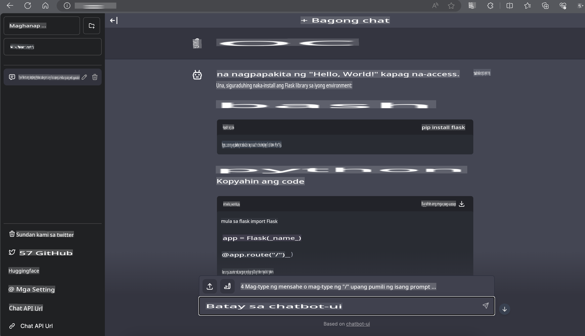

# **Inference Phi-3 sa Nvidia Jetson**

Ang Nvidia Jetson ay isang serye ng mga embedded computing boards mula sa Nvidia. Ang mga modelong Jetson TK1, TX1, at TX2 ay may Tegra processor (o SoC) mula sa Nvidia na may kasamang ARM architecture central processing unit (CPU). Ang Jetson ay isang low-power system na idinisenyo para sa pagpapabilis ng machine learning applications. Ginagamit ang Nvidia Jetson ng mga propesyonal na developer upang lumikha ng makabagong AI products sa iba't ibang industriya, at ng mga estudyante at mahihilig para sa hands-on na pag-aaral ng AI at paggawa ng mga kahanga-hangang proyekto. Ang SLM ay inilalagay sa mga edge device tulad ng Jetson, na magpapabuti sa implementasyon ng mga industrial generative AI application scenarios.

## Deployment sa NVIDIA Jetson:
Ang mga developer na nagtatrabaho sa autonomous robotics at embedded devices ay maaaring makinabang sa Phi-3 Mini. Ang maliit na sukat ng Phi-3 ay ginagawa itong angkop para sa edge deployment. Ang mga parameter ay maingat na inayos habang training, na tinitiyak ang mataas na accuracy ng mga sagot.

### TensorRT-LLM Optimization:
Ang [TensorRT-LLM library](https://github.com/NVIDIA/TensorRT-LLM?WT.mc_id=aiml-138114-kinfeylo) ng NVIDIA ay nag-o-optimize ng inference ng malalaking language model. Sinusuportahan nito ang mahabang context window ng Phi-3 Mini, na nagpapahusay sa throughput at latency. Kasama sa mga optimization ang mga teknik tulad ng LongRoPE, FP8, at inflight batching.

### Availability at Deployment:
Maaaring tuklasin ng mga developer ang Phi-3 Mini na may 128K context window sa [NVIDIA's AI](https://www.nvidia.com/en-us/ai-data-science/generative-ai/). Ito ay naka-package bilang isang NVIDIA NIM, isang microservice na may standard API na maaaring i-deploy kahit saan. Bukod pa rito, narito ang [TensorRT-LLM implementations sa GitHub](https://github.com/NVIDIA/TensorRT-LLM).

## **1. Paghahanda**

a. Jetson Orin NX / Jetson NX

b. JetPack 5.1.2+
   
c. Cuda 11.8
   
d. Python 3.8+

## **2. Pagpapatakbo ng Phi-3 sa Jetson**

Maaari nating piliin ang [Ollama](https://ollama.com) o [LlamaEdge](https://llamaedge.com)

Kung nais mong gamitin ang gguf sa cloud at edge devices nang sabay, maaaring maunawaan ang LlamaEdge bilang WasmEdge (Ang WasmEdge ay isang magaan, high-performance, scalable na WebAssembly runtime na angkop para sa cloud native, edge, at decentralized applications. Sinusuportahan nito ang serverless applications, embedded functions, microservices, smart contracts, at IoT devices. Maaari mong i-deploy ang quantitative model ng gguf sa edge devices at cloud sa pamamagitan ng LlamaEdge.


Narito ang mga hakbang para gamitin ito:

1. I-install at i-download ang mga kaugnay na library at file

```bash

curl -sSf https://raw.githubusercontent.com/WasmEdge/WasmEdge/master/utils/install.sh | bash -s -- --plugin wasi_nn-ggml

curl -LO https://github.com/LlamaEdge/LlamaEdge/releases/latest/download/llama-api-server.wasm

curl -LO https://github.com/LlamaEdge/chatbot-ui/releases/latest/download/chatbot-ui.tar.gz

tar xzf chatbot-ui.tar.gz

```

**Tandaan**: Ang llama-api-server.wasm at chatbot-ui ay kailangang nasa parehong direktoryo

2. Patakbuhin ang mga script sa terminal

```bash

wasmedge --dir .:. --nn-preload default:GGML:AUTO:{Your gguf path} llama-api-server.wasm -p phi-3-chat

```

Narito ang resulta ng pagpapatakbo



***Sample code*** [Phi-3 mini WASM Notebook Sample](https://github.com/Azure-Samples/Phi-3MiniSamples/tree/main/wasm)

Sa kabuuan, ang Phi-3 Mini ay kumakatawan sa isang malaking hakbang pasulong sa language modeling, na pinagsasama ang efficiency, context awareness, at ang optimization expertise ng NVIDIA. Kung ikaw ay gumagawa ng mga robot o edge applications, ang Phi-3 Mini ay isang makapangyarihang kasangkapan na dapat mong malaman.

**Paunawa**:  
Ang dokumentong ito ay isinalin gamit ang mga serbisyo ng machine-based AI translation. Bagama't sinisikap naming maging tumpak, pakitandaan na ang mga awtomatikong pagsasalin ay maaaring maglaman ng mga pagkakamali o kamalian. Ang orihinal na dokumento sa orihinal nitong wika ang dapat ituring na pangunahing sanggunian. Para sa mahalagang impormasyon, inirerekomenda ang propesyonal na pagsasalin ng tao. Hindi kami mananagot sa anumang hindi pagkakaunawaan o maling interpretasyon na dulot ng paggamit ng pagsasaling ito.