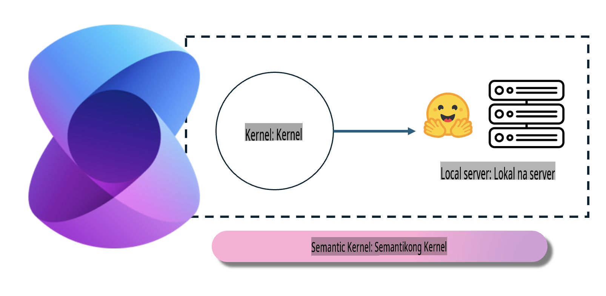
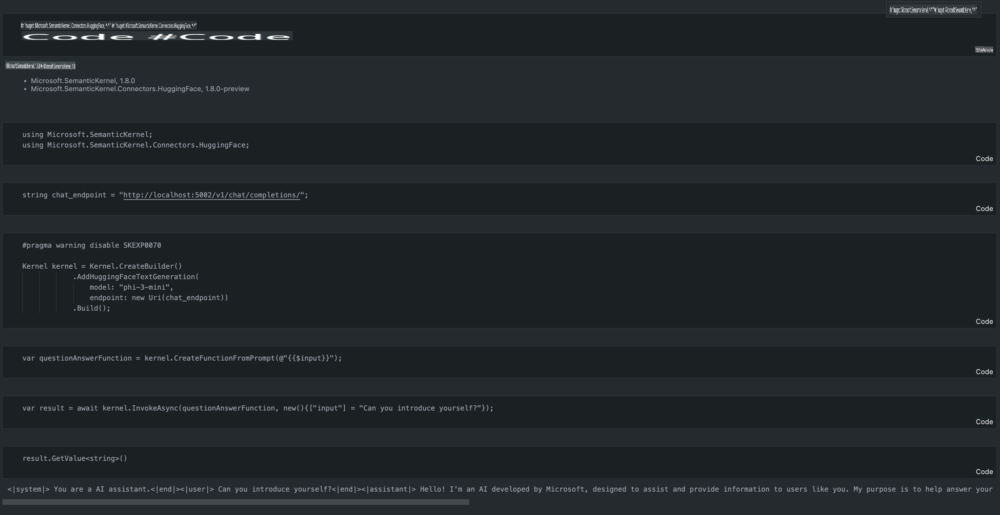

# **Inference Phi-3 sa Lokal na Server**

Maaaring i-deploy ang Phi-3 sa isang lokal na server. Maaaring pumili ang mga user ng [Ollama](https://ollama.com) o [LM Studio](https://llamaedge.com) na mga solusyon, o gumawa ng sarili nilang code. Maaari mong ikonekta ang mga lokal na serbisyo ng Phi-3 gamit ang [Semantic Kernel](https://github.com/microsoft/semantic-kernel?WT.mc_id=aiml-138114-kinfeylo) o [Langchain](https://www.langchain.com/) upang makabuo ng mga Copilot na aplikasyon.

## **Gamitin ang Semantic Kernel para ma-access ang Phi-3-mini**

Sa Copilot na aplikasyon, lumilikha tayo ng mga aplikasyon gamit ang Semantic Kernel / LangChain. Ang ganitong uri ng application framework ay karaniwang tugma sa Azure OpenAI Service / OpenAI na mga modelo, at maaari ring suportahan ang mga open-source na modelo sa Hugging Face at mga lokal na modelo. Ano ang dapat nating gawin kung nais nating gamitin ang Semantic Kernel upang ma-access ang Phi-3-mini? Gamit ang .NET bilang halimbawa, maaari natin itong pagsamahin sa Hugging Face Connector sa Semantic Kernel. Sa default na setting, maaari itong tumukoy sa model id sa Hugging Face (sa unang paggamit, ida-download ang modelo mula sa Hugging Face, na maaaring tumagal ng matagal). Maaari mo ring ikonekta ito sa naitayong lokal na serbisyo. Sa paghahambing ng dalawa, mas inirerekomenda naming gamitin ang huli dahil mas mataas ang antas ng awtonomiya nito, lalo na sa mga aplikasyon sa negosyo.

Mula sa larawan, ang pag-access sa mga lokal na serbisyo gamit ang Semantic Kernel ay madaling makakonekta sa sariling Phi-3-mini model server. Narito ang resulta ng pagpapatakbo:

***Halimbawa ng Code*** https://github.com/kinfey/Phi3MiniSamples/tree/main/semantickernel

**Paunawa**:  
Ang dokumentong ito ay isinalin gamit ang mga serbisyo ng AI-based na pagsasalin. Bagama't sinisikap naming maging tumpak, pakitandaan na ang mga awtomatikong pagsasalin ay maaaring maglaman ng mga pagkakamali o hindi pagkakatumpak. Ang orihinal na dokumento sa orihinal nitong wika ang dapat ituring na opisyal na sanggunian. Para sa mahalagang impormasyon, inirerekomenda ang propesyonal na pagsasalin ng tao. Hindi kami mananagot para sa anumang hindi pagkakaunawaan o maling interpretasyon na dulot ng paggamit ng pagsasaling ito.