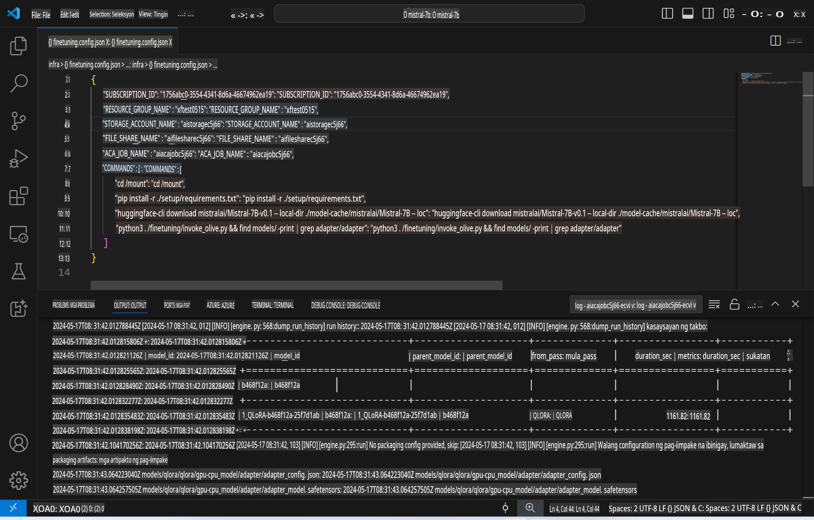
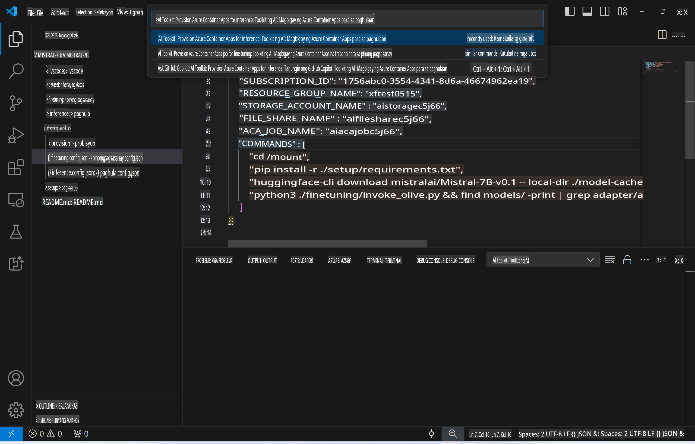
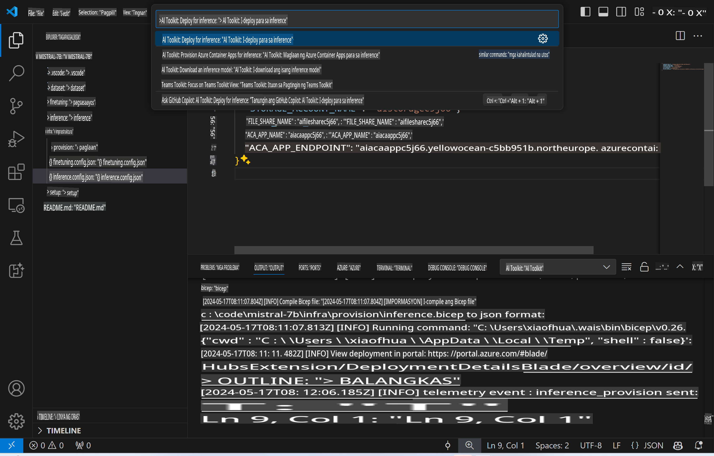
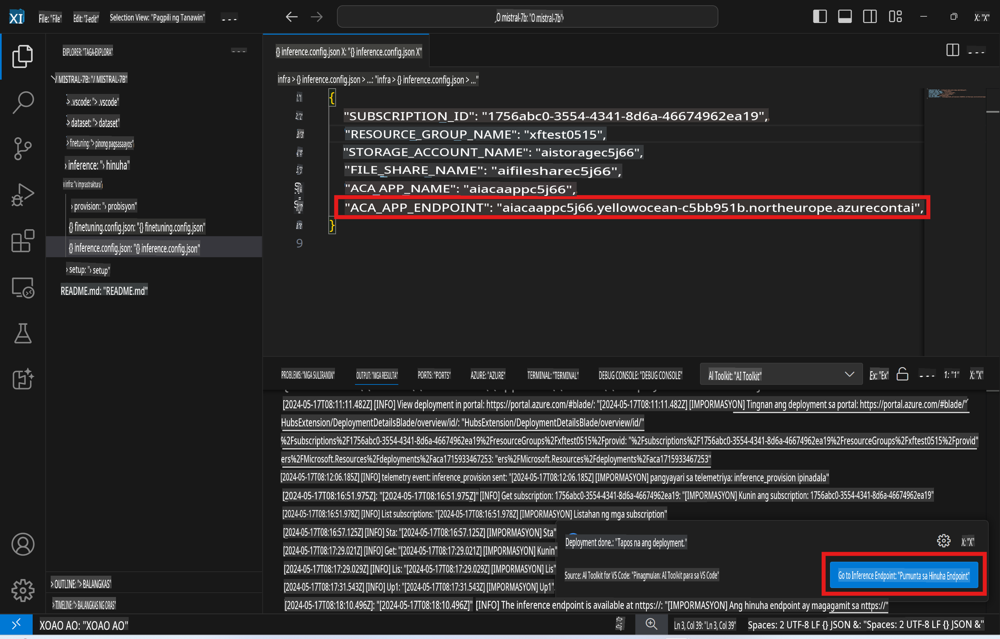

# Remote Inferencing gamit ang fine-tuned na modelo

Pagkatapos ma-train ang adapters sa remote na environment, gumamit ng simpleng Gradio application para makipag-interact sa modelo.



### Mag-set up ng Azure Resources
Kailangan mong i-set up ang Azure Resources para sa remote inference sa pamamagitan ng pag-execute ng `AI Toolkit: Provision Azure Container Apps for inference` mula sa command palette. Sa panahon ng setup na ito, hihilingin sa iyong pumili ng iyong Azure Subscription at resource group.  


Sa default na setting, dapat magkatugma ang subscription at resource group para sa inference sa mga ginamit sa fine-tuning. Gagamitin ng inference ang parehong Azure Container App Environment at maa-access ang modelo at model adapter na nakaimbak sa Azure Files, na nabuo sa panahon ng fine-tuning step.

## Paggamit ng AI Toolkit 

### Deployment para sa Inference  
Kung nais mong baguhin ang inference code o i-reload ang inference model, i-execute ang `AI Toolkit: Deploy for inference` command. I-synchronize nito ang iyong pinakabagong code sa ACA at ire-restart ang replica.  



Pagkatapos ng matagumpay na deployment, handa na ang modelo para sa evaluation gamit ang endpoint na ito.

### Pag-access sa Inference API

Maaaring ma-access ang inference API sa pamamagitan ng pag-click sa "*Go to Inference Endpoint*" button na makikita sa VSCode notification. Bilang alternatibo, ang web API endpoint ay matatagpuan sa ilalim ng `ACA_APP_ENDPOINT` sa `./infra/inference.config.json` at sa output panel.



> **Note:** Maaaring tumagal ng ilang minuto bago maging ganap na operational ang inference endpoint.

## Mga Bahagi ng Inference na Kasama sa Template
 
| Folder | Nilalaman |
| ------ |--------- |
| `infra` | Naglalaman ng lahat ng kinakailangang configuration para sa remote operations. |
| `infra/provision/inference.parameters.json` | Naglalaman ng mga parameter para sa bicep templates, na ginagamit sa pag-provision ng Azure resources para sa inference. |
| `infra/provision/inference.bicep` | Naglalaman ng mga template para sa pag-provision ng Azure resources para sa inference. |
| `infra/inference.config.json` | Ang configuration file na nabuo ng `AI Toolkit: Provision Azure Container Apps for inference` command. Ginagamit ito bilang input para sa iba pang remote command palettes. |

### Paggamit ng AI Toolkit para sa pag-configure ng Azure Resource Provision
I-configure ang [AI Toolkit](https://marketplace.visualstudio.com/items?itemName=ms-windows-ai-studio.windows-ai-studio)

I-provision ang Azure Container Apps para sa inference` command.

You can find configuration parameters in `./infra/provision/inference.parameters.json` file. Here are the details:
| Parameter | Description |
| --------- |------------ |
| `defaultCommands` | This is the commands to initiate a web API. |
| `maximumInstanceCount` | This parameter sets the maximum capacity of GPU instances. |
| `location` | This is the location where Azure resources are provisioned. The default value is the same as the chosen resource group's location. |
| `storageAccountName`, `fileShareName` `acaEnvironmentName`, `acaEnvironmentStorageName`, `acaAppName`,  `acaLogAnalyticsName` | These parameters are used to name the Azure resources for provision. By default, they will be same to the fine-tuning resource name. You can input a new, unused resource name to create your own custom-named resources, or you can input the name of an already existing Azure resource if you'd prefer to use that. For details, refer to the section [Using existing Azure Resources](../../../../../md/01.Introduction/03). |

### Using Existing Azure Resources

By default, the inference provision use the same Azure Container App Environment, Storage Account, Azure File Share, and Azure Log Analytics that were used for fine-tuning. A separate Azure Container App is created solely for the inference API. 

If you have customized the Azure resources during the fine-tuning step or want to use your own existing Azure resources for inference, specify their names in the `./infra/inference.parameters.json` file. Pagkatapos, patakbuhin ang `AI Toolkit: Provision Azure Container Apps for inference` command mula sa command palette. Ina-update nito ang anumang tinukoy na resources at lumilikha ng mga wala pa.

Halimbawa, kung mayroon kang umiiral na Azure container environment, ang iyong `./infra/finetuning.parameters.json` ay dapat ganito ang hitsura:

```json
{
    "$schema": "https://schema.management.azure.com/schemas/2019-04-01/deploymentParameters.json#",
    "contentVersion": "1.0.0.0",
    "parameters": {
      ...
      "acaEnvironmentName": {
        "value": "<your-aca-env-name>"
      },
      "acaEnvironmentStorageName": {
        "value": null
      },
      ...
    }
  }
```

### Manual Provision  
Kung mas gusto mong manu-manong i-configure ang Azure resources, maaari mong gamitin ang mga ibinigay na bicep files sa `./infra/provision` folders. If you have already set up and configured all the Azure resources without using the AI Toolkit command palette, you can simply enter the resource names in the `inference.config.json` file.

Halimbawa:

```json
{
  "SUBSCRIPTION_ID": "<your-subscription-id>",
  "RESOURCE_GROUP_NAME": "<your-resource-group-name>",
  "STORAGE_ACCOUNT_NAME": "<your-storage-account-name>",
  "FILE_SHARE_NAME": "<your-file-share-name>",
  "ACA_APP_NAME": "<your-aca-name>",
  "ACA_APP_ENDPOINT": "<your-aca-endpoint>"
}
```

**Paunawa**:  
Ang dokumentong ito ay isinalin gamit ang mga serbisyo ng AI na nakabatay sa makina. Habang pinagsisikapan naming maging tumpak, pakitandaan na ang mga awtomatikong pagsasalin ay maaaring maglaman ng mga pagkakamali o hindi tumpak na impormasyon. Ang orihinal na dokumento sa orihinal nitong wika ang dapat ituring na opisyal na sanggunian. Para sa mahalagang impormasyon, inirerekomenda ang propesyonal na pagsasalin ng tao. Hindi kami mananagot sa anumang hindi pagkakaunawaan o maling interpretasyon na dulot ng paggamit ng pagsasaling ito.