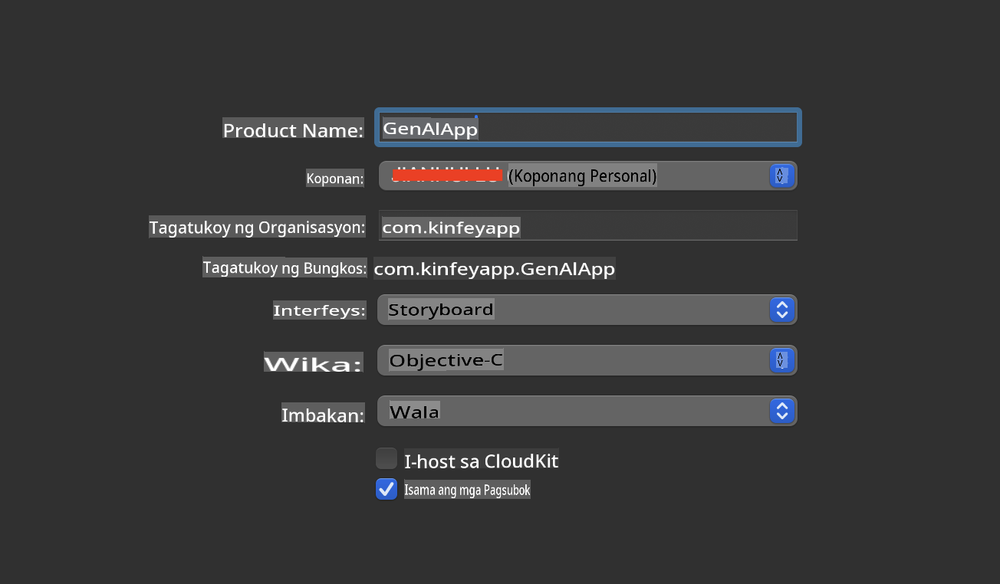
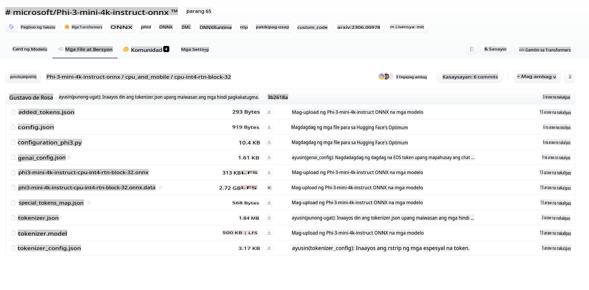
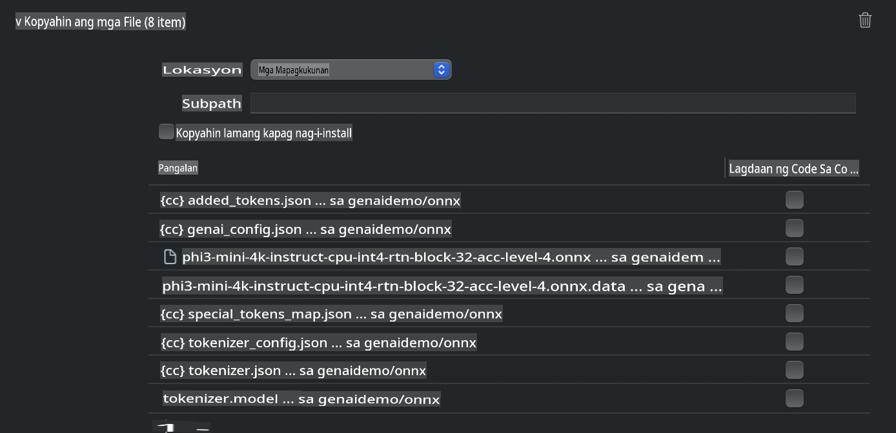
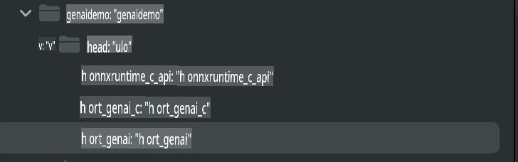
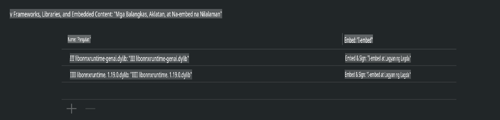
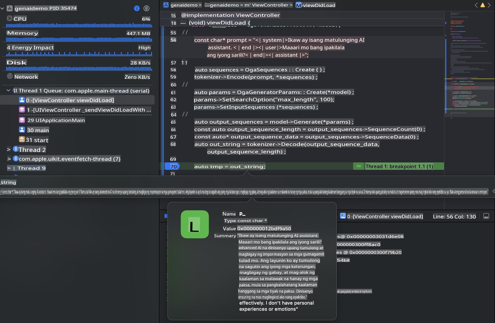

# **Inference Phi-3 sa iOS**

Ang Phi-3-mini ay isang bagong serye ng mga modelo mula sa Microsoft na nagbibigay-daan sa deployment ng Large Language Models (LLMs) sa mga edge device at IoT device. Ang Phi-3-mini ay magagamit para sa iOS, Android, at Edge Device deployments, na nagbibigay-daan sa paggamit ng generative AI sa BYOD environments. Ang sumusunod na halimbawa ay nagpapakita kung paano i-deploy ang Phi-3-mini sa iOS.

## **1. Paghahanda**

- **a.** macOS 14+
- **b.** Xcode 15+
- **c.** iOS SDK 17.x (iPhone 14 A16 o mas bago)
- **d.** Mag-install ng Python 3.10+ (inirerekomenda ang Conda)
- **e.** I-install ang Python library: `python-flatbuffers`
- **f.** Mag-install ng CMake

### Semantic Kernel at Inference

Ang Semantic Kernel ay isang application framework na nagbibigay-daan sa paggawa ng mga application na compatible sa Azure OpenAI Service, OpenAI models, at maging sa mga lokal na modelo. Sa pamamagitan ng Semantic Kernel, madali kang makakakonekta sa iyong self-hosted Phi-3-mini model server.

### Pagtawag ng Quantized Models gamit ang Ollama o LlamaEdge

Maraming user ang mas gustong gumamit ng quantized models para patakbuhin ang mga modelo nang lokal. Ang [Ollama](https://ollama.com) at [LlamaEdge](https://llamaedge.com) ay nagbibigay-daan sa pagtawag ng iba't ibang quantized models:

#### **Ollama**

Maaari mong patakbuhin ang `ollama run phi3` nang direkta o i-configure ito offline. Gumawa ng Modelfile na may path papunta sa iyong `gguf` file. Halimbawa ng code para sa pagpapatakbo ng Phi-3-mini quantized model:

```gguf
FROM {Add your gguf file path}
TEMPLATE \"\"\"<|user|> .Prompt<|end|> <|assistant|>\"\"\"
PARAMETER stop <|end|>
PARAMETER num_ctx 4096
```

#### **LlamaEdge**

Kung nais mong gamitin ang `gguf` sa parehong cloud at edge devices nang sabay, ang LlamaEdge ay isang mahusay na opsyon.

## **2. Pag-compile ng ONNX Runtime para sa iOS**

```bash

git clone https://github.com/microsoft/onnxruntime.git

cd onnxruntime

./build.sh --build_shared_lib --ios --skip_tests --parallel --build_dir ./build_ios --ios --apple_sysroot iphoneos --osx_arch arm64 --apple_deploy_target 17.5 --cmake_generator Xcode --config Release

cd ../

```

### **Paalala**

- **a.** Bago mag-compile, siguraduhing tama ang pagkaka-configure ng Xcode at itakda ito bilang active developer directory sa terminal:

    ```bash
    sudo xcode-select -switch /Applications/Xcode.app/Contents/Developer
    ```

- **b.** Kailangang i-compile ang ONNX Runtime para sa iba't ibang platform. Para sa iOS, maaari kang mag-compile para sa `arm64` or `x86_64`.

- **c.** Inirerekomenda na gamitin ang pinakabagong iOS SDK para sa pag-compile. Gayunpaman, maaari mo ring gamitin ang mas lumang bersyon kung kailangan ng compatibility sa mga nakaraang SDK.

## **3. Pag-compile ng Generative AI gamit ang ONNX Runtime para sa iOS**

> **Paalala:** Dahil ang Generative AI gamit ang ONNX Runtime ay nasa preview pa lamang, asahan ang mga posibleng pagbabago.

```bash

git clone https://github.com/microsoft/onnxruntime-genai
 
cd onnxruntime-genai
 
mkdir ort
 
cd ort
 
mkdir include
 
mkdir lib
 
cd ../
 
cp ../onnxruntime/include/onnxruntime/core/session/onnxruntime_c_api.h ort/include
 
cp ../onnxruntime/build_ios/Release/Release-iphoneos/libonnxruntime*.dylib* ort/lib
 
export OPENCV_SKIP_XCODEBUILD_FORCE_TRYCOMPILE_DEBUG=1
 
python3 build.py --parallel --build_dir ./build_ios --ios --ios_sysroot iphoneos --ios_arch arm64 --ios_deployment_target 17.5 --cmake_generator Xcode --cmake_extra_defines CMAKE_XCODE_ATTRIBUTE_CODE_SIGNING_ALLOWED=NO

```

## **4. Gumawa ng App application sa Xcode**

Pinili ko ang Objective-C bilang paraan ng pag-develop ng App, dahil mas compatible ito sa Generative AI gamit ang ONNX Runtime C++ API. Siyempre, maaari mo ring gamitin ang Swift bridging para makumpleto ang mga kaugnay na tawag.



## **5. Kopyahin ang ONNX quantized INT4 model sa App application project**

Kailangan nating i-import ang INT4 quantization model sa ONNX format, na kailangang i-download muna.



Matapos ma-download, kailangan mo itong idagdag sa Resources directory ng proyekto sa Xcode.



## **6. Idagdag ang C++ API sa ViewControllers**

> **Paalala:**

- **a.** Idagdag ang mga kaukulang C++ header files sa proyekto.

  

- **b.** Isama ang `onnxruntime-genai` dynamic library in Xcode.

  

- **c.** Use the C Samples code for testing. You can also add additional features like ChatUI for more functionality.

- **d.** Since you need to use C++ in your project, rename `ViewController.m` to `ViewController.mm` upang paganahin ang Objective-C++ support.

```objc

    NSString *llmPath = [[NSBundle mainBundle] resourcePath];
    char const *modelPath = llmPath.cString;

    auto model =  OgaModel::Create(modelPath);

    auto tokenizer = OgaTokenizer::Create(*model);

    const char* prompt = "<|system|>You are a helpful AI assistant.<|end|><|user|>Can you introduce yourself?<|end|><|assistant|>";

    auto sequences = OgaSequences::Create();
    tokenizer->Encode(prompt, *sequences);

    auto params = OgaGeneratorParams::Create(*model);
    params->SetSearchOption("max_length", 100);
    params->SetInputSequences(*sequences);

    auto output_sequences = model->Generate(*params);
    const auto output_sequence_length = output_sequences->SequenceCount(0);
    const auto* output_sequence_data = output_sequences->SequenceData(0);
    auto out_string = tokenizer->Decode(output_sequence_data, output_sequence_length);
    
    auto tmp = out_string;

```

## **7. Patakbuhin ang Application**

Kapag tapos na ang setup, maaari mong patakbuhin ang application upang makita ang resulta ng Phi-3-mini model inference.



Para sa higit pang sample code at detalyadong mga tagubilin, bisitahin ang [Phi-3 Mini Samples repository](https://github.com/Azure-Samples/Phi-3MiniSamples/tree/main/ios).

**Paunawa**:  
Ang dokumentong ito ay isinalin gamit ang mga serbisyo ng AI-based na pagsasalin. Bagamat sinisikap naming maging tumpak, pakitandaan na ang mga awtomatikong pagsasalin ay maaaring maglaman ng mga pagkakamali o kamalian. Ang orihinal na dokumento sa kanyang katutubong wika ang dapat ituring na opisyal na sanggunian. Para sa mahahalagang impormasyon, inirerekomenda ang propesyonal na pagsasalin ng tao. Hindi kami mananagot sa anumang maling pagkaunawa o interpretasyon na dulot ng paggamit ng pagsasaling ito.