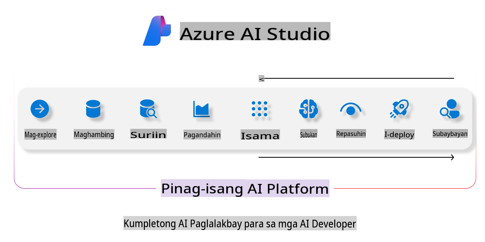
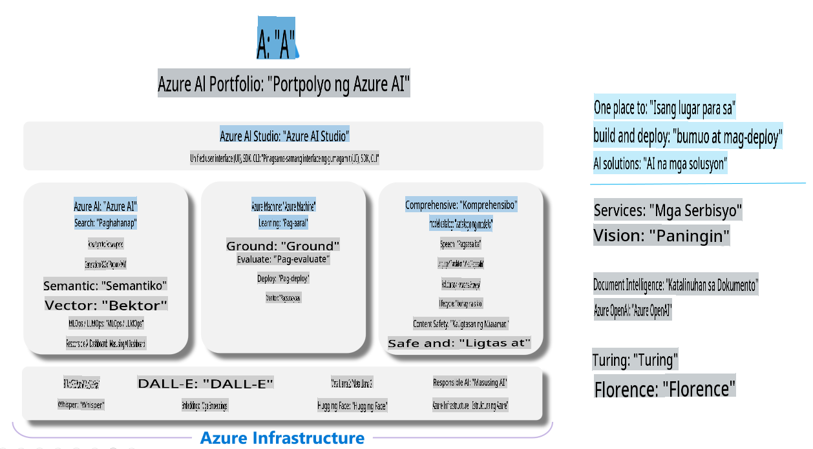

# **Paggamit ng Azure AI Foundry para sa pagsusuri**

Paano suriin ang iyong generative AI application gamit ang [Azure AI Foundry](https://ai.azure.com?WT.mc_id=aiml-138114-kinfeylo). Kung ikaw ay nagsusuri ng single-turn o multi-turn na mga pag-uusap, nagbibigay ang Azure AI Foundry ng mga tool para sa pagsusuri ng performance at kaligtasan ng modelo. 

## Paano suriin ang generative AI apps gamit ang Azure AI Foundry
Para sa mas detalyadong gabay, tingnan ang [Azure AI Foundry Documentation](https://learn.microsoft.com/azure/ai-studio/how-to/evaluate-generative-ai-app?WT.mc_id=aiml-138114-kinfeylo)

Narito ang mga hakbang upang makapagsimula:

## Pagsusuri ng Generative AI Models sa Azure AI Foundry

**Mga Kinakailangan**

- Isang test dataset sa format na CSV o JSON.
- Isang na-deploy na generative AI model (tulad ng Phi-3, GPT 3.5, GPT 4, o Davinci models).
- Isang runtime na may compute instance para sa pagsusuri.

## Mga Nakapaloob na Sukatan ng Pagsusuri

Pinapayagan ka ng Azure AI Foundry na suriin ang parehong single-turn at masalimuot na multi-turn na mga pag-uusap.  
Para sa Retrieval Augmented Generation (RAG) na mga senaryo, kung saan ang modelo ay nakabase sa partikular na data, maaari mong tasahin ang performance gamit ang mga nakapaloob na sukatan ng pagsusuri.  
Bukod dito, maaari mo ring suriin ang pangkalahatang single-turn na mga senaryo ng tanong at sagot (hindi-RAG).

## Paglikha ng Evaluation Run

Mula sa Azure AI Foundry UI, pumunta sa Evaluate page o Prompt Flow page.  
Sundin ang evaluation creation wizard upang i-set up ang evaluation run. Magbigay ng opsyonal na pangalan para sa iyong pagsusuri.  
Piliin ang senaryo na naaayon sa layunin ng iyong application.  
Pumili ng isa o higit pang evaluation metrics upang tasahin ang output ng modelo.

## Custom Evaluation Flow (Opsyonal)

Para sa mas mataas na flexibility, maaari kang magtakda ng custom evaluation flow. I-customize ang proseso ng pagsusuri base sa iyong partikular na pangangailangan.

## Pagtingin sa Mga Resulta

Matapos ang pagsusuri, i-log, tingnan, at suriin ang mga detalyadong sukatan ng pagsusuri sa Azure AI Foundry. Alamin ang mga kakayahan at limitasyon ng iyong application.

**Tandaan** Ang Azure AI Foundry ay kasalukuyang nasa public preview, kaya gamitin ito para sa eksperimento at layuning pag-develop. Para sa mga production workload, isaalang-alang ang ibang mga opsyon. Bisitahin ang opisyal na [AI Foundry documentation](https://learn.microsoft.com/azure/ai-studio/?WT.mc_id=aiml-138114-kinfeylo) para sa higit pang detalye at step-by-step na mga tagubilin.

**Paunawa**:  
Ang dokumentong ito ay isinalin gamit ang mga serbisyo ng AI na nakabatay sa makina. Habang sinisikap naming maging wasto, pakitandaan na ang mga awtomatikong salin ay maaaring maglaman ng mga pagkakamali o hindi tumpak na impormasyon. Ang orihinal na dokumento sa sariling wika nito ang dapat ituring na opisyal na pinagmulan. Para sa mahalagang impormasyon, inirerekomenda ang propesyonal na pagsasalin ng tao. Hindi kami mananagot sa anumang hindi pagkakaunawaan o maling interpretasyon na dulot ng paggamit ng salin na ito.