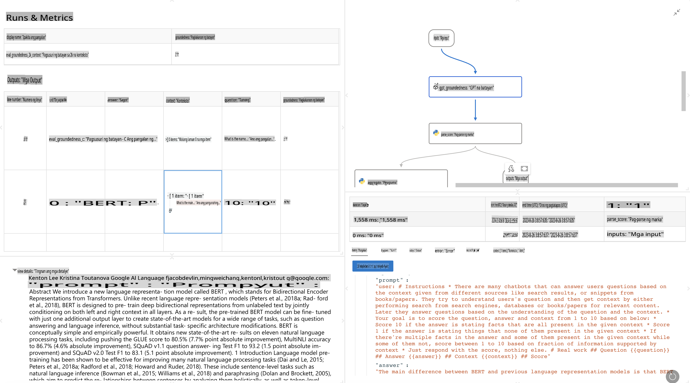

# **Ipakilala ang Promptflow**

[Microsoft Prompt Flow](https://microsoft.github.io/promptflow/index.html?WT.mc_id=aiml-138114-kinfeylo) ay isang visual workflow automation tool na nagbibigay-daan sa mga user na lumikha ng mga automated na proseso gamit ang mga pre-built na template at custom connectors. Dinisenyo ito upang tulungan ang mga developer at business analysts na mabilis na makabuo ng mga automated na proseso para sa mga gawain tulad ng pamamahala ng data, kolaborasyon, at pag-optimize ng proseso. Sa Prompt Flow, madali mong maikokonekta ang iba't ibang serbisyo, aplikasyon, at sistema, at maia-automate ang masalimuot na mga proseso ng negosyo.

Ang Microsoft Prompt Flow ay idinisenyo upang gawing mas madali ang buong proseso ng pagbuo ng AI applications na pinapagana ng Large Language Models (LLMs). Mula sa ideation, prototyping, testing, evaluation, hanggang deployment ng mga LLM-based na aplikasyon, pinapasimple ng Prompt Flow ang proseso at nagbibigay-daan sa iyo na makabuo ng mga LLM app na may kalidad na pang-produksyon.

## Narito ang mga pangunahing tampok at benepisyo ng paggamit ng Microsoft Prompt Flow:

**Interactive Authoring Experience**

Nagbibigay ang Prompt Flow ng visual na representasyon ng istruktura ng iyong flow, kaya't madali mong mauunawaan at malilinang ang iyong mga proyekto.  
Nag-aalok ito ng notebook-like coding experience para sa mas episyenteng pagbuo at pag-debug ng mga flow.

**Prompt Variants at Pagsasaayos**

Lumikha at ikumpara ang iba't ibang bersyon ng prompt upang mapadali ang iterative na proseso ng pagpapabuti.  
Suriin ang performance ng iba't ibang prompt at piliin ang pinaka-epektibo.

**Built-in Evaluation Flows**

Suriin ang kalidad at pagiging epektibo ng iyong mga prompt at flow gamit ang mga built-in evaluation tools.  
Unawain kung gaano kahusay ang performance ng iyong mga LLM-based na aplikasyon.

**Komprehensibong Resources**

Kasama sa Prompt Flow ang isang library ng built-in na mga tool, halimbawa, at template.  
Ang mga resource na ito ay nagsisilbing panimulang punto para sa pagbuo, nagbibigay-inspirasyon, at nagpapabilis ng proseso.

**Kolaborasyon at Enterprise Readiness**

Suportahan ang kolaborasyon ng team sa pamamagitan ng pagpapahintulot sa maraming user na magtulungan sa mga prompt engineering na proyekto.  
Panatilihin ang version control at magbahagi ng kaalaman nang epektibo.  
Pasimplehin ang buong proseso ng prompt engineering mula sa pagbuo at pagsusuri hanggang sa deployment at monitoring.

## Pagsusuri sa Prompt Flow

Sa Microsoft Prompt Flow, mahalaga ang pagsusuri upang matukoy kung gaano kahusay ang performance ng iyong AI models. Tingnan natin kung paano mo maisasaayos ang evaluation flows at metrics sa loob ng Prompt Flow:

**Pag-unawa sa Evaluation sa Prompt Flow**

Sa Prompt Flow, ang flow ay kumakatawan sa isang sequence ng nodes na nagpoproseso ng input at lumilikha ng output.  
Ang evaluation flows ay espesyal na uri ng flow na dinisenyo upang suriin ang performance ng isang run batay sa partikular na pamantayan at layunin.

**Pangunahing Tampok ng Evaluation Flows**

Karaniwan itong tumatakbo pagkatapos ng flow na sinusuri, gamit ang mga output nito.  
Kinakalkula nila ang mga score o metrics upang masukat ang performance ng sinusuring flow.  
Ang mga metrics ay maaaring accuracy, relevance scores, o iba pang kaugnay na sukat.

### Pag-customize ng Evaluation Flows

**Pagde-define ng Inputs**

Kailangang tanggapin ng evaluation flows ang mga output ng run na sinusuri.  
I-define ang inputs katulad ng sa mga standard flow.  
Halimbawa, kung sinusuri mo ang isang QnA flow, pangalanan ang isang input bilang "answer." Kung sinusuri ang isang classification flow, pangalanan ang isang input bilang "category." Maaaring kailanganin din ang ground truth inputs (hal., aktwal na mga label).

**Outputs at Metrics**

Nagpo-produce ang evaluation flows ng mga resulta na sumusukat sa performance ng sinusuring flow.  
Maaaring kalkulahin ang metrics gamit ang Python o LLM (Large Language Models).  
Gamitin ang log_metric() function upang mag-log ng mga kaugnay na metrics.

**Paggamit ng Customized Evaluation Flows**

Bumuo ng sarili mong evaluation flow na angkop sa iyong partikular na mga gawain at layunin.  
I-customize ang metrics batay sa iyong evaluation goals.  
I-apply ang customized evaluation flow na ito sa batch runs para sa malakihang pagsusuri.

## Built-in Evaluation Methods

Nagbibigay din ang Prompt Flow ng built-in evaluation methods.  
Maaari kang mag-submit ng batch runs at gamitin ang mga method na ito upang suriin kung gaano kahusay ang performance ng iyong flow gamit ang malalaking datasets.  
Tingnan ang evaluation results, ikumpara ang mga metrics, at ulitin kung kinakailangan.  
Tandaan, mahalaga ang pagsusuri upang matiyak na ang iyong AI models ay umaabot sa mga nais na pamantayan at layunin.  
Suriin ang opisyal na dokumentasyon para sa detalyadong mga tagubilin sa pagbuo at paggamit ng evaluation flows sa Microsoft Prompt Flow.

Sa kabuuan, ang Microsoft Prompt Flow ay nagbibigay-kapangyarihan sa mga developer na makabuo ng mga dekalidad na LLM applications sa pamamagitan ng pagpapadali sa prompt engineering at pagbibigay ng matibay na development environment. Kung ikaw ay nagtatrabaho gamit ang LLMs, ang Prompt Flow ay isang mahalagang tool na dapat mong subukan. Suriin ang [Prompt Flow Evaluation Documents](https://learn.microsoft.com/azure/machine-learning/prompt-flow/how-to-develop-an-evaluation-flow?view=azureml-api-2?WT.mc_id=aiml-138114-kinfeylo) para sa detalyadong mga tagubilin sa pagbuo at paggamit ng evaluation flows sa Microsoft Prompt Flow.

**Paunawa**:  
Ang dokumentong ito ay isinalin gamit ang mga serbisyong AI na batay sa makina. Habang pinagsisikapan naming maging wasto, pakitandaan na ang mga awtomatikong salin ay maaaring maglaman ng mga pagkakamali o hindi pagkakatugma. Ang orihinal na dokumento sa orihinal nitong wika ang dapat ituring na mapagkakatiwalaang sanggunian. Para sa mahalagang impormasyon, inirerekomenda ang propesyonal na pagsasalin ng tao. Hindi kami mananagot sa anumang hindi pagkakaunawaan o maling interpretasyon na dulot ng paggamit ng salin na ito.