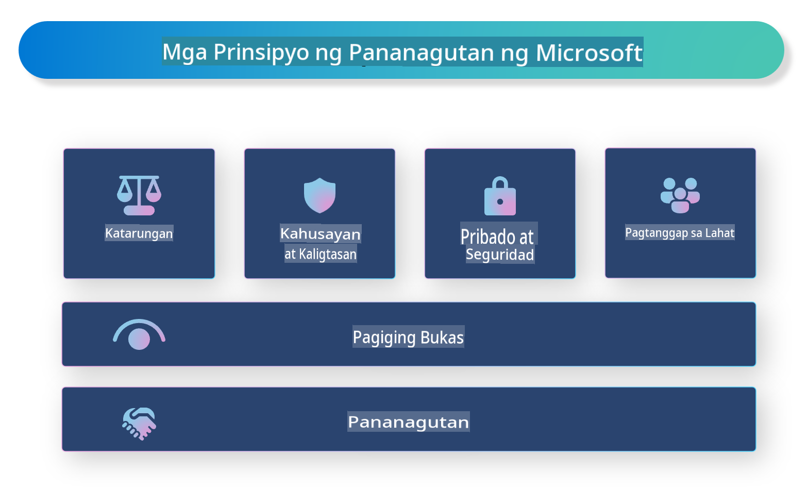

# **Ipakilala ang Responsible AI**

[Microsoft Responsible AI](https://www.microsoft.com/ai/responsible-ai?WT.mc_id=aiml-138114-kinfeylo) ay isang inisyatibo na naglalayong tulungan ang mga developer at organisasyon na bumuo ng mga AI system na transparent, mapagkakatiwalaan, at may pananagutan. Ang inisyatibong ito ay nagbibigay ng gabay at mga mapagkukunan para sa pagbuo ng responsableng AI na naaayon sa mga etikal na prinsipyo tulad ng privacy, katarungan, at transparency. Tatalakayin din natin ang ilang mga hamon at pinakamahusay na kasanayan na kaugnay sa pagbuo ng responsableng AI.

## Pangkalahatang-ideya ng Microsoft Responsible AI 

**Mga Prinsipyong Etikal** 

Ang Microsoft Responsible AI ay ginagabayan ng mga prinsipyong etikal tulad ng privacy, katarungan, transparency, pananagutan, at kaligtasan. Ang mga prinsipyong ito ay idinisenyo upang matiyak na ang mga AI system ay binuo sa isang etikal at responsableng paraan.

**Transparent na AI**

Binibigyang-diin ng Microsoft Responsible AI ang kahalagahan ng transparency sa mga AI system. Kabilang dito ang pagbibigay ng malinaw na paliwanag kung paano gumagana ang mga AI model, gayundin ang pagtiyak na ang mga pinagkukunan ng data at mga algorithm ay pampubliko at madaling ma-access.

**AI na may Pananagutan** 

[Microsoft Responsible AI](https://www.microsoft.com/ai/responsible-ai?WT.mc_id=aiml-138114-kinfeylo) ay nagtataguyod ng pagbuo ng mga AI system na may pananagutan, na nagbibigay ng mga pananaw kung paano gumagawa ng desisyon ang mga AI model. Makakatulong ito sa mga user na maunawaan at magtiwala sa mga resulta ng mga AI system.

**Pagiging Inklusibo** 

Ang mga AI system ay dapat idisenyo upang makinabang ang lahat. Layunin ng Microsoft na lumikha ng inklusibong AI na isinasaalang-alang ang magkakaibang pananaw at iniiwasan ang bias o diskriminasyon.

**Pagiging Maaasahan at Ligtas**

Napakahalaga ng pagtiyak na ang mga AI system ay maaasahan at ligtas. Nakatuon ang Microsoft sa pagbuo ng mga matitibay na modelong gumaganap nang pare-pareho at iniiwasan ang mga mapaminsalang resulta.

**Katarungan sa AI** 

Kinilala ng Microsoft Responsible AI na ang mga AI system ay maaaring magpatuloy ng bias kung ang mga ito ay sinanay gamit ang biased na data o algorithm. Nagbibigay ang inisyatibo ng gabay para sa pagbuo ng patas na AI system na hindi nagdidiskrimina batay sa mga salik tulad ng lahi, kasarian, o edad.

**Privacy at Seguridad** 

Binibigyang-diin ng Microsoft Responsible AI ang kahalagahan ng pagprotekta sa privacy ng mga user at seguridad ng data sa mga AI system. Kabilang dito ang pagpapatupad ng malalakas na pag-encrypt ng data at mga kontrol sa pag-access, gayundin ang regular na pag-audit sa mga AI system para sa mga kahinaan.

**Pananagutan at Responsibilidad** 

Itinataguyod ng Microsoft Responsible AI ang pananagutan at responsibilidad sa pagbuo at paggamit ng AI. Kabilang dito ang pagtiyak na ang mga developer at organisasyon ay may kamalayan sa mga potensyal na panganib na kaugnay ng mga AI system, at gumagawa ng mga hakbang upang mabawasan ang mga panganib na ito.

## Pinakamahusay na kasanayan para sa pagbuo ng responsableng AI system

**Gumamit ng magkakaibang data sets sa pagbuo ng AI models** 

Upang maiwasan ang bias sa mga AI system, mahalagang gumamit ng magkakaibang data sets na kumakatawan sa iba't ibang pananaw at karanasan.

**Gamitin ang mga explainable AI techniques** 

Makakatulong ang explainable AI techniques sa mga user na maunawaan kung paano gumagawa ng desisyon ang mga AI model, na maaaring magpapataas ng tiwala sa sistema.

**Regular na i-audit ang mga AI system para sa mga kahinaan** 

Ang regular na pag-audit ng mga AI system ay makakatulong upang matukoy ang mga potensyal na panganib at kahinaan na kailangang tugunan.

**Magpatupad ng malalakas na pag-encrypt ng data at mga kontrol sa pag-access** 

Makakatulong ang pag-encrypt ng data at mga kontrol sa pag-access upang maprotektahan ang privacy at seguridad ng mga user sa mga AI system.

**Sundin ang mga etikal na prinsipyo sa pagbuo ng AI** 

Ang pagsunod sa mga etikal na prinsipyo tulad ng katarungan, transparency, at pananagutan ay makakatulong sa pagbuo ng tiwala sa mga AI system at matiyak na ang mga ito ay binuo sa responsableng paraan.

## Paggamit ng AI Foundry para sa Responsible AI 

[Azure AI Foundry](https://ai.azure.com?WT.mc_id=aiml-138114-kinfeylo) ay isang makapangyarihang platform na nagpapahintulot sa mga developer at organisasyon na mabilis na lumikha ng matatalino, makabago, handa sa merkado, at responsableng aplikasyon. Narito ang ilang pangunahing tampok at kakayahan ng Azure AI Foundry:

**Out-of-the-Box APIs at Models** 

Nagbibigay ang Azure AI Foundry ng mga pre-built at customizable na APIs at models. Sinasaklaw nito ang iba't ibang AI tasks, kabilang ang generative AI, natural language processing para sa mga pag-uusap, paghahanap, monitoring, pagsasalin, pagsasalita, bisyon, at paggawa ng desisyon.

**Prompt Flow** 

Ang prompt flow sa Azure AI Foundry ay nagpapahintulot sa iyo na lumikha ng mga karanasang conversational AI. Pinapadali nito ang pagdisenyo at pamamahala ng mga conversational flow, na kapaki-pakinabang para sa paggawa ng mga chatbot, virtual assistant, at iba pang interactive na aplikasyon.

**Retrieval Augmented Generation (RAG)** 

Ang RAG ay isang teknik na pinagsasama ang retrieval-based at generative-based na mga diskarte. Pinapahusay nito ang kalidad ng mga generated na sagot sa pamamagitan ng paggamit ng parehong pre-existing na kaalaman (retrieval) at malikhaing pagbuo (generation).

**Mga Panukat para sa Pagsusuri at Pagsubaybay ng Generative AI** 

Nagbibigay ang Azure AI Foundry ng mga tool para sa pagsusuri at pagsubaybay ng mga generative AI model. Maaari mong tasahin ang kanilang performance, katarungan, at iba pang mahahalagang panukat upang matiyak ang responsableng paggamit. Bukod dito, kung lumikha ka ng dashboard, maaari mong gamitin ang no-code UI sa Azure Machine Learning Studio upang i-customize at lumikha ng Responsible AI Dashboard at kaugnay na scorecard batay sa [Responsible AI Toolbox](https://responsibleaitoolbox.ai/?WT.mc_id=aiml-138114-kinfeylo) Python Libraries. Ang scorecard na ito ay tumutulong sa pagbabahagi ng mga pangunahing pananaw na may kaugnayan sa katarungan, kahalagahan ng mga feature, at iba pang konsiderasyon para sa responsableng paggamit sa parehong teknikal at hindi teknikal na mga stakeholder.

Upang magamit ang AI Foundry sa responsableng AI, maaari mong sundin ang mga sumusunod na pinakamahusay na kasanayan:

**Tukuyin ang problema at layunin ng iyong AI system** 

Bago simulan ang proseso ng pagbuo, mahalagang malinaw na tukuyin ang problema o layunin na nais mong lutasin ng iyong AI system. Makakatulong ito upang matukoy ang data, algorithm, at mga mapagkukunan na kailangan upang makabuo ng epektibong modelo.

**Kolektahin at iproseso ang may kaugnayang data** 

Ang kalidad at dami ng data na ginamit sa pagsasanay ng AI system ay may malaking epekto sa pagganap nito. Samakatuwid, mahalagang kolektahin ang may kaugnayang data, linisin ito, iproseso, at tiyakin na ito ay kumakatawan sa populasyon o problema na nais mong lutasin.

**Pumili ng angkop na pagsusuri** 

May iba't ibang mga algorithm para sa pagsusuri. Mahalagang pumili ng pinaka-angkop na algorithm batay sa iyong data at problema.

**Suriin at bigyang-kahulugan ang modelo** 

Kapag nakabuo na ng AI model, mahalagang suriin ang pagganap nito gamit ang angkop na mga panukat at bigyang-kahulugan ang mga resulta nang malinaw. Makakatulong ito upang matukoy ang anumang bias o limitasyon sa modelo at gumawa ng mga pagpapabuti kung kinakailangan.

**Tiyakin ang transparency at explainability** 

Ang mga AI system ay dapat na transparent at explainable upang maunawaan ng mga user kung paano ito gumagana at kung paano ginagawa ang mga desisyon. Lalo itong mahalaga para sa mga aplikasyon na may malaking epekto sa buhay ng tao, tulad ng healthcare, pananalapi, at mga legal na sistema.

**Subaybayan at i-update ang modelo** 

Ang mga AI system ay dapat na patuloy na sinusubaybayan at ina-update upang matiyak na nananatili itong tumpak at epektibo sa paglipas ng panahon. Kailangan nito ng tuloy-tuloy na maintenance, pagsusuri, at retraining ng modelo.

Sa konklusyon, ang Microsoft Responsible AI ay isang inisyatibo na naglalayong tulungan ang mga developer at organisasyon na bumuo ng mga AI system na transparent, mapagkakatiwalaan, at may pananagutan. Tandaan na napakahalaga ng responsableng pagpapatupad ng AI, at layunin ng Azure AI Foundry na gawing praktikal ito para sa mga organisasyon. Sa pamamagitan ng pagsunod sa mga etikal na prinsipyo at pinakamahusay na kasanayan, masisiguro natin na ang mga AI system ay binuo at ginamit sa responsableng paraan na kapaki-pakinabang para sa lipunan.

**Paunawa**:  
Ang dokumentong ito ay isinalin gamit ang mga serbisyo ng AI na batay sa makina. Habang pinagsusumikapan naming maging wasto ang pagsasalin, mangyaring tandaan na ang mga awtomatikong pagsasalin ay maaaring maglaman ng mga pagkakamali o kamalian. Ang orihinal na dokumento sa sariling wika nito ang dapat ituring na opisyal na pinagmulan. Para sa mahahalagang impormasyon, inirerekomenda ang propesyonal na pagsasalin ng tao. Hindi kami mananagot sa anumang hindi pagkakaintindihan o maling interpretasyon na dulot ng paggamit ng pagsasaling ito.