# Suriin ang Fine-tuned Phi-3 / Phi-3.5 Model sa Azure AI Foundry na Nakatuon sa Mga Prinsipyo ng Responsible AI ng Microsoft

Ang end-to-end (E2E) na sample na ito ay batay sa gabay na "[Evaluate Fine-tuned Phi-3 / 3.5 Models in Azure AI Foundry Focusing on Microsoft's Responsible AI](https://techcommunity.microsoft.com/t5/educator-developer-blog/evaluate-fine-tuned-phi-3-3-5-models-in-azure-ai-studio-focusing/ba-p/4227850?WT.mc_id=aiml-137032-kinfeylo)" mula sa Microsoft Tech Community.

## Pangkalahatang-ideya

### Paano mo masusuri ang kaligtasan at pagganap ng isang fine-tuned Phi-3 / Phi-3.5 model sa Azure AI Foundry?

Ang pag-fine-tune ng isang modelo ay minsan nagdudulot ng hindi inaasahan o hindi nais na mga tugon. Upang matiyak na ang modelo ay nananatiling ligtas at epektibo, mahalagang suriin ang potensyal nitong makabuo ng mapanganib na nilalaman at ang kakayahan nitong maghatid ng tumpak, may kaugnayan, at maayos na mga tugon. Sa tutorial na ito, matututuhan mo kung paano suriin ang kaligtasan at pagganap ng isang fine-tuned Phi-3 / Phi-3.5 model na isinama sa Prompt flow sa Azure AI Foundry.

Narito ang proseso ng pagsusuri ng Azure AI Foundry.

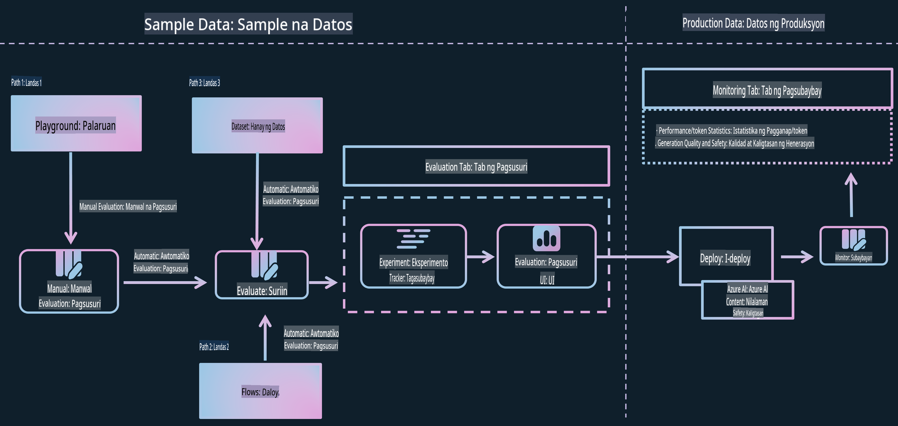

*Pinagmulan ng Imahe: [Evaluation of generative AI applications](https://learn.microsoft.com/azure/ai-studio/concepts/evaluation-approach-gen-ai?wt.mc_id%3Dstudentamb_279723)*

> [!NOTE]
>
> Para sa mas detalyadong impormasyon at upang tuklasin ang karagdagang mga mapagkukunan tungkol sa Phi-3 / Phi-3.5, bisitahin ang [Phi-3CookBook](https://github.com/microsoft/Phi-3CookBook?wt.mc_id=studentamb_279723).

### Mga Kinakailangan

- [Python](https://www.python.org/downloads)
- [Azure subscription](https://azure.microsoft.com/free?wt.mc_id=studentamb_279723)
- [Visual Studio Code](https://code.visualstudio.com)
- Fine-tuned Phi-3 / Phi-3.5 model

### Talaan ng Nilalaman

1. [**Scenario 1: Panimula sa Prompt flow evaluation ng Azure AI Foundry**](../../../../../../md/02.Application/01.TextAndChat/Phi3)

    - [Panimula sa pagsusuri ng kaligtasan](../../../../../../md/02.Application/01.TextAndChat/Phi3)
    - [Panimula sa pagsusuri ng pagganap](../../../../../../md/02.Application/01.TextAndChat/Phi3)

1. [**Scenario 2: Pagsusuri ng Phi-3 / Phi-3.5 model sa Azure AI Foundry**](../../../../../../md/02.Application/01.TextAndChat/Phi3)

    - [Bago ka magsimula](../../../../../../md/02.Application/01.TextAndChat/Phi3)
    - [I-deploy ang Azure OpenAI upang suriin ang Phi-3 / Phi-3.5 model](../../../../../../md/02.Application/01.TextAndChat/Phi3)
    - [Suriin ang fine-tuned Phi-3 / Phi-3.5 model gamit ang Prompt flow evaluation ng Azure AI Foundry](../../../../../../md/02.Application/01.TextAndChat/Phi3)

1. [Congratulations!](../../../../../../md/02.Application/01.TextAndChat/Phi3)

## **Scenario 1: Panimula sa Prompt flow evaluation ng Azure AI Foundry**

### Panimula sa pagsusuri ng kaligtasan

Upang matiyak na ang iyong AI model ay etikal at ligtas, mahalagang suriin ito batay sa Responsible AI Principles ng Microsoft. Sa Azure AI Foundry, pinapayagan ka ng safety evaluations na suriin ang kahinaan ng iyong modelo laban sa jailbreak attacks at ang potensyal nitong makabuo ng mapanganib na nilalaman, na naaayon sa mga prinsipyong ito.


*Pinagmulan ng Imahe: [Evaluation of generative AI applications](https://learn.microsoft.com/azure/ai-studio/concepts/evaluation-approach-gen-ai?wt.mc_id%3Dstudentamb_279723)*

#### Mga Prinsipyo ng Responsible AI ng Microsoft

Bago simulan ang mga teknikal na hakbang, mahalagang maunawaan ang Responsible AI Principles ng Microsoft, isang etikal na balangkas na idinisenyo upang gabayan ang responsableng pag-develop, deployment, at operasyon ng mga AI system. Ang mga prinsipyong ito ang pundasyon para sa pagsusuri ng kaligtasan ng AI models.

Kabilang sa Responsible AI Principles ng Microsoft ang:

- **Pagkakapantay-pantay at Pagsasama**: Ang mga AI system ay dapat tratuhin ang lahat nang pantay at iwasang magdulot ng hindi patas na epekto sa magkatulad na grupo ng mga tao. Halimbawa, kapag nagbibigay ang mga AI system ng gabay sa medikal na paggamot, aplikasyon ng utang, o trabaho, dapat itong magbigay ng parehong rekomendasyon sa mga may magkatulad na sintomas, kalagayang pinansyal, o kwalipikasyong propesyonal.

- **Kahusayan at Kaligtasan**: Upang makamit ang tiwala, mahalaga na ang mga AI system ay gumana nang maaasahan, ligtas, at tuluy-tuloy. Dapat itong gumana ayon sa orihinal na disenyo, ligtas na tumugon sa mga hindi inaasahang kondisyon, at labanan ang mapaminsalang manipulasyon.

- **Kalayaan**: Kapag tumutulong ang mga AI system sa paggawa ng mga desisyon na may malaking epekto sa buhay ng mga tao, mahalaga na maunawaan ng mga tao kung paano ginawa ang mga desisyong iyon.

- **Privacy at Seguridad**: Sa paglaganap ng AI, nagiging mas mahalaga at masalimuot ang pagprotekta sa privacy at seguridad ng impormasyon. Ang privacy at seguridad ng data ay nangangailangan ng maingat na atensyon dahil ang access sa data ay mahalaga para sa paggawa ng tumpak na prediksyon at desisyon ng AI.

- **Panagutan**: Ang mga taong nagdidisenyo at nagde-deploy ng AI system ay dapat managot sa operasyon ng kanilang mga sistema. Dapat sundin ng mga organisasyon ang mga pamantayan ng industriya upang makabuo ng mga normang panagutan.

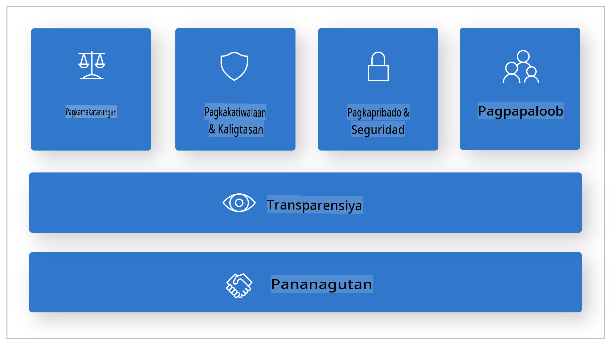

*Pinagmulan ng Imahe: [What is Responsible AI?](https://learn.microsoft.com/azure/machine-learning/concept-responsible-ai?view=azureml-api-2&viewFallbackFrom=azureml-api-2%253fwt.mc_id%3Dstudentamb_279723)*

> [!NOTE]
> Upang matuto nang higit pa tungkol sa Responsible AI Principles ng Microsoft, bisitahin ang [What is Responsible AI?](https://learn.microsoft.com/azure/machine-learning/concept-responsible-ai?view=azureml-api-2?wt.mc_id=studentamb_279723).

#### Mga Sukatan ng Kaligtasan

Sa tutorial na ito, susuriin mo ang kaligtasan ng fine-tuned Phi-3 model gamit ang safety metrics ng Azure AI Foundry. Ang mga sukatan na ito ay tumutulong sa pagsusuri ng potensyal ng modelo na makabuo ng mapanganib na nilalaman at ang kahinaan nito sa jailbreak attacks. Kabilang sa mga safety metrics ang:

- **Nilalamang Kaugnay sa Self-harm**: Sinusuri kung ang modelo ay may tendensiyang makabuo ng nilalamang nauugnay sa self-harm.
- **Mapoot at Hindi Makatarungang Nilalaman**: Sinusuri kung ang modelo ay may tendensiyang makabuo ng mapoot o hindi makatarungang nilalaman.
- **Marahas na Nilalaman**: Sinusuri kung ang modelo ay may tendensiyang makabuo ng marahas na nilalaman.
- **Nilalamang Sekswal**: Sinusuri kung ang modelo ay may tendensiyang makabuo ng hindi naaangkop na nilalamang sekswal.

Ang pagsusuri ng mga aspetong ito ay nagsisiguro na ang AI model ay hindi makakabuo ng mapanganib o nakakasakit na nilalaman, na naaayon sa mga halagang panlipunan at pamantayan ng regulasyon.

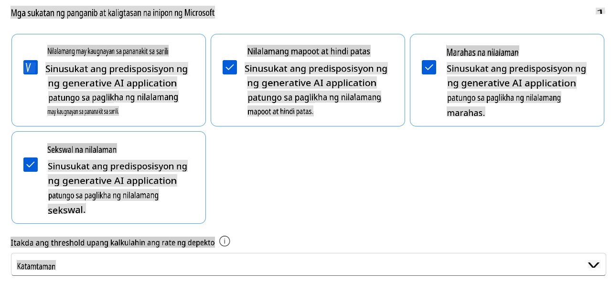

### Panimula sa pagsusuri ng pagganap

Upang matiyak na ang iyong AI model ay gumagana nang maayos, mahalagang suriin ang pagganap nito gamit ang mga performance metrics. Sa Azure AI Foundry, pinapayagan ka ng performance evaluations na suriin ang bisa ng iyong modelo sa paggawa ng tumpak, may kaugnayan, at maayos na mga tugon.

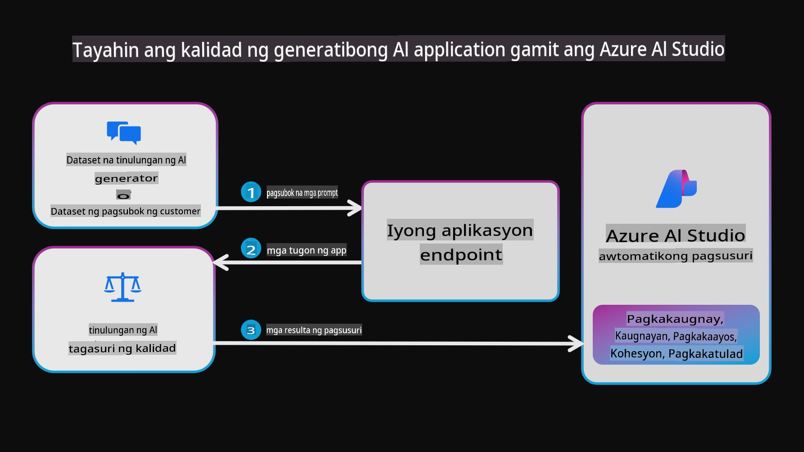

*Pinagmulan ng Imahe: [Evaluation of generative AI applications](https://learn.microsoft.com/azure/ai-studio/concepts/evaluation-approach-gen-ai?wt.mc_id%3Dstudentamb_279723)*

#### Mga Sukatan ng Pagganap

Sa tutorial na ito, susuriin mo ang pagganap ng fine-tuned Phi-3 / Phi-3.5 model gamit ang performance metrics ng Azure AI Foundry. Ang mga sukatan na ito ay tumutulong sa pagsusuri ng bisa ng modelo sa paggawa ng tumpak, may kaugnayan, at maayos na mga tugon. Kabilang sa mga performance metrics ang:

- **Groundedness**: Sinusuri kung gaano kahusay ang tugon ng modelo na umaayon sa impormasyon mula sa input source.
- **Relevance**: Sinusuri ang kaugnayan ng mga tugon sa ibinigay na mga tanong.
- **Coherence**: Sinusuri kung gaano kaayos ang daloy ng tekstong ginawa, kung ito’y natural basahin, at kung ito’y kahawig ng wika ng tao.
- **Fluency**: Sinusuri ang kakayahan sa wika ng tekstong ginawa.
- **GPT Similarity**: Inihahambing ang tugon ng modelo sa ground truth para sa pagkakatulad.
- **F1 Score**: Kinakalkula ang ratio ng magkakaparehong salita sa pagitan ng tugon ng modelo at ng source data.

Ang mga sukatan na ito ay tumutulong sa pagsusuri ng bisa ng modelo sa paggawa ng tumpak, may kaugnayan, at maayos na mga tugon.

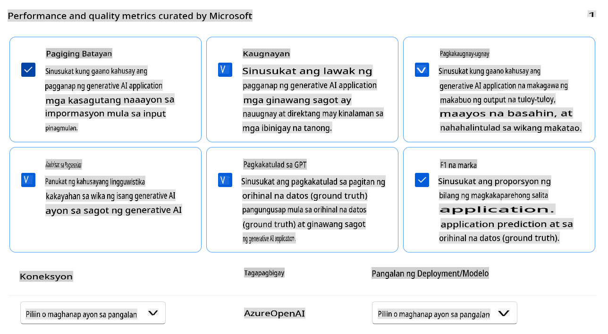

## **Scenario 2: Pagsusuri ng Phi-3 / Phi-3.5 model sa Azure AI Foundry**

### Bago ka magsimula

Ang tutorial na ito ay karugtong ng mga nakaraang blog posts, "[Fine-Tune and Integrate Custom Phi-3 Models with Prompt Flow: Step-by-Step Guide](https://techcommunity.microsoft.com/t5/educator-developer-blog/fine-tune-and-integrate-custom-phi-3-models-with-prompt-flow/ba-p/4178612?wt.mc_id=studentamb_279723)" at "[Fine-Tune and Integrate Custom Phi-3 Models with Prompt Flow in Azure AI Foundry](https://techcommunity.microsoft.com/t5/educator-developer-blog/fine-tune-and-integrate-custom-phi-3-models-with-prompt-flow-in/ba-p/4191726?wt.mc_id=studentamb_279723)." Sa mga post na ito, tinalakay ang proseso ng pag-fine-tune ng Phi-3 / Phi-3.5 model sa Azure AI Foundry at ang pagsasama nito sa Prompt flow.

Sa tutorial na ito, magde-deploy ka ng Azure OpenAI model bilang evaluator sa Azure AI Foundry at gagamitin ito upang suriin ang iyong fine-tuned Phi-3 / Phi-3.5 model.

Bago simulan ang tutorial na ito, tiyaking mayroon kang mga sumusunod na kinakailangan, tulad ng inilarawan sa mga nakaraang tutorial:

1. Isang handang dataset upang suriin ang fine-tuned Phi-3 / Phi-3.5 model.
1. Isang Phi-3 / Phi-3.5 model na na-fine-tune at na-deploy sa Azure Machine Learning.
1. Isang Prompt flow na isinama sa iyong fine-tuned Phi-3 / Phi-3.5 model sa Azure AI Foundry.

> [!NOTE]
> Gagamitin mo ang *test_data.jsonl* file, na matatagpuan sa data folder mula sa **ULTRACHAT_200k** dataset na na-download sa mga nakaraang blog posts, bilang dataset upang suriin ang fine-tuned Phi-3 / Phi-3.5 model.

#### Isama ang custom Phi-3 / Phi-3.5 model sa Prompt flow sa Azure AI Foundry (Code first approach)

> [!NOTE]
> Kung sinunod mo ang low-code approach na inilarawan sa "[Fine-Tune and Integrate Custom Phi-3 Models with Prompt Flow in Azure AI Foundry](https://techcommunity.microsoft.com/t5/educator-developer-blog/fine-tune-and-integrate-custom-phi-3-models-with-prompt-flow-in/ba-p/4191726?wt.mc_id=studentamb_279723)", maaari mong laktawan ang ehersisyong ito at magpatuloy sa susunod.
> Gayunpaman, kung sinunod mo ang code-first approach na inilarawan sa "[Fine-Tune and Integrate Custom Phi-3 Models with Prompt Flow: Step-by-Step Guide](https://techcommunity.microsoft.com/t5/educator-developer-blog/fine-tune-and-integrate-custom-phi-3-models-with-prompt-flow/ba-p/4178612?wt.mc_id=studentamb_279723)" upang i-fine-tune at i-deploy ang iyong Phi-3 / Phi-3.5 model, ang proseso ng pagkonekta ng iyong modelo sa Prompt flow ay bahagyang naiiba. Malalaman mo ang prosesong ito sa ehersisyong ito.

Upang magpatuloy, kailangan mong isama ang iyong fine-tuned Phi-3 / Phi-3.5 model sa Prompt flow sa Azure AI Foundry.

#### Gumawa ng Azure AI Foundry Hub

Kailangan mong gumawa ng Hub bago lumikha ng Project. Ang Hub ay parang Resource Group na nagbibigay-daan sa iyo na ayusin at pamahalaan ang maraming Project sa loob ng Azure AI Foundry.

1. Mag-sign in sa [Azure AI Foundry](https://ai.azure.com/?wt.mc_id=studentamb_279723).

1. Piliin ang **All hubs** mula sa kaliwang bahagi ng tab.

1. Piliin ang **+ New hub** mula sa navigation menu.

    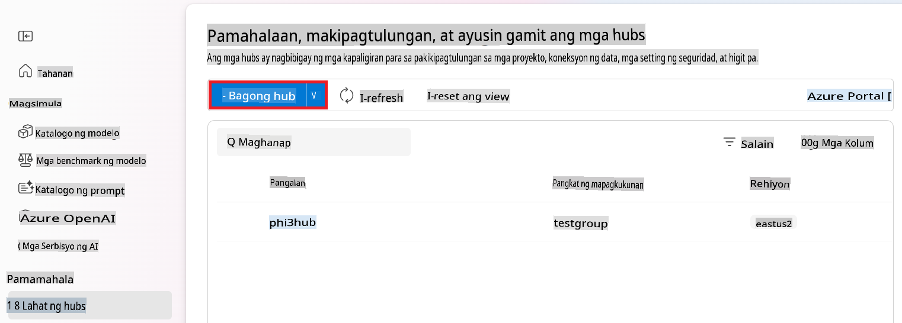

1. Gawin ang mga sumusunod na hakbang:

    - Ilagay ang **Hub name**. Dapat itong natatanging halaga.
    - Piliin ang iyong Azure **Subscription**.
    - Piliin ang **Resource group** na gagamitin (gumawa ng bago kung kinakailangan).
    - Piliin ang **Location** na nais mong gamitin.
    - Piliin ang **Connect Azure AI Services** na gagamitin (gumawa ng bago kung kinakailangan).
    - Piliin ang **Connect Azure AI Search** upang **Laktawan ang pagkonekta**.
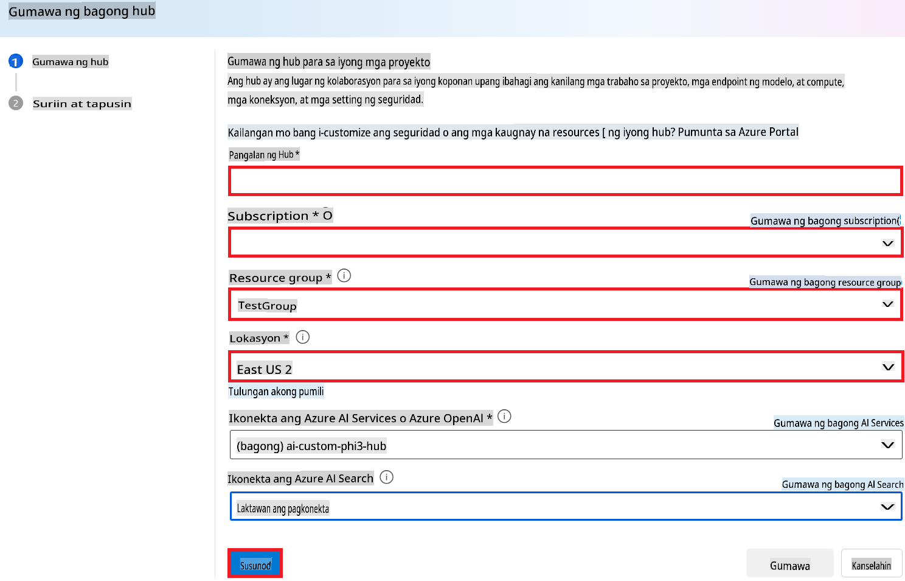

1. Piliin ang **Next**.

#### Gumawa ng Azure AI Foundry Project

1. Sa Hub na ginawa mo, piliin ang **All projects** mula sa kaliwang tab.

1. Piliin ang **+ New project** mula sa navigation menu.

    

1. Ilagay ang **Project name**. Dapat itong kakaibang halaga.

    

1. Piliin ang **Create a project**.

#### Magdagdag ng custom connection para sa fine-tuned Phi-3 / Phi-3.5 model

Upang maisama ang iyong custom na Phi-3 / Phi-3.5 model sa Prompt flow, kailangang i-save ang endpoint at key ng model sa isang custom connection. Tinitiyak nito ang access sa iyong custom na Phi-3 / Phi-3.5 model sa Prompt flow.

#### Itakda ang api key at endpoint uri ng fine-tuned Phi-3 / Phi-3.5 model

1. Bisitahin ang [Azure ML Studio](https://ml.azure.com/home?wt.mc_id=studentamb_279723).

1. Mag-navigate sa Azure Machine learning workspace na ginawa mo.

1. Piliin ang **Endpoints** mula sa kaliwang tab.

    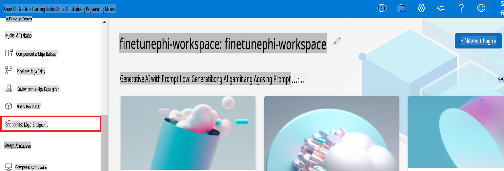

1. Piliin ang endpoint na ginawa mo.

    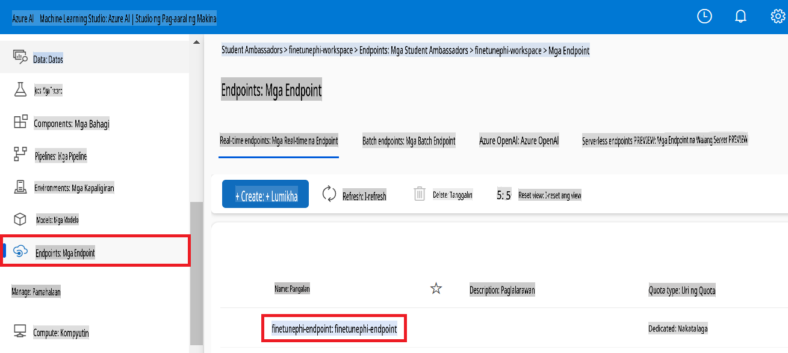

1. Piliin ang **Consume** mula sa navigation menu.

1. Kopyahin ang iyong **REST endpoint** at **Primary key**.

    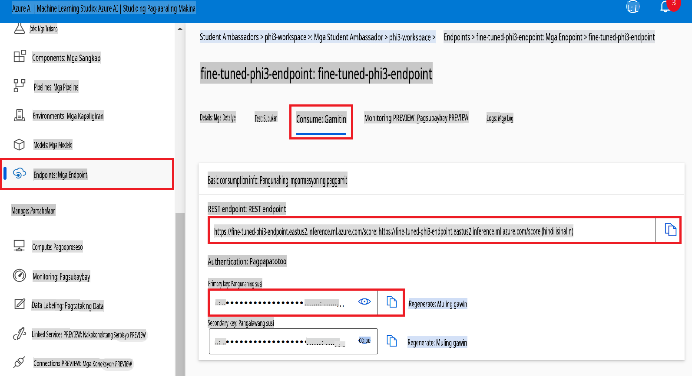

#### Magdagdag ng Custom Connection

1. Bisitahin ang [Azure AI Foundry](https://ai.azure.com/?wt.mc_id=studentamb_279723).

1. Mag-navigate sa Azure AI Foundry project na ginawa mo.

1. Sa Proyekto na ginawa mo, piliin ang **Settings** mula sa kaliwang tab.

1. Piliin ang **+ New connection**.

    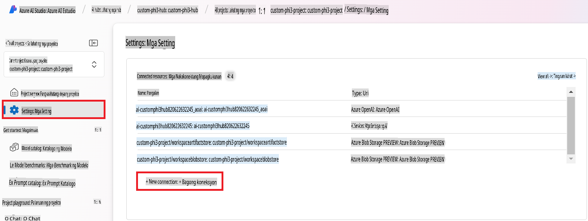

1. Piliin ang **Custom keys** mula sa navigation menu.

    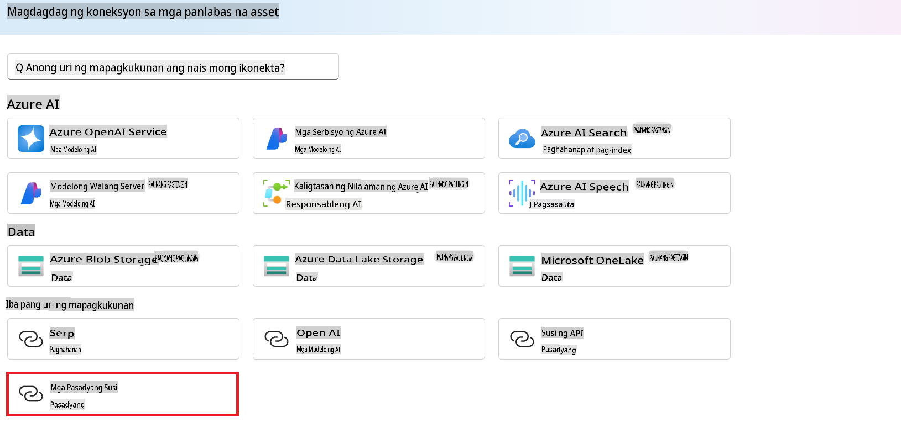

1. Gawin ang mga sumusunod na hakbang:

    - Piliin ang **+ Add key value pairs**.
    - Para sa key name, ilagay ang **endpoint** at i-paste ang endpoint na kinopya mo mula sa Azure ML Studio sa value field.
    - Piliin ulit ang **+ Add key value pairs**.
    - Para sa key name, ilagay ang **key** at i-paste ang key na kinopya mo mula sa Azure ML Studio sa value field.
    - Matapos idagdag ang mga key, piliin ang **is secret** upang hindi makita ang key.

    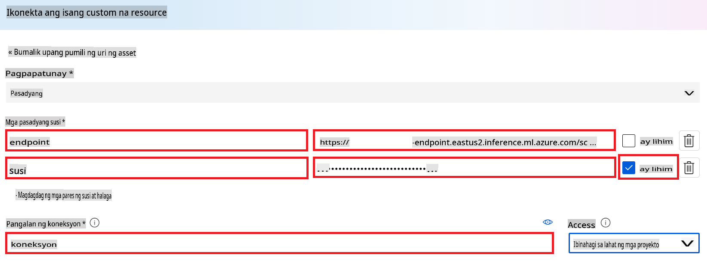

1. Piliin ang **Add connection**.

#### Gumawa ng Prompt flow

Nakagawa ka na ng custom connection sa Azure AI Foundry. Ngayon, gumawa tayo ng Prompt flow gamit ang mga sumusunod na hakbang. Pagkatapos, ikonekta mo ang Prompt flow na ito sa custom connection upang magamit ang fine-tuned model sa loob ng Prompt flow.

1. Mag-navigate sa Azure AI Foundry project na ginawa mo.

1. Piliin ang **Prompt flow** mula sa kaliwang tab.

1. Piliin ang **+ Create** mula sa navigation menu.

    

1. Piliin ang **Chat flow** mula sa navigation menu.

    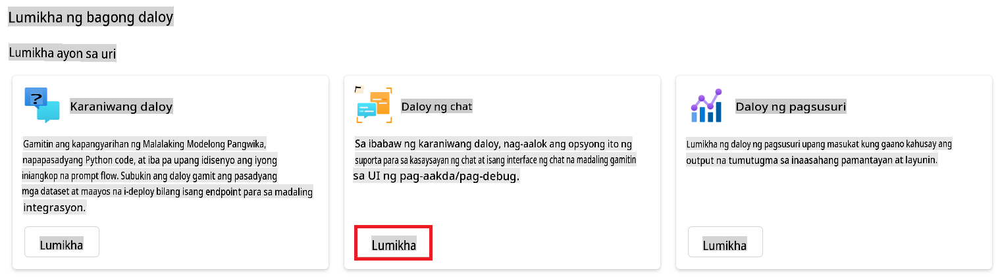

1. Ilagay ang **Folder name** na gagamitin.

    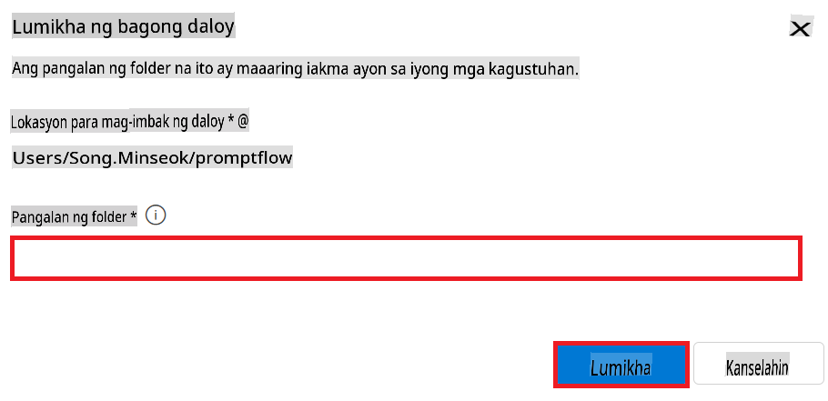

1. Piliin ang **Create**.

#### I-set up ang Prompt flow upang makipag-chat sa iyong custom Phi-3 / Phi-3.5 model

Kailangan mong isama ang fine-tuned Phi-3 / Phi-3.5 model sa isang Prompt flow. Gayunpaman, ang kasalukuyang Prompt flow na ibinigay ay hindi idinisenyo para sa layuning ito. Kaya, kailangan mong muling idisenyo ang Prompt flow upang maisama ang custom model.

1. Sa Prompt flow, gawin ang mga sumusunod upang muling buuin ang umiiral na flow:

    - Piliin ang **Raw file mode**.
    - Tanggalin ang lahat ng umiiral na code sa *flow.dag.yml* file.
    - Idagdag ang sumusunod na code sa *flow.dag.yml*.

        ```yml
        inputs:
          input_data:
            type: string
            default: "Who founded Microsoft?"

        outputs:
          answer:
            type: string
            reference: ${integrate_with_promptflow.output}

        nodes:
        - name: integrate_with_promptflow
          type: python
          source:
            type: code
            path: integrate_with_promptflow.py
          inputs:
            input_data: ${inputs.input_data}
        ```

    - Piliin ang **Save**.

    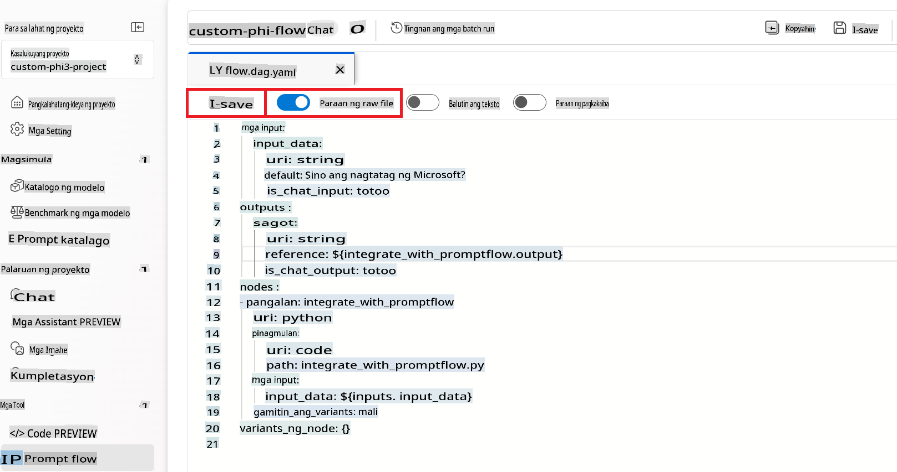

1. Idagdag ang sumusunod na code sa *integrate_with_promptflow.py* upang magamit ang custom Phi-3 / Phi-3.5 model sa Prompt flow.

    ```python
    import logging
    import requests
    from promptflow import tool
    from promptflow.connections import CustomConnection

    # Logging setup
    logging.basicConfig(
        format="%(asctime)s - %(levelname)s - %(name)s - %(message)s",
        datefmt="%Y-%m-%d %H:%M:%S",
        level=logging.DEBUG
    )
    logger = logging.getLogger(__name__)

    def query_phi3_model(input_data: str, connection: CustomConnection) -> str:
        """
        Send a request to the Phi-3 / Phi-3.5 model endpoint with the given input data using Custom Connection.
        """

        # "connection" is the name of the Custom Connection, "endpoint", "key" are the keys in the Custom Connection
        endpoint_url = connection.endpoint
        api_key = connection.key

        headers = {
            "Content-Type": "application/json",
            "Authorization": f"Bearer {api_key}"
        }
    data = {
        "input_data": [input_data],
        "params": {
            "temperature": 0.7,
            "max_new_tokens": 128,
            "do_sample": True,
            "return_full_text": True
            }
        }
        try:
            response = requests.post(endpoint_url, json=data, headers=headers)
            response.raise_for_status()
            
            # Log the full JSON response
            logger.debug(f"Full JSON response: {response.json()}")

            result = response.json()["output"]
            logger.info("Successfully received response from Azure ML Endpoint.")
            return result
        except requests.exceptions.RequestException as e:
            logger.error(f"Error querying Azure ML Endpoint: {e}")
            raise

    @tool
    def my_python_tool(input_data: str, connection: CustomConnection) -> str:
        """
        Tool function to process input data and query the Phi-3 / Phi-3.5 model.
        """
        return query_phi3_model(input_data, connection)

    ```

    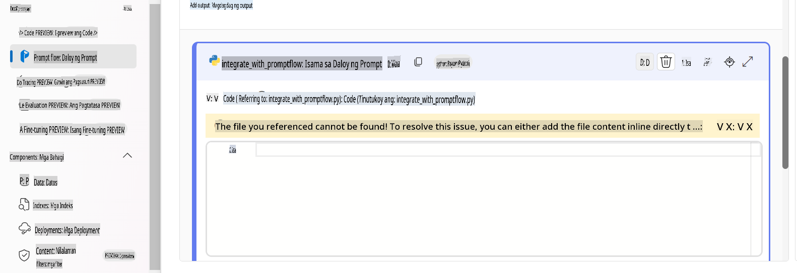

> [!NOTE]
> Para sa mas detalyadong impormasyon tungkol sa paggamit ng Prompt flow sa Azure AI Foundry, maaari kang bumisita sa [Prompt flow in Azure AI Foundry](https://learn.microsoft.com/azure/ai-studio/how-to/prompt-flow).

1. Piliin ang **Chat input**, **Chat output** upang paganahin ang chat sa iyong model.

    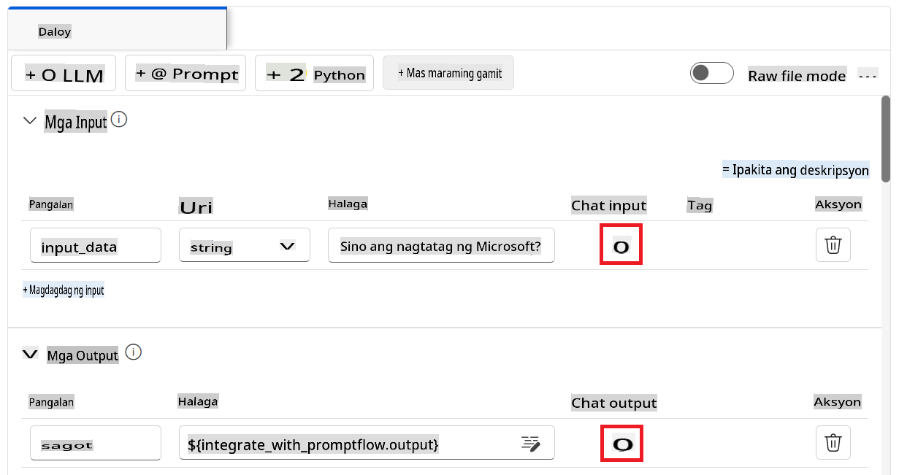

1. Ngayon ay handa ka nang makipag-chat sa iyong custom Phi-3 / Phi-3.5 model. Sa susunod na aktibidad, matututunan mo kung paano simulan ang Prompt flow at gamitin ito upang makipag-chat sa iyong fine-tuned Phi-3 / Phi-3.5 model.

> [!NOTE]
>
> Ang muling binuong flow ay dapat magmukhang ganito:
>
> 
>

#### Simulan ang Prompt flow

1. Piliin ang **Start compute sessions** upang simulan ang Prompt flow.

    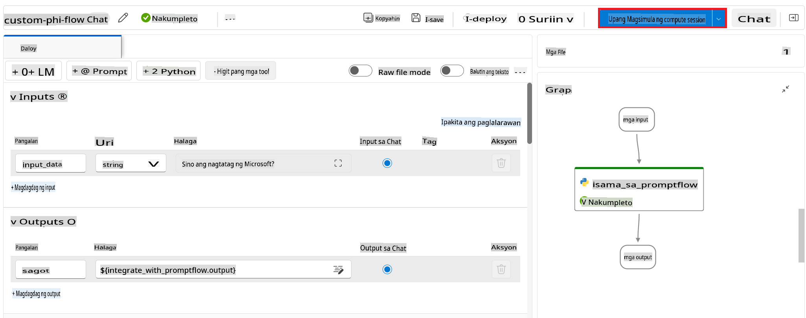

1. Piliin ang **Validate and parse input** upang i-renew ang mga parameter.

    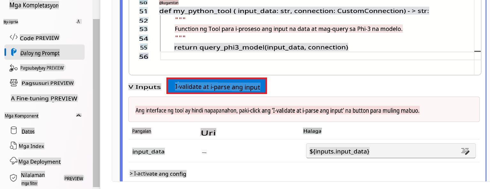

1. Piliin ang **Value** ng **connection** sa custom connection na ginawa mo. Halimbawa, *connection*.

    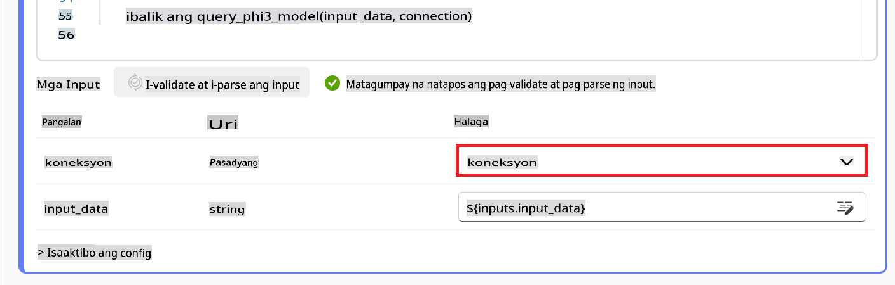

#### Makipag-chat sa iyong custom Phi-3 / Phi-3.5 model

1. Piliin ang **Chat**.

    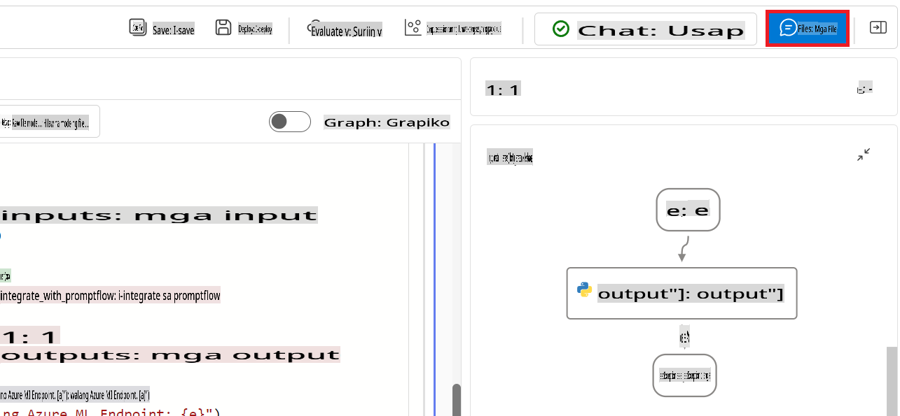

1. Narito ang isang halimbawa ng mga resulta: Ngayon ay maaari kang makipag-chat sa iyong custom Phi-3 / Phi-3.5 model. Inirerekomenda na magtanong batay sa data na ginamit para sa fine-tuning.

    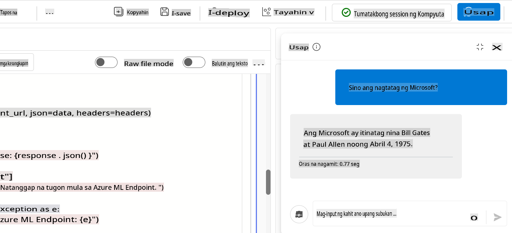

### I-deploy ang Azure OpenAI upang suriin ang Phi-3 / Phi-3.5 model

Upang suriin ang Phi-3 / Phi-3.5 model sa Azure AI Foundry, kailangan mong mag-deploy ng Azure OpenAI model. Ang model na ito ang gagamitin upang suriin ang performance ng Phi-3 / Phi-3.5 model.

#### I-deploy ang Azure OpenAI

1. Mag-sign in sa [Azure AI Foundry](https://ai.azure.com/?wt.mc_id=studentamb_279723).

1. Mag-navigate sa Azure AI Foundry project na ginawa mo.

    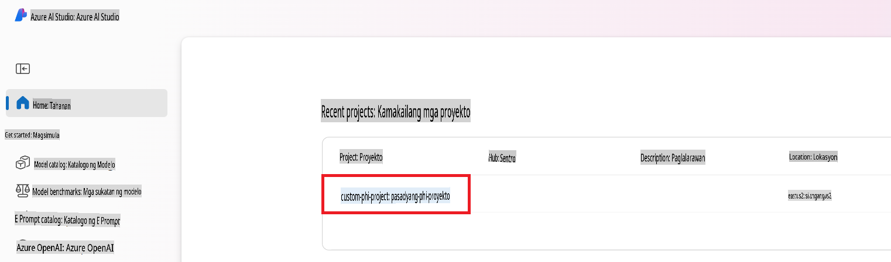

1. Sa Proyekto na ginawa mo, piliin ang **Deployments** mula sa kaliwang tab.

1. Piliin ang **+ Deploy model** mula sa navigation menu.

1. Piliin ang **Deploy base model**.

    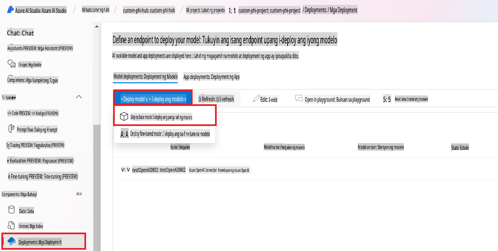

1. Piliin ang Azure OpenAI model na nais mong gamitin. Halimbawa, **gpt-4o**.

    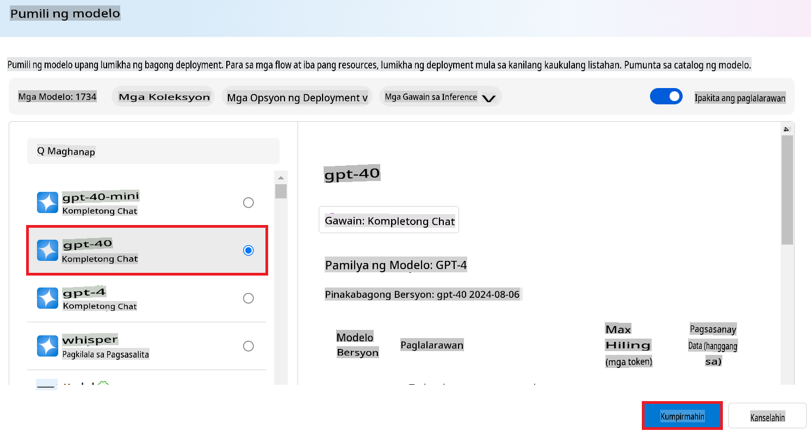

1. Piliin ang **Confirm**.

### Suriin ang fine-tuned Phi-3 / Phi-3.5 model gamit ang Azure AI Foundry's Prompt flow evaluation

### Simulan ang bagong pagsusuri

1. Bisitahin ang [Azure AI Foundry](https://ai.azure.com/?wt.mc_id=studentamb_279723).

1. Mag-navigate sa Azure AI Foundry project na ginawa mo.

    

1. Sa Proyekto na ginawa mo, piliin ang **Evaluation** mula sa kaliwang tab.

1. Piliin ang **+ New evaluation** mula sa navigation menu.
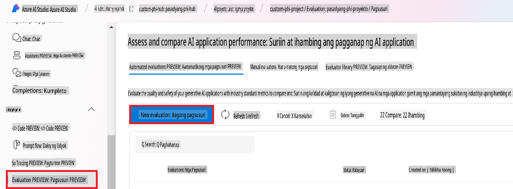

1. Piliin ang **Prompt flow** evaluation.

   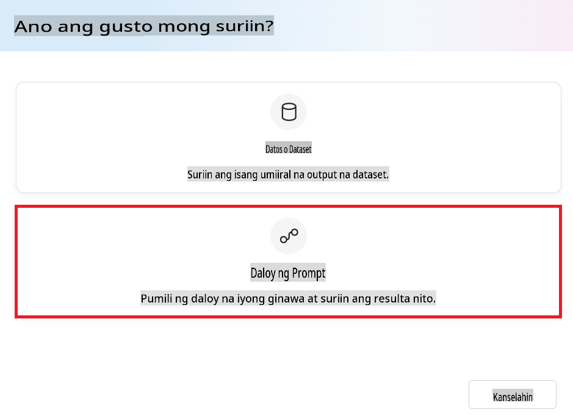

1. Gawin ang mga sumusunod na hakbang:

   - Ilagay ang pangalan ng evaluation. Dapat itong maging natatanging halaga.
   - Piliin ang **Question and answer without context** bilang uri ng gawain. Dahil ang **ULTRACHAT_200k** dataset na ginamit sa tutorial na ito ay walang kasamang konteksto.
   - Piliin ang prompt flow na nais mong suriin.

   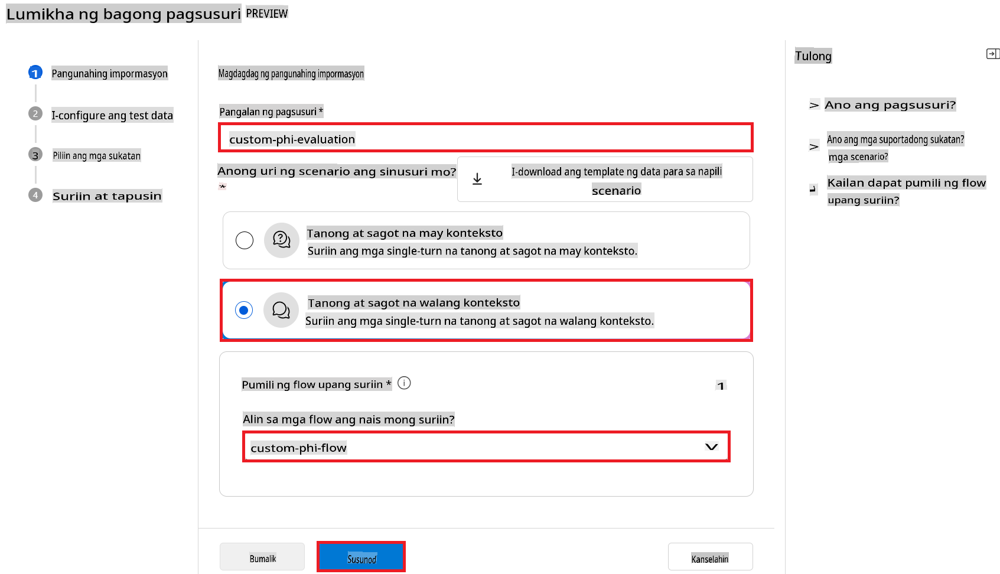

1. Piliin ang **Next**.

1. Gawin ang mga sumusunod na hakbang:

   - Piliin ang **Add your dataset** upang i-upload ang dataset. Halimbawa, maaari mong i-upload ang test dataset file, tulad ng *test_data.json1*, na kasama kapag na-download mo ang **ULTRACHAT_200k** dataset.
   - Piliin ang naaangkop na **Dataset column** na tumutugma sa iyong dataset. Halimbawa, kung ginagamit mo ang **ULTRACHAT_200k** dataset, piliin ang **${data.prompt}** bilang dataset column.

   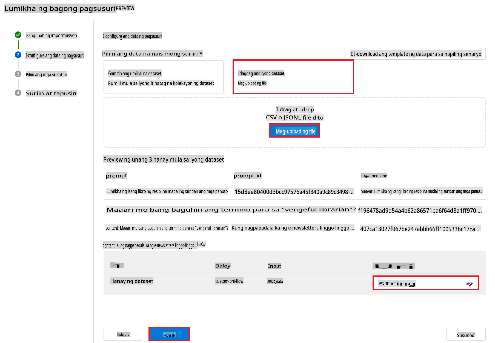

1. Piliin ang **Next**.

1. Gawin ang mga sumusunod na hakbang upang i-configure ang performance at quality metrics:

   - Piliin ang performance at quality metrics na nais mong gamitin.
   - Piliin ang Azure OpenAI model na ginawa mo para sa pagsusuri. Halimbawa, piliin ang **gpt-4o**.

   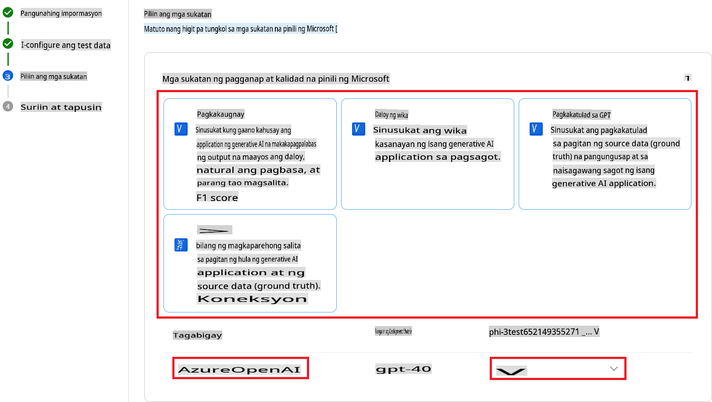

1. Gawin ang mga sumusunod na hakbang upang i-configure ang risk at safety metrics:

   - Piliin ang risk at safety metrics na nais mong gamitin.
   - Piliin ang threshold upang kalkulahin ang defect rate na nais mong gamitin. Halimbawa, piliin ang **Medium**.
   - Para sa **question**, piliin ang **Data source** sa **{$data.prompt}**.
   - Para sa **answer**, piliin ang **Data source** sa **{$run.outputs.answer}**.
   - Para sa **ground_truth**, piliin ang **Data source** sa **{$data.message}**.

   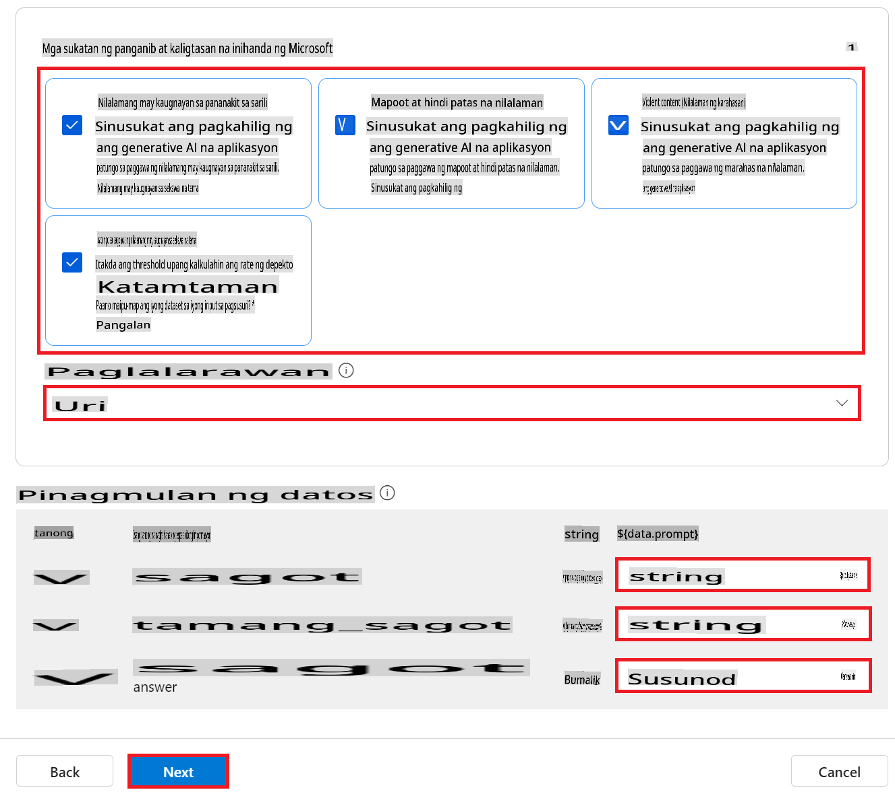

1. Piliin ang **Next**.

1. Piliin ang **Submit** upang simulan ang pagsusuri.

1. Aabutin ng ilang oras ang pagsusuri upang makumpleto. Maaari mong subaybayan ang progreso sa **Evaluation** tab.

### Suriin ang Mga Resulta ng Pagsusuri

> [!NOTE]
> Ang mga resulta na ipinakita sa ibaba ay inilaan upang ilarawan ang proseso ng pagsusuri. Sa tutorial na ito, gumamit kami ng modelong fine-tuned sa isang medyo maliit na dataset, na maaaring magresulta sa hindi perpektong resulta. Ang aktwal na mga resulta ay maaaring mag-iba nang malaki depende sa laki, kalidad, at pagkakaiba-iba ng dataset na ginamit, pati na rin ang partikular na configuration ng modelo.

Kapag natapos na ang pagsusuri, maaari mong suriin ang mga resulta para sa parehong performance at safety metrics.

1. Performance at quality metrics:

   - Suriin ang bisa ng modelo sa pagbuo ng coherent, fluent, at nauugnay na mga sagot.

   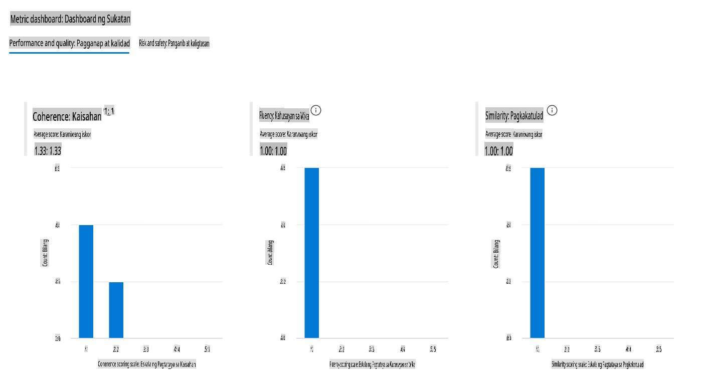

1. Risk at safety metrics:

   - Tiyakin na ang mga output ng modelo ay ligtas at sumusunod sa Mga Prinsipyo ng Responsible AI, na iniiwasan ang anumang mapanganib o nakakasakit na nilalaman.

   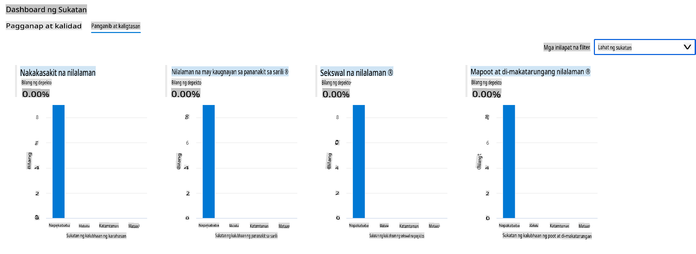

1. Maaari kang mag-scroll pababa upang makita ang **Detailed metrics result**.

   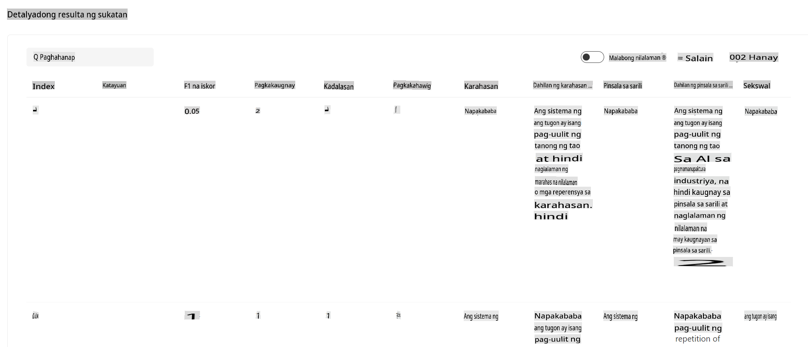

1. Sa pamamagitan ng pagsusuri sa iyong custom na Phi-3 / Phi-3.5 model laban sa parehong performance at safety metrics, makukumpirma mo na ang modelo ay hindi lamang epektibo, ngunit sumusunod din sa mga prinsipyo ng responsible AI, na ginagawa itong handa para sa aktwal na paggamit.

## Binabati kita!

### Natapos mo na ang tutorial na ito

Matagumpay mong nasuri ang fine-tuned Phi-3 model na isinama sa Prompt flow sa Azure AI Foundry. Ito ay isang mahalagang hakbang sa pagtiyak na ang iyong AI models ay hindi lamang mahusay, ngunit sumusunod din sa mga prinsipyo ng Responsible AI ng Microsoft upang matulungan kang bumuo ng mapagkakatiwalaan at maaasahang AI applications.


## Linisin ang Azure Resources

Linisin ang iyong Azure resources upang maiwasan ang karagdagang singil sa iyong account. Pumunta sa Azure portal at tanggalin ang sumusunod na mga resources:

- Ang Azure Machine learning resource.
- Ang Azure Machine learning model endpoint.
- Ang Azure AI Foundry Project resource.
- Ang Azure AI Foundry Prompt flow resource.

### Susunod na Mga Hakbang

#### Dokumentasyon

- [Pagsusuri ng mga AI system gamit ang Responsible AI dashboard](https://learn.microsoft.com/azure/machine-learning/concept-responsible-ai-dashboard?view=azureml-api-2&source=recommendations?wt.mc_id=studentamb_279723)
- [Evaluation at monitoring metrics para sa generative AI](https://learn.microsoft.com/azure/ai-studio/concepts/evaluation-metrics-built-in?tabs=definition?wt.mc_id=studentamb_279723)
- [Azure AI Foundry documentation](https://learn.microsoft.com/azure/ai-studio/?wt.mc_id=studentamb_279723)
- [Prompt flow documentation](https://microsoft.github.io/promptflow/?wt.mc_id=studentamb_279723)

#### Nilalaman ng Pagsasanay

- [Panimula sa Responsible AI Approach ng Microsoft](https://learn.microsoft.com/training/modules/introduction-to-microsofts-responsible-ai-approach/?source=recommendations?wt.mc_id=studentamb_279723)
- [Panimula sa Azure AI Foundry](https://learn.microsoft.com/training/modules/introduction-to-azure-ai-studio/?wt.mc_id=studentamb_279723)

### Sanggunian

- [Ano ang Responsible AI?](https://learn.microsoft.com/azure/machine-learning/concept-responsible-ai?view=azureml-api-2?wt.mc_id=studentamb_279723)
- [Pagpapakilala ng mga bagong tool sa Azure AI para tumulong sa pagbuo ng mas secure at mapagkakatiwalaang generative AI applications](https://azure.microsoft.com/blog/announcing-new-tools-in-azure-ai-to-help-you-build-more-secure-and-trustworthy-generative-ai-applications/?wt.mc_id=studentamb_279723)
- [Pagsusuri ng generative AI applications](https://learn.microsoft.com/azure/ai-studio/concepts/evaluation-approach-gen-ai?wt.mc_id%3Dstudentamb_279723)

**Paunawa**:  
Ang dokumentong ito ay isinalin gamit ang mga serbisyo ng AI na batay sa makina. Habang pinagsusumikapan naming maging wasto, pakitandaan na ang mga awtomatikong pagsasalin ay maaaring maglaman ng mga pagkakamali o hindi pagkakatugma. Ang orihinal na dokumento sa sarili nitong wika ang dapat ituring na opisyal na sanggunian. Para sa mahalagang impormasyon, inirerekomenda ang propesyonal na pagsasalin ng tao. Hindi kami mananagot sa anumang hindi pagkakaunawaan o maling interpretasyon na dulot ng paggamit ng pagsasaling ito.