# Fine-tune at I-integrate ang mga custom na Phi-3 model gamit ang Prompt flow

Ang end-to-end (E2E) na sample na ito ay nakabase sa gabay na "[Fine-Tune and Integrate Custom Phi-3 Models with Prompt Flow: Step-by-Step Guide](https://techcommunity.microsoft.com/t5/educator-developer-blog/fine-tune-and-integrate-custom-phi-3-models-with-prompt-flow/ba-p/4178612?WT.mc_id=aiml-137032-kinfeylo)" mula sa Microsoft Tech Community. Layunin nitong ipakita ang mga proseso ng fine-tuning, pag-deploy, at pag-integrate ng mga custom na Phi-3 model gamit ang Prompt flow.

## Pangkalahatang-ideya

Sa E2E sample na ito, matututuhan mo kung paano i-fine-tune ang Phi-3 model at i-integrate ito gamit ang Prompt flow. Sa pamamagitan ng Azure Machine Learning at Prompt flow, makakabuo ka ng workflow para sa pag-deploy at paggamit ng mga custom na AI model. Ang E2E sample na ito ay nahahati sa tatlong senaryo:

**Scenario 1: I-set up ang Azure resources at Maghanda para sa fine-tuning**

**Scenario 2: I-fine-tune ang Phi-3 model at I-deploy sa Azure Machine Learning Studio**

**Scenario 3: I-integrate gamit ang Prompt flow at Makipag-chat sa iyong custom na model**

Narito ang pangkalahatang-ideya ng E2E sample na ito.

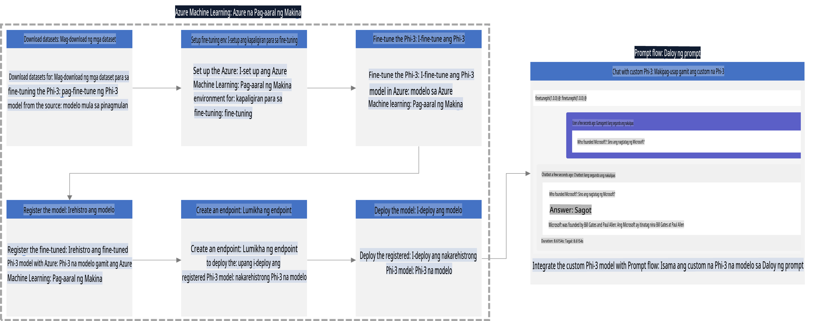

### Talaan ng Nilalaman

1. **[Scenario 1: I-set up ang Azure resources at Maghanda para sa fine-tuning](../../../../../../md/02.Application/01.TextAndChat/Phi3)**
    - [Lumikha ng Azure Machine Learning Workspace](../../../../../../md/02.Application/01.TextAndChat/Phi3)
    - [Mag-request ng GPU quotas sa Azure Subscription](../../../../../../md/02.Application/01.TextAndChat/Phi3)
    - [Magdagdag ng role assignment](../../../../../../md/02.Application/01.TextAndChat/Phi3)
    - [I-set up ang proyekto](../../../../../../md/02.Application/01.TextAndChat/Phi3)
    - [Maghanda ng dataset para sa fine-tuning](../../../../../../md/02.Application/01.TextAndChat/Phi3)

1. **[Scenario 2: I-fine-tune ang Phi-3 model at I-deploy sa Azure Machine Learning Studio](../../../../../../md/02.Application/01.TextAndChat/Phi3)**
    - [I-set up ang Azure CLI](../../../../../../md/02.Application/01.TextAndChat/Phi3)
    - [I-fine-tune ang Phi-3 model](../../../../../../md/02.Application/01.TextAndChat/Phi3)
    - [I-deploy ang fine-tuned model](../../../../../../md/02.Application/01.TextAndChat/Phi3)

1. **[Scenario 3: I-integrate gamit ang Prompt flow at Makipag-chat sa iyong custom na model](../../../../../../md/02.Application/01.TextAndChat/Phi3)**
    - [I-integrate ang custom na Phi-3 model gamit ang Prompt flow](../../../../../../md/02.Application/01.TextAndChat/Phi3)
    - [Makipag-chat sa iyong custom na model](../../../../../../md/02.Application/01.TextAndChat/Phi3)

## Scenario 1: I-set up ang Azure resources at Maghanda para sa fine-tuning

### Lumikha ng Azure Machine Learning Workspace

1. I-type ang *azure machine learning* sa **search bar** sa itaas ng portal page at piliin ang **Azure Machine Learning** mula sa mga opsyon na lalabas.

    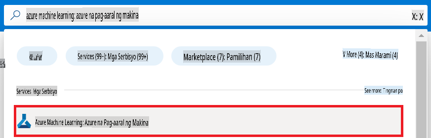

1. Piliin ang **+ Create** mula sa navigation menu.

1. Piliin ang **New workspace** mula sa navigation menu.

    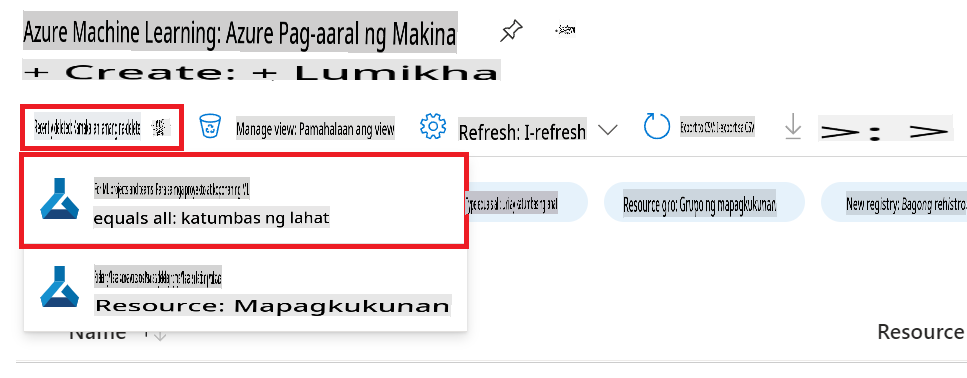

1. Gawin ang mga sumusunod na hakbang:

    - Piliin ang iyong Azure **Subscription**.
    - Piliin ang **Resource group** na gagamitin (gumawa ng bago kung kinakailangan).
    - I-enter ang **Workspace Name**. Dapat itong unique na halaga.
    - Piliin ang **Region** na nais mong gamitin.
    - Piliin ang **Storage account** na gagamitin (gumawa ng bago kung kinakailangan).
    - Piliin ang **Key vault** na gagamitin (gumawa ng bago kung kinakailangan).
    - Piliin ang **Application insights** na gagamitin (gumawa ng bago kung kinakailangan).
    - Piliin ang **Container registry** na gagamitin (gumawa ng bago kung kinakailangan).

    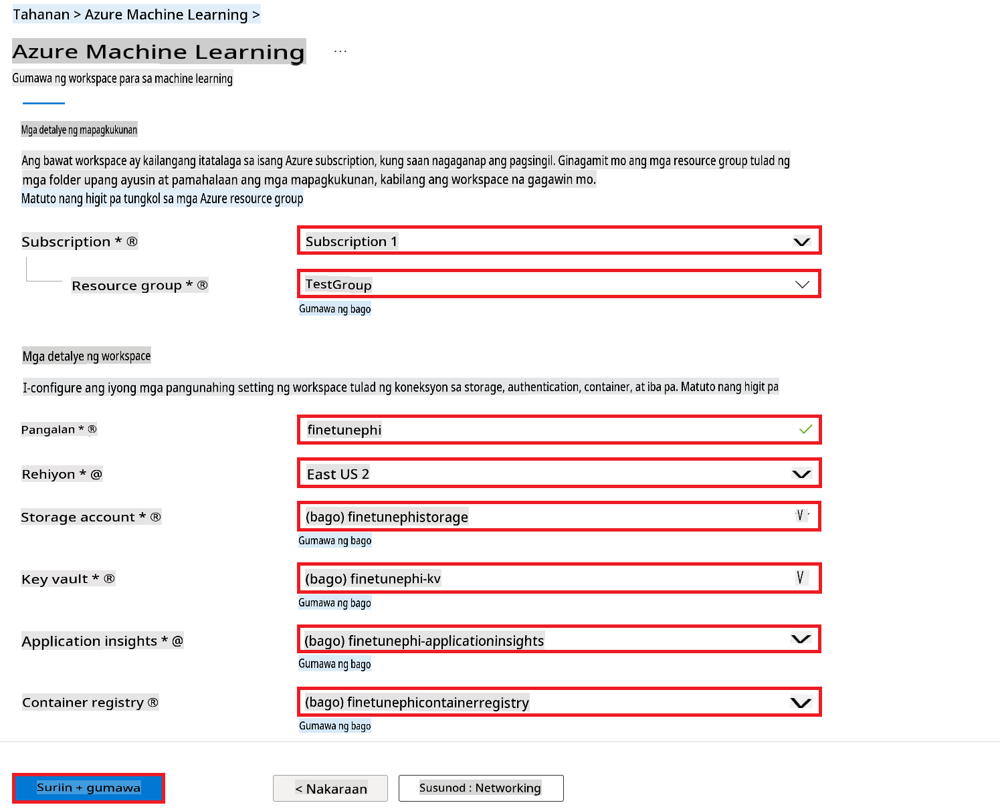

1. Piliin ang **Review + Create**.

1. Piliin ang **Create**.

### Mag-request ng GPU quotas sa Azure Subscription

Sa E2E sample na ito, gagamitin mo ang *Standard_NC24ads_A100_v4 GPU* para sa fine-tuning, na nangangailangan ng quota request, at ang *Standard_E4s_v3* CPU para sa deployment, na hindi nangangailangan ng quota request.

> [!NOTE]
>
> Tanging ang mga Pay-As-You-Go subscription (ang karaniwang uri ng subscription) ang kwalipikado para sa GPU allocation; ang mga benefit subscription ay hindi kasalukuyang suportado.
>
> Para sa mga gumagamit ng benefit subscription (tulad ng Visual Studio Enterprise Subscription) o para sa mga nais subukan nang mabilis ang proseso ng fine-tuning at deployment, ang tutorial na ito ay nagbibigay din ng gabay para sa fine-tuning gamit ang minimal dataset sa CPU. Gayunpaman, mahalagang tandaan na mas maganda ang resulta ng fine-tuning kapag gumagamit ng GPU na may mas malaking dataset.

1. Bisitahin ang [Azure ML Studio](https://ml.azure.com/home?wt.mc_id=studentamb_279723).

1. Gawin ang mga sumusunod na hakbang upang mag-request ng *Standard NCADSA100v4 Family* quota:

    - Piliin ang **Quota** mula sa kaliwang bahagi ng tab.
    - Piliin ang **Virtual machine family** na gagamitin. Halimbawa, piliin ang **Standard NCADSA100v4 Family Cluster Dedicated vCPUs**, na kinabibilangan ng *Standard_NC24ads_A100_v4* GPU.
    - Piliin ang **Request quota** mula sa navigation menu.

        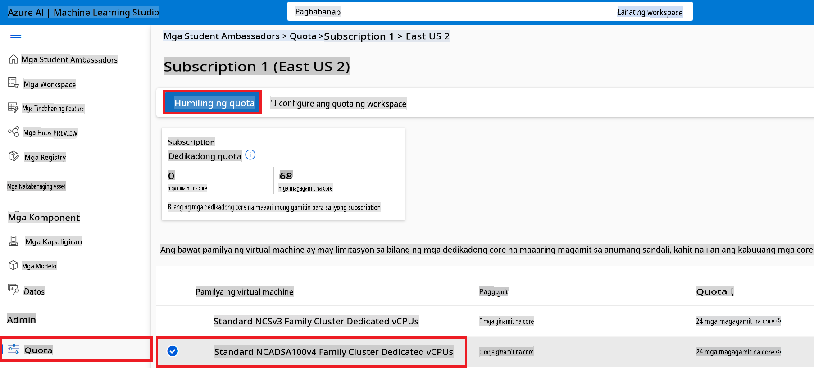

    - Sa loob ng Request quota page, i-enter ang **New cores limit** na nais mong gamitin. Halimbawa, 24.
    - Sa loob ng Request quota page, piliin ang **Submit** upang mag-request ng GPU quota.

> [!NOTE]
> Maaari mong piliin ang angkop na GPU o CPU para sa iyong mga pangangailangan sa pamamagitan ng pag-refer sa dokumentong [Sizes for Virtual Machines in Azure](https://learn.microsoft.com/azure/virtual-machines/sizes/overview?tabs=breakdownseries%2Cgeneralsizelist%2Ccomputesizelist%2Cmemorysizelist%2Cstoragesizelist%2Cgpusizelist%2Cfpgasizelist%2Chpcsizelist).

### Magdagdag ng role assignment

Upang ma-fine-tune at ma-deploy ang iyong mga model, kailangan mong lumikha ng User Assigned Managed Identity (UAI) at mag-assign ng tamang mga pahintulot dito. Ang UAI na ito ay gagamitin para sa authentication sa panahon ng deployment.

#### Lumikha ng User Assigned Managed Identity (UAI)

1. I-type ang *managed identities* sa **search bar** sa itaas ng portal page at piliin ang **Managed Identities** mula sa mga opsyon na lalabas.

    

1. Piliin ang **+ Create**.

    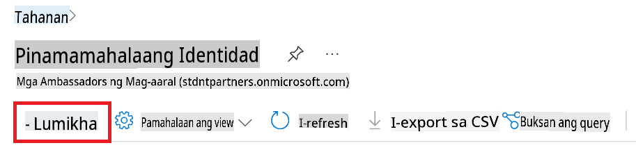

1. Gawin ang mga sumusunod na hakbang:

    - Piliin ang iyong Azure **Subscription**.
    - Piliin ang **Resource group** na gagamitin (gumawa ng bago kung kinakailangan).
    - Piliin ang **Region** na nais mong gamitin.
    - I-enter ang **Name**. Dapat itong unique na halaga.

1. Piliin ang **Review + create**.

1. Piliin ang **+ Create**.

#### Magdagdag ng Contributor role assignment sa Managed Identity

1. Pumunta sa Managed Identity resource na nilikha mo.

1. Piliin ang **Azure role assignments** mula sa kaliwang bahagi ng tab.

1. Piliin ang **+Add role assignment** mula sa navigation menu.

1. Sa loob ng Add role assignment page, gawin ang mga sumusunod na hakbang:
    - Piliin ang **Scope** sa **Resource group**.
    - Piliin ang iyong Azure **Subscription**.
    - Piliin ang **Resource group** na gagamitin.
    - Piliin ang **Role** sa **Contributor**.

    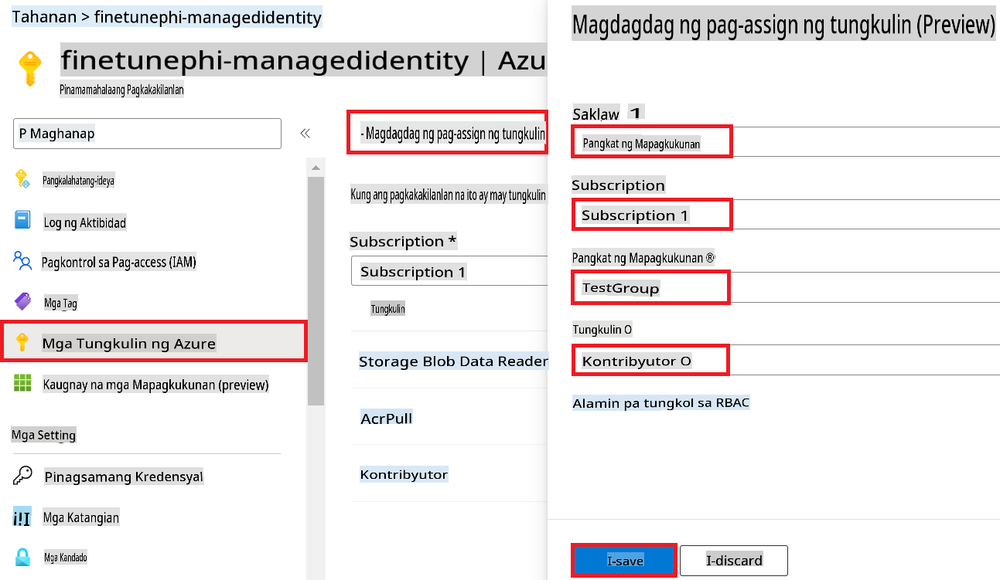

1. Piliin ang **Save**.

#### Magdagdag ng Storage Blob Data Reader role assignment sa Managed Identity

1. I-type ang *storage accounts* sa **search bar** sa itaas ng portal page at piliin ang **Storage accounts** mula sa mga opsyon na lalabas.

    

1. Piliin ang storage account na naka-link sa Azure Machine Learning workspace na nilikha mo. Halimbawa, *finetunephistorage*.

1. Gawin ang mga sumusunod na hakbang upang pumunta sa Add role assignment page:

    - Pumunta sa Azure Storage account na nilikha mo.
    - Piliin ang **Access Control (IAM)** mula sa kaliwang bahagi ng tab.
    - Piliin ang **+ Add** mula sa navigation menu.
    - Piliin ang **Add role assignment** mula sa navigation menu.

    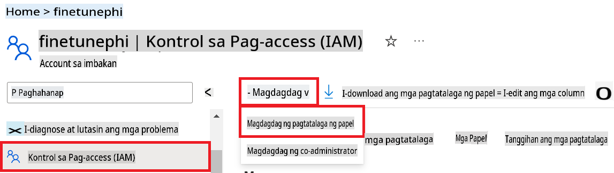

1. Sa loob ng Add role assignment page, gawin ang mga sumusunod na hakbang:

    - Sa Role page, i-type ang *Storage Blob Data Reader* sa **search bar** at piliin ang **Storage Blob Data Reader** mula sa mga opsyon na lalabas.
    - Sa Role page, piliin ang **Next**.
    - Sa Members page, piliin ang **Assign access to** **Managed identity**.
    - Sa Members page, piliin ang **+ Select members**.
    - Sa Select managed identities page, piliin ang iyong Azure **Subscription**.
    - Sa Select managed identities page, piliin ang **Managed identity** sa **Manage Identity**.
    - Sa Select managed identities page, piliin ang Managed Identity na nilikha mo. Halimbawa, *finetunephi-managedidentity*.
    - Sa Select managed identities page, piliin ang **Select**.

    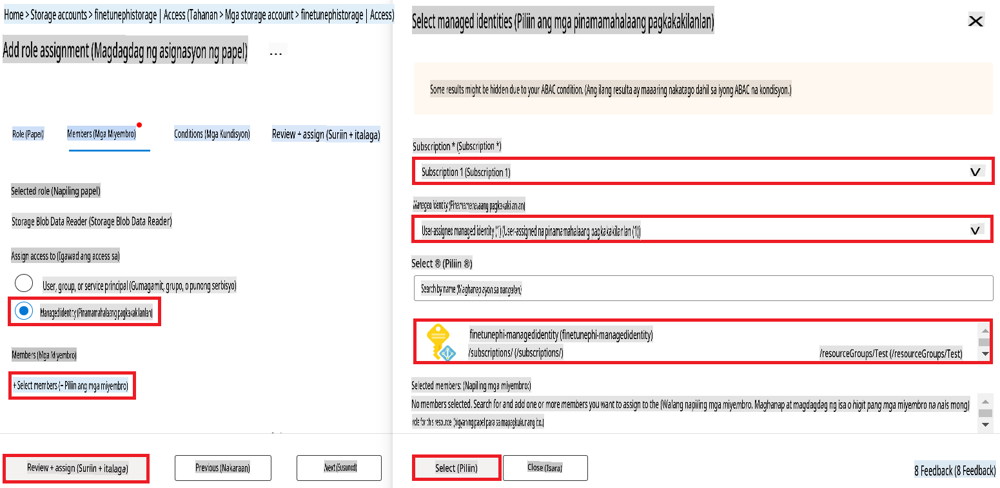

1. Piliin ang **Review + assign**.

#### Magdagdag ng AcrPull role assignment sa Managed Identity

1. I-type ang *container registries* sa **search bar** sa itaas ng portal page at piliin ang **Container registries** mula sa mga opsyon na lalabas.

    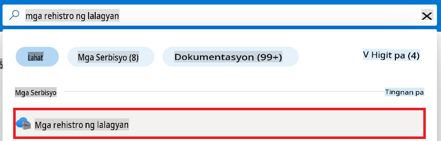

1. Piliin ang container registry na naka-link sa Azure Machine Learning workspace. Halimbawa, *finetunephicontainerregistries*.

1. Gawin ang mga sumusunod na hakbang upang pumunta sa Add role assignment page:

    - Piliin ang **Access Control (IAM)** mula sa kaliwang bahagi ng tab.
    - Piliin ang **+ Add** mula sa navigation menu.
    - Piliin ang **Add role assignment** mula sa navigation menu.

1. Sa loob ng Add role assignment page, gawin ang mga sumusunod na hakbang:

    - Sa Role page, i-type ang *AcrPull* sa **search bar** at piliin ang **AcrPull** mula sa mga opsyon na lalabas.
    - Sa Role page, piliin ang **Next**.
    - Sa Members page, piliin ang **Assign access to** **Managed identity**.
    - Sa Members page, piliin ang **+ Select members**.
    - Sa Select managed identities page, piliin ang iyong Azure **Subscription**.
    - Sa Select managed identities page, piliin ang **Managed identity** sa **Manage Identity**.
    - Sa Select managed identities page, piliin ang Managed Identity na nilikha mo. Halimbawa, *finetunephi-managedidentity*.
    - Sa Select managed identities page, piliin ang **Select**.
    - Piliin ang **Review + assign**.

### I-set up ang proyekto

Ngayon, gagawa ka ng folder kung saan magtatrabaho at magse-set up ng virtual environment para makabuo ng program na nakikipag-interact sa mga user at gumagamit ng naka-store na chat history mula sa Azure Cosmos DB para sa mga sagot nito.

#### Gumawa ng folder kung saan magtatrabaho

1. Buksan ang terminal window at i-type ang sumusunod na command upang gumawa ng folder na pinangalanang *finetune-phi* sa default na path.

    ```console
    mkdir finetune-phi
    ```

1. I-type ang sumusunod na command sa iyong terminal upang pumunta sa *finetune-phi* folder na ginawa mo.

    ```console
    cd finetune-phi
    ```

#### Gumawa ng virtual environment

1. I-type ang sumusunod na command sa iyong terminal upang gumawa ng virtual environment na pinangalanang *.venv*.

    ```console
    python -m venv .venv
    ```

1. I-type ang sumusunod na command sa iyong terminal upang i-activate ang virtual environment.

    ```console
    .venv\Scripts\activate.bat
    ```

> [!NOTE]
>
> Kung gumana ito, makikita mo ang *(.venv)* bago ang command prompt.

#### I-install ang mga kinakailangang package

1. I-type ang sumusunod na mga command sa iyong terminal upang i-install ang mga kinakailangang package.

    ```console
    pip install datasets==2.19.1
    pip install transformers==4.41.1
    pip install azure-ai-ml==1.16.0
    pip install torch==2.3.1
    pip install trl==0.9.4
    pip install promptflow==1.12.0
    ```

#### Gumawa ng mga file ng proyekto

Sa exercise na ito, gagawa ka ng mga mahahalagang file para sa ating proyekto. Kasama dito ang mga script para sa pag-download ng dataset, pag-set up ng Azure Machine Learning environment, fine-tuning ng Phi-3 model, at pag-deploy ng fine-tuned model. Gagawa ka rin ng *conda.yml* file para sa pag-set up ng fine-tuning environment.

Sa exercise na ito, gagawin mo ang sumusunod:

- Gumawa ng *download_dataset.py* file para sa pag-download ng dataset.
- Gumawa ng *setup_ml.py* file para sa pag-set up ng Azure Machine Learning environment.
- Gumawa ng *fine_tune.py* file sa *finetuning_dir* folder para sa fine-tuning ng Phi-3 model gamit ang dataset.
- Gumawa ng *conda.yml* file para sa pag-set up ng fine-tuning environment.
- Gumawa ng *deploy_model.py* file para sa pag-deploy ng fine-tuned model.
- Gumawa ng *integrate_with_promptflow.py* file para sa pag-integrate ng fine-tuned model at pag-execute ng model gamit ang Prompt flow.
- Gumawa ng *flow.dag.yml* file para sa pag-set up ng workflow structure para sa Prompt flow.
- Gumawa ng *config.py* file para sa pagpasok ng Azure information.

> [!NOTE]
>
> Kumpletong istruktura ng folder:
>
> ```text
> └── YourUserName
> .    └── finetune-phi
> .        ├── finetuning_dir
> .        │      └── fine_tune.py
> .        ├── conda.yml
> .        ├── config.py
> .        ├── deploy_model.py
> .        ├── download_dataset.py
> .        ├── flow.dag.yml
> .        ├── integrate_with_promptflow.py
> .        └── setup_ml.py
> ```

1. Buksan ang **Visual Studio Code**.

1. Piliin ang **File** mula sa menu bar.

1. Piliin ang **Open Folder**.

1. Piliin ang *finetune-phi* folder na ginawa mo, na matatagpuan sa *C:\Users\yourUserName\finetune-phi*.

    

1. Sa kaliwang bahagi ng Visual Studio Code, i-right-click at piliin ang **New File** upang gumawa ng bagong file na pinangalanang *download_dataset.py*.

1. Sa kaliwang bahagi ng Visual Studio Code, i-right-click at piliin ang **New File** upang gumawa ng bagong file na pinangalanang *setup_ml.py*.

1. Sa kaliwang bahagi ng Visual Studio Code, i-right-click at piliin ang **New File** upang gumawa ng bagong file na pinangalanang *deploy_model.py*.

    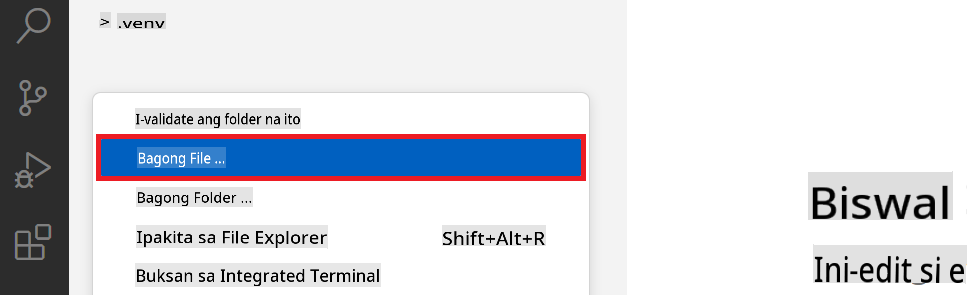

1. Sa kaliwang bahagi ng Visual Studio Code, i-right-click at piliin ang **New Folder** upang gumawa ng bagong folder na pinangalanang *finetuning_dir*.

1. Sa *finetuning_dir* folder, gumawa ng bagong file na pinangalanang *fine_tune.py*.

#### Gumawa at I-configure ang *conda.yml* file

1. Sa kaliwang bahagi ng Visual Studio Code, i-right-click at piliin ang **New File** upang gumawa ng bagong file na pinangalanang *conda.yml*.

1. Idagdag ang sumusunod na code sa *conda.yml* file upang i-set up ang fine-tuning environment para sa Phi-3 model.

    ```yml
    name: phi-3-training-env
    channels:
      - defaults
      - conda-forge
    dependencies:
      - python=3.10
      - pip
      - numpy<2.0
      - pip:
          - torch==2.4.0
          - torchvision==0.19.0
          - trl==0.8.6
          - transformers==4.41
          - datasets==2.21.0
          - azureml-core==1.57.0
          - azure-storage-blob==12.19.0
          - azure-ai-ml==1.16
          - azure-identity==1.17.1
          - accelerate==0.33.0
          - mlflow==2.15.1
          - azureml-mlflow==1.57.0
    ```

#### Gumawa at I-configure ang *config.py* file

1. Sa kaliwang bahagi ng Visual Studio Code, i-right-click at piliin ang **New File** upang gumawa ng bagong file na pinangalanang *config.py*.

1. Idagdag ang sumusunod na code sa *config.py* file upang isama ang iyong Azure information.

    ```python
    # Azure settings
    AZURE_SUBSCRIPTION_ID = "your_subscription_id"
    AZURE_RESOURCE_GROUP_NAME = "your_resource_group_name" # "TestGroup"

    # Azure Machine Learning settings
    AZURE_ML_WORKSPACE_NAME = "your_workspace_name" # "finetunephi-workspace"

    # Azure Managed Identity settings
    AZURE_MANAGED_IDENTITY_CLIENT_ID = "your_azure_managed_identity_client_id"
    AZURE_MANAGED_IDENTITY_NAME = "your_azure_managed_identity_name" # "finetunephi-mangedidentity"
    AZURE_MANAGED_IDENTITY_RESOURCE_ID = f"/subscriptions/{AZURE_SUBSCRIPTION_ID}/resourceGroups/{AZURE_RESOURCE_GROUP_NAME}/providers/Microsoft.ManagedIdentity/userAssignedIdentities/{AZURE_MANAGED_IDENTITY_NAME}"

    # Dataset file paths
    TRAIN_DATA_PATH = "data/train_data.jsonl"
    TEST_DATA_PATH = "data/test_data.jsonl"

    # Fine-tuned model settings
    AZURE_MODEL_NAME = "your_fine_tuned_model_name" # "finetune-phi-model"
    AZURE_ENDPOINT_NAME = "your_fine_tuned_model_endpoint_name" # "finetune-phi-endpoint"
    AZURE_DEPLOYMENT_NAME = "your_fine_tuned_model_deployment_name" # "finetune-phi-deployment"

    AZURE_ML_API_KEY = "your_fine_tuned_model_api_key"
    AZURE_ML_ENDPOINT = "your_fine_tuned_model_endpoint_uri" # "https://{your-endpoint-name}.{your-region}.inference.ml.azure.com/score"
    ```

#### Magdagdag ng Azure environment variables

1. Gawin ang sumusunod na hakbang upang idagdag ang Azure Subscription ID:

    - I-type ang *subscriptions* sa **search bar** sa itaas ng portal page at piliin ang **Subscriptions** mula sa mga opsyon na lalabas.
    - Piliin ang Azure Subscription na kasalukuyan
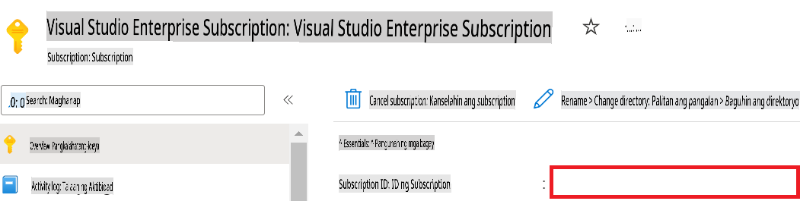

1. Gawin ang mga sumusunod na hakbang upang idagdag ang Azure Workspace Name:

    - Pumunta sa Azure Machine Learning resource na iyong nilikha.
    - Kopyahin at i-paste ang iyong account name sa *config.py* file.

    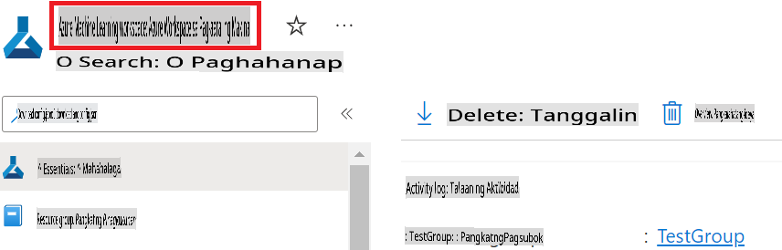

1. Gawin ang mga sumusunod na hakbang upang idagdag ang Azure Resource Group Name:

    - Pumunta sa Azure Machine Learning resource na iyong nilikha.
    - Kopyahin at i-paste ang iyong Azure Resource Group Name sa *config.py* file.

    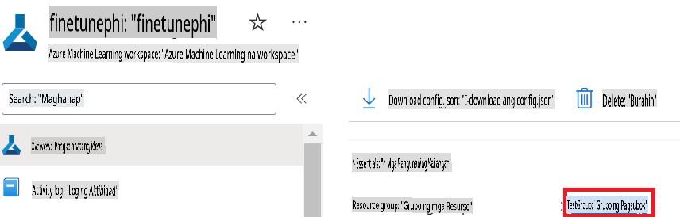

2. Gawin ang mga sumusunod na hakbang upang idagdag ang Azure Managed Identity name:

    - Pumunta sa Managed Identities resource na iyong nilikha.
    - Kopyahin at i-paste ang iyong Azure Managed Identity name sa *config.py* file.

    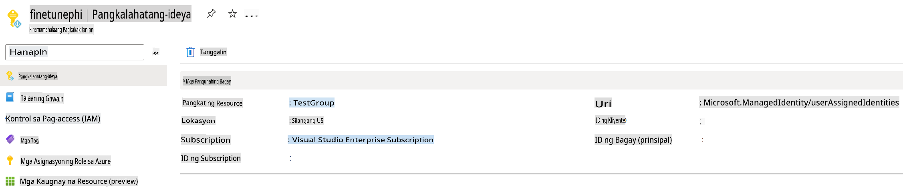

### Ihanda ang dataset para sa fine-tuning

Sa aktibidad na ito, tatakbuhin mo ang *download_dataset.py* file upang ma-download ang *ULTRACHAT_200k* datasets sa iyong lokal na environment. Gagamitin mo ang datasets na ito upang i-fine-tune ang Phi-3 model sa Azure Machine Learning.

#### I-download ang iyong dataset gamit ang *download_dataset.py*

1. Buksan ang *download_dataset.py* file sa Visual Studio Code.

1. Idagdag ang sumusunod na code sa *download_dataset.py*.

    ```python
    import json
    import os
    from datasets import load_dataset
    from config import (
        TRAIN_DATA_PATH,
        TEST_DATA_PATH)

    def load_and_split_dataset(dataset_name, config_name, split_ratio):
        """
        Load and split a dataset.
        """
        # Load the dataset with the specified name, configuration, and split ratio
        dataset = load_dataset(dataset_name, config_name, split=split_ratio)
        print(f"Original dataset size: {len(dataset)}")
        
        # Split the dataset into train and test sets (80% train, 20% test)
        split_dataset = dataset.train_test_split(test_size=0.2)
        print(f"Train dataset size: {len(split_dataset['train'])}")
        print(f"Test dataset size: {len(split_dataset['test'])}")
        
        return split_dataset

    def save_dataset_to_jsonl(dataset, filepath):
        """
        Save a dataset to a JSONL file.
        """
        # Create the directory if it does not exist
        os.makedirs(os.path.dirname(filepath), exist_ok=True)
        
        # Open the file in write mode
        with open(filepath, 'w', encoding='utf-8') as f:
            # Iterate over each record in the dataset
            for record in dataset:
                # Dump the record as a JSON object and write it to the file
                json.dump(record, f)
                # Write a newline character to separate records
                f.write('\n')
        
        print(f"Dataset saved to {filepath}")

    def main():
        """
        Main function to load, split, and save the dataset.
        """
        # Load and split the ULTRACHAT_200k dataset with a specific configuration and split ratio
        dataset = load_and_split_dataset("HuggingFaceH4/ultrachat_200k", 'default', 'train_sft[:1%]')
        
        # Extract the train and test datasets from the split
        train_dataset = dataset['train']
        test_dataset = dataset['test']

        # Save the train dataset to a JSONL file
        save_dataset_to_jsonl(train_dataset, TRAIN_DATA_PATH)
        
        # Save the test dataset to a separate JSONL file
        save_dataset_to_jsonl(test_dataset, TEST_DATA_PATH)

    if __name__ == "__main__":
        main()

    ```

> [!TIP]
>
> **Patnubay para sa fine-tuning gamit ang minimal dataset gamit ang CPU**
>
> Kung nais mong gumamit ng CPU para sa fine-tuning, mainam ang paraang ito para sa mga may benefit subscriptions (tulad ng Visual Studio Enterprise Subscription) o upang mabilis na masubukan ang fine-tuning at deployment process.
>
> Palitan ang `dataset = load_and_split_dataset("HuggingFaceH4/ultrachat_200k", 'default', 'train_sft[:1%]')` with `dataset = load_and_split_dataset("HuggingFaceH4/ultrachat_200k", 'default', 'train_sft[:10]')`
>

1. I-type ang sumusunod na command sa iyong terminal upang patakbuhin ang script at i-download ang dataset sa iyong lokal na environment.

    ```console
    python download_data.py
    ```

1. Siguraduhing ang datasets ay matagumpay na na-save sa iyong lokal na *finetune-phi/data* directory.

> [!NOTE]
>
> **Laki ng dataset at oras ng fine-tuning**
>
> Sa sample na ito, 1% lamang ng dataset (`train_sft[:1%]`) ang gagamitin. Malaki ang nabawas sa dami ng data, kaya mas mabilis ang pag-upload at fine-tuning process. Maaari mong ayusin ang porsyento upang makahanap ng tamang balanse sa pagitan ng oras ng training at performance ng model. Ang paggamit ng mas maliit na bahagi ng dataset ay nagpapabilis sa proseso ng fine-tuning, na ginagawa itong mas madaling pamahalaan para sa sample na ito.

## Scenario 2: Fine-tune ang Phi-3 model at I-deploy sa Azure Machine Learning Studio

### I-set up ang Azure CLI

Kailangan mong i-set up ang Azure CLI upang ma-authenticate ang iyong environment. Ang Azure CLI ay nagbibigay-daan upang pamahalaan ang mga Azure resource direkta mula sa command line at nagbibigay ng mga kinakailangang kredensyal para ma-access ng Azure Machine Learning ang mga resource na ito. Upang makapagsimula, i-install ang [Azure CLI](https://learn.microsoft.com/cli/azure/install-azure-cli).

1. Buksan ang terminal window at i-type ang sumusunod na command upang mag-log in sa iyong Azure account.

    ```console
    az login
    ```

1. Piliin ang iyong Azure account na gagamitin.

1. Piliin ang iyong Azure subscription na gagamitin.

    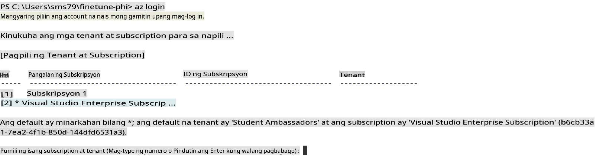

> [!TIP]
>
> Kung nahihirapan kang mag-sign in sa Azure, subukang gumamit ng device code. Buksan ang terminal window at i-type ang sumusunod na command upang mag-sign in sa iyong Azure account:
>
> ```console
> az login --use-device-code
> ```
>

### Fine-tune ang Phi-3 model

Sa aktibidad na ito, i-fine-tune mo ang Phi-3 model gamit ang ibinigay na dataset. Una, ide-define mo ang fine-tuning process sa *fine_tune.py* file. Pagkatapos, iko-configure mo ang Azure Machine Learning environment at sisimulan ang fine-tuning process sa pamamagitan ng pagpatakbo ng *setup_ml.py* file. Ang script na ito ang magtitiyak na ang fine-tuning ay magaganap sa loob ng Azure Machine Learning environment.

Sa pamamagitan ng pagpapatakbo ng *setup_ml.py*, sisimulan mo ang fine-tuning process sa Azure Machine Learning environment.

#### Magdagdag ng code sa *fine_tune.py* file

1. Pumunta sa *finetuning_dir* folder at buksan ang *fine_tune.py* file sa Visual Studio Code.

1. Idagdag ang sumusunod na code sa *fine_tune.py*.

    ```python
    import argparse
    import sys
    import logging
    import os
    from datasets import load_dataset
    import torch
    import mlflow
    from transformers import AutoModelForCausalLM, AutoTokenizer, TrainingArguments
    from trl import SFTTrainer

    # To avoid the INVALID_PARAMETER_VALUE error in MLflow, disable MLflow integration
    os.environ["DISABLE_MLFLOW_INTEGRATION"] = "True"

    # Logging setup
    logging.basicConfig(
        format="%(asctime)s - %(levelname)s - %(name)s - %(message)s",
        datefmt="%Y-%m-%d %H:%M:%S",
        handlers=[logging.StreamHandler(sys.stdout)],
        level=logging.WARNING
    )
    logger = logging.getLogger(__name__)

    def initialize_model_and_tokenizer(model_name, model_kwargs):
        """
        Initialize the model and tokenizer with the given pretrained model name and arguments.
        """
        model = AutoModelForCausalLM.from_pretrained(model_name, **model_kwargs)
        tokenizer = AutoTokenizer.from_pretrained(model_name)
        tokenizer.model_max_length = 2048
        tokenizer.pad_token = tokenizer.unk_token
        tokenizer.pad_token_id = tokenizer.convert_tokens_to_ids(tokenizer.pad_token)
        tokenizer.padding_side = 'right'
        return model, tokenizer

    def apply_chat_template(example, tokenizer):
        """
        Apply a chat template to tokenize messages in the example.
        """
        messages = example["messages"]
        if messages[0]["role"] != "system":
            messages.insert(0, {"role": "system", "content": ""})
        example["text"] = tokenizer.apply_chat_template(
            messages, tokenize=False, add_generation_prompt=False
        )
        return example

    def load_and_preprocess_data(train_filepath, test_filepath, tokenizer):
        """
        Load and preprocess the dataset.
        """
        train_dataset = load_dataset('json', data_files=train_filepath, split='train')
        test_dataset = load_dataset('json', data_files=test_filepath, split='train')
        column_names = list(train_dataset.features)

        train_dataset = train_dataset.map(
            apply_chat_template,
            fn_kwargs={"tokenizer": tokenizer},
            num_proc=10,
            remove_columns=column_names,
            desc="Applying chat template to train dataset",
        )

        test_dataset = test_dataset.map(
            apply_chat_template,
            fn_kwargs={"tokenizer": tokenizer},
            num_proc=10,
            remove_columns=column_names,
            desc="Applying chat template to test dataset",
        )

        return train_dataset, test_dataset

    def train_and_evaluate_model(train_dataset, test_dataset, model, tokenizer, output_dir):
        """
        Train and evaluate the model.
        """
        training_args = TrainingArguments(
            bf16=True,
            do_eval=True,
            output_dir=output_dir,
            eval_strategy="epoch",
            learning_rate=5.0e-06,
            logging_steps=20,
            lr_scheduler_type="cosine",
            num_train_epochs=3,
            overwrite_output_dir=True,
            per_device_eval_batch_size=4,
            per_device_train_batch_size=4,
            remove_unused_columns=True,
            save_steps=500,
            seed=0,
            gradient_checkpointing=True,
            gradient_accumulation_steps=1,
            warmup_ratio=0.2,
        )

        trainer = SFTTrainer(
            model=model,
            args=training_args,
            train_dataset=train_dataset,
            eval_dataset=test_dataset,
            max_seq_length=2048,
            dataset_text_field="text",
            tokenizer=tokenizer,
            packing=True
        )

        train_result = trainer.train()
        trainer.log_metrics("train", train_result.metrics)

        mlflow.transformers.log_model(
            transformers_model={"model": trainer.model, "tokenizer": tokenizer},
            artifact_path=output_dir,
        )

        tokenizer.padding_side = 'left'
        eval_metrics = trainer.evaluate()
        eval_metrics["eval_samples"] = len(test_dataset)
        trainer.log_metrics("eval", eval_metrics)

    def main(train_file, eval_file, model_output_dir):
        """
        Main function to fine-tune the model.
        """
        model_kwargs = {
            "use_cache": False,
            "trust_remote_code": True,
            "torch_dtype": torch.bfloat16,
            "device_map": None,
            "attn_implementation": "eager"
        }

        # pretrained_model_name = "microsoft/Phi-3-mini-4k-instruct"
        pretrained_model_name = "microsoft/Phi-3.5-mini-instruct"

        with mlflow.start_run():
            model, tokenizer = initialize_model_and_tokenizer(pretrained_model_name, model_kwargs)
            train_dataset, test_dataset = load_and_preprocess_data(train_file, eval_file, tokenizer)
            train_and_evaluate_model(train_dataset, test_dataset, model, tokenizer, model_output_dir)

    if __name__ == "__main__":
        parser = argparse.ArgumentParser()
        parser.add_argument("--train-file", type=str, required=True, help="Path to the training data")
        parser.add_argument("--eval-file", type=str, required=True, help="Path to the evaluation data")
        parser.add_argument("--model_output_dir", type=str, required=True, help="Directory to save the fine-tuned model")
        args = parser.parse_args()
        main(args.train_file, args.eval_file, args.model_output_dir)

    ```

1. I-save at isara ang *fine_tune.py* file.

> [!TIP]
> **Pwede kang mag-fine-tune ng Phi-3.5 model**
>
> Sa *fine_tune.py* file, maaari mong palitan ang `pretrained_model_name` from `"microsoft/Phi-3-mini-4k-instruct"` to any model you want to fine-tune. For example, if you change it to `"microsoft/Phi-3.5-mini-instruct"`, you'll be using the Phi-3.5-mini-instruct model for fine-tuning. To find and use the model name you prefer, visit [Hugging Face](https://huggingface.co/), search for the model you're interested in, and then copy and paste its name into the `pretrained_model_name` field sa iyong script.
>
> :::image type="content" source="../../imgs/03/FineTuning-PromptFlow/finetunephi3.5.png" alt-text="Fine tune Phi-3.5.":::
>

#### Magdagdag ng code sa *setup_ml.py* file

1. Buksan ang *setup_ml.py* file sa Visual Studio Code.

1. Idagdag ang sumusunod na code sa *setup_ml.py*.

    ```python
    import logging
    from azure.ai.ml import MLClient, command, Input
    from azure.ai.ml.entities import Environment, AmlCompute
    from azure.identity import AzureCliCredential
    from config import (
        AZURE_SUBSCRIPTION_ID,
        AZURE_RESOURCE_GROUP_NAME,
        AZURE_ML_WORKSPACE_NAME,
        TRAIN_DATA_PATH,
        TEST_DATA_PATH
    )

    # Constants

    # Uncomment the following lines to use a CPU instance for training
    # COMPUTE_INSTANCE_TYPE = "Standard_E16s_v3" # cpu
    # COMPUTE_NAME = "cpu-e16s-v3"
    # DOCKER_IMAGE_NAME = "mcr.microsoft.com/azureml/openmpi4.1.0-ubuntu20.04:latest"

    # Uncomment the following lines to use a GPU instance for training
    COMPUTE_INSTANCE_TYPE = "Standard_NC24ads_A100_v4"
    COMPUTE_NAME = "gpu-nc24s-a100-v4"
    DOCKER_IMAGE_NAME = "mcr.microsoft.com/azureml/curated/acft-hf-nlp-gpu:59"

    CONDA_FILE = "conda.yml"
    LOCATION = "eastus2" # Replace with the location of your compute cluster
    FINETUNING_DIR = "./finetuning_dir" # Path to the fine-tuning script
    TRAINING_ENV_NAME = "phi-3-training-environment" # Name of the training environment
    MODEL_OUTPUT_DIR = "./model_output" # Path to the model output directory in azure ml

    # Logging setup to track the process
    logger = logging.getLogger(__name__)
    logging.basicConfig(
        format="%(asctime)s - %(levelname)s - %(name)s - %(message)s",
        datefmt="%Y-%m-%d %H:%M:%S",
        level=logging.WARNING
    )

    def get_ml_client():
        """
        Initialize the ML Client using Azure CLI credentials.
        """
        credential = AzureCliCredential()
        return MLClient(credential, AZURE_SUBSCRIPTION_ID, AZURE_RESOURCE_GROUP_NAME, AZURE_ML_WORKSPACE_NAME)

    def create_or_get_environment(ml_client):
        """
        Create or update the training environment in Azure ML.
        """
        env = Environment(
            image=DOCKER_IMAGE_NAME,  # Docker image for the environment
            conda_file=CONDA_FILE,  # Conda environment file
            name=TRAINING_ENV_NAME,  # Name of the environment
        )
        return ml_client.environments.create_or_update(env)

    def create_or_get_compute_cluster(ml_client, compute_name, COMPUTE_INSTANCE_TYPE, location):
        """
        Create or update the compute cluster in Azure ML.
        """
        try:
            compute_cluster = ml_client.compute.get(compute_name)
            logger.info(f"Compute cluster '{compute_name}' already exists. Reusing it for the current run.")
        except Exception:
            logger.info(f"Compute cluster '{compute_name}' does not exist. Creating a new one with size {COMPUTE_INSTANCE_TYPE}.")
            compute_cluster = AmlCompute(
                name=compute_name,
                size=COMPUTE_INSTANCE_TYPE,
                location=location,
                tier="Dedicated",  # Tier of the compute cluster
                min_instances=0,  # Minimum number of instances
                max_instances=1  # Maximum number of instances
            )
            ml_client.compute.begin_create_or_update(compute_cluster).wait()  # Wait for the cluster to be created
        return compute_cluster

    def create_fine_tuning_job(env, compute_name):
        """
        Set up the fine-tuning job in Azure ML.
        """
        return command(
            code=FINETUNING_DIR,  # Path to fine_tune.py
            command=(
                "python fine_tune.py "
                "--train-file ${{inputs.train_file}} "
                "--eval-file ${{inputs.eval_file}} "
                "--model_output_dir ${{inputs.model_output}}"
            ),
            environment=env,  # Training environment
            compute=compute_name,  # Compute cluster to use
            inputs={
                "train_file": Input(type="uri_file", path=TRAIN_DATA_PATH),  # Path to the training data file
                "eval_file": Input(type="uri_file", path=TEST_DATA_PATH),  # Path to the evaluation data file
                "model_output": MODEL_OUTPUT_DIR
            }
        )

    def main():
        """
        Main function to set up and run the fine-tuning job in Azure ML.
        """
        # Initialize ML Client
        ml_client = get_ml_client()

        # Create Environment
        env = create_or_get_environment(ml_client)
        
        # Create or get existing compute cluster
        create_or_get_compute_cluster(ml_client, COMPUTE_NAME, COMPUTE_INSTANCE_TYPE, LOCATION)

        # Create and Submit Fine-Tuning Job
        job = create_fine_tuning_job(env, COMPUTE_NAME)
        returned_job = ml_client.jobs.create_or_update(job)  # Submit the job
        ml_client.jobs.stream(returned_job.name)  # Stream the job logs
        
        # Capture the job name
        job_name = returned_job.name
        print(f"Job name: {job_name}")

    if __name__ == "__main__":
        main()

    ```

1. Palitan ang `COMPUTE_INSTANCE_TYPE`, `COMPUTE_NAME`, and `LOCATION` gamit ang iyong mga detalye.

    ```python
   # Uncomment the following lines to use a GPU instance for training
    COMPUTE_INSTANCE_TYPE = "Standard_NC24ads_A100_v4"
    COMPUTE_NAME = "gpu-nc24s-a100-v4"
    ...
    LOCATION = "eastus2" # Replace with the location of your compute cluster
    ```

> [!TIP]
>
> **Patnubay para sa fine-tuning gamit ang minimal dataset gamit ang CPU**
>
> Kung nais mong gumamit ng CPU para sa fine-tuning, mainam ang paraang ito para sa mga may benefit subscriptions (tulad ng Visual Studio Enterprise Subscription) o upang mabilis na masubukan ang fine-tuning at deployment process.
>
> 1. Buksan ang *setup_ml* file.
> 1. Palitan ang `COMPUTE_INSTANCE_TYPE`, `COMPUTE_NAME`, and `DOCKER_IMAGE_NAME` with the following. If you do not have access to *Standard_E16s_v3*, you can use an equivalent CPU instance or request a new quota.
> 1. Replace `LOCATION` gamit ang iyong mga detalye.
>
>    ```python
>    # Uncomment the following lines to use a CPU instance for training
>    COMPUTE_INSTANCE_TYPE = "Standard_E16s_v3" # cpu
>    COMPUTE_NAME = "cpu-e16s-v3"
>    DOCKER_IMAGE_NAME = "mcr.microsoft.com/azureml/openmpi4.1.0-ubuntu20.04:latest"
>    LOCATION = "eastus2" # Replace with the location of your compute cluster
>    ```
>

1. I-type ang sumusunod na command upang patakbuhin ang *setup_ml.py* script at simulan ang fine-tuning process sa Azure Machine Learning.

    ```python
    python setup_ml.py
    ```

1. Sa aktibidad na ito, matagumpay mong na-fine-tune ang Phi-3 model gamit ang Azure Machine Learning. Sa pamamagitan ng pagpapatakbo ng *setup_ml.py* script, na-set up mo ang Azure Machine Learning environment at sinimulan ang fine-tuning process na nakasaad sa *fine_tune.py* file. Tandaan na maaaring tumagal ang fine-tuning process. Matapos patakbuhin ang `python setup_ml.py` command, you need to wait for the process to complete. You can monitor the status of the fine-tuning job by following the link provided in the terminal to the Azure Machine Learning portal.

    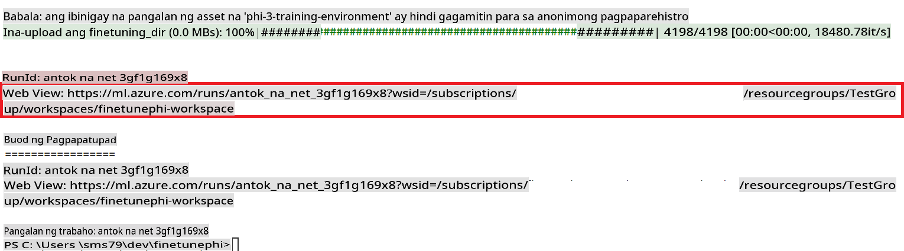

### Deploy the fine-tuned model

To integrate the fine-tuned Phi-3 model with Prompt Flow, you need to deploy the model to make it accessible for real-time inference. This process involves registering the model, creating an online endpoint, and deploying the model.

#### Set the model name, endpoint name, and deployment name for deployment

1. Open *config.py* file.

1. Replace `AZURE_MODEL_NAME = "your_fine_tuned_model_name"` with the desired name for your model.

1. Replace `AZURE_ENDPOINT_NAME = "your_fine_tuned_model_endpoint_name"` with the desired name for your endpoint.

1. Replace `AZURE_DEPLOYMENT_NAME = "your_fine_tuned_model_deployment_name"` gamit ang nais na pangalan para sa iyong deployment.

#### Magdagdag ng code sa *deploy_model.py* file

Ang pagpapatakbo ng *deploy_model.py* file ay awtomatikong gagawin ang buong deployment process. Ire-rehistro nito ang model, gagawa ng endpoint, at isasagawa ang deployment base sa mga setting na nakasaad sa config.py file, kabilang ang model name, endpoint name, at deployment name.

1. Buksan ang *deploy_model.py* file sa Visual Studio Code.

1. Idagdag ang sumusunod na code sa *deploy_model.py*.

    ```python
    import logging
    from azure.identity import AzureCliCredential
    from azure.ai.ml import MLClient
    from azure.ai.ml.entities import Model, ProbeSettings, ManagedOnlineEndpoint, ManagedOnlineDeployment, IdentityConfiguration, ManagedIdentityConfiguration, OnlineRequestSettings
    from azure.ai.ml.constants import AssetTypes

    # Configuration imports
    from config import (
        AZURE_SUBSCRIPTION_ID,
        AZURE_RESOURCE_GROUP_NAME,
        AZURE_ML_WORKSPACE_NAME,
        AZURE_MANAGED_IDENTITY_RESOURCE_ID,
        AZURE_MANAGED_IDENTITY_CLIENT_ID,
        AZURE_MODEL_NAME,
        AZURE_ENDPOINT_NAME,
        AZURE_DEPLOYMENT_NAME
    )

    # Constants
    JOB_NAME = "your-job-name"
    COMPUTE_INSTANCE_TYPE = "Standard_E4s_v3"

    deployment_env_vars = {
        "SUBSCRIPTION_ID": AZURE_SUBSCRIPTION_ID,
        "RESOURCE_GROUP_NAME": AZURE_RESOURCE_GROUP_NAME,
        "UAI_CLIENT_ID": AZURE_MANAGED_IDENTITY_CLIENT_ID,
    }

    # Logging setup
    logging.basicConfig(
        format="%(asctime)s - %(levelname)s - %(name)s - %(message)s",
        datefmt="%Y-%m-%d %H:%M:%S",
        level=logging.DEBUG
    )
    logger = logging.getLogger(__name__)

    def get_ml_client():
        """Initialize and return the ML Client."""
        credential = AzureCliCredential()
        return MLClient(credential, AZURE_SUBSCRIPTION_ID, AZURE_RESOURCE_GROUP_NAME, AZURE_ML_WORKSPACE_NAME)

    def register_model(ml_client, model_name, job_name):
        """Register a new model."""
        model_path = f"azureml://jobs/{job_name}/outputs/artifacts/paths/model_output"
        logger.info(f"Registering model {model_name} from job {job_name} at path {model_path}.")
        run_model = Model(
            path=model_path,
            name=model_name,
            description="Model created from run.",
            type=AssetTypes.MLFLOW_MODEL,
        )
        model = ml_client.models.create_or_update(run_model)
        logger.info(f"Registered model ID: {model.id}")
        return model

    def delete_existing_endpoint(ml_client, endpoint_name):
        """Delete existing endpoint if it exists."""
        try:
            endpoint_result = ml_client.online_endpoints.get(name=endpoint_name)
            logger.info(f"Deleting existing endpoint {endpoint_name}.")
            ml_client.online_endpoints.begin_delete(name=endpoint_name).result()
            logger.info(f"Deleted existing endpoint {endpoint_name}.")
        except Exception as e:
            logger.info(f"No existing endpoint {endpoint_name} found to delete: {e}")

    def create_or_update_endpoint(ml_client, endpoint_name, description=""):
        """Create or update an endpoint."""
        delete_existing_endpoint(ml_client, endpoint_name)
        logger.info(f"Creating new endpoint {endpoint_name}.")
        endpoint = ManagedOnlineEndpoint(
            name=endpoint_name,
            description=description,
            identity=IdentityConfiguration(
                type="user_assigned",
                user_assigned_identities=[ManagedIdentityConfiguration(resource_id=AZURE_MANAGED_IDENTITY_RESOURCE_ID)]
            )
        )
        endpoint_result = ml_client.online_endpoints.begin_create_or_update(endpoint).result()
        logger.info(f"Created new endpoint {endpoint_name}.")
        return endpoint_result

    def create_or_update_deployment(ml_client, endpoint_name, deployment_name, model):
        """Create or update a deployment."""

        logger.info(f"Creating deployment {deployment_name} for endpoint {endpoint_name}.")
        deployment = ManagedOnlineDeployment(
            name=deployment_name,
            endpoint_name=endpoint_name,
            model=model.id,
            instance_type=COMPUTE_INSTANCE_TYPE,
            instance_count=1,
            environment_variables=deployment_env_vars,
            request_settings=OnlineRequestSettings(
                max_concurrent_requests_per_instance=3,
                request_timeout_ms=180000,
                max_queue_wait_ms=120000
            ),
            liveness_probe=ProbeSettings(
                failure_threshold=30,
                success_threshold=1,
                period=100,
                initial_delay=500,
            ),
            readiness_probe=ProbeSettings(
                failure_threshold=30,
                success_threshold=1,
                period=100,
                initial_delay=500,
            ),
        )
        deployment_result = ml_client.online_deployments.begin_create_or_update(deployment).result()
        logger.info(f"Created deployment {deployment.name} for endpoint {endpoint_name}.")
        return deployment_result

    def set_traffic_to_deployment(ml_client, endpoint_name, deployment_name):
        """Set traffic to the specified deployment."""
        try:
            # Fetch the current endpoint details
            endpoint = ml_client.online_endpoints.get(name=endpoint_name)
            
            # Log the current traffic allocation for debugging
            logger.info(f"Current traffic allocation: {endpoint.traffic}")
            
            # Set the traffic allocation for the deployment
            endpoint.traffic = {deployment_name: 100}
            
            # Update the endpoint with the new traffic allocation
            endpoint_poller = ml_client.online_endpoints.begin_create_or_update(endpoint)
            updated_endpoint = endpoint_poller.result()
            
            # Log the updated traffic allocation for debugging
            logger.info(f"Updated traffic allocation: {updated_endpoint.traffic}")
            logger.info(f"Set traffic to deployment {deployment_name} at endpoint {endpoint_name}.")
            return updated_endpoint
        except Exception as e:
            # Log any errors that occur during the process
            logger.error(f"Failed to set traffic to deployment: {e}")
            raise


    def main():
        ml_client = get_ml_client()

        registered_model = register_model(ml_client, AZURE_MODEL_NAME, JOB_NAME)
        logger.info(f"Registered model ID: {registered_model.id}")

        endpoint = create_or_update_endpoint(ml_client, AZURE_ENDPOINT_NAME, "Endpoint for finetuned Phi-3 model")
        logger.info(f"Endpoint {AZURE_ENDPOINT_NAME} is ready.")

        try:
            deployment = create_or_update_deployment(ml_client, AZURE_ENDPOINT_NAME, AZURE_DEPLOYMENT_NAME, registered_model)
            logger.info(f"Deployment {AZURE_DEPLOYMENT_NAME} is created for endpoint {AZURE_ENDPOINT_NAME}.")

            set_traffic_to_deployment(ml_client, AZURE_ENDPOINT_NAME, AZURE_DEPLOYMENT_NAME)
            logger.info(f"Traffic is set to deployment {AZURE_DEPLOYMENT_NAME} at endpoint {AZURE_ENDPOINT_NAME}.")
        except Exception as e:
            logger.error(f"Failed to create or update deployment: {e}")

    if __name__ == "__main__":
        main()

    ```

1. Gawin ang sumusunod na hakbang upang makuha ang `JOB_NAME`:

    - Navigate to Azure Machine Learning resource that you created.
    - Select **Studio web URL** to open the Azure Machine Learning workspace.
    - Select **Jobs** from the left side tab.
    - Select the experiment for fine-tuning. For example, *finetunephi*.
    - Select the job that you created.
    - Copy and paste your job Name into the `JOB_NAME = "your-job-name"` in *deploy_model.py* file.

1. Replace `COMPUTE_INSTANCE_TYPE` gamit ang iyong mga detalye.

1. I-type ang sumusunod na command upang patakbuhin ang *deploy_model.py* script at simulan ang deployment process sa Azure Machine Learning.

    ```python
    python deploy_model.py
    ```

> [!WARNING]
> Upang maiwasan ang karagdagang singil sa iyong account, siguraduhing tanggalin ang endpoint na nilikha sa Azure Machine Learning workspace.
>

#### Tingnan ang deployment status sa Azure Machine Learning Workspace

1. Bisitahin ang [Azure ML Studio](https://ml.azure.com/home?wt.mc_id=studentamb_279723).

1. Pumunta sa Azure Machine Learning workspace na iyong nilikha.

1. Piliin ang **Studio web URL** upang buksan ang Azure Machine Learning workspace.

1. Piliin ang **Endpoints** mula sa kaliwang bahagi ng tab.

    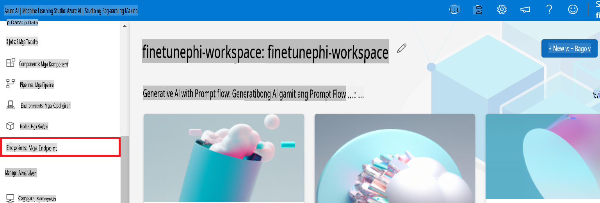

2. Piliin ang endpoint na iyong nilikha.

    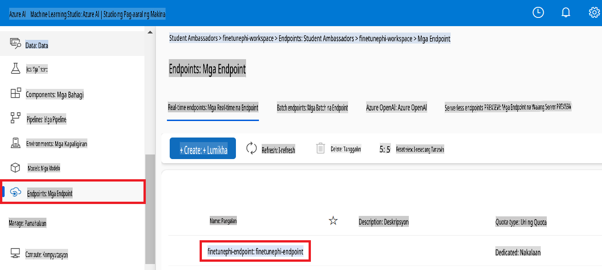

3. Sa pahinang ito, maaari mong pamahalaan ang mga endpoint na nilikha sa deployment process.

## Scenario 3: Integrasyon gamit ang Prompt flow at Makipag-usap sa iyong custom na model

### I-integrate ang custom na Phi-3 model gamit ang Prompt flow

Matapos matagumpay na mai-deploy ang iyong fine-tuned model, maaari mo na itong i-integrate gamit ang Prompt flow upang magamit ang iyong model sa real-time applications, na nagbibigay-daan sa iba't ibang interactive tasks gamit ang iyong custom na Phi-3 model.

#### I-set ang api key at endpoint uri ng fine-tuned Phi-3 model

1. Pumunta sa Azure Machine Learning workspace na iyong nilikha.
1. Piliin ang **Endpoints** mula sa kaliwang bahagi ng tab.
1. Piliin ang endpoint na iyong nilikha.
1. Piliin ang **Consume** mula sa navigation menu.
1. Kopyahin at i-paste ang iyong **REST endpoint** sa *config.py* file, palitan ang `AZURE_ML_ENDPOINT = "your_fine_tuned_model_endpoint_uri"` with your **REST endpoint**.
1. Copy and paste your **Primary key** into the *config.py* file, replacing `AZURE_ML_API_KEY = "your_fine_tuned_model_api_key"` gamit ang iyong **Primary key**.

    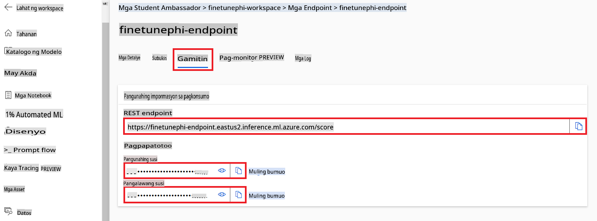

#### Magdagdag ng code sa *flow.dag.yml* file

1. Buksan ang *flow.dag.yml* file sa Visual Studio Code.

1. Idagdag ang sumusunod na code sa *flow.dag.yml*.

    ```yml
    inputs:
      input_data:
        type: string
        default: "Who founded Microsoft?"

    outputs:
      answer:
        type: string
        reference: ${integrate_with_promptflow.output}

    nodes:
    - name: integrate_with_promptflow
      type: python
      source:
        type: code
        path: integrate_with_promptflow.py
      inputs:
        input_data: ${inputs.input_data}
    ```

#### Magdagdag ng code sa *integrate_with_promptflow.py* file

1. Buksan ang *integrate_with_promptflow.py* file sa Visual Studio Code.

1. Idagdag ang sumusunod na code sa *integrate_with_promptflow.py*.

    ```python
    import logging
    import requests
    from promptflow.core import tool
    import asyncio
    import platform
    from config import (
        AZURE_ML_ENDPOINT,
        AZURE_ML_API_KEY
    )

    # Logging setup
    logging.basicConfig(
        format="%(asctime)s - %(levelname)s - %(name)s - %(message)s",
        datefmt="%Y-%m-%d %H:%M:%S",
        level=logging.DEBUG
    )
    logger = logging.getLogger(__name__)

    def query_azml_endpoint(input_data: list, endpoint_url: str, api_key: str) -> str:
        """
        Send a request to the Azure ML endpoint with the given input data.
        """
        headers = {
            "Content-Type": "application/json",
            "Authorization": f"Bearer {api_key}"
        }
        data = {
            "input_data": [input_data],
            "params": {
                "temperature": 0.7,
                "max_new_tokens": 128,
                "do_sample": True,
                "return_full_text": True
            }
        }
        try:
            response = requests.post(endpoint_url, json=data, headers=headers)
            response.raise_for_status()
            result = response.json()[0]
            logger.info("Successfully received response from Azure ML Endpoint.")
            return result
        except requests.exceptions.RequestException as e:
            logger.error(f"Error querying Azure ML Endpoint: {e}")
            raise

    def setup_asyncio_policy():
        """
        Setup asyncio event loop policy for Windows.
        """
        if platform.system() == 'Windows':
            asyncio.set_event_loop_policy(asyncio.WindowsSelectorEventLoopPolicy())
            logger.info("Set Windows asyncio event loop policy.")

    @tool
    def my_python_tool(input_data: str) -> str:
        """
        Tool function to process input data and query the Azure ML endpoint.
        """
        setup_asyncio_policy()
        return query_azml_endpoint(input_data, AZURE_ML_ENDPOINT, AZURE_ML_API_KEY)

    ```

### Makipag-usap sa iyong custom na model

1. I-type ang sumusunod na command upang patakbuhin ang *deploy_model.py* script at simulan ang deployment process sa Azure Machine Learning.

    ```python
    pf flow serve --source ./ --port 8080 --host localhost
    ```

1. Narito ang isang halimbawa ng resulta: Ngayon ay maaari ka nang makipag-usap sa iyong custom na Phi-3 model. Inirerekomenda na magtanong ng mga katanungan batay sa data na ginamit para sa fine-tuning.

    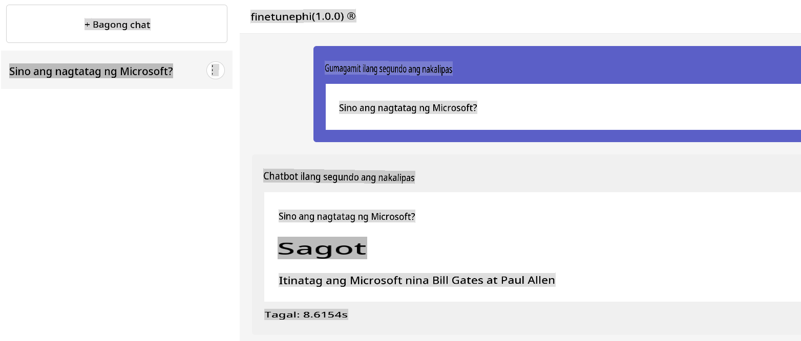

**Paunawa**:  
Ang dokumentong ito ay isinalin gamit ang mga serbisyo ng AI-based na awtomatikong pagsasalin. Bagamat pinagsisikapan naming maging wasto, pakatandaan na ang mga awtomatikong pagsasalin ay maaaring maglaman ng mga pagkakamali o kamalian. Ang orihinal na dokumento sa orihinal nitong wika ang dapat ituring na opisyal na sanggunian. Para sa mahalagang impormasyon, inirerekomenda ang propesyonal na pagsasaling-wika ng tao. Hindi kami mananagot sa anumang hindi pagkakaunawaan o maling interpretasyon na dulot ng paggamit ng pagsasaling ito.