# Fine-tune at I-integrate ang mga custom na modelo ng Phi-3 gamit ang Prompt flow sa Azure AI Foundry

Ang end-to-end (E2E) na sample na ito ay batay sa gabay na "[Fine-Tune and Integrate Custom Phi-3 Models with Prompt Flow in Azure AI Foundry](https://techcommunity.microsoft.com/t5/educator-developer-blog/fine-tune-and-integrate-custom-phi-3-models-with-prompt-flow-in/ba-p/4191726?WT.mc_id=aiml-137032-kinfeylo)" mula sa Microsoft Tech Community. Ipinapakita nito ang proseso ng fine-tuning, pag-deploy, at pag-integrate ng mga custom na modelo ng Phi-3 gamit ang Prompt flow sa Azure AI Foundry. 
Hindi tulad ng E2E sample na "[Fine-Tune and Integrate Custom Phi-3 Models with Prompt Flow](./E2E_Phi-3-FineTuning_PromptFlow_Integration.md)", na nangangailangan ng pagtakbo ng code nang lokal, ang tutorial na ito ay nakatuon lamang sa fine-tuning at pag-integrate ng iyong modelo sa loob ng Azure AI / ML Studio.

## Pangkalahatang-ideya

Sa E2E sample na ito, matututunan mo kung paano mag-fine-tune ng Phi-3 model at i-integrate ito gamit ang Prompt flow sa Azure AI Foundry. Sa pamamagitan ng paggamit ng Azure AI / ML Studio, magtatatag ka ng workflow para sa pag-deploy at paggamit ng mga custom na AI models. Ang E2E sample na ito ay nahahati sa tatlong senaryo:

**Scenario 1: I-set up ang mga Azure resources at Maghanda para sa fine-tuning**

**Scenario 2: I-fine-tune ang Phi-3 model at I-deploy sa Azure Machine Learning Studio**

**Scenario 3: I-integrate gamit ang Prompt flow at Makipag-chat gamit ang iyong custom na modelo sa Azure AI Foundry**

Narito ang isang pangkalahatang-ideya ng E2E sample na ito.

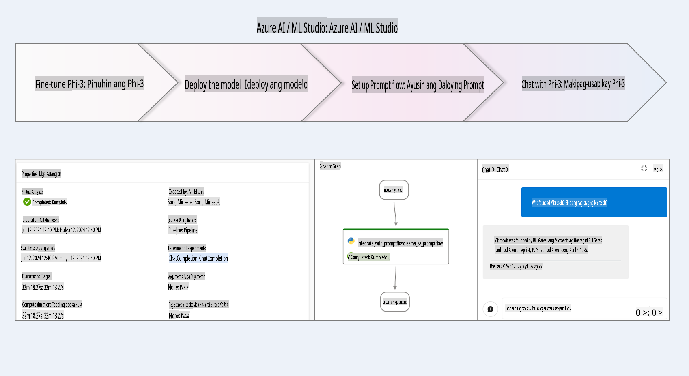

### Talaan ng Nilalaman

1. **[Scenario 1: I-set up ang mga Azure resources at Maghanda para sa fine-tuning](../../../../../../md/02.Application/01.TextAndChat/Phi3)**
    - [Gumawa ng Azure Machine Learning Workspace](../../../../../../md/02.Application/01.TextAndChat/Phi3)
    - [Mag-request ng GPU quotas sa Azure Subscription](../../../../../../md/02.Application/01.TextAndChat/Phi3)
    - [Magdagdag ng role assignment](../../../../../../md/02.Application/01.TextAndChat/Phi3)
    - [I-set up ang proyekto](../../../../../../md/02.Application/01.TextAndChat/Phi3)
    - [Maghanda ng dataset para sa fine-tuning](../../../../../../md/02.Application/01.TextAndChat/Phi3)

1. **[Scenario 2: I-fine-tune ang Phi-3 model at I-deploy sa Azure Machine Learning Studio](../../../../../../md/02.Application/01.TextAndChat/Phi3)**
    - [I-fine-tune ang Phi-3 model](../../../../../../md/02.Application/01.TextAndChat/Phi3)
    - [I-deploy ang fine-tuned Phi-3 model](../../../../../../md/02.Application/01.TextAndChat/Phi3)

1. **[Scenario 3: I-integrate gamit ang Prompt flow at Makipag-chat gamit ang iyong custom na modelo sa Azure AI Foundry](../../../../../../md/02.Application/01.TextAndChat/Phi3)**
    - [I-integrate ang custom na Phi-3 model gamit ang Prompt flow](../../../../../../md/02.Application/01.TextAndChat/Phi3)
    - [Makipag-chat gamit ang iyong custom na Phi-3 model](../../../../../../md/02.Application/01.TextAndChat/Phi3)

## Scenario 1: I-set up ang mga Azure resources at Maghanda para sa fine-tuning

### Gumawa ng Azure Machine Learning Workspace

1. I-type ang *azure machine learning* sa **search bar** sa itaas ng portal page at piliin ang **Azure Machine Learning** mula sa mga opsyon na lalabas.

    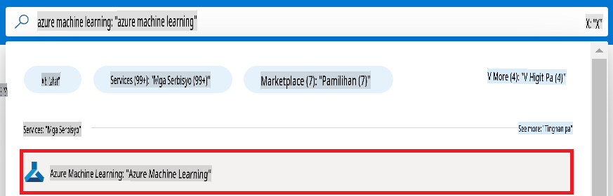

2. Piliin ang **+ Create** mula sa navigation menu.

3. Piliin ang **New workspace** mula sa navigation menu.

    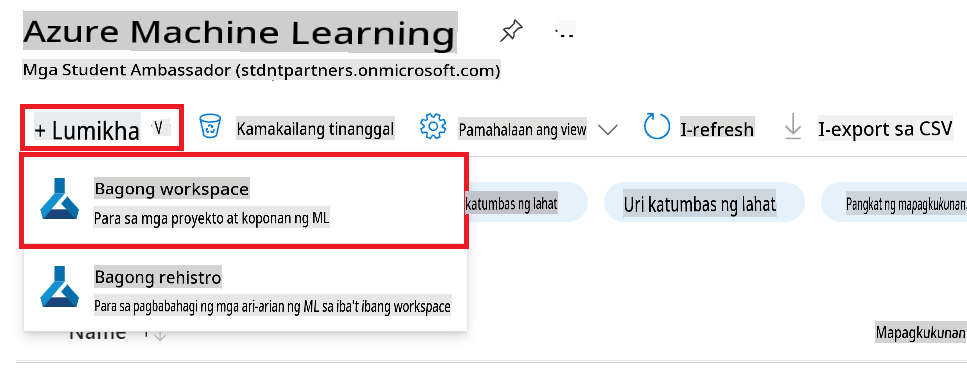

4. Gawin ang mga sumusunod na hakbang:

    - Piliin ang iyong Azure **Subscription**.
    - Piliin ang **Resource group** na gagamitin (gumawa ng bago kung kinakailangan).
    - Ipasok ang **Workspace Name**. Dapat itong natatanging halaga.
    - Piliin ang **Region** na nais mong gamitin.
    - Piliin ang **Storage account** na gagamitin (gumawa ng bago kung kinakailangan).
    - Piliin ang **Key vault** na gagamitin (gumawa ng bago kung kinakailangan).
    - Piliin ang **Application insights** na gagamitin (gumawa ng bago kung kinakailangan).
    - Piliin ang **Container registry** na gagamitin (gumawa ng bago kung kinakailangan).

    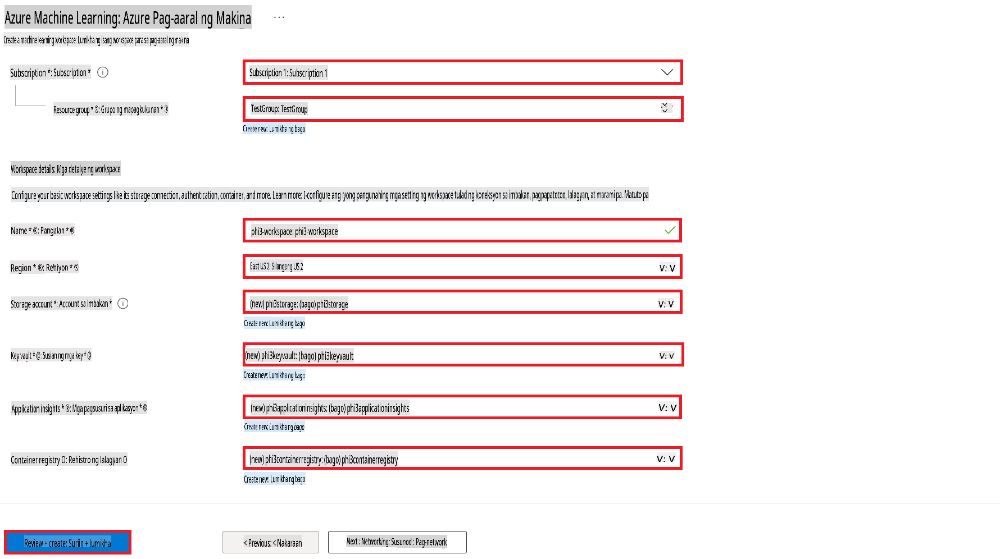

5. Piliin ang **Review + Create**.

6. Piliin ang **Create**.

### Mag-request ng GPU quotas sa Azure Subscription

Sa tutorial na ito, matututunan mong i-fine-tune at i-deploy ang isang Phi-3 model gamit ang GPUs. Para sa fine-tuning, gagamitin mo ang *Standard_NC24ads_A100_v4* GPU, na nangangailangan ng quota request. Para sa deployment, gagamitin mo ang *Standard_NC6s_v3* GPU, na nangangailangan din ng quota request.

> [!NOTE]
>
> Ang mga Pay-As-You-Go subscriptions lamang (ang karaniwang uri ng subscription) ang kwalipikado para sa GPU allocation; ang mga benefit subscriptions ay kasalukuyang hindi suportado.
>

1. Bisitahin ang [Azure ML Studio](https://ml.azure.com/home?wt.mc_id=studentamb_279723).

1. Gawin ang mga sumusunod na hakbang upang mag-request ng *Standard NCADSA100v4 Family* quota:

    - Piliin ang **Quota** mula sa kaliwang tab.
    - Piliin ang **Virtual machine family** na gagamitin. Halimbawa, piliin ang **Standard NCADSA100v4 Family Cluster Dedicated vCPUs**, na kinabibilangan ng *Standard_NC24ads_A100_v4* GPU.
    - Piliin ang **Request quota** mula sa navigation menu.

        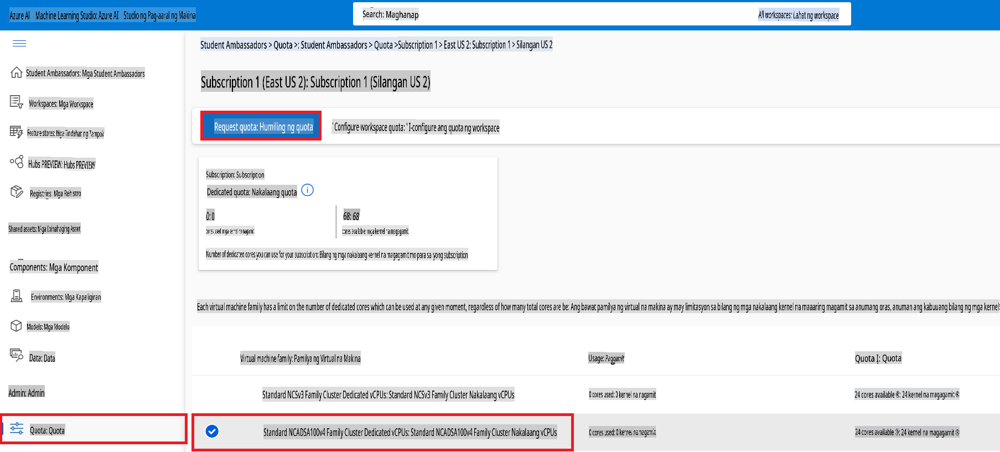

    - Sa loob ng Request quota page, ilagay ang **New cores limit** na nais mong gamitin. Halimbawa, 24.
    - Sa loob ng Request quota page, piliin ang **Submit** upang mag-request ng GPU quota.

1. Gawin ang mga sumusunod na hakbang upang mag-request ng *Standard NCSv3 Family* quota:

    - Piliin ang **Quota** mula sa kaliwang tab.
    - Piliin ang **Virtual machine family** na gagamitin. Halimbawa, piliin ang **Standard NCSv3 Family Cluster Dedicated vCPUs**, na kinabibilangan ng *Standard_NC6s_v3* GPU.
    - Piliin ang **Request quota** mula sa navigation menu.
    - Sa loob ng Request quota page, ilagay ang **New cores limit** na nais mong gamitin. Halimbawa, 24.
    - Sa loob ng Request quota page, piliin ang **Submit** upang mag-request ng GPU quota.

### Magdagdag ng role assignment

Upang ma-fine-tune at ma-deploy ang iyong mga modelo, kailangan mo munang gumawa ng User Assigned Managed Identity (UAI) at bigyan ito ng tamang mga pahintulot. Ang UAI na ito ang gagamitin para sa authentication sa panahon ng deployment.

#### Gumawa ng User Assigned Managed Identity (UAI)

1. I-type ang *managed identities* sa **search bar** sa itaas ng portal page at piliin ang **Managed Identities** mula sa mga opsyon na lalabas.

    

1. Piliin ang **+ Create**.

    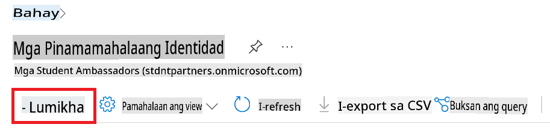

1. Gawin ang mga sumusunod na hakbang:

    - Piliin ang iyong Azure **Subscription**.
    - Piliin ang **Resource group** na gagamitin (gumawa ng bago kung kinakailangan).
    - Piliin ang **Region** na nais mong gamitin.
    - Ipasok ang **Name**. Dapat itong natatanging halaga.

    

1. Piliin ang **Review + create**.

1. Piliin ang **+ Create**.

#### Magdagdag ng Contributor role assignment sa Managed Identity

1. Mag-navigate sa Managed Identity resource na iyong ginawa.

1. Piliin ang **Azure role assignments** mula sa kaliwang tab.

1. Piliin ang **+Add role assignment** mula sa navigation menu.

1. Sa loob ng Add role assignment page, gawin ang mga sumusunod na hakbang:
    - Piliin ang **Scope** sa **Resource group**.
    - Piliin ang iyong Azure **Subscription**.
    - Piliin ang **Resource group** na gagamitin.
    - Piliin ang **Role** sa **Contributor**.

    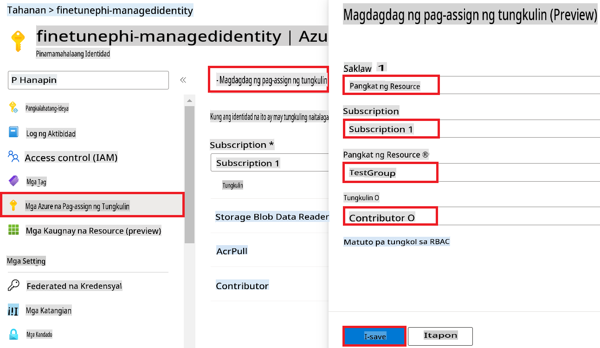

2. Piliin ang **Save**.

#### Magdagdag ng Storage Blob Data Reader role assignment sa Managed Identity

1. I-type ang *storage accounts* sa **search bar** sa itaas ng portal page at piliin ang **Storage accounts** mula sa mga opsyon na lalabas.

    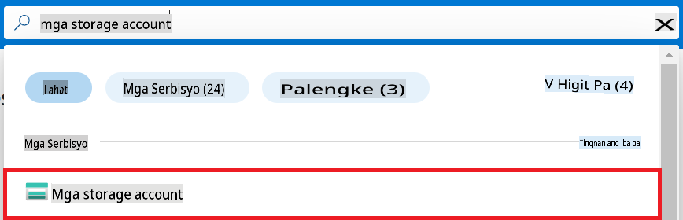

1. Piliin ang storage account na kaugnay ng Azure Machine Learning workspace na iyong ginawa. Halimbawa, *finetunephistorage*.

1. Gawin ang mga sumusunod na hakbang upang mag-navigate sa Add role assignment page:

    - Mag-navigate sa Azure Storage account na iyong ginawa.
    - Piliin ang **Access Control (IAM)** mula sa kaliwang tab.
    - Piliin ang **+ Add** mula sa navigation menu.
    - Piliin ang **Add role assignment** mula sa navigation menu.

    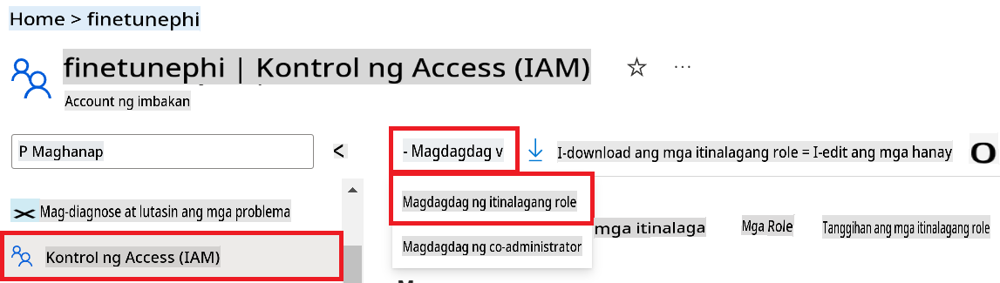

1. Sa loob ng Add role assignment page, gawin ang mga sumusunod na hakbang:

    - Sa Role page, i-type ang *Storage Blob Data Reader* sa **search bar** at piliin ang **Storage Blob Data Reader** mula sa mga opsyon na lalabas.
    - Sa Role page, piliin ang **Next**.
    - Sa Members page, piliin ang **Assign access to** **Managed identity**.
    - Sa Members page, piliin ang **+ Select members**.
    - Sa Select managed identities page, piliin ang iyong Azure **Subscription**.
    - Sa Select managed identities page, piliin ang **Managed identity** sa **Manage Identity**.
    - Sa Select managed identities page, piliin ang Managed Identity na iyong ginawa. Halimbawa, *finetunephi-managedidentity*.
    - Sa Select managed identities page, piliin ang **Select**.

    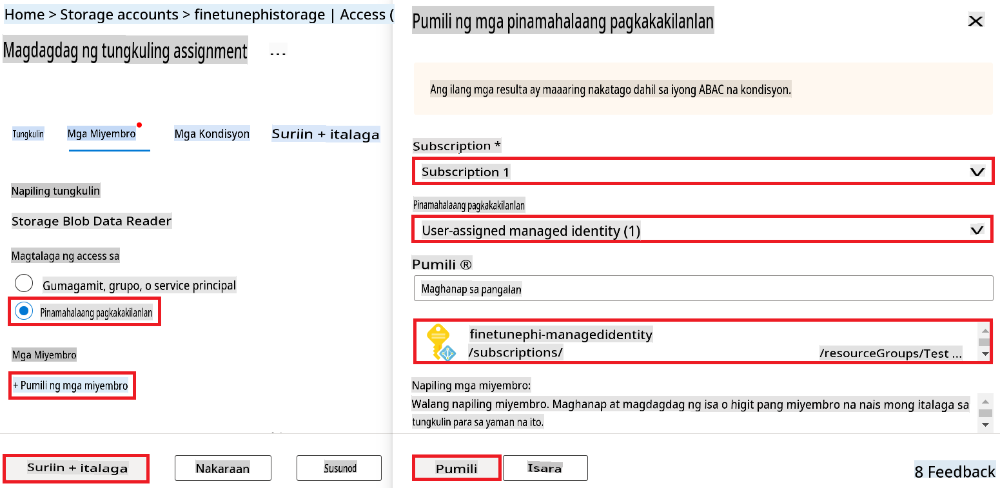

1. Piliin ang **Review + assign**.

#### Magdagdag ng AcrPull role assignment sa Managed Identity

1. I-type ang *container registries* sa **search bar** sa itaas ng portal page at piliin ang **Container registries** mula sa mga opsyon na lalabas.

    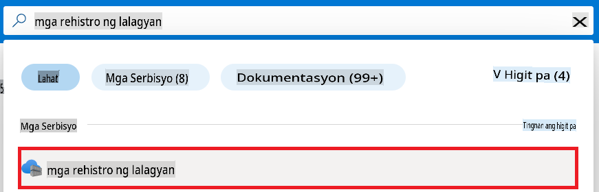

1. Piliin ang container registry na kaugnay ng Azure Machine Learning workspace. Halimbawa, *finetunephicontainerregistry*.

1. Gawin ang mga sumusunod na hakbang upang mag-navigate sa Add role assignment page:

    - Piliin ang **Access Control (IAM)** mula sa kaliwang tab.
    - Piliin ang **+ Add** mula sa navigation menu.
    - Piliin ang **Add role assignment** mula sa navigation menu.

1. Sa loob ng Add role assignment page, gawin ang mga sumusunod na hakbang:

    - Sa Role page, i-type ang *AcrPull* sa **search bar** at piliin ang **AcrPull** mula sa mga opsyon na lalabas.
    - Sa Role page, piliin ang **Next**.
    - Sa Members page, piliin ang **Assign access to** **Managed identity**.
    - Sa Members page, piliin ang **+ Select members**.
    - Sa Select managed identities page, piliin ang iyong Azure **Subscription**.
    - Sa Select managed identities page, piliin ang **Managed identity** sa **Manage Identity**.
    - Sa Select managed identities page, piliin ang Managed Identity na iyong ginawa. Halimbawa, *finetunephi-managedidentity*.
    - Sa Select managed identities page, piliin ang **Select**.
    - Piliin ang **Review + assign**.

### I-set up ang proyekto

Upang ma-download ang mga datasets na kinakailangan para sa fine-tuning, magse-set up ka ng lokal na environment.

Sa exercise na ito, ikaw ay:

- Gumawa ng folder para sa iyong trabaho.
- Gumawa ng virtual environment.
- Mag-install ng mga kinakailangang package.
- Gumawa ng *download_dataset.py* file para ma-download ang dataset.

#### Gumawa ng folder para sa iyong trabaho

1. Buksan ang isang terminal window at i-type ang sumusunod na command upang gumawa ng folder na pinangalanang *finetune-phi* sa default na path.

    ```console
    mkdir finetune-phi
    ```

2. I-type ang sumusunod na command sa iyong terminal upang mag-navigate sa *finetune-phi* folder na iyong ginawa.

    ```console
    cd finetune-phi
    ```

#### Gumawa ng virtual environment

1. I-type ang sumusunod na command sa iyong terminal upang gumawa ng virtual environment na pinangalanang *.venv*.

    ```console
    python -m venv .venv
    ```

2. I-type ang sumusunod na command sa iyong terminal upang i-activate ang virtual environment.

    ```console
    .venv\Scripts\activate.bat
    ```

> [!NOTE]
> Kung gumana ito, dapat mong makita ang *(.venv)* bago ang command prompt.

#### Mag-install ng mga kinakailangang package

1. I-type ang sumusunod na mga command sa iyong terminal upang mai-install ang mga kinakailangang package.

    ```console
    pip install datasets==2.19.1
    ```

#### Gumawa ng `download_dataset.py`

> [!NOTE]
> Buong istruktura ng folder:
>
> ```text
> └── YourUserName
> .    └── finetune-phi
> .        └── download_dataset.py
> ```

1. Buksan ang **Visual Studio Code**.

1. Piliin ang **File** mula sa menu bar.

1. Piliin ang **Open Folder**.

1. Piliin ang *finetune-phi* folder na iyong ginawa, na matatagpuan sa *C:\Users\yourUserName\finetune-phi*.

    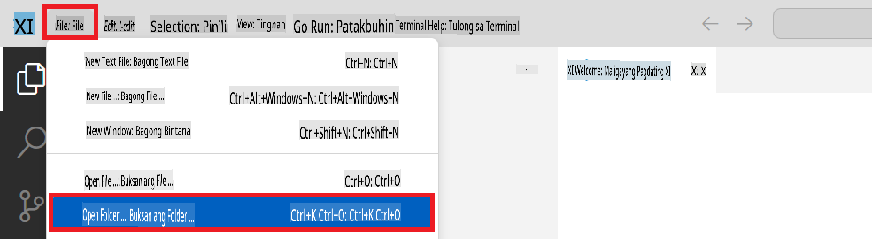

1. Sa kaliwang pane ng Visual Studio Code, i-right-click at piliin ang **New File** upang gumawa ng bagong file na pinangalanang *download_dataset.py*.

    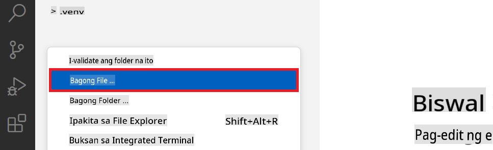

### Maghanda ng dataset para sa fine-tuning

Sa exercise na ito, tatakbo mo ang *download_dataset.py* file upang ma-download ang *ultrachat_200k* datasets sa iyong lokal na environment. Gagamitin mo ang datasets na ito upang ma-fine-tune ang Phi-3 model sa Azure Machine Learning.

Sa exercise na ito, ikaw ay:

- Magdagdag ng code sa *download_dataset.py* file upang ma-download ang datasets.
- Patakbuhin ang *download_dataset.py* file upang ma-download ang datasets sa iyong lokal na environment.

#### I-download ang iyong dataset gamit ang *download_dataset.py*

1. Buksan ang *download_dataset.py* file sa Visual Studio Code.

1. Idagdag ang sumusunod na code sa *download_dataset.py* file.

    ```python
    import json
    import os
    from datasets import load_dataset

    def load_and_split_dataset(dataset_name, config_name, split_ratio):
        """
        Load and split a dataset.
        """
        # Load the dataset with the specified name, configuration, and split ratio
        dataset = load_dataset(dataset_name, config_name, split=split_ratio)
        print(f"Original dataset size: {len(dataset)}")
        
        # Split the dataset into train and test sets (80% train, 20% test)
        split_dataset = dataset.train_test_split(test_size=0.2)
        print(f"Train dataset size: {len(split_dataset['train'])}")
        print(f"Test dataset size: {len(split_dataset['test'])}")
        
        return split_dataset

    def save_dataset_to_jsonl(dataset, filepath):
        """
        Save a dataset to a JSONL file.
        """
        # Create the directory if it does not exist
        os.makedirs(os.path.dirname(filepath), exist_ok=True)
        
        # Open the file in write mode
        with open(filepath, 'w', encoding='utf-8') as f:
            # Iterate over each record in the dataset
            for record in dataset:
                # Dump the record as a JSON object and write it to the file
                json.dump(record, f)
                # Write a newline character to separate records
                f.write('\n')
        
        print(f"Dataset saved to {filepath}")

    def main():
        """
        Main function to load, split, and save the dataset.
        """
        # Load and split the ULTRACHAT_200k dataset with a specific configuration and split ratio
        dataset = load_and_split_dataset("HuggingFaceH4/ultrachat_200k", 'default', 'train_sft[:1%]')
        
        # Extract the train and test datasets from the split
        train_dataset = dataset['train']
        test_dataset = dataset['test']

        # Save the train dataset to a JSONL file
        save_dataset_to_jsonl(train_dataset, "data/train_data.jsonl")
        
        # Save the test dataset to a separate JSONL file
        save_dataset_to_jsonl(test_dataset, "data/test_data.jsonl")

    if __name__ == "__main__":
        main()

    ```

1. I-type ang sumusunod na command sa iyong terminal upang patakbuhin ang script at ma-download ang dataset sa iyong lokal na environment.

    ```console
    python download_dataset.py
    ```

1. Siguraduhin na ang datasets ay matagumpay na na-save sa iyong lokal na *finetune-phi/data* directory.

> [!NOTE]
>
> #### Paalala ukol sa laki ng dataset at oras ng fine-tuning
>
> Sa tutorial na ito, gagamit ka lamang ng 1% ng dataset (`split='train[:1%]'`). Malaki ang nababawas nito sa dami ng data, na nagpapabilis sa parehong upload at fine-tuning na proseso. Maaari mong ayusin ang porsyento upang mahanap ang tamang balanse sa pagitan ng oras ng training at performance ng modelo. Ang paggamit ng mas maliit na bahagi ng dataset ay nagpapababa ng oras na kinakailangan para sa fine-tuning, na ginagawang mas madali ang proseso para sa tutorial.

## Scenario 2: I-fine-tune ang Phi-3 model at I-deploy sa Azure Machine Learning Studio

### I-fine-tune ang Phi-3 model

Sa exercise na ito, i-fine-tune mo ang Phi-3 model sa Azure Machine Learning Studio.

Sa exercise na ito, ikaw ay:

- Gumawa ng computer cluster para sa fine-tuning.
- I-fine-tune ang
1. Bisitahin ang [Azure ML Studio](https://ml.azure.com/home?wt.mc_id=studentamb_279723).

1. Piliin ang **Compute** mula sa kaliwang bahagi ng tab.

1. Piliin ang **Compute clusters** mula sa navigation menu.

1. Piliin ang **+ New**.

    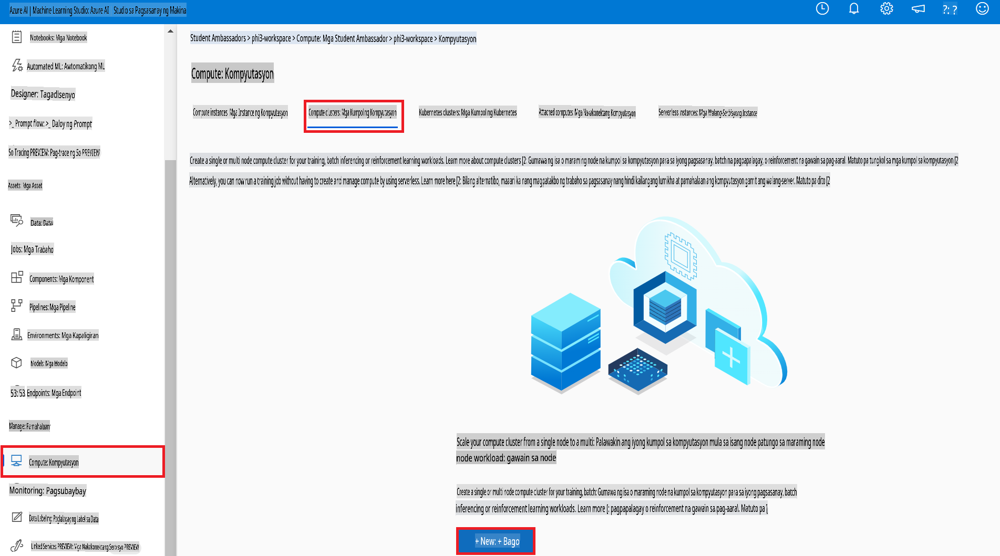

1. Gawin ang mga sumusunod na hakbang:

    - Piliin ang **Region** na nais mong gamitin.
    - Piliin ang **Virtual machine tier** na **Dedicated**.
    - Piliin ang **Virtual machine type** na **GPU**.
    - Piliin ang **Virtual machine size** filter na **Select from all options**.
    - Piliin ang **Virtual machine size** na **Standard_NC24ads_A100_v4**.

    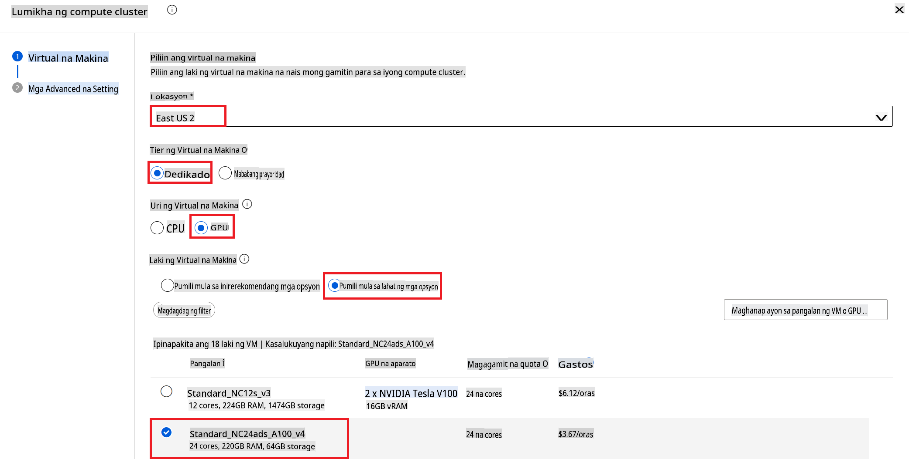

1. Piliin ang **Next**.

1. Gawin ang mga sumusunod na hakbang:

    - I-enter ang **Compute name**. Dapat itong natatanging halaga.
    - Piliin ang **Minimum number of nodes** na **0**.
    - Piliin ang **Maximum number of nodes** na **1**.
    - Piliin ang **Idle seconds before scale down** na **120**.

    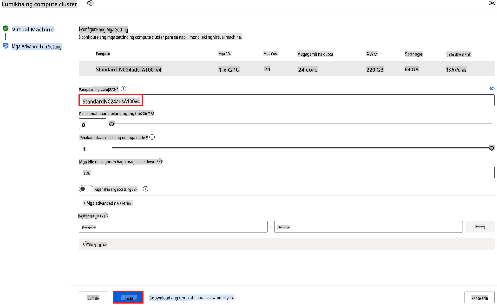

1. Piliin ang **Create**.

#### I-fine-tune ang Phi-3 model

1. Bisitahin ang [Azure ML Studio](https://ml.azure.com/home?wt.mc_id=studentamb_279723).

1. Piliin ang Azure Machine Learning workspace na ginawa mo.

    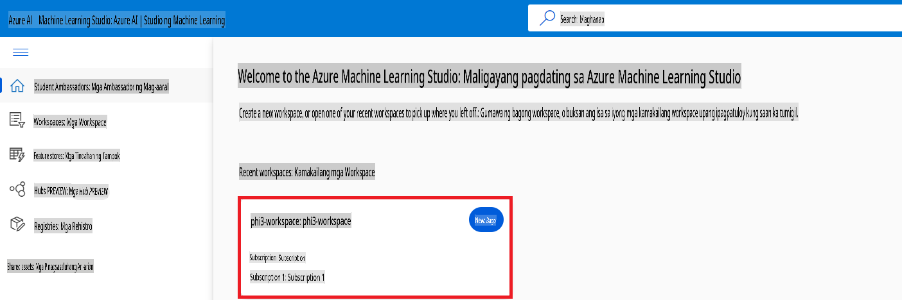

1. Gawin ang mga sumusunod na hakbang:

    - Piliin ang **Model catalog** mula sa kaliwang bahagi ng tab.
    - I-type ang *phi-3-mini-4k* sa **search bar** at piliin ang **Phi-3-mini-4k-instruct** mula sa mga opsyon na lumitaw.

    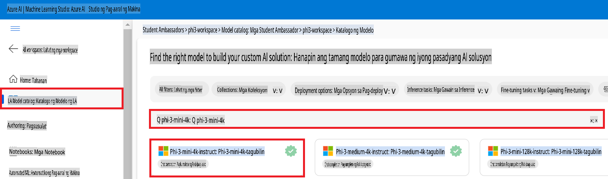

1. Piliin ang **Fine-tune** mula sa navigation menu.

    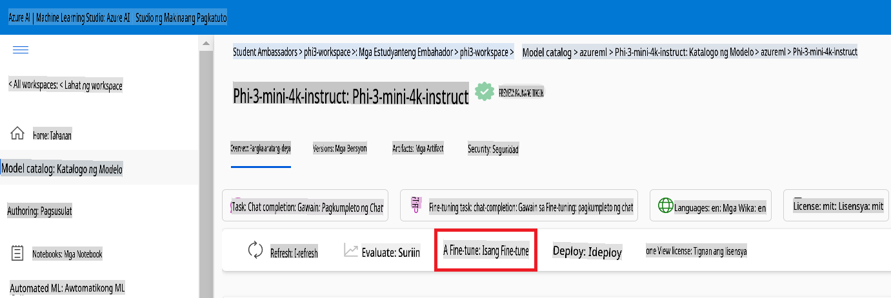

1. Gawin ang mga sumusunod na hakbang:

    - Piliin ang **Select task type** na **Chat completion**.
    - Piliin ang **+ Select data** para mag-upload ng **Training data**.
    - Piliin ang Validation data upload type na **Provide different validation data**.
    - Piliin ang **+ Select data** para mag-upload ng **Validation data**.

    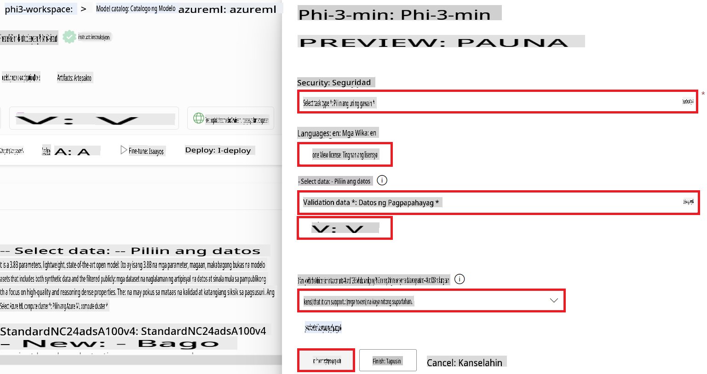

    > [!TIP]
    >
    > Maaari mong piliin ang **Advanced settings** para i-customize ang mga configuration tulad ng **learning_rate** at **lr_scheduler_type** upang ma-optimize ang proseso ng fine-tuning ayon sa iyong mga pangangailangan.

1. Piliin ang **Finish**.

1. Sa ehersisyong ito, matagumpay mong na-fine-tune ang Phi-3 model gamit ang Azure Machine Learning. Tandaan na ang proseso ng fine-tuning ay maaaring tumagal ng mahabang oras. Pagkatapos patakbuhin ang fine-tuning job, kailangan mong hintayin itong matapos. Maaari mong i-monitor ang status ng fine-tuning job sa pamamagitan ng pag-navigate sa Jobs tab sa kaliwang bahagi ng iyong Azure Machine Learning Workspace. Sa susunod na serye, ide-deploy mo ang fine-tuned na model at i-integrate ito sa Prompt flow.

    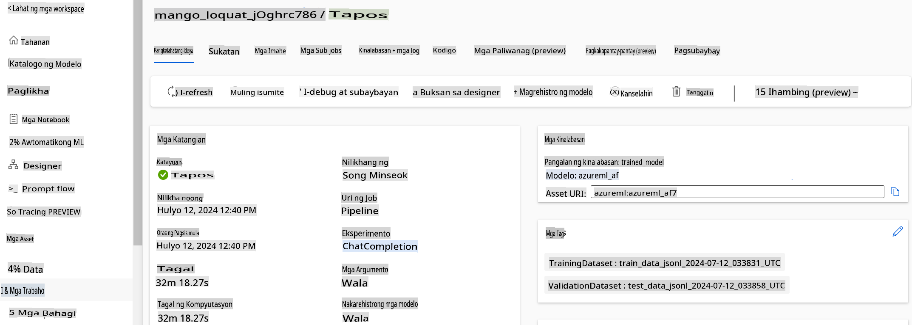

### I-deploy ang fine-tuned na Phi-3 model

Upang ma-integrate ang fine-tuned Phi-3 model sa Prompt flow, kailangan mong i-deploy ang model upang magamit ito para sa real-time inference. Kasama sa prosesong ito ang pagrehistro ng model, paggawa ng online endpoint, at pag-deploy ng model.

Sa ehersisyong ito, gagawin mo ang mga sumusunod:

- Irehistro ang fine-tuned na model sa Azure Machine Learning workspace.
- Gumawa ng online endpoint.
- I-deploy ang na-rehistrong fine-tuned Phi-3 model.

#### Irehistro ang fine-tuned na model

1. Bisitahin ang [Azure ML Studio](https://ml.azure.com/home?wt.mc_id=studentamb_279723).

1. Piliin ang Azure Machine Learning workspace na ginawa mo.

    

1. Piliin ang **Models** mula sa kaliwang bahagi ng tab.
1. Piliin ang **+ Register**.
1. Piliin ang **From a job output**.

    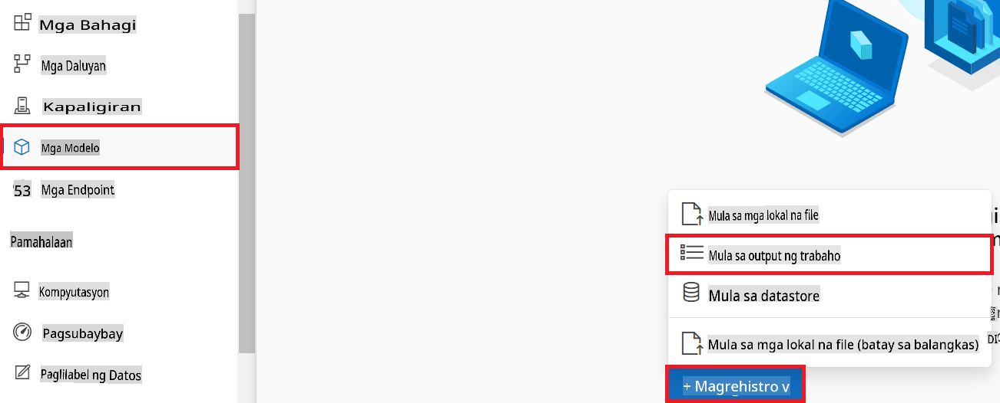

1. Piliin ang job na ginawa mo.

    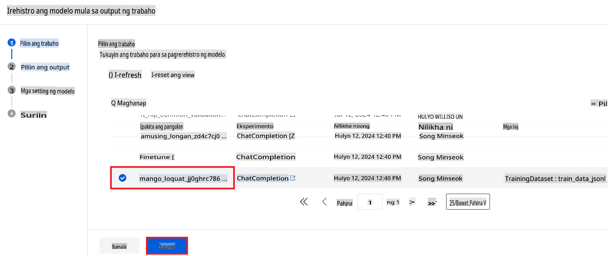

1. Piliin ang **Next**.

1. Piliin ang **Model type** na **MLflow**.

1. Siguraduhing nakapili ng **Job output**; dapat itong awtomatikong napili.

    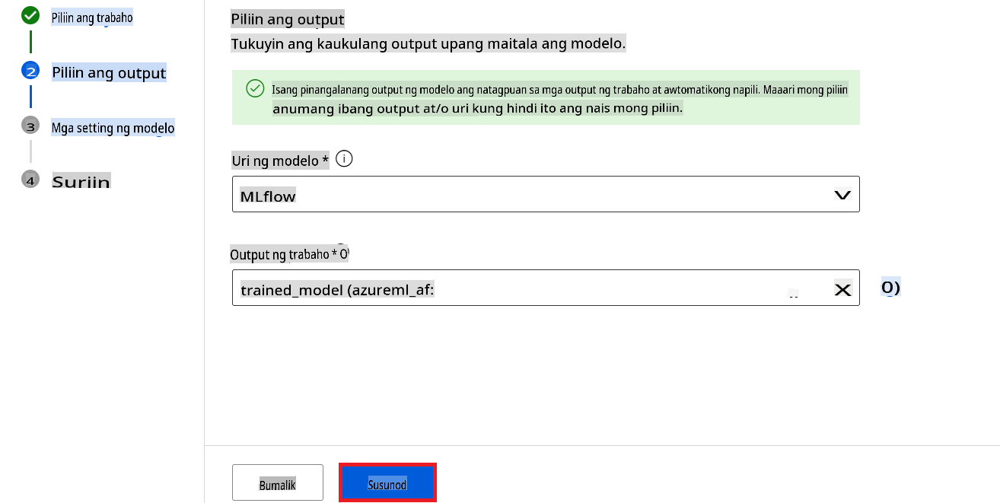

2. Piliin ang **Next**.

3. Piliin ang **Register**.

    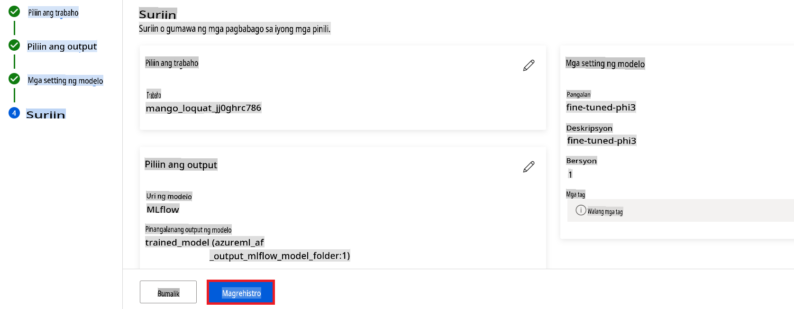

4. Maaari mong makita ang iyong na-rehistrong model sa pamamagitan ng pag-navigate sa **Models** menu mula sa kaliwang bahagi ng tab.

    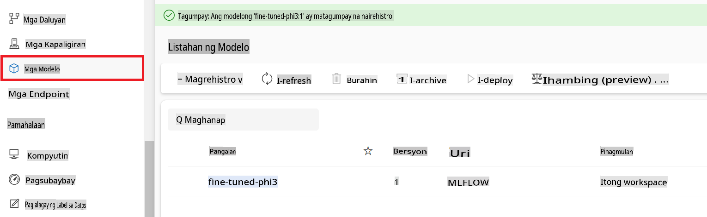

#### I-deploy ang fine-tuned na model

1. Mag-navigate sa Azure Machine Learning workspace na ginawa mo.

1. Piliin ang **Endpoints** mula sa kaliwang bahagi ng tab.

1. Piliin ang **Real-time endpoints** mula sa navigation menu.

    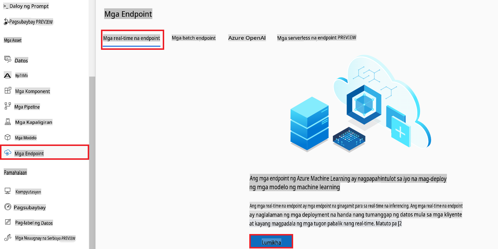

1. Piliin ang **Create**.

1. Piliin ang na-rehistrong model na ginawa mo.

    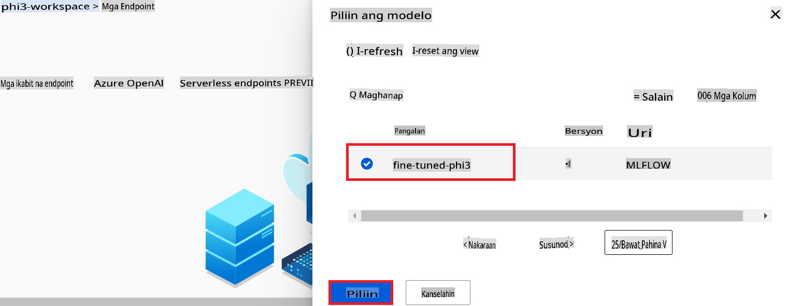

1. Piliin ang **Select**.

1. Gawin ang mga sumusunod na hakbang:

    - Piliin ang **Virtual machine** na *Standard_NC6s_v3*.
    - Piliin ang **Instance count** na nais mong gamitin. Halimbawa, *1*.
    - Piliin ang **Endpoint** na **New** upang gumawa ng endpoint.
    - I-enter ang **Endpoint name**. Dapat itong natatanging halaga.
    - I-enter ang **Deployment name**. Dapat itong natatanging halaga.

    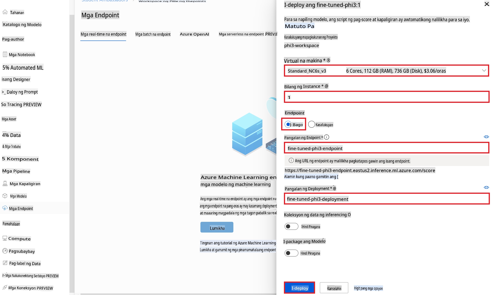

1. Piliin ang **Deploy**.

> [!WARNING]
> Upang maiwasan ang karagdagang singil sa iyong account, siguraduhing i-delete ang ginawa mong endpoint sa Azure Machine Learning workspace.
>

#### Tingnan ang status ng deployment sa Azure Machine Learning Workspace

1. Mag-navigate sa Azure Machine Learning workspace na ginawa mo.

1. Piliin ang **Endpoints** mula sa kaliwang bahagi ng tab.

1. Piliin ang endpoint na ginawa mo.

    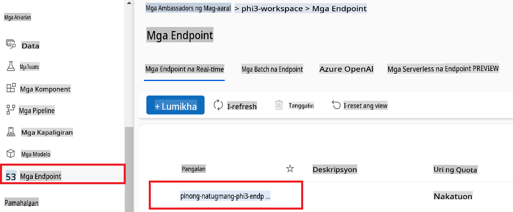

1. Sa pahinang ito, maaari mong pamahalaan ang endpoints habang nasa proseso ng deployment.

> [!NOTE]
> Kapag natapos na ang deployment, siguraduhing ang **Live traffic** ay naka-set sa **100%**. Kung hindi, piliin ang **Update traffic** upang i-adjust ang traffic settings. Tandaan na hindi mo maaaring i-test ang model kung ang traffic ay naka-set sa 0%.
>
> 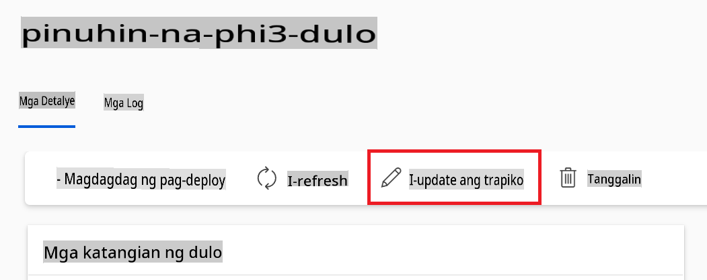
>

## Scenario 3: I-integrate sa Prompt flow at Makipag-chat sa Iyong Custom Model sa Azure AI Foundry

### I-integrate ang custom Phi-3 model sa Prompt flow

Matapos matagumpay na ma-deploy ang iyong fine-tuned na model, maaari mo na itong i-integrate sa Prompt Flow upang magamit ang iyong model sa real-time applications, na nagbibigay-daan sa iba't ibang interactive na gawain gamit ang iyong custom Phi-3 model.

Sa ehersisyong ito, gagawin mo ang mga sumusunod:

- Gumawa ng Azure AI Foundry Hub.
- Gumawa ng Azure AI Foundry Project.
- Gumawa ng Prompt flow.
- Magdagdag ng custom connection para sa fine-tuned Phi-3 model.
- I-set up ang Prompt flow upang makipag-chat gamit ang iyong custom Phi-3 model.

> [!NOTE]
> Maaari mo ring i-integrate ang Prompt flow gamit ang Azure ML Studio. Ang parehong proseso ng integration ay maaaring i-apply sa Azure ML Studio.

#### Gumawa ng Azure AI Foundry Hub

Kailangan mong gumawa ng Hub bago gumawa ng Project. Ang isang Hub ay nagsisilbing Resource Group, na nagbibigay-daan sa iyo upang ayusin at pamahalaan ang maraming Projects sa loob ng Azure AI Foundry.

1. Bisitahin ang [Azure AI Foundry](https://ai.azure.com/?WT.mc_id=aiml-137032-kinfeylo).

1. Piliin ang **All hubs** mula sa kaliwang bahagi ng tab.

1. Piliin ang **+ New hub** mula sa navigation menu.

    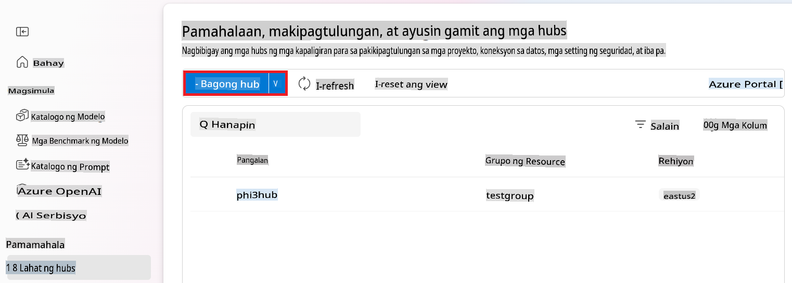

1. Gawin ang mga sumusunod na hakbang:

    - I-enter ang **Hub name**. Dapat itong natatanging halaga.
    - Piliin ang iyong Azure **Subscription**.
    - Piliin ang **Resource group** na gagamitin (gumawa ng bago kung kinakailangan).
    - Piliin ang **Location** na nais mong gamitin.
    - Piliin ang **Connect Azure AI Services** na gagamitin (gumawa ng bago kung kinakailangan).
    - Piliin ang **Connect Azure AI Search** na **Skip connecting**.

    

1. Piliin ang **Next**.

#### Gumawa ng Azure AI Foundry Project

1. Sa Hub na ginawa mo, piliin ang **All projects** mula sa kaliwang bahagi ng tab.

1. Piliin ang **+ New project** mula sa navigation menu.

    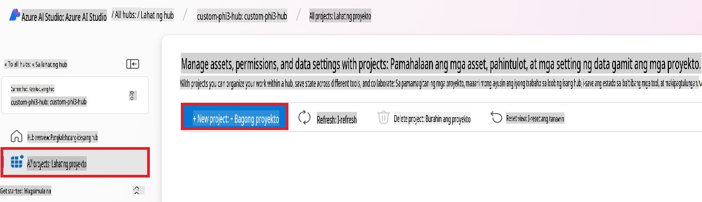

1. I-enter ang **Project name**. Dapat itong natatanging halaga.

    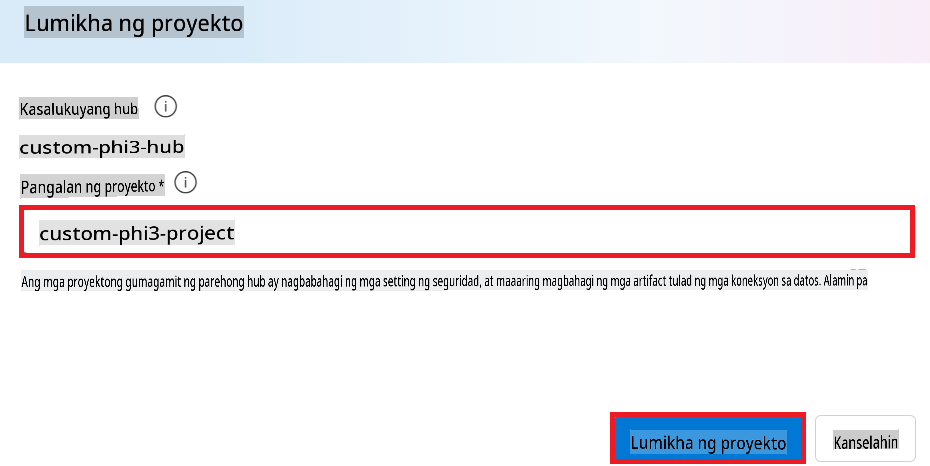

1. Piliin ang **Create a project**.

#### Magdagdag ng custom connection para sa fine-tuned Phi-3 model

Upang ma-integrate ang iyong custom Phi-3 model sa Prompt flow, kailangan mong i-save ang endpoint at key ng model sa isang custom connection. Ang setup na ito ay nagsisiguro ng access sa iyong custom Phi-3 model sa Prompt flow.

#### I-set ang API key at endpoint URI ng fine-tuned Phi-3 model

1. Bisitahin ang [Azure ML Studio](https://ml.azure.com/home?WT.mc_id=aiml-137032-kinfeylo).

1. Mag-navigate sa Azure Machine Learning workspace na ginawa mo.

1. Piliin ang **Endpoints** mula sa kaliwang bahagi ng tab.

    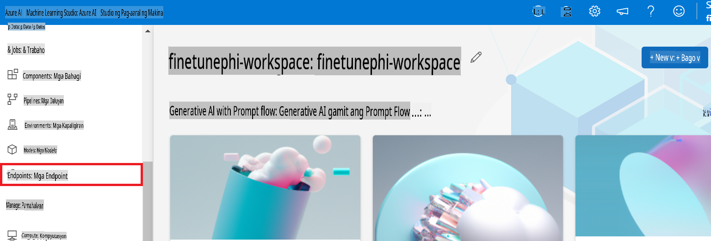

1. Piliin ang endpoint na ginawa mo.

    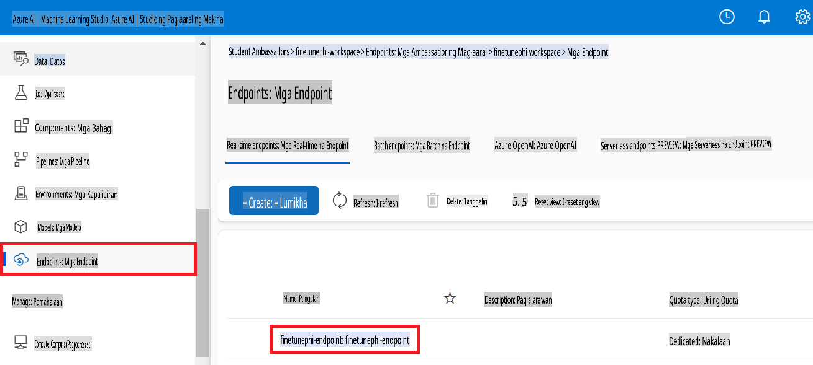

1. Piliin ang **Consume** mula sa navigation menu.

1. Kopyahin ang iyong **REST endpoint** at **Primary key**.
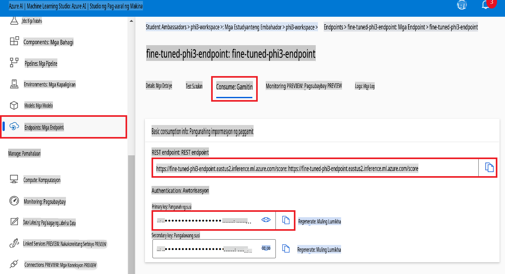

#### Magdagdag ng Custom Connection

1. Bisitahin ang [Azure AI Foundry](https://ai.azure.com/?WT.mc_id=aiml-137032-kinfeylo).

1. Pumunta sa Azure AI Foundry project na iyong ginawa.

1. Sa loob ng Project na iyong ginawa, piliin ang **Settings** mula sa kaliwang bahagi ng tab.

1. Piliin ang **+ New connection**.

    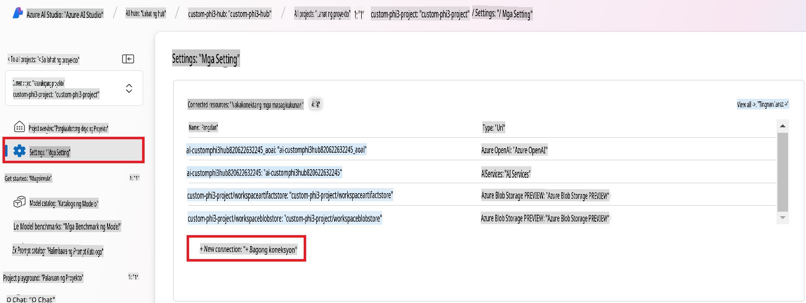

1. Piliin ang **Custom keys** mula sa navigation menu.

    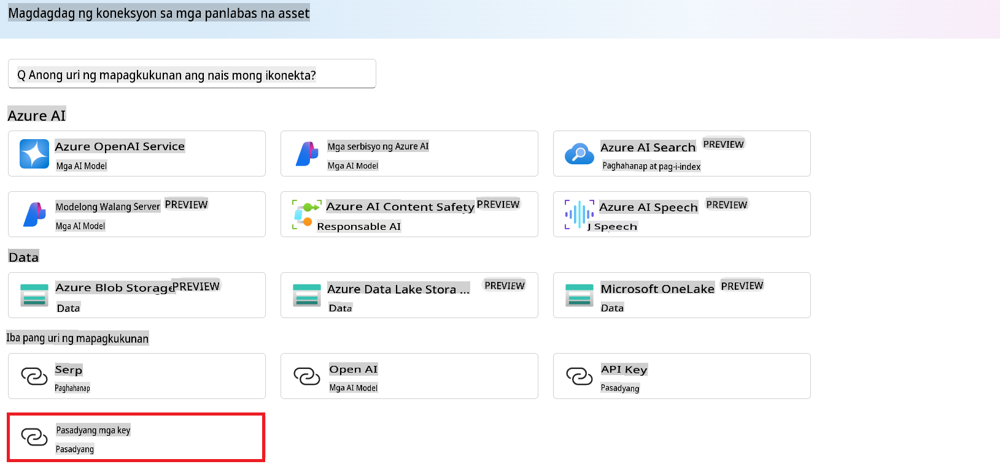

1. Gawin ang mga sumusunod na hakbang:

    - Piliin ang **+ Add key value pairs**.
    - Para sa key name, ilagay ang **endpoint** at i-paste ang endpoint na kinopya mo mula sa Azure ML Studio sa value field.
    - Piliin muli ang **+ Add key value pairs**.
    - Para sa key name, ilagay ang **key** at i-paste ang key na kinopya mo mula sa Azure ML Studio sa value field.
    - Pagkatapos idagdag ang mga key, piliin ang **is secret** upang hindi ma-expose ang key.

    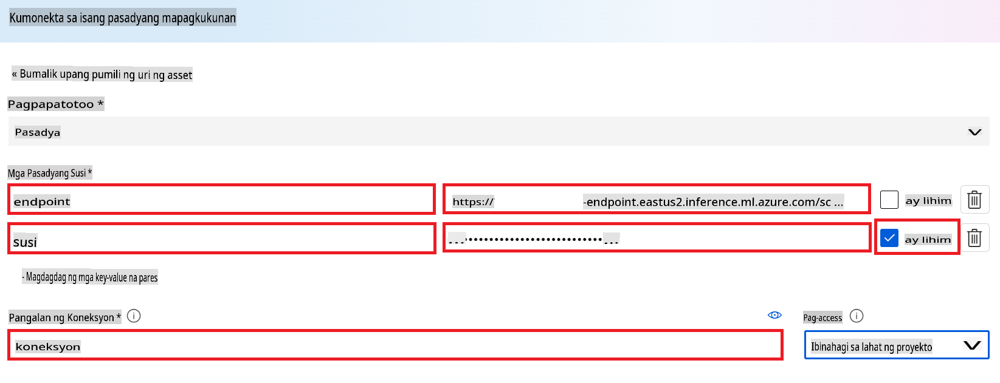

1. Piliin ang **Add connection**.

#### Gumawa ng Prompt flow

Nakagawa ka na ng custom connection sa Azure AI Foundry. Ngayon, gumawa tayo ng Prompt flow gamit ang mga sumusunod na hakbang. Pagkatapos nito, iko-connect mo ang Prompt flow sa custom connection upang magamit ang fine-tuned na modelo sa loob ng Prompt flow.

1. Pumunta sa Azure AI Foundry project na iyong ginawa.

1. Piliin ang **Prompt flow** mula sa kaliwang bahagi ng tab.

1. Piliin ang **+ Create** mula sa navigation menu.

    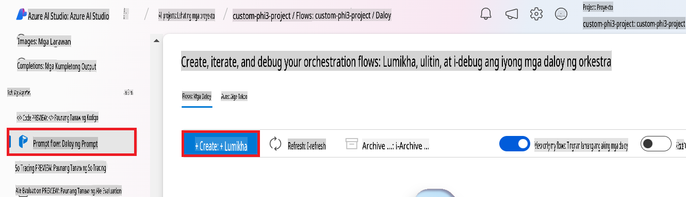

1. Piliin ang **Chat flow** mula sa navigation menu.

    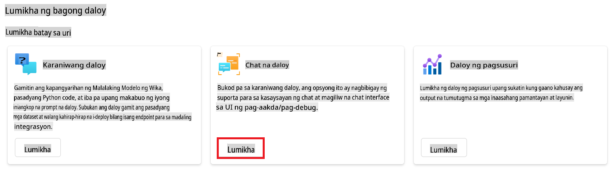

1. I-enter ang **Folder name** na gagamitin.

    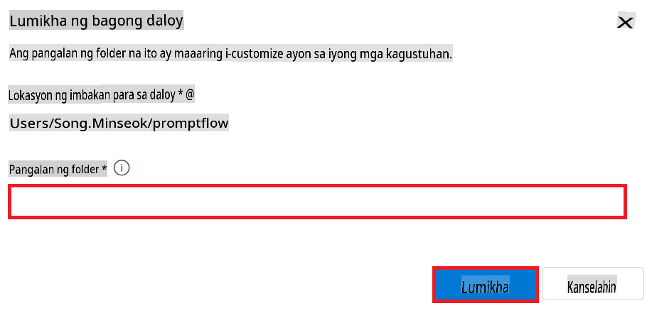

2. Piliin ang **Create**.

#### I-set up ang Prompt flow upang makipag-chat sa iyong custom na Phi-3 model

Kailangan mong i-integrate ang fine-tuned na Phi-3 model sa isang Prompt flow. Gayunpaman, ang umiiral na Prompt flow ay hindi dinisenyo para sa layuning ito. Kaya, kailangan mong muling idisenyo ang Prompt flow upang maisama ang custom na modelo.

1. Sa loob ng Prompt flow, gawin ang mga sumusunod na hakbang upang i-rebuild ang umiiral na flow:

    - Piliin ang **Raw file mode**.
    - Burahin ang lahat ng umiiral na code sa *flow.dag.yml* file.
    - Idagdag ang sumusunod na code sa *flow.dag.yml* file.

        ```yml
        inputs:
          input_data:
            type: string
            default: "Who founded Microsoft?"

        outputs:
          answer:
            type: string
            reference: ${integrate_with_promptflow.output}

        nodes:
        - name: integrate_with_promptflow
          type: python
          source:
            type: code
            path: integrate_with_promptflow.py
          inputs:
            input_data: ${inputs.input_data}
        ```

    - Piliin ang **Save**.

    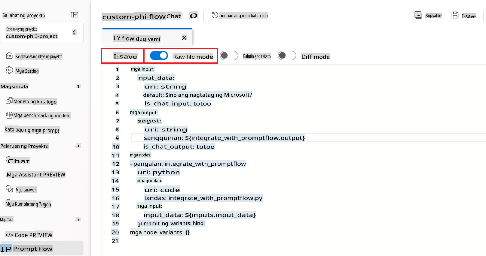

1. Idagdag ang sumusunod na code sa *integrate_with_promptflow.py* file upang magamit ang custom na Phi-3 model sa Prompt flow.

    ```python
    import logging
    import requests
    from promptflow import tool
    from promptflow.connections import CustomConnection

    # Logging setup
    logging.basicConfig(
        format="%(asctime)s - %(levelname)s - %(name)s - %(message)s",
        datefmt="%Y-%m-%d %H:%M:%S",
        level=logging.DEBUG
    )
    logger = logging.getLogger(__name__)

    def query_phi3_model(input_data: str, connection: CustomConnection) -> str:
        """
        Send a request to the Phi-3 model endpoint with the given input data using Custom Connection.
        """

        # "connection" is the name of the Custom Connection, "endpoint", "key" are the keys in the Custom Connection
        endpoint_url = connection.endpoint
        api_key = connection.key

        headers = {
            "Content-Type": "application/json",
            "Authorization": f"Bearer {api_key}"
        }
        data = {
            "input_data": {
                "input_string": [
                    {"role": "user", "content": input_data}
                ],
                "parameters": {
                    "temperature": 0.7,
                    "max_new_tokens": 128
                }
            }
        }
        try:
            response = requests.post(endpoint_url, json=data, headers=headers)
            response.raise_for_status()
            
            # Log the full JSON response
            logger.debug(f"Full JSON response: {response.json()}")

            result = response.json()["output"]
            logger.info("Successfully received response from Azure ML Endpoint.")
            return result
        except requests.exceptions.RequestException as e:
            logger.error(f"Error querying Azure ML Endpoint: {e}")
            raise

    @tool
    def my_python_tool(input_data: str, connection: CustomConnection) -> str:
        """
        Tool function to process input data and query the Phi-3 model.
        """
        return query_phi3_model(input_data, connection)

    ```

    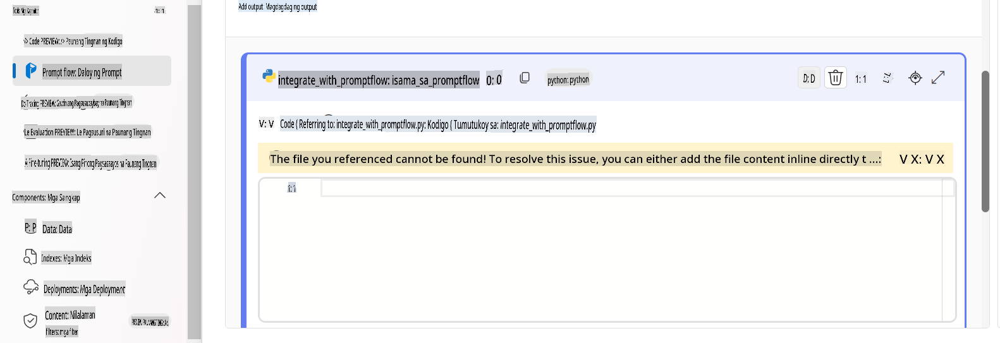

> [!NOTE]
> Para sa mas detalyadong impormasyon tungkol sa paggamit ng Prompt flow sa Azure AI Foundry, maaari mong bisitahin ang [Prompt flow in Azure AI Foundry](https://learn.microsoft.com/azure/ai-studio/how-to/prompt-flow).

1. Piliin ang **Chat input**, **Chat output** upang paganahin ang chat sa iyong modelo.

    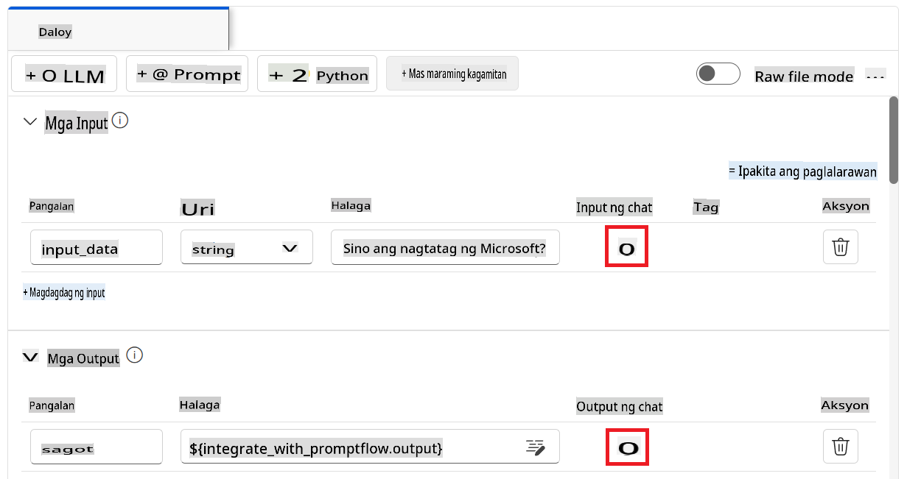

1. Handa ka nang makipag-chat sa iyong custom na Phi-3 model. Sa susunod na exercise, matututunan mo kung paano simulan ang Prompt flow at gamitin ito upang makipag-chat sa iyong fine-tuned na Phi-3 model.

> [!NOTE]
>
> Ang rebuilt na flow ay dapat magmukhang ganito:
>
> 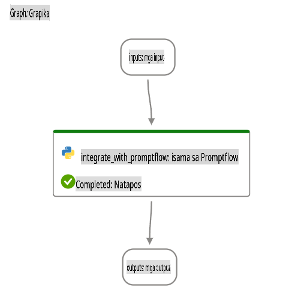
>

### Makipag-chat sa iyong custom na Phi-3 model

Ngayon na na-fine-tune at na-integrate mo ang iyong custom na Phi-3 model sa Prompt flow, handa ka nang makipag-interact dito. Ang exercise na ito ay gagabay sa iyo kung paano i-set up at simulan ang chat gamit ang iyong modelo sa pamamagitan ng Prompt flow. Sa pagsunod sa mga hakbang na ito, magagamit mo nang buo ang kakayahan ng iyong fine-tuned na Phi-3 model para sa iba't ibang gawain at usapan.

- Makipag-chat sa iyong custom na Phi-3 model gamit ang Prompt flow.

#### Simulan ang Prompt flow

1. Piliin ang **Start compute sessions** upang simulan ang Prompt flow.

    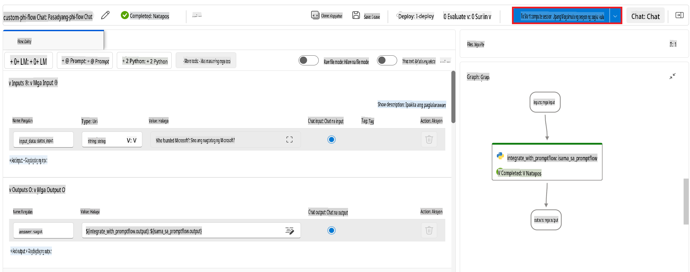

1. Piliin ang **Validate and parse input** upang i-renew ang mga parameter.

    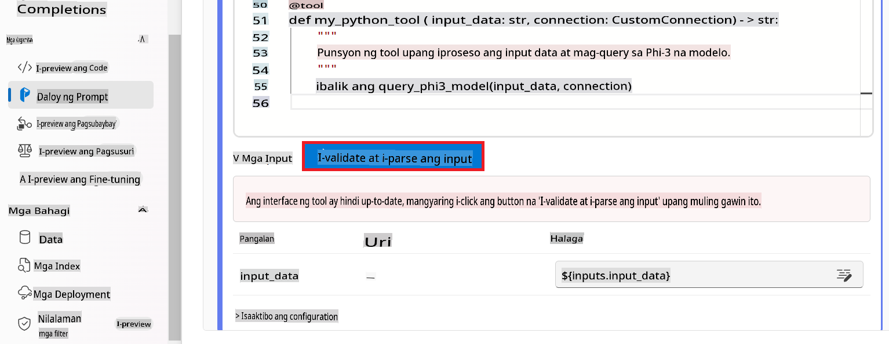

1. Piliin ang **Value** ng **connection** sa custom connection na iyong ginawa. Halimbawa, *connection*.

    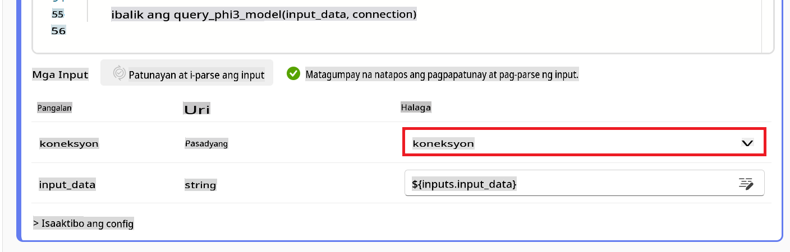

#### Makipag-chat sa iyong custom na modelo

1. Piliin ang **Chat**.

    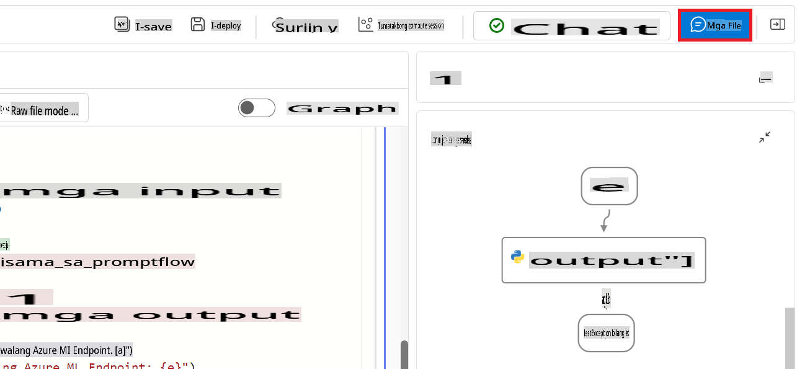

1. Narito ang isang halimbawa ng mga resulta: Maaari ka nang makipag-chat sa iyong custom na Phi-3 model. Inirerekomenda na magtanong ng mga tanong batay sa datos na ginamit para sa fine-tuning.

    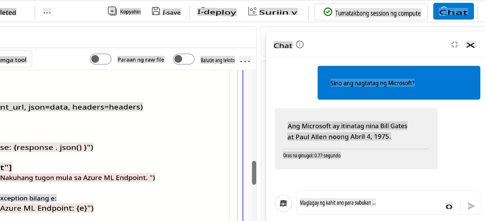

**Paunawa**:  
Ang dokumentong ito ay isinalin gamit ang mga serbisyo ng AI na batay sa makina. Bagama't nagsusumikap kami para sa kawastuhan, mangyaring tandaan na ang mga awtomatikong pagsasalin ay maaaring maglaman ng mga pagkakamali o kamalian. Ang orihinal na dokumento sa sarili nitong wika ang dapat ituring na mapagkakatiwalaang pinagmulan. Para sa mahalagang impormasyon, inirerekomenda ang propesyonal na pagsasalin ng tao. Hindi kami mananagot sa anumang hindi pagkakaunawaan o maling interpretasyon na dulot ng paggamit ng pagsasaling ito.