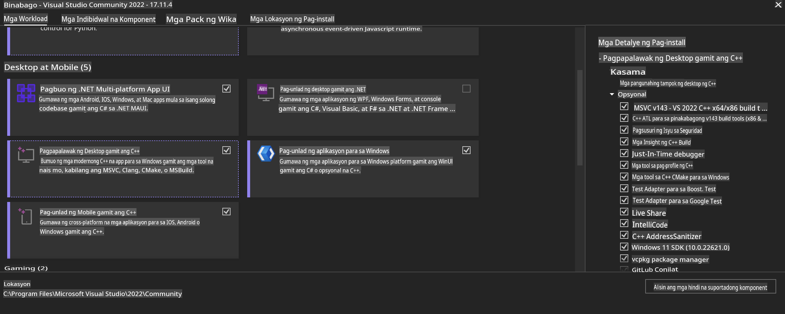
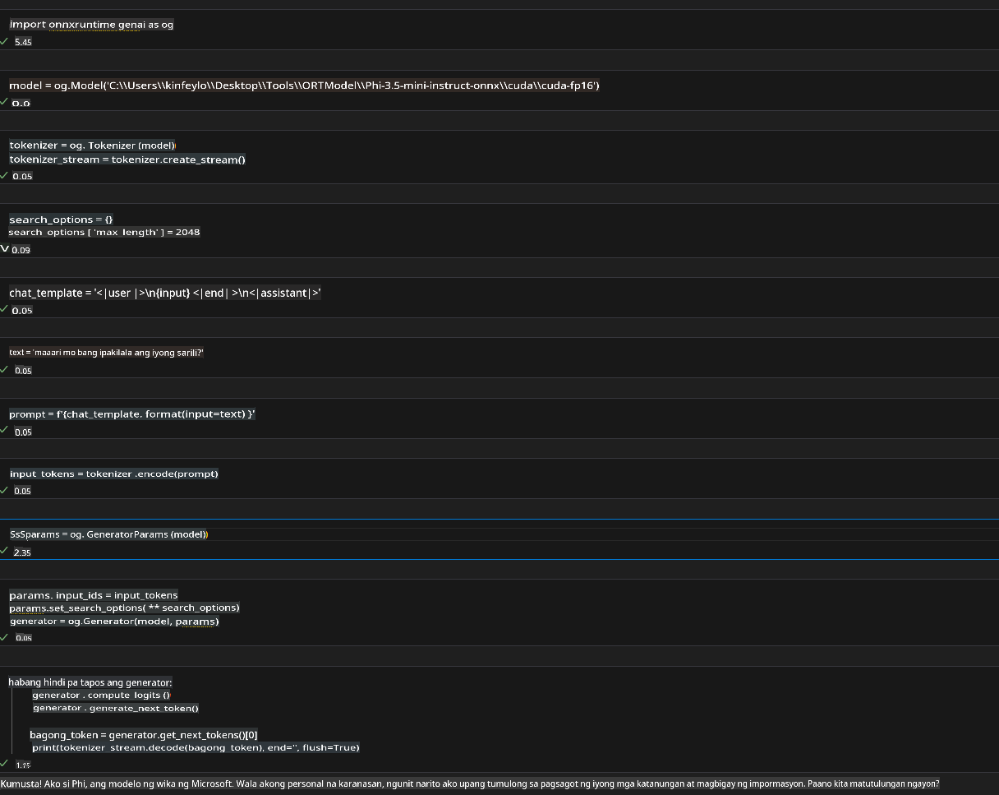

# **Patnubay para sa OnnxRuntime GenAI Windows GPU**

Ang patnubay na ito ay nagbibigay ng mga hakbang para sa pag-set up at paggamit ng ONNX Runtime (ORT) gamit ang GPUs sa Windows. Layunin nitong tulungan kang mapakinabangan ang GPU acceleration para sa iyong mga modelo, na nagpapabuti sa pagganap at kahusayan.

Ang dokumentong ito ay nagbibigay ng gabay sa:

- Pagsasaayos ng Kapaligiran: Mga tagubilin sa pag-install ng mga kinakailangang dependencies tulad ng CUDA, cuDNN, at ONNX Runtime.
- Konpigurasyon: Paano i-configure ang kapaligiran at ONNX Runtime upang mahusay na magamit ang mga GPU resources.
- Mga Tip sa Pag-optimize: Mga payo kung paano i-fine-tune ang iyong GPU settings para sa pinakamainam na pagganap.

### **1. Python 3.10.x /3.11.8**

   ***Tandaan*** Inirerekomenda ang paggamit ng [miniforge](https://github.com/conda-forge/miniforge/releases/latest/download/Miniforge3-Windows-x86_64.exe) bilang iyong Python environment.

   ```bash

   conda create -n pydev python==3.11.8

   conda activate pydev

   ```

   ***Paalala*** Kung naka-install ka na ng anumang Python ONNX library, mangyaring i-uninstall ito.

### **2. I-install ang CMake gamit ang winget**

   ```bash

   winget install -e --id Kitware.CMake

   ```

### **3. I-install ang Visual Studio 2022 - Desktop Development with C++**

   ***Tandaan*** Kung ayaw mong mag-compile, maaari mong laktawan ang hakbang na ito.



### **4. I-install ang NVIDIA Driver**

1. **NVIDIA GPU Driver**  [https://www.nvidia.com/en-us/drivers/](https://www.nvidia.com/en-us/drivers/)

2. **NVIDIA CUDA 12.4** [https://developer.nvidia.com/cuda-12-4-0-download-archive](https://developer.nvidia.com/cuda-12-4-0-download-archive)

3. **NVIDIA CUDNN 9.4**  [https://developer.nvidia.com/cudnn-downloads](https://developer.nvidia.com/cudnn-downloads)

***Paalala*** Gumamit ng default settings sa proseso ng pag-install.

### **5. I-set ang NVIDIA Env**

Kopyahin ang NVIDIA CUDNN 9.4 lib, bin, include sa NVIDIA CUDA 12.4 lib, bin, include.

- kopyahin ang *'C:\Program Files\NVIDIA\CUDNN\v9.4\bin\12.6'* na mga file papunta sa *'C:\Program Files\NVIDIA GPU Computing Toolkit\CUDA\v12.4\bin'*

- kopyahin ang *'C:\Program Files\NVIDIA\CUDNN\v9.4\include\12.6'* na mga file papunta sa *'C:\Program Files\NVIDIA GPU Computing Toolkit\CUDA\v12.4\include'*

- kopyahin ang *'C:\Program Files\NVIDIA\CUDNN\v9.4\lib\12.6'* na mga file papunta sa *'C:\Program Files\NVIDIA GPU Computing Toolkit\CUDA\v12.4\lib\x64'*

### **6. I-download ang Phi-3.5-mini-instruct-onnx**

   ```bash

   winget install -e --id Git.Git

   winget install -e --id GitHub.GitLFS

   git lfs install

   git clone https://huggingface.co/microsoft/Phi-3.5-mini-instruct-onnx

   ```

### **7. Patakbuhin ang InferencePhi35Instruct.ipynb**

   Buksan ang [Notebook](../../../../../../code/09.UpdateSamples/Aug/ortgpu-phi35-instruct.ipynb) at isagawa ito.



### **8. I-compile ang ORT GenAI GPU**

   ***Tandaan*** 
   
   1. Mangyaring i-uninstall muna ang lahat ng may kaugnayan sa onnx, onnxruntime, at onnxruntime-genai.

   ```bash

   pip list 
   
   ```

   Pagkatapos ay i-uninstall ang lahat ng onnxruntime libraries, halimbawa:

   ```bash

   pip uninstall onnxruntime

   pip uninstall onnxruntime-genai

   pip uninstall onnxruntume-genai-cuda
   
   ```

   2. Suriin ang suporta para sa Visual Studio Extension.

   Tingnan ang C:\Program Files\NVIDIA GPU Computing Toolkit\CUDA\v12.4\extras upang tiyakin na ang C:\Program Files\NVIDIA GPU Computing Toolkit\CUDA\v12.4\extras\visual_studio_integration ay naroroon. 

   Kung wala ito, hanapin ito sa iba pang mga folder ng Cuda toolkit driver at kopyahin ang visual_studio_integration folder at mga nilalaman nito sa C:\Program Files\NVIDIA GPU Computing Toolkit\CUDA\v12.4\extras\visual_studio_integration.

   - Kung ayaw mong mag-compile, maaari mong laktawan ang hakbang na ito.

   ```bash

   git clone https://github.com/microsoft/onnxruntime-genai

   ```

   - I-download ang [https://github.com/microsoft/onnxruntime/releases/download/v1.19.2/onnxruntime-win-x64-gpu-1.19.2.zip](https://github.com/microsoft/onnxruntime/releases/download/v1.19.2/onnxruntime-win-x64-gpu-1.19.2.zip)

   - I-extract ang onnxruntime-win-x64-gpu-1.19.2.zip at palitan ang pangalan nito bilang **ort**, pagkatapos ay kopyahin ang ort folder sa onnxruntime-genai.

   - Gamit ang Windows Terminal, pumunta sa Developer Command Prompt para sa VS 2022 at pumunta sa onnxruntime-genai.


   - I-compile ito gamit ang iyong Python environment.

   ```bash

   cd onnxruntime-genai

   python build.py --use_cuda  --cuda_home "C:\Program Files\NVIDIA GPU Computing Toolkit\CUDA\v12.4" --config Release
 

   cd build/Windows/Release/Wheel

   pip install .whl

   ```

**Paunawa**:  
Ang dokumentong ito ay isinalin gamit ang mga serbisyo ng AI na nakabatay sa makina. Habang sinisikap naming maging tumpak, pakitandaan na ang mga awtomatikong pagsasalin ay maaaring maglaman ng mga pagkakamali o hindi tumpak na impormasyon. Ang orihinal na dokumento sa sariling wika nito ang dapat ituring na opisyal na pinagmulan. Para sa mahalagang impormasyon, inirerekomenda ang propesyonal na pagsasalin ng tao. Wala kaming pananagutan sa anumang hindi pagkakaunawaan o maling interpretasyon na maaaring magmula sa paggamit ng pagsasaling ito.