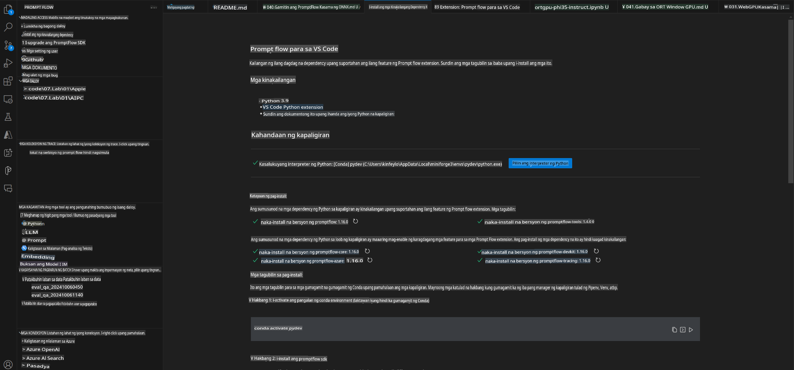
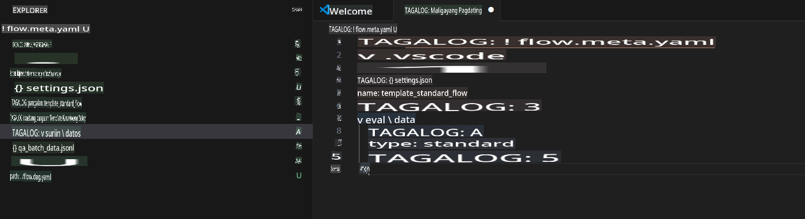
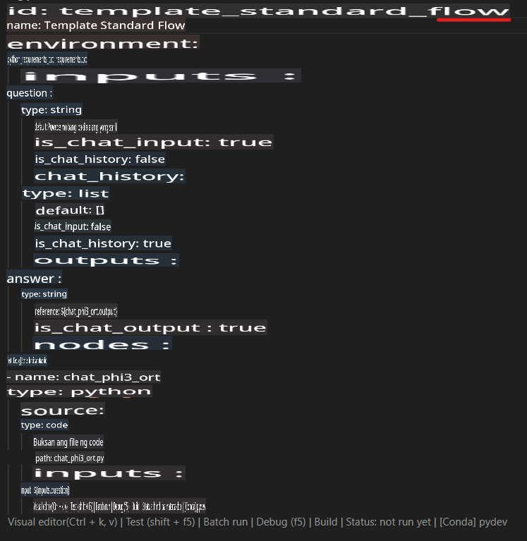
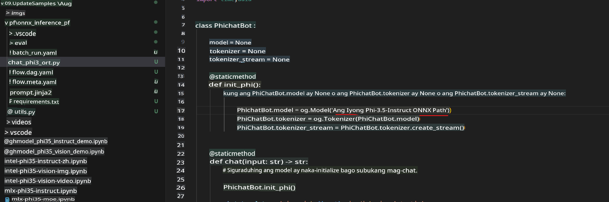
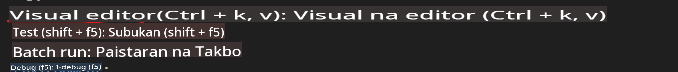
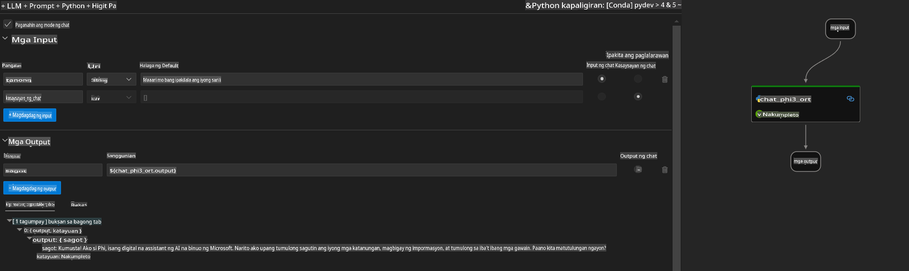
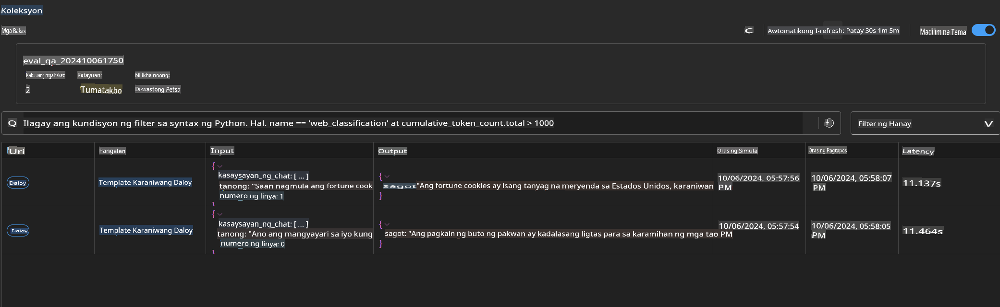

# Paggamit ng Windows GPU para gumawa ng Prompt Flow solution gamit ang Phi-3.5-Instruct ONNX

Ang dokumentong ito ay isang halimbawa kung paano gamitin ang PromptFlow kasama ang ONNX (Open Neural Network Exchange) para sa pag-develop ng mga AI application batay sa Phi-3 models.

Ang PromptFlow ay isang hanay ng mga development tools na idinisenyo upang gawing mas madali ang buong development cycle ng LLM-based (Large Language Model) AI applications, mula sa ideation at prototyping hanggang sa testing at evaluation.

Sa pamamagitan ng pagsasama ng PromptFlow at ONNX, maaaring:

- **I-optimize ang Performance ng Modelo**: Gamitin ang ONNX para sa mas mabilis at mahusay na inference at deployment ng modelo.
- **Pinasimpleng Development**: Gamitin ang PromptFlow upang pamahalaan ang workflow at i-automate ang mga paulit-ulit na gawain.
- **Pahusayin ang Kolaborasyon**: Hikayatin ang mas mahusay na pagtutulungan sa mga miyembro ng team sa pamamagitan ng pagbibigay ng iisang development environment.

Ang **Prompt flow** ay isang hanay ng mga development tools na idinisenyo upang gawing mas madali ang buong proseso ng pag-develop ng LLM-based AI applications, mula sa ideation, prototyping, testing, evaluation hanggang sa production deployment at monitoring. Ginagawa nitong mas madali ang prompt engineering at nagbibigay-daan sa iyo na bumuo ng mga LLM apps na may kalidad para sa production.

Ang Prompt flow ay maaaring kumonekta sa OpenAI, Azure OpenAI Service, at mga customizable na modelo (Huggingface, local LLM/SLM). Layunin naming i-deploy ang quantized ONNX model ng Phi-3.5 sa mga lokal na application. Ang Prompt flow ay makakatulong sa atin na mas mahusay na magplano ng ating negosyo at makumpleto ang mga lokal na solusyon batay sa Phi-3.5. Sa halimbawang ito, pagsasamahin natin ang ONNX Runtime GenAI Library upang makumpleto ang Prompt flow solution batay sa Windows GPU.

## **Pag-install**

### **ONNX Runtime GenAI para sa Windows GPU**

Basahin ang gabay na ito upang i-set up ang ONNX Runtime GenAI para sa Windows GPU [click here](./ORTWindowGPUGuideline.md)

### **Pag-set up ng Prompt flow sa VSCode**

1. I-install ang Prompt flow VS Code Extension


2. Matapos i-install ang Prompt flow VS Code Extension, i-click ang extension, at piliin ang **Installation dependencies** at sundin ang gabay upang i-install ang Prompt flow SDK sa iyong environment.



3. I-download ang [Sample Code](../../../../../../code/09.UpdateSamples/Aug/pf/onnx_inference_pf) at gamitin ang VS Code upang buksan ang sample na ito.



4. Buksan ang **flow.dag.yaml** upang piliin ang iyong Python environment.



   Buksan ang **chat_phi3_ort.py** upang baguhin ang lokasyon ng iyong Phi-3.5-instruct ONNX Model.



5. Patakbuhin ang iyong prompt flow para sa testing.

Buksan ang **flow.dag.yaml** at i-click ang visual editor.



Pagkatapos i-click ito, patakbuhin ito para sa testing.



1. Maaari mong patakbuhin ang batch sa terminal upang tingnan ang mas maraming resulta.

```bash

pf run create --file batch_run.yaml --stream --name 'Your eval qa name'    

```

Maaari mong tingnan ang mga resulta sa iyong default na browser.



**Paunawa**:  
Ang dokumentong ito ay isinalin gamit ang mga serbisyo ng AI na nakabatay sa makina. Bagama't sinisikap naming maging wasto, pakitandaan na ang mga awtomatikong pagsasalin ay maaaring maglaman ng mga pagkakamali o hindi pagkakatugma. Ang orihinal na dokumento sa orihinal nitong wika ang dapat ituring na mapagkakatiwalaang sanggunian. Para sa mahahalagang impormasyon, inirerekomenda ang propesyonal na pagsasalin ng tao. Hindi kami mananagot sa anumang hindi pagkakaunawaan o maling interpretasyon na dulot ng paggamit ng pagsasaling ito.