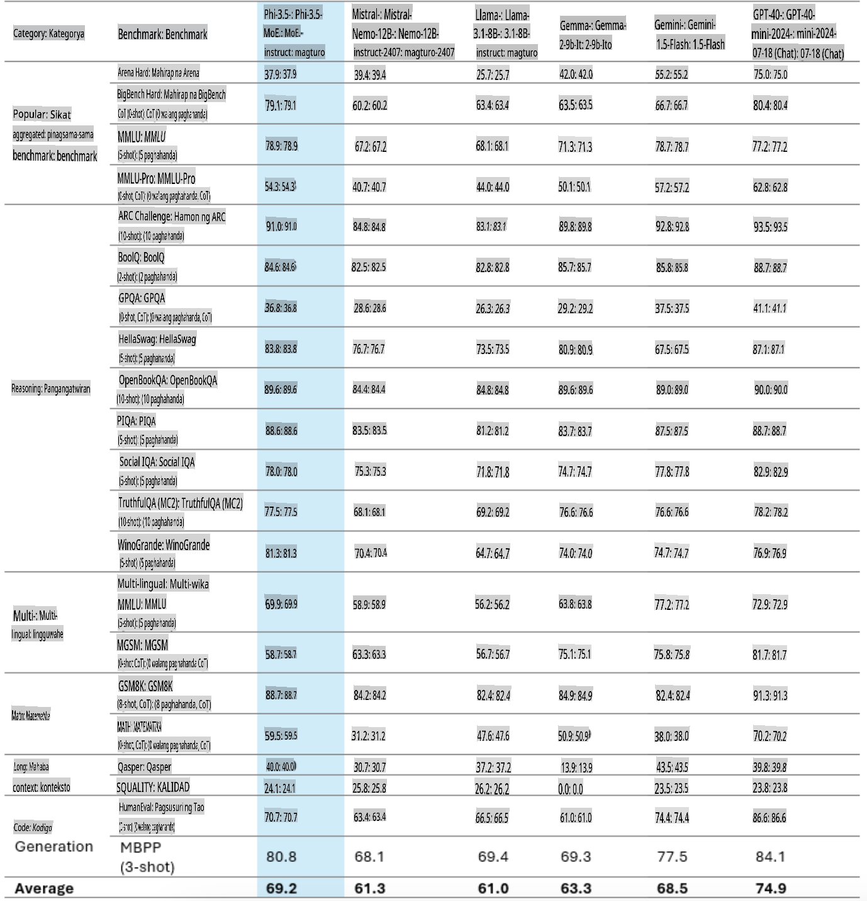
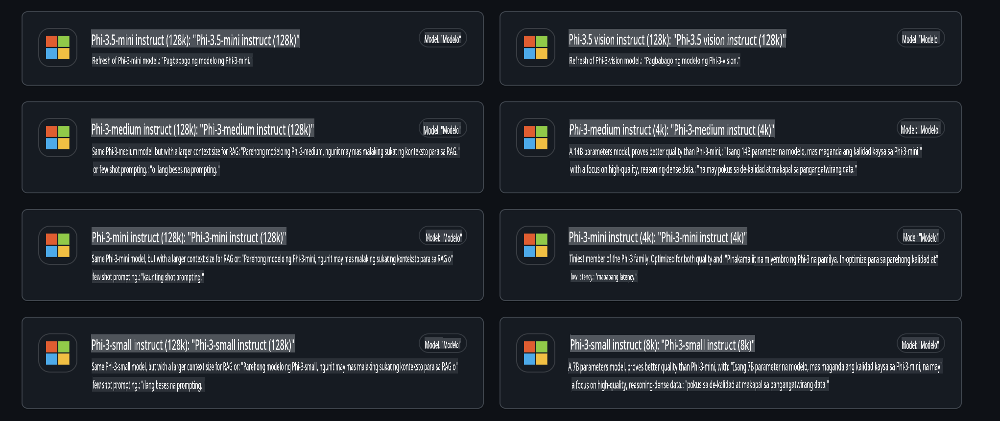
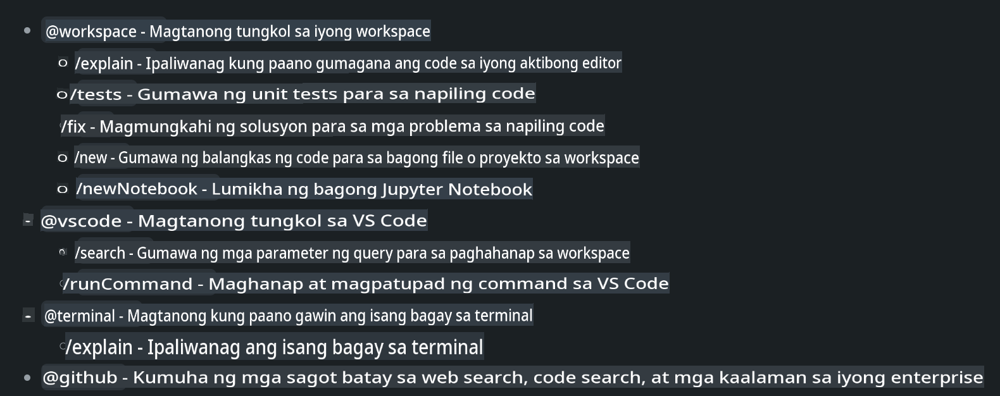
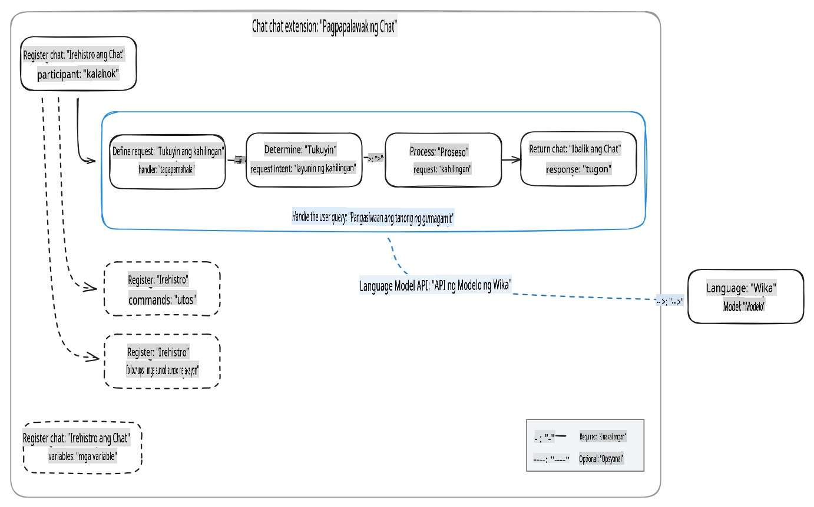
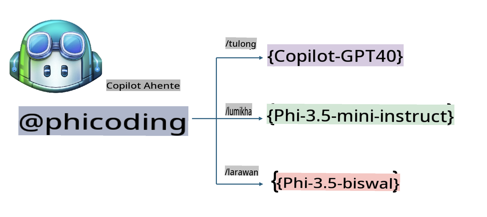
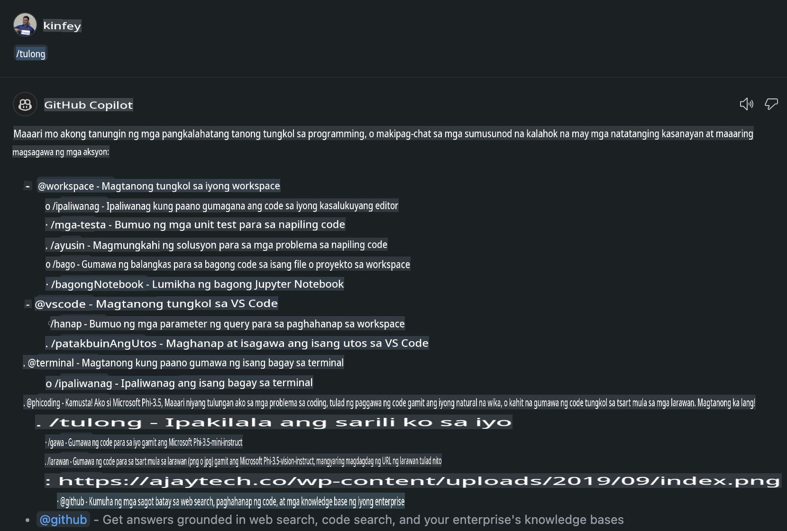
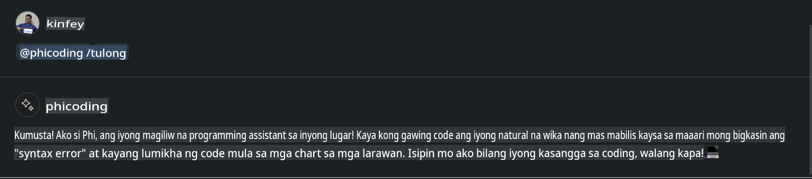
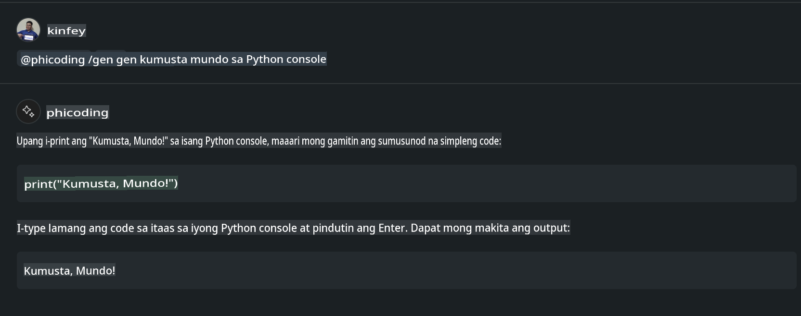
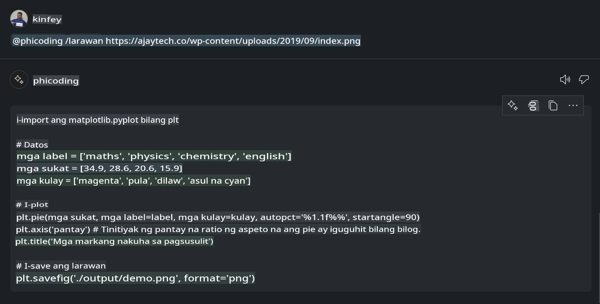

# **Gumawa ng Sariling Visual Studio Code Chat Copilot Agent gamit ang Phi-3.5 mula sa GitHub Models**

Gumagamit ka ba ng Visual Studio Code Copilot? Lalo na sa Chat, maaari kang gumamit ng iba't ibang mga agent upang mapahusay ang kakayahang lumikha, magsulat, at magpanatili ng mga proyekto sa Visual Studio Code. Ang Visual Studio Code ay may API na nagpapahintulot sa mga kumpanya at indibidwal na gumawa ng iba't ibang mga agent batay sa kanilang negosyo upang palawakin ang mga kakayahan nito sa iba't ibang larangan. Sa artikulong ito, magtutuon tayo sa **Phi-3.5-mini-instruct (128k)** at **Phi-3.5-vision-instruct (128k)** mula sa GitHub Models upang gumawa ng sarili mong Visual Studio Code Agent.

## **Tungkol sa Phi-3.5 sa GitHub Models**

Alam natin na ang Phi-3/3.5-mini-instruct mula sa Phi-3/3.5 Family ay may malakas na kakayahan sa pag-unawa at paggawa ng code, at may kalamangan kumpara sa Gemma-2-9b at Mistral-Nemo-12B-instruct-2407.



Ang pinakabagong GitHub Models ay nagbibigay na ng access sa Phi-3.5-mini-instruct (128k) at Phi-3.5-vision-instruct (128k) models. Maaaring ma-access ito ng mga developer gamit ang OpenAI SDK, Azure AI Inference SDK, at REST API.



***Tandaan:*** Inirerekomenda na gamitin ang Azure AI Inference SDK dito, dahil mas madali itong magpalit gamit ang Azure Model Catalog sa production environment.

Narito ang mga resulta ng **Phi-3.5-mini-instruct (128k)** at **Phi-3.5-vision-instruct (128k)** sa code generation scenario pagkatapos ikonekta sa GitHub Models, bilang paghahanda sa mga sumusunod na halimbawa.

**Demo: Ginamit ng GitHub Models Phi-3.5-mini-instruct (128k) ang Prompt upang gumawa ng code** ([i-click ang link na ito](../../../../../../code/09.UpdateSamples/Aug/ghmodel_phi35_instruct_demo.ipynb))

**Demo: Ginamit ng GitHub Models Phi-3.5-vision-instruct (128k) ang Larawan upang gumawa ng code** ([i-click ang link na ito](../../../../../../code/09.UpdateSamples/Aug/ghmodel_phi35_vision_demo.ipynb))

## **Tungkol sa GitHub Copilot Chat Agent**

Ang GitHub Copilot Chat Agent ay maaaring magsagawa ng iba't ibang gawain sa iba't ibang mga proyekto batay sa code. Ang sistema ay may apat na agent: workspace, github, terminal, vscode.



Sa pamamagitan ng pagdaragdag ng pangalan ng agent na may ‘@’, maaari mong mabilis na magawa ang kaukulang gawain. Para sa mga negosyo, kung idaragdag mo ang mga business-related content tulad ng requirements, coding, test specifications, at release, maaari kang magkaroon ng mas makapangyarihang enterprise private functions batay sa GitHub Copilot.

Ang Visual Studio Code Chat Agent ay opisyal nang naglabas ng API, na nagbibigay-daan sa mga negosyo o developer ng negosyo na gumawa ng mga agent batay sa iba’t ibang software business ecosystems. Sa pamamagitan ng Visual Studio Code Extension Development, madali mong maa-access ang interface ng Visual Studio Code Chat Agent API. Maaari tayong mag-develop batay sa prosesong ito.



Ang development scenario ay maaaring suportahan ang access sa third-party model APIs (tulad ng GitHub Models, Azure Model Catalog, at mga self-built services batay sa open-source models) at maaari ring gumamit ng gpt-35-turbo, gpt-4, at gpt-4o models na ibinibigay ng GitHub Copilot.

## **Magdagdag ng Agent @phicoding batay sa Phi-3.5**

Susubukan nating isama ang programming capabilities ng Phi-3.5 upang makumpleto ang pagsusulat ng code, paggawa ng code mula sa imahe, at iba pang mga gawain. Magbuo ng isang Agent na nakapalibot sa Phi-3.5 - @PHI, narito ang ilang mga kakayahan:

1. Gumawa ng self-introduction gamit ang GPT-4o na ibinibigay ng GitHub Copilot sa pamamagitan ng **@phicoding /help** na utos.

2. Gumawa ng code para sa iba't ibang programming languages gamit ang **Phi-3.5-mini-instruct (128k)** sa pamamagitan ng **@phicoding /gen** na utos.

3. Gumawa ng code mula sa imahe gamit ang **Phi-3.5-vision-instruct (128k)** at image completion sa pamamagitan ng **@phicoding /image** na utos.



## **Mga Kaugnay na Hakbang**

1. I-install ang Visual Studio Code Extension development support gamit ang npm.

```bash

npm install --global yo generator-code 

```

2. Gumawa ng Visual Studio Code Extension plugin (gamit ang Typescript development mode, pangalanan itong phiext).

```bash

yo code 

```

3. Buksan ang nilikhang proyekto at baguhin ang package.json. Narito ang mga kaugnay na tagubilin at configuration, pati na rin ang configuration ng GitHub Models. Tandaan na kailangang idagdag ang iyong GitHub Models token dito.

```json

{
  "name": "phiext",
  "displayName": "phiext",
  "description": "",
  "version": "0.0.1",
  "engines": {
    "vscode": "^1.93.0"
  },
  "categories": [
    "AI",
    "Chat"
  ],
  "activationEvents": [],
  "enabledApiProposals": [
      "chatVariableResolver"
  ],
  "main": "./dist/extension.js",
  "contributes": {
    "chatParticipants": [
        {
            "id": "chat.phicoding",
            "name": "phicoding",
            "description": "Hey! I am Microsoft Phi-3.5, She can help me with coding problems, such as generation code with your natural language, or even generation code about chart from images. Just ask me anything!",
            "isSticky": true,
            "commands": [
                {
                    "name": "help",
                    "description": "Introduce myself to you"
                },
                {
                    "name": "gen",
                    "description": "Generate code for you with Microsoft Phi-3.5-mini-instruct"
                },
                {
                    "name": "image",
                    "description": "Generate code for chart from image(png or jpg) with Microsoft Phi-3.5-vision-instruct, please add image url like this : https://ajaytech.co/wp-content/uploads/2019/09/index.png"
                }
            ]
        }
    ],
    "commands": [
        {
            "command": "phicoding.namesInEditor",
            "title": "Use Microsoft Phi 3.5 in Editor"
        }
    ],
    "configuration": {
      "type": "object",
      "title": "githubmodels",
      "properties": {
        "githubmodels.endpoint": {
          "type": "string",
          "default": "https://models.inference.ai.azure.com",
          "description": "Your GitHub Models Endpoint",
          "order": 0
        },
        "githubmodels.api_key": {
          "type": "string",
          "default": "Your GitHub Models Token",
          "description": "Your GitHub Models Token",
          "order": 1
        },
        "githubmodels.phi35instruct": {
          "type": "string",
          "default": "Phi-3.5-mini-instruct",
          "description": "Your Phi-35-Instruct Model",
          "order": 2
        },
        "githubmodels.phi35vision": {
          "type": "string",
          "default": "Phi-3.5-vision-instruct",
          "description": "Your Phi-35-Vision Model",
          "order": 3
        }
      }
    }
  },
  "scripts": {
    "vscode:prepublish": "npm run package",
    "compile": "webpack",
    "watch": "webpack --watch",
    "package": "webpack --mode production --devtool hidden-source-map",
    "compile-tests": "tsc -p . --outDir out",
    "watch-tests": "tsc -p . -w --outDir out",
    "pretest": "npm run compile-tests && npm run compile && npm run lint",
    "lint": "eslint src",
    "test": "vscode-test"
  },
  "devDependencies": {
    "@types/vscode": "^1.93.0",
    "@types/mocha": "^10.0.7",
    "@types/node": "20.x",
    "@typescript-eslint/eslint-plugin": "^8.3.0",
    "@typescript-eslint/parser": "^8.3.0",
    "eslint": "^9.9.1",
    "typescript": "^5.5.4",
    "ts-loader": "^9.5.1",
    "webpack": "^5.94.0",
    "webpack-cli": "^5.1.4",
    "@vscode/test-cli": "^0.0.10",
    "@vscode/test-electron": "^2.4.1"
  },
  "dependencies": {
    "@types/node-fetch": "^2.6.11",
    "node-fetch": "^3.3.2",
    "@azure-rest/ai-inference": "latest",
    "@azure/core-auth": "latest",
    "@azure/core-sse": "latest"
  }
}


```

4. Baguhin ang src/extension.ts.

```typescript

// The module 'vscode' contains the VS Code extensibility API
// Import the module and reference it with the alias vscode in your code below
import * as vscode from 'vscode';
import ModelClient from "@azure-rest/ai-inference";
import { AzureKeyCredential } from "@azure/core-auth";


interface IPhiChatResult extends vscode.ChatResult {
    metadata: {
        command: string;
    };
}


const MODEL_SELECTOR: vscode.LanguageModelChatSelector = { vendor: 'copilot', family: 'gpt-4o' };

function isValidImageUrl(url: string): boolean {
    const regex = /^(https?:\/\/.*\.(?:png|jpg))$/i;
    return regex.test(url);
}
  

// This method is called when your extension is activated
// Your extension is activated the very first time the command is executed
export function activate(context: vscode.ExtensionContext) {

    const codinghandler: vscode.ChatRequestHandler = async (request: vscode.ChatRequest, context: vscode.ChatContext, stream: vscode.ChatResponseStream, token: vscode.CancellationToken): Promise<IPhiChatResult> => {


        const config : any = vscode.workspace.getConfiguration('githubmodels');
        const endPoint: string = config.get('endpoint');
        const apiKey: string = config.get('api_key');
        const phi35instruct: string = config.get('phi35instruct');
        const phi35vision: string = config.get('phi35vision');
        
        if (request.command === 'help') {

            const content = "Welcome to Coding assistant with Microsoft Phi-3.5"; 
            stream.progress(content);


            try {
                const [model] = await vscode.lm.selectChatModels(MODEL_SELECTOR);
                if (model) {
                    const messages = [
                        vscode.LanguageModelChatMessage.User("Please help me express this content in a humorous way: I am a programming assistant who can help you convert natural language into code and generate code based on the charts in the images. output format like this : Hey I am Phi ......")
                    ];
                    const chatResponse = await model.sendRequest(messages, {}, token);
                    for await (const fragment of chatResponse.text) {
                        stream.markdown(fragment);
                    }
                }
            } catch(err) {
                console.log(err);
            }


            return { metadata: { command: 'help' } };

        }

        
        if (request.command === 'gen') {

            const content = "Welcome to use phi-3.5 to generate code";

            stream.progress(content);

            const client = new ModelClient(endPoint, new AzureKeyCredential(apiKey));

            const response = await client.path("/chat/completions").post({
              body: {
                messages: [
                  { role:"system", content: "You are a coding assistant.Help answer all code generation questions." },
                  { role:"user", content: request.prompt }
                ],
                model: phi35instruct,
                temperature: 0.4,
                max_tokens: 1000,
                top_p: 1.
              }
            });

            stream.markdown(response.body.choices[0].message.content);

            return { metadata: { command: 'gen' } };

        }


        
        if (request.command === 'image') {


            const content = "Welcome to use phi-3.5 to generate code from image(png or jpg),image url like this:https://ajaytech.co/wp-content/uploads/2019/09/index.png";

            stream.progress(content);

            if (!isValidImageUrl(request.prompt)) {
                stream.markdown('Please provide a valid image URL');
                return { metadata: { command: 'image' } };
            }
            else
            {

                const client = new ModelClient(endPoint, new AzureKeyCredential(apiKey));
    
                const response = await client.path("/chat/completions").post({
                    body: {
                      messages: [
                        { role: "system", content: "You are a helpful assistant that describes images in details." },
                        { role: "user", content: [
                            { type: "text", text: "Please generate code according to the chart in the picture according to the following requirements\n1. Keep all information in the chart, including data and text\n2. Do not generate additional information that is not included in the chart\n3. Please extract data from the picture, do not generate it from csv\n4. Please save the regenerated chart as a chart and save it to ./output/demo.png"},
                            { type: "image_url", image_url: {url: request.prompt}
                            }
                          ]
                        }
                      ],
                      model: phi35vision,
                      temperature: 0.4,
                      max_tokens: 2048,
                      top_p: 1.
                    }
                  });
    
                
                stream.markdown(response.body.choices[0].message.content);
    
                return { metadata: { command: 'image' } };
            }


        }


        return { metadata: { command: '' } };
    };


    const phi_ext = vscode.chat.createChatParticipant("chat.phicoding", codinghandler);

    phi_ext.iconPath = new vscode.ThemeIcon('sparkle');


    phi_ext.followupProvider = {
        provideFollowups(result: IPhiChatResult, context: vscode.ChatContext, token: vscode.CancellationToken) {
            return [{
                prompt: 'Let us coding with Phi-3.5 😋😋😋😋',
                label: vscode.l10n.t('Enjoy coding with Phi-3.5'),
                command: 'help'
            } satisfies vscode.ChatFollowup];
        }
    };

    context.subscriptions.push(phi_ext);
}

// This method is called when your extension is deactivated
export function deactivate() {}


```

6. Patakbuhin.

***/help***



***@phicoding /help***



***@phicoding /gen***



***@phicoding /image***



Maaari mong i-download ang sample code: [i-click dito](../../../../../../code/09.UpdateSamples/Aug/vscode)

## **Mga Mapagkukunan**

1. Mag-sign up sa GitHub Models [https://gh.io/models](https://gh.io/models)

2. Matuto tungkol sa Visual Studio Code Extension Development [https://code.visualstudio.com/api/get-started/your-first-extension](https://code.visualstudio.com/api/get-started/your-first-extension)

3. Matuto tungkol sa Visual Studio Code Coilot Chat API [https://code.visualstudio.com/api/extension-guides/chat](https://code.visualstudio.com/api/extension-guides/chat)

**Paunawa**:  
Ang dokumentong ito ay isinalin gamit ang mga serbisyo ng machine-based AI translation. Bagama't aming pinagsisikapang maging wasto, pakatandaan na ang mga awtomatikong pagsasalin ay maaaring maglaman ng mga pagkakamali o hindi tumpak na salin. Ang orihinal na dokumento sa sarili nitong wika ang dapat ituring na opisyal na sanggunian. Para sa mahalagang impormasyon, inirerekomenda ang propesyonal na pagsasalin ng tao. Hindi kami mananagot para sa anumang hindi pagkakaunawaan o maling interpretasyon na maaaring dulot ng paggamit ng pagsasaling ito.