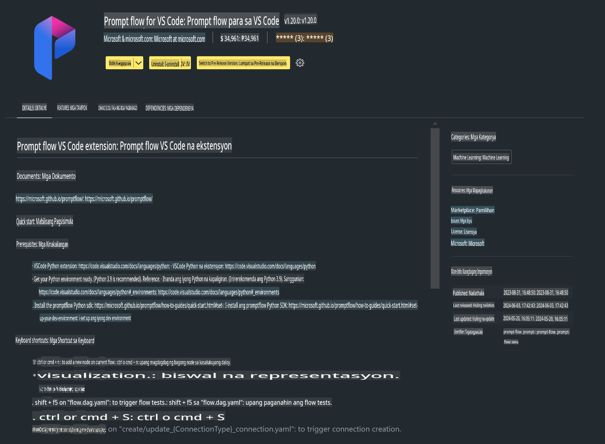

# **Lab 0 - Pag-install**

Kapag pumasok tayo sa Lab, kailangan nating i-configure ang kaukulang environment:

### **1. Python 3.11+**

Inirerekomenda ang paggamit ng miniforge para i-configure ang iyong Python environment.

Para sa pag-configure ng miniforge, pakibisita ang [https://github.com/conda-forge/miniforge](https://github.com/conda-forge/miniforge).

Pagkatapos i-configure ang miniforge, patakbuhin ang sumusunod na command sa Power Shell:

```bash

conda create -n pyenv python==3.11.8 -y

conda activate pyenv

```

### **2. I-install ang Prompt flow SDK**

Sa Lab 1, gagamit tayo ng Prompt flow, kaya kailangan mong i-configure ang Prompt flow SDK.

```bash

pip install promptflow --upgrade

```

Pwede mong i-check ang promptflow SDK gamit ang command na ito:

```bash

pf --version

```

### **3. I-install ang Visual Studio Code Prompt flow Extension**



### **4. MLX Framework ng Apple**

Ang MLX ay isang array framework para sa pananaliksik sa machine learning gamit ang Apple silicon, na binuo ng Apple machine learning research. Pwede mong gamitin ang **Apple MLX framework** para pabilisin ang LLM / SLM gamit ang Apple Silicon. Kung gusto mong malaman pa, maaari mong basahin ang [https://github.com/microsoft/PhiCookBook/blob/main/md/01.Introduction/03/MLX_Inference.md](https://github.com/microsoft/PhiCookBook/blob/main/md/01.Introduction/03/MLX_Inference.md).

I-install ang MLX framework Library gamit ang bash:

```bash

pip install mlx-lm

```

### **5. Iba pang Python Library**

Gumawa ng requirements.txt at idagdag ang nilalamang ito:

```txt

notebook
numpy 
scipy 
scikit-learn 
matplotlib 
pandas 
pillow 
graphviz

```

### **6. I-install ang NVM**

I-install ang nvm sa Powershell:

```bash

brew install nvm

```

I-install ang nodejs 18.20:

```bash

nvm install 18.20.0

nvm use 18.20.0

```

### **7. I-install ang Visual Studio Code Development Support**

```bash

npm install --global yo generator-code

```

Binabati kita! Matagumpay mong na-configure ang SDK. Susunod, magpatuloy sa mga hands-on na hakbang.

**Paunawa**:  
Ang dokumentong ito ay isinalin gamit ang mga serbisyo ng AI na nakabatay sa makina. Bagama't pinagsisikapan naming maging wasto, pakitandaan na ang mga awtomatikong pagsasalin ay maaaring maglaman ng mga pagkakamali o kamalian. Ang orihinal na dokumento sa orihinal nitong wika ang dapat ituring na opisyal na pinagmulan. Para sa mahalagang impormasyon, inirerekomenda ang propesyonal na pagsasalin ng tao. Hindi kami mananagot para sa anumang hindi pagkakaunawaan o maling interpretasyon na dulot ng paggamit ng pagsasaling ito.