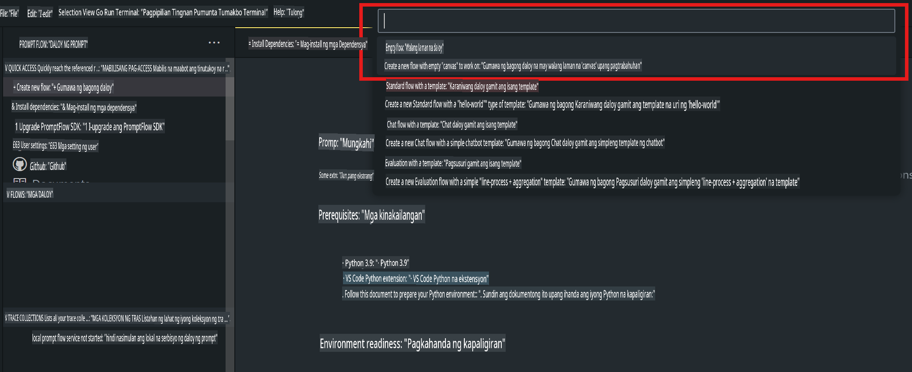
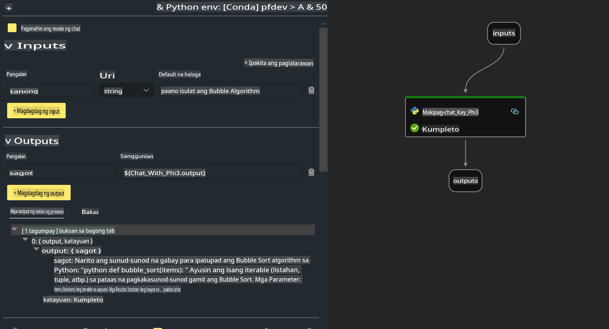

# **Lab 2 - Patakbuhin ang Prompt flow gamit ang Phi-3-mini sa AIPC**

## **Ano ang Prompt flow**

Ang Prompt flow ay isang hanay ng mga development tools na idinisenyo upang gawing mas madali ang end-to-end na development cycle ng mga LLM-based AI applications, mula sa ideya, prototyping, testing, evaluation hanggang sa production deployment at monitoring. Pinapasimple nito ang prompt engineering at nagbibigay-daan upang makabuo ng mga LLM apps na may kalidad para sa production.

Sa pamamagitan ng Prompt flow, magagawa mo ang sumusunod:

- Gumawa ng mga daloy na nag-uugnay sa LLMs, prompts, Python code, at iba pang tools sa isang executable na workflow.

- I-debug at ulitin ang iyong mga daloy, lalo na ang pakikipag-ugnayan sa LLMs nang madali.

- Suriin ang iyong mga daloy, kalkulahin ang kalidad at performance metrics gamit ang mas malalaking datasets.

- Isama ang testing at evaluation sa iyong CI/CD system upang masiguro ang kalidad ng iyong daloy.

- I-deploy ang iyong mga daloy sa platform na iyong pinili o isama sa code base ng iyong app nang madali.

- (Opsyonal ngunit lubos na inirerekomenda) Makipagtulungan sa iyong team gamit ang cloud version ng Prompt flow sa Azure AI.


## **Pagbuo ng generation code flows sa Apple Silicon**

***Tandaan*** ：Kung hindi mo pa natatapos ang pag-install ng environment, mangyaring bisitahin ang [Lab 0 -Installations](./01.Installations.md)

1. Buksan ang Prompt flow Extension sa Visual Studio Code at gumawa ng bagong walang laman na flow project.



2. Magdagdag ng Inputs at Outputs na mga parameter at magdagdag ng Python Code bilang bagong daloy.




Maaari kang sumangguni sa istrukturang ito (flow.dag.yaml) upang mabuo ang iyong daloy:

```yaml

inputs:
  prompt:
    type: string
    default: Write python code for Fibonacci serie. Please use markdown as output
outputs:
  result:
    type: string
    reference: ${gen_code_by_phi3.output}
nodes:
- name: gen_code_by_phi3
  type: python
  source:
    type: code
    path: gen_code_by_phi3.py
  inputs:
    prompt: ${inputs.prompt}


```

3. I-quantify ang phi-3-mini

Layunin naming mas mapatakbo nang maayos ang SLM sa mga lokal na device. Karaniwan, ini-quantify namin ang modelo (INT4, FP16, FP32).

```bash

python -m mlx_lm.convert --hf-path microsoft/Phi-3-mini-4k-instruct

```

**Tandaan:** Ang default na folder ay mlx_model.

4. Magdagdag ng Code sa ***Chat_With_Phi3.py***

```python


from promptflow import tool

from mlx_lm import load, generate


# The inputs section will change based on the arguments of the tool function, after you save the code
# Adding type to arguments and return value will help the system show the types properly
# Please update the function name/signature per need
@tool
def my_python_tool(prompt: str) -> str:

    model_id = './mlx_model_phi3_mini'

    model, tokenizer = load(model_id)

    # <|user|>\nWrite python code for Fibonacci serie. Please use markdown as output<|end|>\n<|assistant|>

    response = generate(model, tokenizer, prompt="<|user|>\n" + prompt  + "<|end|>\n<|assistant|>", max_tokens=2048, verbose=True)

    return response


```

4. Maaari mong i-test ang daloy mula sa Debug o Run upang suriin kung maayos ang generation code.


5. Patakbuhin ang daloy bilang development API sa terminal.

```

pf flow serve --source ./ --port 8080 --host localhost   

```

Maaari mo itong i-test sa Postman / Thunder Client.


### **Tandaan**

1. Ang unang pagtakbo ay tumatagal ng mahabang oras. Inirerekomenda na i-download ang phi-3 model mula sa Hugging Face CLI.

2. Dahil sa limitadong computing power ng Intel NPU, inirerekomenda na gamitin ang Phi-3-mini-4k-instruct.

3. Ginagamit namin ang Intel NPU Acceleration upang i-quantize ang INT4 conversion, ngunit kung muli mong patatakbuhin ang serbisyo, kailangan mong tanggalin ang cache at ang mga nc_workshop folders.


## **Mga Resources**

1. Matutunan ang Promptflow [https://microsoft.github.io/promptflow/](https://microsoft.github.io/promptflow/)

2. Matutunan ang Intel NPU Acceleration [https://github.com/intel/intel-npu-acceleration-library](https://github.com/intel/intel-npu-acceleration-library)

3. Sample Code, i-download [Local NPU Agent Sample Code](../../../../../../../../../code/07.Lab/01/AIPC/local-npu-agent)

**Paunawa**:  
Ang dokumentong ito ay isinalin gamit ang mga serbisyo ng AI na nakabatay sa makina. Bagamat pinagsisikapan naming maging tumpak, pakatandaan na ang mga awtomatikong pagsasalin ay maaaring maglaman ng mga pagkakamali o kamalian. Ang orihinal na dokumento sa sarili nitong wika ang dapat ituring na opisyal na sanggunian. Para sa mahalagang impormasyon, inirerekomenda ang propesyonal na pagsasaling-wika ng tao. Hindi kami mananagot sa anumang hindi pagkakaunawaan o maling interpretasyon na maaaring magmula sa paggamit ng pagsasaling ito.