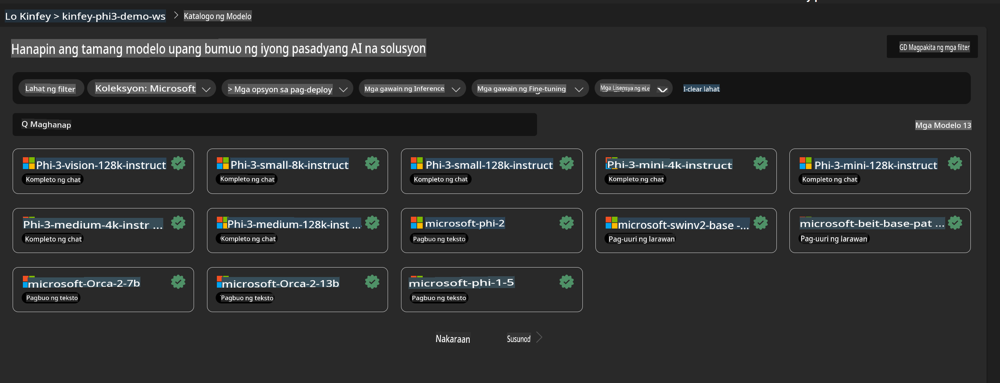
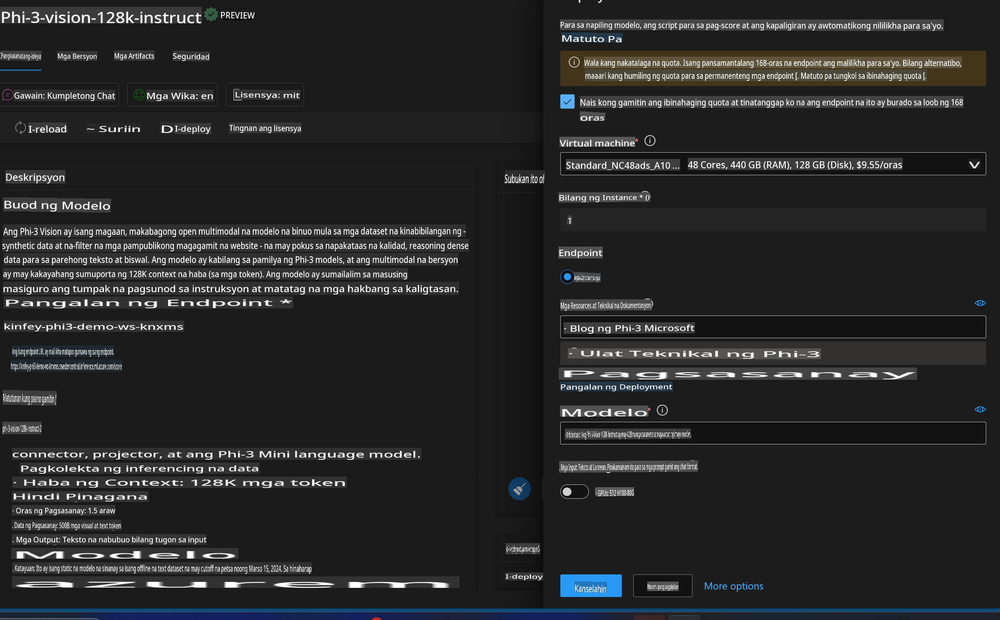
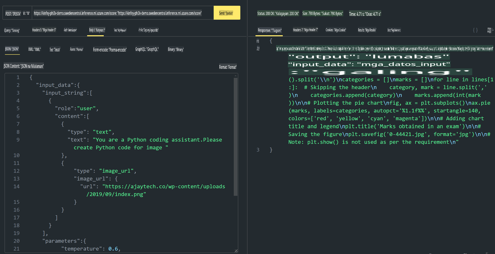

# **Lab 3 - I-deploy ang Phi-3-Vision sa Azure Machine Learning Service**

Gagamit tayo ng NPU upang makumpleto ang production deployment ng lokal na code, at pagkatapos ay nais nating ipakilala ang kakayahang gamitin ang PHI-3-VISION upang makagawa ng code mula sa mga larawan.

Sa gabay na ito, mabilis nating maitatayo ang isang Model As Service Phi-3 Vision service sa Azure Machine Learning Service.

***Note***: Ang Phi-3 Vision ay nangangailangan ng sapat na computing power upang makabuo ng content nang mas mabilis. Kailangan natin ng cloud computing power upang maisakatuparan ito.

### **1. Gumawa ng Azure Machine Learning Service**

Kailangan nating gumawa ng Azure Machine Learning Service sa Azure Portal. Kung nais mong matutunan kung paano, pakibisita ang link na ito [https://learn.microsoft.com/azure/machine-learning/quickstart-create-resources?view=azureml-api-2](https://learn.microsoft.com/azure/machine-learning/quickstart-create-resources?view=azureml-api-2)

### **2. Piliin ang Phi-3 Vision sa Azure Machine Learning Service**



### **3. I-deploy ang Phi-3-Vision sa Azure**



### **4. Subukan ang Endpoint sa Postman**



***Note***

1. Ang mga parameter na kailangang ipadala ay dapat kasama ang Authorization, azureml-model-deployment, at Content-Type. Kailangan mong tingnan ang impormasyon ng deployment upang makuha ito.

2. Para sa pagpapadala ng mga parameter, ang Phi-3-Vision ay kailangang magpadala ng link ng imahe. Pakitukoy ang GPT-4-Vision na paraan para sa pagpapadala ng mga parameter, halimbawa:

```json

{
  "input_data":{
    "input_string":[
      {
        "role":"user",
        "content":[ 
          {
            "type": "text",
            "text": "You are a Python coding assistant.Please create Python code for image "
          },
          {
              "type": "image_url",
              "image_url": {
                "url": "https://ajaytech.co/wp-content/uploads/2019/09/index.png"
              }
          }
        ]
      }
    ],
    "parameters":{
          "temperature": 0.6,
          "top_p": 0.9,
          "do_sample": false,
          "max_new_tokens": 2048
    }
  }
}

```

3. Gamitin ang **/score** gamit ang Post method

**Congratulations**! Natapos mo ang mabilisang deployment ng PHI-3-VISION at nasubukan kung paano gamitin ang mga larawan upang makabuo ng code. Sa susunod, maaari nating pagsamahin ang mga application gamit ang NPU at cloud.

**Paunawa**:  
Ang dokumentong ito ay isinalin gamit ang mga serbisyo ng AI na nakabatay sa makina. Bagama't sinisikap naming maging tumpak, mangyaring tandaan na ang mga awtomatikong pagsasalin ay maaaring maglaman ng mga pagkakamali o hindi tumpak na impormasyon. Ang orihinal na dokumento sa sariling wika nito ang dapat ituring na opisyal na sanggunian. Para sa mahalagang impormasyon, inirerekomenda ang propesyonal na pagsasalin ng tao. Hindi kami mananagot sa anumang hindi pagkakaunawaan o maling interpretasyon na dulot ng paggamit ng pagsasaling ito.