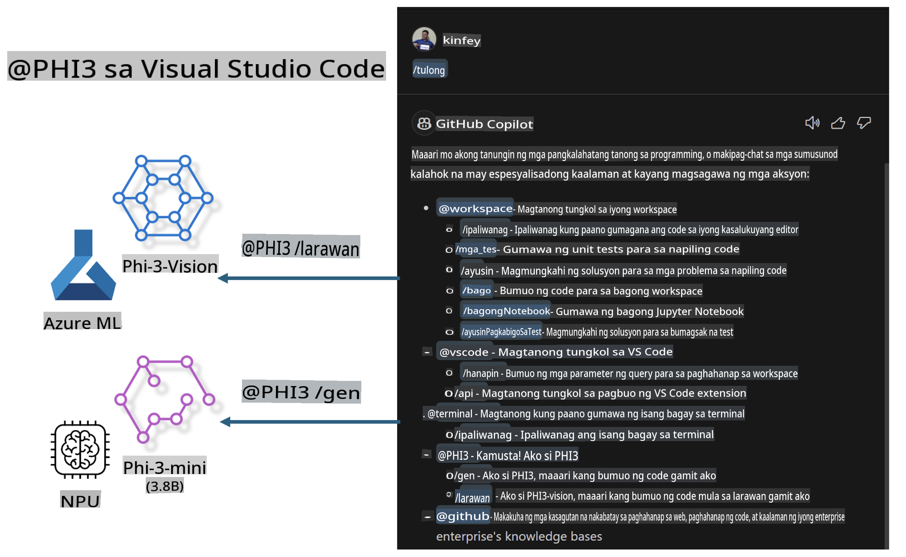

# **Bumuo ng Sariling Visual Studio Code GitHub Copilot Chat gamit ang Microsoft Phi-3 Family**

Nagamit mo na ba ang workspace agent sa GitHub Copilot Chat? Gusto mo bang bumuo ng code agent para sa inyong team? Ang hands-on lab na ito ay naglalayong pagsamahin ang open source model upang makabuo ng enterprise-level na code business agent.

## **Pundasyon**

### **Bakit pumili ng Microsoft Phi-3**

Ang Phi-3 ay isang serye ng pamilya na kinabibilangan ng phi-3-mini, phi-3-small, at phi-3-medium, batay sa iba't ibang training parameters para sa text generation, dialogue completion, at code generation. Meron ding phi-3-vision na nakabase sa Vision. Angkop ito para sa mga negosyo o iba't ibang team na gustong lumikha ng offline generative AI solutions.

Inirerekomendang basahin ang link na ito [https://github.com/microsoft/PhiCookBook/blob/main/md/01.Introduction/01/01.PhiFamily.md](https://github.com/microsoft/PhiCookBook/blob/main/md/01.Introduction/01/01.PhiFamily.md)

### **Microsoft GitHub Copilot Chat**

Ang GitHub Copilot Chat extension ay nagbibigay ng chat interface na nagpapahintulot sa iyo na makipag-ugnayan sa GitHub Copilot at makatanggap ng mga sagot sa mga coding-related na tanong direkta sa loob ng VS Code, nang hindi kinakailangang mag-navigate sa dokumentasyon o maghanap sa mga online forum.

Maaaring gumamit ang Copilot Chat ng syntax highlighting, indentation, at iba pang mga feature ng formatting upang gawing mas malinaw ang sagot. Depende sa uri ng tanong mula sa user, ang resulta ay maaaring maglaman ng mga link sa konteksto na ginamit ng Copilot para sa pagbuo ng sagot, tulad ng mga source code file o dokumentasyon, o mga button para sa pag-access ng functionality ng VS Code.

- Ang Copilot Chat ay bahagi ng daloy ng trabaho ng developer at nagbibigay ng tulong kung saan kinakailangan:

- Simulan ang inline chat conversation direkta mula sa editor o terminal para sa tulong habang nagko-code ka

- Gamitin ang Chat view para magkaroon ng AI assistant na laging nandiyan upang tumulong

- Ilunsad ang Quick Chat para magtanong ng mabilis at bumalik agad sa ginagawa mo

Maaari mong gamitin ang GitHub Copilot Chat sa iba't ibang sitwasyon, tulad ng:

- Pagsagot sa mga coding na tanong kung paano mas mahusay na lutasin ang isang problema

- Pagpapaliwanag ng code ng iba at pagmumungkahi ng mga pagpapabuti

- Paghahain ng mga solusyon sa code

- Pagbuo ng mga unit test case

- Pagbuo ng dokumentasyon ng code

Inirerekomendang basahin ang link na ito [https://code.visualstudio.com/docs/copilot/copilot-chat](https://code.visualstudio.com/docs/copilot/copilot-chat?WT.mc_id=aiml-137032-kinfeylo)

###  **Microsoft GitHub Copilot Chat @workspace**

Ang pag-refer sa **@workspace** sa Copilot Chat ay nagpapahintulot sa iyo na magtanong tungkol sa buong codebase mo. Batay sa tanong, matalinong kinukuha ng Copilot ang mga kaugnay na file at simbolo, na ginagamit nito sa sagot bilang mga link at halimbawa ng code.

Para masagot ang iyong tanong, ang **@workspace** ay naghahanap sa parehong mga source na ginagamit ng isang developer kapag nagna-navigate sa codebase sa VS Code:

- Lahat ng file sa workspace, maliban sa mga file na naka-ignore ng isang .gitignore file

- Istruktura ng direktoryo kasama ang mga nested na folder at pangalan ng file

- Code search index ng GitHub, kung ang workspace ay isang GitHub repository at naka-index ng code search

- Mga simbolo at depinisyon sa workspace

- Kasalukuyang napiling teksto o nakikitang teksto sa aktibong editor

Tandaan: Hindi sinusunod ang .gitignore kung may nakabukas na file o napiling teksto sa loob ng isang ignored na file.

Inirerekomendang basahin ang link na ito [[https://code.visualstudio.com/docs/copilot/copilot-chat](https://code.visualstudio.com/docs/copilot/workspace-context?WT.mc_id=aiml-137032-kinfeylo)]

## **Alamin Pa Tungkol sa Lab na Ito**

Malaki ang naitulong ng GitHub Copilot sa pagpapabuti ng programming efficiency ng mga negosyo, at bawat negosyo ay nagnanais na i-customize ang mga kaugnay na function ng GitHub Copilot. Maraming negosyo ang nag-customize ng mga Extension na katulad ng GitHub Copilot batay sa kanilang sariling business scenarios at open source models. Para sa mga negosyo, mas madaling kontrolin ang mga customized na Extension, ngunit naaapektuhan din nito ang karanasan ng user. Sa katunayan, mas malakas ang mga function ng GitHub Copilot sa paghawak ng mga pangkalahatang scenario at propesyonalismo. Kung ang karanasan ay maaring mapanatiling pareho, mas maganda ang pagkakaroon ng customized na Extension para sa negosyo. Ang GitHub Copilot Chat ay nagbibigay ng mga kaugnay na API para sa mga negosyo upang mapalawak ang karanasan sa Chat. Ang pagpapanatili ng pare-parehong karanasan at pagkakaroon ng customized na mga function ay nagbibigay ng mas mahusay na karanasan sa user.

Ang lab na ito ay pangunahing gumagamit ng Phi-3 model na pinagsama sa lokal na NPU at Azure hybrid upang bumuo ng custom Agent sa GitHub Copilot Chat ***@PHI3*** upang tulungan ang mga enterprise developer sa pagbuo ng code ***(@PHI3 /gen)*** at pagbuo ng code batay sa mga imahe ***(@PHI3 /img)***.

### ***Tandaan:*** 

Ang lab na ito ay kasalukuyang ipinatutupad sa AIPC ng Intel CPU at Apple Silicon. Patuloy naming ia-update ang Qualcomm na bersyon ng NPU.

## **Lab**

| Pangalan | Deskripsyon | AIPC | Apple |
| ------------ | ----------- | -------- |-------- |
| Lab0 - Installations(✅) | I-configure at i-install ang mga kaugnay na environment at installation tools | [Go](./HOL/AIPC/01.Installations.md) |[Go](./HOL/Apple/01.Installations.md) |
| Lab1 - Run Prompt flow with Phi-3-mini (✅) | Pinagsama sa AIPC / Apple Silicon, gamit ang lokal na NPU upang lumikha ng code generation gamit ang Phi-3-mini | [Go](./HOL/AIPC/02.PromptflowWithNPU.md) |  [Go](./HOL/Apple/02.PromptflowWithMLX.md) |
| Lab2 - Deploy Phi-3-vision on Azure Machine Learning Service(✅) | Bumuo ng code sa pamamagitan ng pag-deploy ng Azure Machine Learning Service's Model Catalog - Phi-3-vision image | [Go](./HOL/AIPC/03.DeployPhi3VisionOnAzure.md) |[Go](./HOL/Apple/03.DeployPhi3VisionOnAzure.md) |
| Lab3 - Gumawa ng @phi-3 agent sa GitHub Copilot Chat(✅)  | Gumawa ng custom Phi-3 agent sa GitHub Copilot Chat upang makumpleto ang code generation, graph generation code, RAG, atbp. | [Go](./HOL/AIPC/04.CreatePhi3AgentInVSCode.md) | [Go](./HOL/Apple/04.CreatePhi3AgentInVSCode.md) |
| Sample Code (✅)  | I-download ang sample code | [Go](../../../../../../../code/07.Lab/01/AIPC) | [Go](../../../../../../../code/07.Lab/01/Apple) |

## **Mga Resources**

1. Phi-3 Cookbook [https://github.com/microsoft/Phi-3CookBook](https://github.com/microsoft/Phi-3CookBook)

2. Alamin pa ang tungkol sa GitHub Copilot [https://learn.microsoft.com/training/paths/copilot/](https://learn.microsoft.com/training/paths/copilot/?WT.mc_id=aiml-137032-kinfeylo)

3. Alamin pa ang tungkol sa GitHub Copilot Chat [https://learn.microsoft.com/training/paths/accelerate-app-development-using-github-copilot/](https://learn.microsoft.com/training/paths/accelerate-app-development-using-github-copilot/?WT.mc_id=aiml-137032-kinfeylo)

4. Alamin pa ang tungkol sa GitHub Copilot Chat API [https://code.visualstudio.com/api/extension-guides/chat](https://code.visualstudio.com/api/extension-guides/chat?WT.mc_id=aiml-137032-kinfeylo)

5. Alamin pa ang tungkol sa Azure AI Foundry [https://learn.microsoft.com/training/paths/create-custom-copilots-ai-studio/](https://learn.microsoft.com/training/paths/create-custom-copilots-ai-studio/?WT.mc_id=aiml-137032-kinfeylo)

6. Alamin pa ang tungkol sa Azure AI Foundry's Model Catalog [https://learn.microsoft.com/azure/ai-studio/how-to/model-catalog-overview](https://learn.microsoft.com/azure/ai-studio/how-to/model-catalog-overview)

**Paunawa**:  
Ang dokumentong ito ay isinalin gamit ang mga serbisyo ng AI na nakabatay sa makina. Bagama't sinisikap naming maging tumpak, pakatandaan na ang mga awtomatikong pagsasalin ay maaaring maglaman ng mga pagkakamali o hindi pagkakatumpak. Ang orihinal na dokumento sa sariling wika nito ang dapat ituring na mapagkakatiwalaang sanggunian. Para sa mahalagang impormasyon, inirerekomenda ang propesyonal na pagsasalin ng tao. Hindi kami mananagot sa anumang hindi pagkakaunawaan o maling interpretasyon na dulot ng paggamit ng pagsasaling ito.