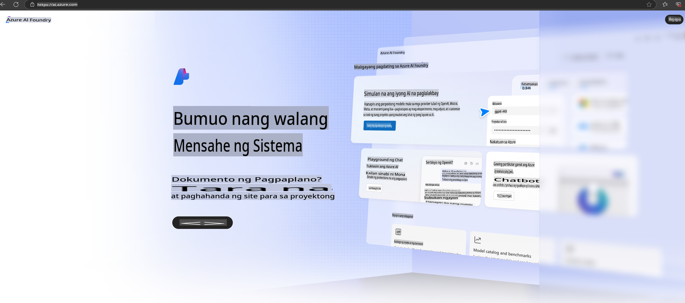

# **Paggamit ng Phi-3 sa Azure AI Foundry**

Sa pag-usbong ng Generative AI, layunin nating magkaroon ng isang pinagsama-samang platform para pamahalaan ang iba't ibang LLM at SLM, pagsasama ng datos ng negosyo, fine-tuning/RAG operations, at pagsusuri ng iba't ibang negosyo matapos ang integrasyon ng LLM at SLM, at iba pa, upang mas maipatupad nang mahusay ang mga matatalinong aplikasyon ng generative AI. Ang [Azure AI Foundry](https://ai.azure.com) ay isang enterprise-level na generative AI application platform.

Sa pamamagitan ng Azure AI Foundry, maaari mong suriin ang mga sagot ng large language model (LLM) at isaayos ang mga bahagi ng prompt application gamit ang prompt flow para sa mas mahusay na performance. Ang platform na ito ay nagbibigay-daan sa scalability para gawing ganap na produksyon ang mga proof of concepts nang madali. Ang tuloy-tuloy na pagmo-monitor at pag-refine ay sumusuporta sa pangmatagalang tagumpay.

Maaari nating mabilis na i-deploy ang Phi-3 model sa Azure AI Foundry sa pamamagitan ng simpleng mga hakbang, at pagkatapos ay gamitin ang Azure AI Foundry upang makumpleto ang mga kaugnay na gawain tulad ng Phi-3 Playground/Chat, Fine-tuning, pagsusuri, at iba pa.

## **1. Paghahanda**

Kung mayroon ka nang [Azure Developer CLI](https://learn.microsoft.com/azure/developer/azure-developer-cli/overview?WT.mc_id=aiml-138114-kinfeylo) na naka-install sa iyong makina, ang paggamit ng template na ito ay kasingdali ng pagpapatakbo ng command na ito sa isang bagong direktoryo.

## Manu-manong Paglikha

Ang paggawa ng Microsoft Azure AI Foundry project at hub ay isang mahusay na paraan upang ayusin at pamahalaan ang iyong AI na gawain. Narito ang isang step-by-step na gabay upang makapagsimula ka:

### Paggawa ng Project sa Azure AI Foundry

1. **Pumunta sa Azure AI Foundry**: Mag-sign in sa Azure AI Foundry portal.
2. **Gumawa ng Project**:
   - Kung nasa isang project ka, piliin ang "Azure AI Foundry" sa itaas na kaliwang bahagi ng pahina upang pumunta sa Home page.
   - Piliin ang "+ Create project".
   - Maglagay ng pangalan para sa project.
   - Kung mayroon kang hub, ito ay awtomatikong pipiliin. Kung may access ka sa higit sa isang hub, maaari kang pumili ng iba pa mula sa dropdown. Kung nais mong lumikha ng bagong hub, piliin ang "Create new hub" at magbigay ng pangalan.
   - Piliin ang "Create".

### Paggawa ng Hub sa Azure AI Foundry

1. **Pumunta sa Azure AI Foundry**: Mag-sign in gamit ang iyong Azure account.
2. **Gumawa ng Hub**:
   - Piliin ang Management center mula sa kaliwang menu.
   - Piliin ang "All resources", pagkatapos ang pababang arrow sa tabi ng "+ New project" at piliin ang "+ New hub".
   - Sa "Create a new hub" na dialog, maglagay ng pangalan para sa iyong hub (hal., contoso-hub) at baguhin ang ibang mga field kung kinakailangan.
   - Piliin ang "Next", suriin ang impormasyon, at pagkatapos ay piliin ang "Create".

Para sa mas detalyadong mga tagubilin, maaari mong tingnan ang opisyal na [Microsoft documentation](https://learn.microsoft.com/azure/ai-studio/how-to/create-projects).

Pagkatapos ng matagumpay na paggawa, maaari mong ma-access ang studio na iyong ginawa sa pamamagitan ng [ai.azure.com](https://ai.azure.com/)

Maaaring magkaroon ng maraming projects sa isang AI Foundry. Gumawa ng project sa AI Foundry bilang paghahanda.

Gumawa ng Azure AI Foundry [QuickStarts](https://learn.microsoft.com/azure/ai-studio/quickstarts/get-started-code)

## **2. I-deploy ang Phi model sa Azure AI Foundry**

I-click ang Explore option ng project upang pumasok sa Model Catalog at piliin ang Phi-3

Piliin ang Phi-3-mini-4k-instruct

I-click ang 'Deploy' upang i-deploy ang Phi-3-mini-4k-instruct model

> [!NOTE]
>
> Maaari mong piliin ang computing power kapag nag-de-deploy

## **3. Playground Chat Phi sa Azure AI Foundry**

Pumunta sa deployment page, piliin ang Playground, at makipag-chat sa Phi-3 ng Azure AI Foundry

## **4. Pag-deploy ng Model mula sa Azure AI Foundry**

Upang mag-deploy ng model mula sa Azure Model Catalog, sundin ang mga hakbang na ito:

- Mag-sign in sa Azure AI Foundry.
- Piliin ang model na nais mong i-deploy mula sa Azure AI Foundry model catalog.
- Sa Details page ng model, piliin ang Deploy at pagkatapos ay piliin ang Serverless API with Azure AI Content Safety.
- Piliin ang project kung saan mo gustong i-deploy ang iyong mga model. Para magamit ang Serverless API offering, ang iyong workspace ay dapat nasa East US 2 o Sweden Central na rehiyon. Maaari mong i-customize ang Deployment name.
- Sa deployment wizard, piliin ang Pricing and terms upang malaman ang tungkol sa presyo at mga tuntunin ng paggamit.
- Piliin ang Deploy. Maghintay hanggang maging handa ang deployment at ma-redirect ka sa Deployments page.
- Piliin ang Open in playground upang simulan ang pakikipag-ugnayan sa model.
- Maaari kang bumalik sa Deployments page, piliin ang deployment, at tandaan ang endpoint's Target URL at ang Secret Key, na maaari mong gamitin upang tawagan ang deployment at makabuo ng mga sagot.
- Palaging makikita ang mga detalye ng endpoint, URL, at access keys sa pamamagitan ng pagpunta sa Build tab at pagpili sa Deployments mula sa Components section.

> [!NOTE]
> Tandaan na ang iyong account ay dapat may Azure AI Developer role permissions sa Resource Group upang maisagawa ang mga hakbang na ito.

## **5. Paggamit ng Phi API sa Azure AI Foundry**

Maaari mong ma-access ang https://{Pangalan ng iyong project}.region.inference.ml.azure.com/swagger.json sa pamamagitan ng Postman GET at pagsamahin ito sa Key upang malaman ang mga ibinigay na interface.

Madali mong makukuha ang mga request parameters, pati na rin ang mga response parameters.

**Paunawa**:  
Ang dokumentong ito ay isinalin gamit ang mga serbisyo ng AI-based na pagsasalin. Bagama't pinagsisikapan naming maging wasto, mangyaring tandaan na ang mga awtomatikong pagsasalin ay maaaring maglaman ng mga pagkakamali o hindi tumpak na impormasyon. Ang orihinal na dokumento sa sariling wika nito ang dapat ituring na opisyal na sanggunian. Para sa mahalagang impormasyon, inirerekomenda ang propesyonal na pagsasalin ng tao. Hindi kami mananagot sa anumang hindi pagkakaunawaan o maling interpretasyon na maaaring magmula sa paggamit ng pagsasaling ito.