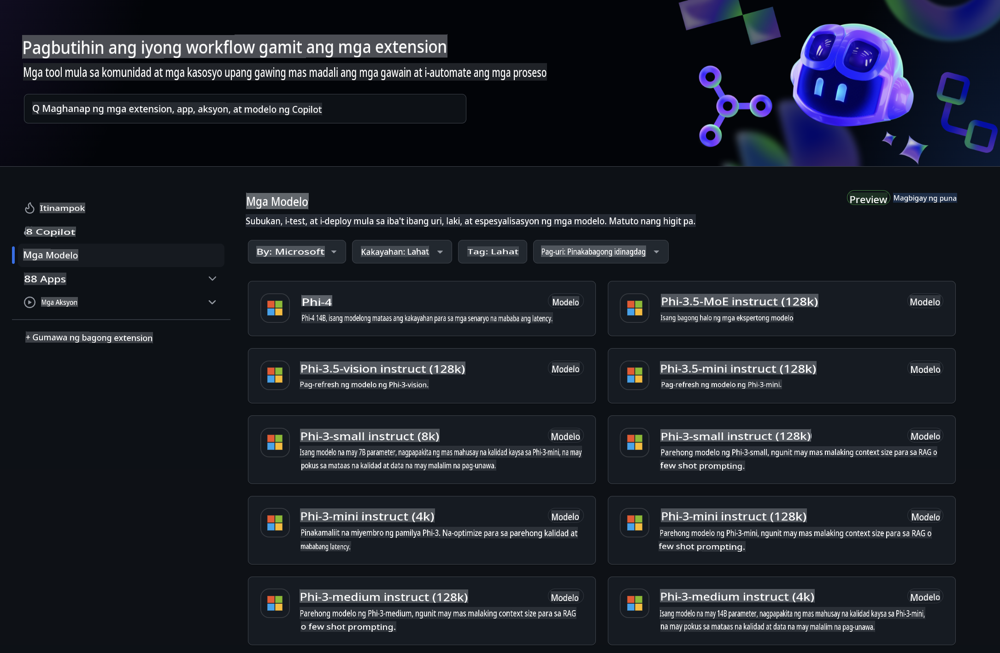
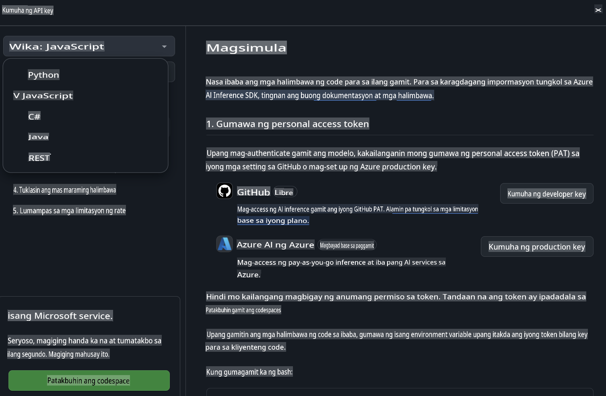
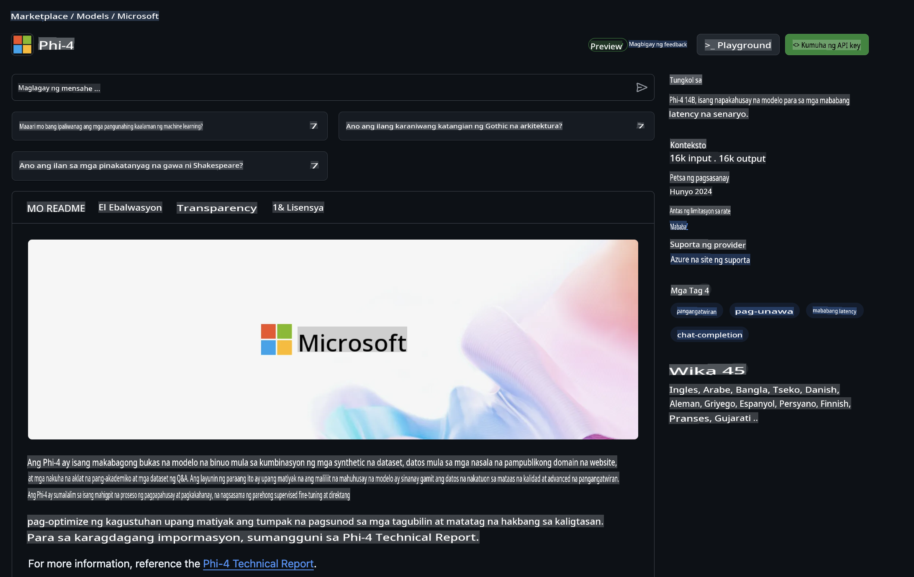

## Mga Modelo ng GitHub - Limitadong Pampublikong Beta

Maligayang pagdating sa [GitHub Models](https://github.com/marketplace/models)! Naka-set up na ang lahat para ma-explore mo ang mga AI Model na naka-host sa Azure AI.



Para sa karagdagang impormasyon tungkol sa mga Modelong makikita sa GitHub Models, bisitahin ang [GitHub Model Marketplace](https://github.com/marketplace/models)

## Mga Available na Modelo

Ang bawat modelo ay may nakalaang playground at sample code.


### Mga Phi-3 Model sa GitHub Model Catalog

[Phi-3-Medium-128k-Instruct](https://github.com/marketplace/models/azureml/Phi-3-medium-128k-instruct)

[Phi-3-medium-4k-instruct](https://github.com/marketplace/models/azureml/Phi-3-medium-4k-instruct)

[Phi-3-mini-128k-instruct](https://github.com/marketplace/models/azureml/Phi-3-mini-128k-instruct)

[Phi-3-mini-4k-instruct](https://github.com/marketplace/models/azureml/Phi-3-mini-4k-instruct)

[Phi-3-small-128k-instruct](https://github.com/marketplace/models/azureml/Phi-3-small-128k-instruct)

[Phi-3-small-8k-instruct](https://github.com/marketplace/models/azureml/Phi-3-small-8k-instruct)

## Pagsisimula

May ilang mga simpleng halimbawa na handa nang patakbuhin. Makikita mo ang mga ito sa samples directory. Kung nais mong direktang pumunta sa paborito mong wika, narito ang mga halimbawa sa mga sumusunod na Wika:

- Python  
- JavaScript  
- cURL  

Mayroon ding dedikadong Codespaces Environment para sa pagpapatakbo ng mga halimbawa at modelo.



## Sample Code

Narito ang mga halimbawa ng code para sa ilang mga use case. Para sa karagdagang impormasyon tungkol sa Azure AI Inference SDK, tingnan ang kumpletong dokumentasyon at mga halimbawa.

## Setup

1. Gumawa ng personal access token  
Hindi mo kailangang magbigay ng anumang mga pahintulot sa token. Tandaan na ang token ay ipapadala sa isang Microsoft service.

Para magamit ang mga code snippet sa ibaba, gumawa ng environment variable para itakda ang iyong token bilang key para sa client code.

Kung gumagamit ka ng bash:  
```
export GITHUB_TOKEN="<your-github-token-goes-here>"
```  
Kung gumagamit ka ng powershell:  

```
$Env:GITHUB_TOKEN="<your-github-token-goes-here>"
```  

Kung gumagamit ka ng Windows command prompt:  

```
set GITHUB_TOKEN=<your-github-token-goes-here>
```  

## Halimbawa ng Python

### I-install ang mga dependencies  
I-install ang Azure AI Inference SDK gamit ang pip (Kinakailangan: Python >=3.8):  

```
pip install azure-ai-inference
```  

### Patakbuhin ang isang simpleng halimbawa ng code  

Ipinapakita ng halimbawa na ito ang isang simpleng tawag sa chat completion API. Ginagamit nito ang GitHub AI model inference endpoint at ang iyong GitHub token. Ang tawag ay synchronous.  

```
import os
from azure.ai.inference import ChatCompletionsClient
from azure.ai.inference.models import SystemMessage, UserMessage
from azure.core.credentials import AzureKeyCredential

endpoint = "https://models.inference.ai.azure.com"
# Replace Model_Name 
model_name = "Phi-3-small-8k-instruct"
token = os.environ["GITHUB_TOKEN"]

client = ChatCompletionsClient(
    endpoint=endpoint,
    credential=AzureKeyCredential(token),
)

response = client.complete(
    messages=[
        SystemMessage(content="You are a helpful assistant."),
        UserMessage(content="What is the capital of France?"),
    ],
    model=model_name,
    temperature=1.,
    max_tokens=1000,
    top_p=1.
)

print(response.choices[0].message.content)
```  

### Patakbuhin ang isang multi-turn na pag-uusap  

Ipinapakita ng halimbawa na ito ang isang multi-turn na pag-uusap gamit ang chat completion API. Kapag ginagamit ang modelo para sa isang chat application, kakailanganin mong pamahalaan ang kasaysayan ng pag-uusap at ipadala ang pinakabagong mga mensahe sa modelo.  

```
import os
from azure.ai.inference import ChatCompletionsClient
from azure.ai.inference.models import AssistantMessage, SystemMessage, UserMessage
from azure.core.credentials import AzureKeyCredential

token = os.environ["GITHUB_TOKEN"]
endpoint = "https://models.inference.ai.azure.com"
# Replace Model_Name
model_name = "Phi-3-small-8k-instruct"

client = ChatCompletionsClient(
    endpoint=endpoint,
    credential=AzureKeyCredential(token),
)

messages = [
    SystemMessage(content="You are a helpful assistant."),
    UserMessage(content="What is the capital of France?"),
    AssistantMessage(content="The capital of France is Paris."),
    UserMessage(content="What about Spain?"),
]

response = client.complete(messages=messages, model=model_name)

print(response.choices[0].message.content)
```  

### I-stream ang output  

Para sa mas magandang karanasan ng user, gugustuhin mong i-stream ang tugon ng modelo para ang unang token ay lumabas agad at maiwasan ang paghihintay para sa mahabang tugon.  

```
import os
from azure.ai.inference import ChatCompletionsClient
from azure.ai.inference.models import SystemMessage, UserMessage
from azure.core.credentials import AzureKeyCredential

token = os.environ["GITHUB_TOKEN"]
endpoint = "https://models.inference.ai.azure.com"
# Replace Model_Name
model_name = "Phi-3-small-8k-instruct"

client = ChatCompletionsClient(
    endpoint=endpoint,
    credential=AzureKeyCredential(token),
)

response = client.complete(
    stream=True,
    messages=[
        SystemMessage(content="You are a helpful assistant."),
        UserMessage(content="Give me 5 good reasons why I should exercise every day."),
    ],
    model=model_name,
)

for update in response:
    if update.choices:
        print(update.choices[0].delta.content or "", end="")

client.close()
```  

## JavaScript

### I-install ang mga dependencies  

I-install ang Node.js.  

Kopyahin ang sumusunod na mga linya ng teksto at i-save ito bilang isang file na package.json sa loob ng iyong folder.  

```
{
  "type": "module",
  "dependencies": {
    "@azure-rest/ai-inference": "latest",
    "@azure/core-auth": "latest",
    "@azure/core-sse": "latest"
  }
}
```  

Tandaan: Ang @azure/core-sse ay kinakailangan lamang kung mag-i-stream ka ng chat completions response.  

Buksan ang isang terminal window sa folder na ito at patakbuhin ang npm install.  

Para sa bawat snippet ng code sa ibaba, kopyahin ang nilalaman sa isang file na sample.js at patakbuhin gamit ang node sample.js.  

### Patakbuhin ang isang simpleng halimbawa ng code  

Ipinapakita ng halimbawa na ito ang isang simpleng tawag sa chat completion API. Ginagamit nito ang GitHub AI model inference endpoint at ang iyong GitHub token. Ang tawag ay synchronous.  

```
import ModelClient from "@azure-rest/ai-inference";
import { AzureKeyCredential } from "@azure/core-auth";

const token = process.env["GITHUB_TOKEN"];
const endpoint = "https://models.inference.ai.azure.com";
// Update your modelname
const modelName = "Phi-3-small-8k-instruct";

export async function main() {

  const client = new ModelClient(endpoint, new AzureKeyCredential(token));

  const response = await client.path("/chat/completions").post({
    body: {
      messages: [
        { role:"system", content: "You are a helpful assistant." },
        { role:"user", content: "What is the capital of France?" }
      ],
      model: modelName,
      temperature: 1.,
      max_tokens: 1000,
      top_p: 1.
    }
  });

  if (response.status !== "200") {
    throw response.body.error;
  }
  console.log(response.body.choices[0].message.content);
}

main().catch((err) => {
  console.error("The sample encountered an error:", err);
});
```  

### Patakbuhin ang isang multi-turn na pag-uusap  

Ipinapakita ng halimbawa na ito ang isang multi-turn na pag-uusap gamit ang chat completion API. Kapag ginagamit ang modelo para sa isang chat application, kakailanganin mong pamahalaan ang kasaysayan ng pag-uusap at ipadala ang pinakabagong mga mensahe sa modelo.  

```
import ModelClient from "@azure-rest/ai-inference";
import { AzureKeyCredential } from "@azure/core-auth";

const token = process.env["GITHUB_TOKEN"];
const endpoint = "https://models.inference.ai.azure.com";
// Update your modelname
const modelName = "Phi-3-small-8k-instruct";

export async function main() {

  const client = new ModelClient(endpoint, new AzureKeyCredential(token));

  const response = await client.path("/chat/completions").post({
    body: {
      messages: [
        { role: "system", content: "You are a helpful assistant." },
        { role: "user", content: "What is the capital of France?" },
        { role: "assistant", content: "The capital of France is Paris." },
        { role: "user", content: "What about Spain?" },
      ],
      model: modelName,
    }
  });

  if (response.status !== "200") {
    throw response.body.error;
  }

  for (const choice of response.body.choices) {
    console.log(choice.message.content);
  }
}

main().catch((err) => {
  console.error("The sample encountered an error:", err);
});
```  

### I-stream ang output  
Para sa mas magandang karanasan ng user, gugustuhin mong i-stream ang tugon ng modelo para ang unang token ay lumabas agad at maiwasan ang paghihintay para sa mahabang tugon.  

```
import ModelClient from "@azure-rest/ai-inference";
import { AzureKeyCredential } from "@azure/core-auth";
import { createSseStream } from "@azure/core-sse";

const token = process.env["GITHUB_TOKEN"];
const endpoint = "https://models.inference.ai.azure.com";
// Update your modelname
const modelName = "Phi-3-small-8k-instruct";

export async function main() {

  const client = new ModelClient(endpoint, new AzureKeyCredential(token));

  const response = await client.path("/chat/completions").post({
    body: {
      messages: [
        { role: "system", content: "You are a helpful assistant." },
        { role: "user", content: "Give me 5 good reasons why I should exercise every day." },
      ],
      model: modelName,
      stream: true
    }
  }).asNodeStream();

  const stream = response.body;
  if (!stream) {
    throw new Error("The response stream is undefined");
  }

  if (response.status !== "200") {
    stream.destroy();
    throw new Error(`Failed to get chat completions, http operation failed with ${response.status} code`);
  }

  const sseStream = createSseStream(stream);

  for await (const event of sseStream) {
    if (event.data === "[DONE]") {
      return;
    }
    for (const choice of (JSON.parse(event.data)).choices) {
        process.stdout.write(choice.delta?.content ?? ``);
    }
  }
}

main().catch((err) => {
  console.error("The sample encountered an error:", err);
});
```  

## REST

### Patakbuhin ang isang simpleng halimbawa ng code  

I-paste ang sumusunod sa isang shell:  

```
curl -X POST "https://models.inference.ai.azure.com/chat/completions" \
    -H "Content-Type: application/json" \
    -H "Authorization: Bearer $GITHUB_TOKEN" \
    -d '{
        "messages": [
            {
                "role": "system",
                "content": "You are a helpful assistant."
            },
            {
                "role": "user",
                "content": "What is the capital of France?"
            }
        ],
        "model": "Phi-3-small-8k-instruct"
    }'
```  

### Patakbuhin ang isang multi-turn na pag-uusap  

Tawagan ang chat completion API at ipasa ang kasaysayan ng chat:  

```
curl -X POST "https://models.inference.ai.azure.com/chat/completions" \
    -H "Content-Type: application/json" \
    -H "Authorization: Bearer $GITHUB_TOKEN" \
    -d '{
        "messages": [
            {
                "role": "system",
                "content": "You are a helpful assistant."
            },
            {
                "role": "user",
                "content": "What is the capital of France?"
            },
            {
                "role": "assistant",
                "content": "The capital of France is Paris."
            },
            {
                "role": "user",
                "content": "What about Spain?"
            }
        ],
        "model": "Phi-3-small-8k-instruct"
    }'
```  

### I-stream ang output  

Ito ay isang halimbawa ng pagtawag sa endpoint at pag-stream ng tugon.  

```
curl -X POST "https://models.inference.ai.azure.com/chat/completions" \
    -H "Content-Type: application/json" \
    -H "Authorization: Bearer $GITHUB_TOKEN" \
    -d '{
        "messages": [
            {
                "role": "system",
                "content": "You are a helpful assistant."
            },
            {
                "role": "user",
                "content": "Give me 5 good reasons why I should exercise every day."
            }
        ],
        "stream": true,
        "model": "Phi-3-small-8k-instruct"
    }'
```  

## LIBRENG Paggamit at Mga Limitasyon ng Rate para sa GitHub Models  



Ang [mga limitasyon ng rate para sa playground at libreng paggamit ng API](https://docs.github.com/en/github-models/prototyping-with-ai-models#rate-limits) ay idinisenyo upang tulungan kang mag-eksperimento sa mga modelo at gumawa ng prototype ng iyong AI application. Para sa paggamit na lampas sa mga limitasyong iyon, at upang dalhin ang iyong application sa mas malaking saklaw, kailangan mong mag-provision ng mga resource mula sa isang Azure account, at mag-authenticate mula roon sa halip na ang iyong GitHub personal access token. Hindi mo kailangang baguhin ang anumang iba pa sa iyong code. Gamitin ang link na ito upang matutunan kung paano lumampas sa mga limitasyon ng libreng tier sa Azure AI.  

### Mga Paalala  

Tandaan na kapag nakikipag-ugnayan ka sa isang modelo, ikaw ay nag-eeksperimento sa AI, kaya maaaring may mga pagkakamali sa nilalaman.  

Ang tampok na ito ay may iba't ibang limitasyon (kabilang ang mga kahilingan kada minuto, mga kahilingan kada araw, mga token kada kahilingan, at mga sabay-sabay na kahilingan) at hindi ito idinisenyo para sa mga production use case.  

Gumagamit ang GitHub Models ng Azure AI Content Safety. Ang mga filter na ito ay hindi maaaring i-disable bilang bahagi ng karanasan sa GitHub Models. Kung magpasya kang gumamit ng mga modelo sa pamamagitan ng isang bayad na serbisyo, mangyaring i-configure ang iyong mga content filter upang matugunan ang iyong mga kinakailangan.  

Ang serbisyong ito ay sakop ng Pre-release Terms ng GitHub.

**Paunawa**:  
Ang dokumentong ito ay isinalin gamit ang mga serbisyo ng AI-based na pagsasalin. Bagama't sinisikap naming maging wasto, pakatandaan na ang mga awtomatikong pagsasalin ay maaaring maglaman ng mga pagkakamali o hindi pagkakatugma. Ang orihinal na dokumento sa sariling wika nito ang dapat ituring na opisyal na sanggunian. Para sa mahahalagang impormasyon, inirerekomenda ang propesyonal na pagsasalin ng tao. Hindi kami mananagot para sa anumang hindi pagkakaunawaan o maling interpretasyon na dulot ng paggamit ng pagsasaling ito.