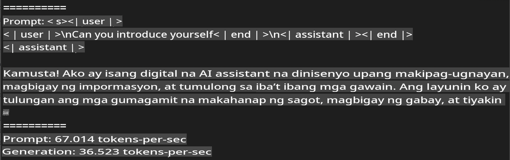
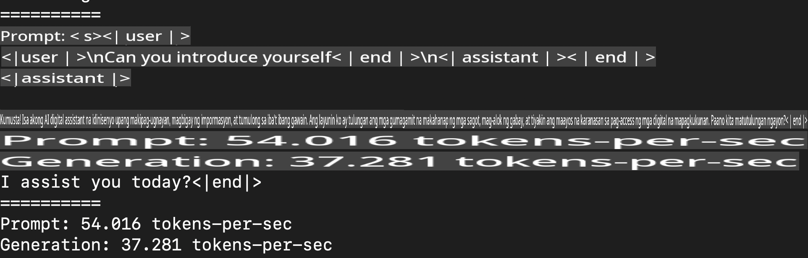
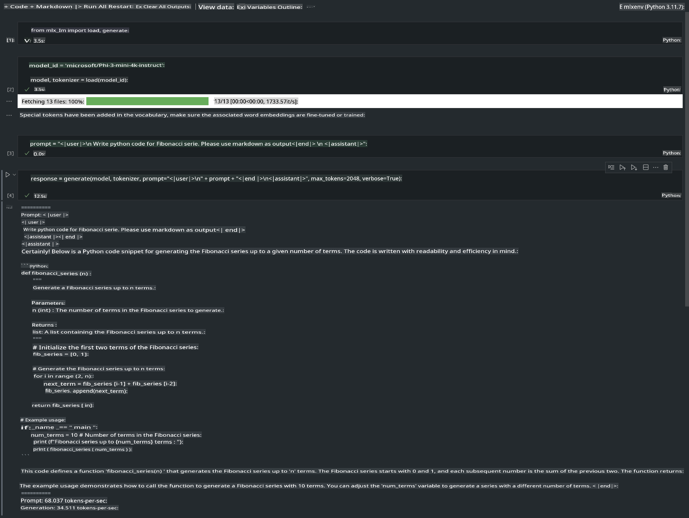

# **Inference Phi-3 gamit ang Apple MLX Framework**

## **Ano ang MLX Framework**

Ang MLX ay isang framework para sa machine learning research na nakatuon sa Apple silicon, na binuo ng Apple machine learning research team.

Idinisenyo ang MLX ng mga eksperto sa machine learning para sa mga eksperto rin sa larangang ito. Layunin nitong maging user-friendly habang nananatiling epektibo sa pagsasanay at pag-deploy ng mga modelo. Ang disenyo ng framework ay sadyang pinasimple upang mas madaling mapalawig at mapahusay ng mga mananaliksik ang MLX, nang mabilis na makapagsaliksik ng mga bagong ideya.

Maaaring mapabilis ang Large Language Models (LLMs) sa mga Apple Silicon devices gamit ang MLX, at madali itong patakbuhin nang lokal.

## **Paggamit ng MLX para sa inference ng Phi-3-mini**

### **1. I-set up ang iyong MLX environment**

1. Python 3.11.x  
2. I-install ang MLX Library  

```bash

pip install mlx-lm

```

### **2. Pagpapatakbo ng Phi-3-mini sa Terminal gamit ang MLX**

```bash

python -m mlx_lm.generate --model microsoft/Phi-3-mini-4k-instruct --max-token 2048 --prompt  "<|user|>\nCan you introduce yourself<|end|>\n<|assistant|>"

```

Ang resulta (ang aking environment ay Apple M1 Max, 64GB) ay:



### **3. Pag-quantize ng Phi-3-mini gamit ang MLX sa Terminal**

```bash

python -m mlx_lm.convert --hf-path microsoft/Phi-3-mini-4k-instruct

```

***Paalala:*** Ang modelo ay maaaring i-quantize gamit ang `mlx_lm.convert`, at ang default na quantization ay INT4. Sa halimbawang ito, ang Phi-3-mini ay i-quantize sa INT4.

Ang modelo ay maaaring i-quantize gamit ang `mlx_lm.convert`, at ang default na quantization ay INT4. Sa halimbawang ito, ang Phi-3-mini ay i-quantize sa INT4. Pagkatapos ng quantization, ito ay maiimbak sa default na direktoryo na `./mlx_model`.

Maaari nating subukan ang na-quantize na modelo gamit ang MLX mula sa terminal:

```bash

python -m mlx_lm.generate --model ./mlx_model/ --max-token 2048 --prompt  "<|user|>\nCan you introduce yourself<|end|>\n<|assistant|>"

```

Ang resulta ay:



### **4. Pagpapatakbo ng Phi-3-mini gamit ang MLX sa Jupyter Notebook**



***Paalala:*** Mangyaring basahin ang halimbawang ito [i-click ang link na ito](../../../../../code/03.Inference/MLX/MLX_DEMO.ipynb)

## **Mga Mapagkukunan**

1. Matuto tungkol sa Apple MLX Framework [https://ml-explore.github.io](https://ml-explore.github.io/mlx/build/html/index.html)

2. Apple MLX GitHub Repo [https://github.com/ml-explore](https://github.com/ml-explore)

**Paunawa**:  
Ang dokumentong ito ay isinalin gamit ang mga serbisyo ng AI na batay sa makina. Bagama't sinisikap naming maging tumpak, pakitandaan na ang mga awtomatikong pagsasalin ay maaaring maglaman ng mga pagkakamali o kamalian. Ang orihinal na dokumento sa orihinal nitong wika ang dapat ituring na opisyal na sanggunian. Para sa mahalagang impormasyon, inirerekomenda ang propesyonal na pagsasalin ng tao. Hindi kami mananagot para sa anumang hindi pagkakaunawaan o maling interpretasyon na dulot ng paggamit ng pagsasaling ito.