# Fine-tuning Phi-3 gamit ang Azure AI Foundry

Tuklasin natin kung paano i-fine-tune ang Phi-3 Mini language model ng Microsoft gamit ang Azure AI Foundry. Ang fine-tuning ay nagbibigay-daan upang iakma ang Phi-3 Mini sa mga partikular na gawain, na mas nagpapalakas at nagpapahusay sa kakayahan nito.

## Mga Dapat Isaalang-alang

- **Kakayahan:** Aling mga modelo ang maaaring i-fine-tune? Ano ang magagawa ng base model pagkatapos i-fine-tune?
- **Gastos:** Ano ang modelo ng pagpepresyo para sa fine-tuning?
- **Pagpapasadya:** Gaano kalawak ang maaaring baguhin sa base model – at sa anong paraan?
- **Kaginhawahan:** Paano ginagawa ang fine-tuning – kailangan ko bang magsulat ng custom code? Kailangan ko bang magdala ng sarili kong compute resources?
- **Kaligtasan:** Ang mga fine-tuned na modelo ay may mga panganib sa kaligtasan – may mga mekanismo bang nakahanda upang maiwasan ang di-sinasadyang pinsala?

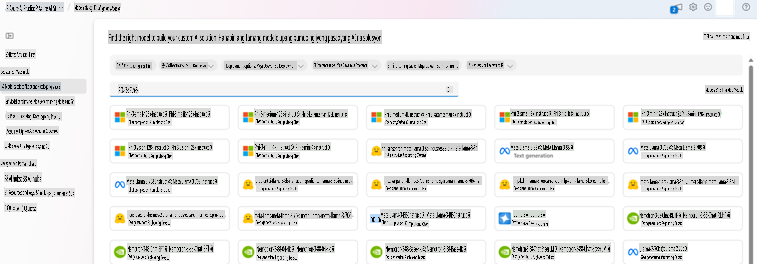

## Paghahanda para sa Fine-Tuning

### Mga Kinakailangan

> [!NOTE]
> Para sa mga modelo ng Phi-3 family, ang pay-as-you-go na fine-tune na alok ay available lamang sa mga hub na nilikha sa **East US 2** na rehiyon.

- Isang Azure subscription. Kung wala ka pang Azure subscription, gumawa ng [paid Azure account](https://azure.microsoft.com/pricing/purchase-options/pay-as-you-go) upang magsimula.

- Isang [AI Foundry project](https://ai.azure.com?WT.mc_id=aiml-138114-kinfeylo).
- Ginagamit ang Azure role-based access controls (Azure RBAC) upang magbigay ng access sa mga operasyon sa Azure AI Foundry. Upang maisagawa ang mga hakbang sa artikulong ito, ang iyong user account ay kailangang maitalaga sa __Azure AI Developer role__ sa resource group.

### Pagpaparehistro ng Subscription Provider

Siguraduhing nakarehistro ang subscription sa `Microsoft.Network` resource provider.

1. Mag-sign in sa [Azure portal](https://portal.azure.com).
1. Piliin ang **Subscriptions** mula sa kaliwang menu.
1. Piliin ang subscription na nais mong gamitin.
1. Piliin ang **AI project settings** > **Resource providers** mula sa kaliwang menu.
1. Kumpirmahin na ang **Microsoft.Network** ay nasa listahan ng resource providers. Kung hindi, idagdag ito.

### Paghahanda ng Data

Ihanda ang iyong training at validation data upang ma-finetune ang iyong modelo. Ang iyong training data at validation datasets ay binubuo ng input at output na mga halimbawa kung paano mo nais na gumana ang modelo.

Siguraduhin na ang lahat ng training examples ay sumusunod sa inaasahang format para sa inference. Upang epektibong ma-finetune ang mga modelo, tiyakin ang balanseng at magkakaibang dataset.

Kasama rito ang pagpapanatili ng balanse sa data, pagsasama ng iba't ibang senaryo, at pana-panahong pagrerepaso ng training data upang umayon sa mga inaasahan sa totoong mundo, na nagreresulta sa mas eksaktong at balanseng tugon ng modelo.

Iba't ibang uri ng modelo ang nangangailangan ng iba't ibang format ng training data.

### Chat Completion

Ang training at validation data na gagamitin mo **ay dapat** naka-format bilang JSON Lines (JSONL) na dokumento. Para sa `Phi-3-mini-128k-instruct`, ang fine-tuning dataset ay kailangang naka-format sa conversational format na ginagamit ng Chat completions API.

### Halimbawa ng Format ng File

```json
    {"messages": [{"role": "system", "content": "You are an Xbox customer support agent whose primary goal is to help users with issues they are experiencing with their Xbox devices. You are friendly and concise. You only provide factual answers to queries, and do not provide answers that are not related to Xbox."}, {"role": "user", "content": "Is Xbox better than PlayStation?"}, {"role": "assistant", "content": "I apologize, but I cannot provide personal opinions. My primary job is to assist you with any issues related to your Xbox device. Do you have any Xbox-related issues that need addressing?"}]}
    {"messages": [{"role": "system", "content": "You are an Xbox customer support agent whose primary goal is to help users with issues they are experiencing with their Xbox devices. You are friendly and concise. You only provide factual answers to queries, and do not provide answers that are not related to Xbox."}, {"role": "user", "content": "Can I play PC games on my Xbox?"}, {"role": "assistant", "content": "While Xbox consoles don't natively support PC games, they can play an array of Xbox games, many of which are also available on PC. Can I assist you with finding games compatible with your Xbox device?"}]}
    {"messages": [{"role": "system", "content": "You are an Xbox customer support agent whose primary goal is to help users with issues they are experiencing with their Xbox devices. You are friendly and concise. You only provide factual answers to queries, and do not provide answers that are not related to Xbox."}, {"role": "user", "content": "I'm having trouble connecting my Xbox to the Wi-Fi."}, {"role": "assistant", "content": "No worries, let's go through the network settings on your Xbox. Can you please tell me what happens when you try to connect it to the Wi-Fi?"}]}
```

Ang suportadong uri ng file ay JSON Lines. Ang mga file ay ina-upload sa default datastore at ginagawang available sa iyong proyekto.

## Fine-Tuning Phi-3 gamit ang Azure AI Foundry

Pinapayagan ka ng Azure AI Foundry na iakma ang mga malalaking language model sa iyong personal na datasets gamit ang proseso ng fine-tuning. Ang fine-tuning ay nagbibigay ng malaking halaga sa pamamagitan ng pagpapasadya at pag-optimize para sa mga partikular na gawain at aplikasyon. Nagdudulot ito ng mas mahusay na performance, mas mababang gastos, mas maikling latency, at mas akmang output.

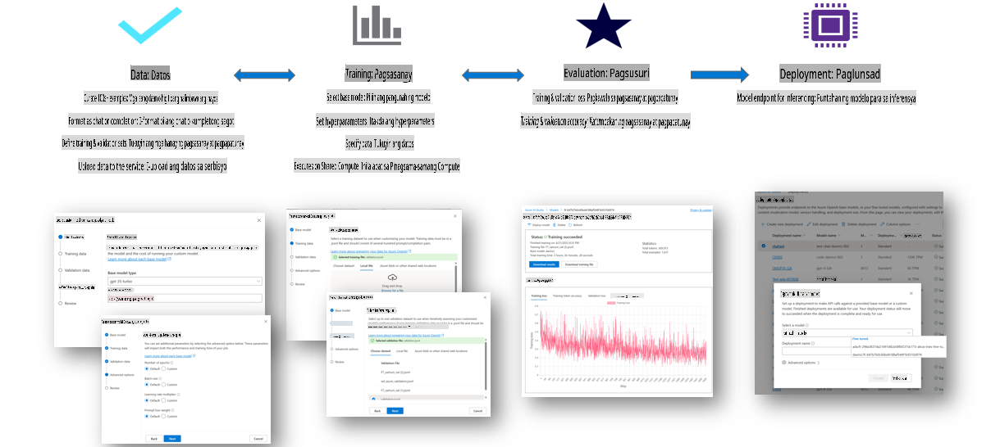

### Gumawa ng Bagong Proyekto

1. Mag-sign in sa [Azure AI Foundry](https://ai.azure.com).

1. Piliin ang **+New project** upang gumawa ng bagong proyekto sa Azure AI Foundry.

    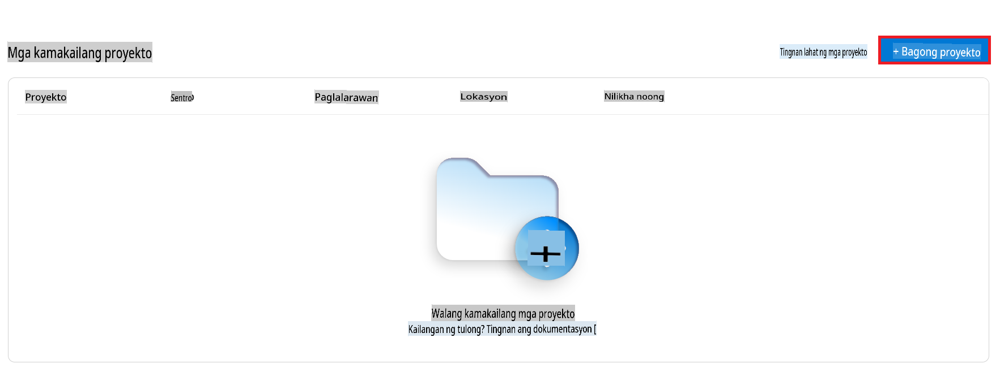

1. Gawin ang mga sumusunod:

    - **Hub name** ng proyekto. Kailangang natatanging halaga ito.
    - Piliin ang **Hub** na gagamitin (gumawa ng bago kung kinakailangan).

    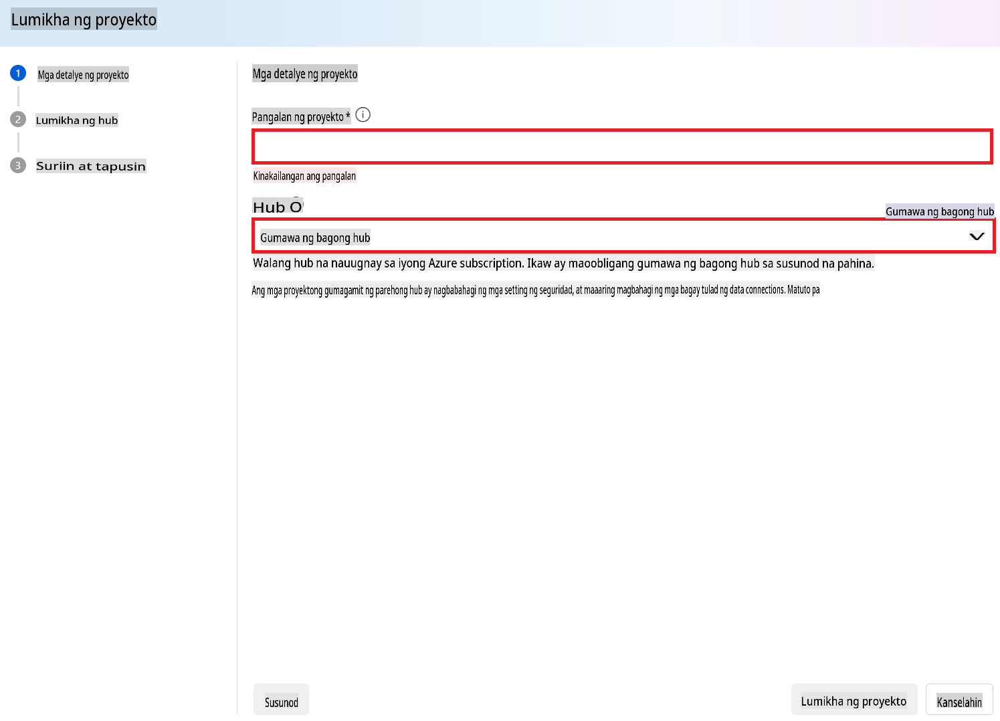

1. Upang gumawa ng bagong hub, gawin ang mga sumusunod:

    - Ipasok ang **Hub name**. Kailangang natatanging halaga ito.
    - Piliin ang iyong Azure **Subscription**.
    - Piliin ang **Resource group** na gagamitin (gumawa ng bago kung kinakailangan).
    - Piliin ang **Location** na nais mong gamitin.
    - Piliin ang **Connect Azure AI Services** na gagamitin (gumawa ng bago kung kinakailangan).
    - Piliin ang **Connect Azure AI Search** upang **Skip connecting**.

    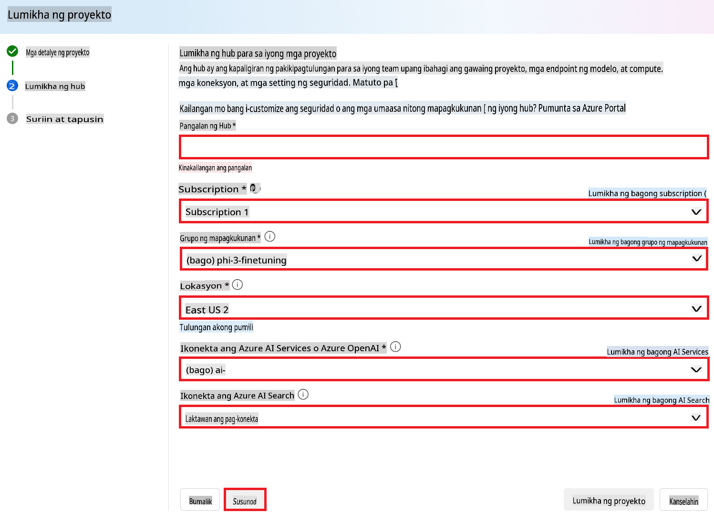

1. Piliin ang **Next**.
1. Piliin ang **Create a project**.

### Paghahanda ng Data

Bago ang fine-tuning, mangolekta o gumawa ng dataset na may kaugnayan sa iyong gawain, tulad ng mga chat instruction, tanong-sagot na pares, o iba pang kaugnay na text data. Linisin at i-preprocess ang data na ito sa pamamagitan ng pag-aalis ng ingay, paghawak ng mga nawawalang halaga, at pag-tokenize ng teksto.

### Fine-tune Phi-3 Models sa Azure AI Foundry

> [!NOTE]
> Sinusuportahan ang fine-tuning ng Phi-3 models sa mga proyektong matatagpuan sa East US 2.

1. Piliin ang **Model catalog** mula sa kaliwang tab.

1. I-type ang *phi-3* sa **search bar** at piliin ang phi-3 model na nais mong gamitin.

    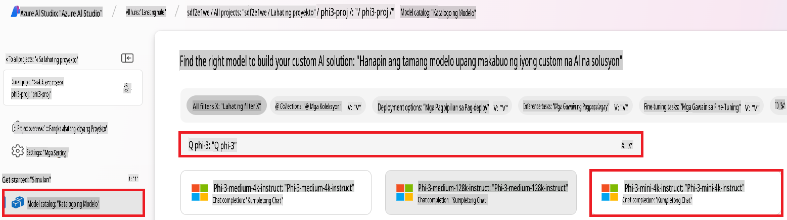

1. Piliin ang **Fine-tune**.

    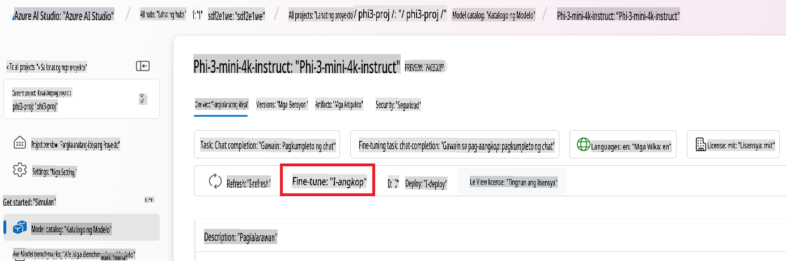

1. Ipasok ang **Fine-tuned model name**.

    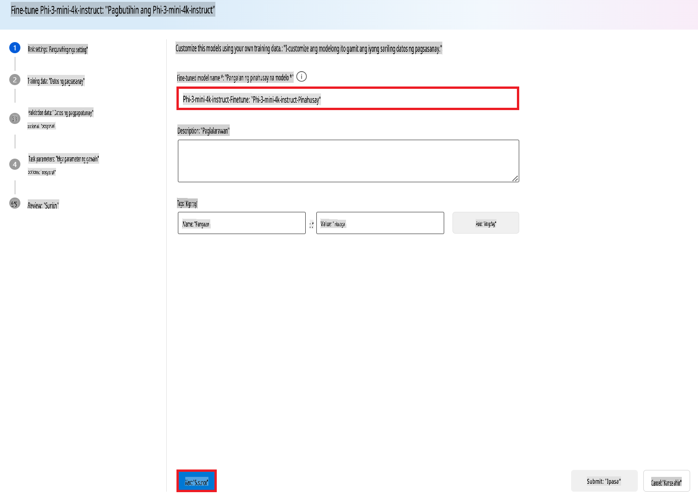

1. Piliin ang **Next**.

1. Gawin ang mga sumusunod:

    - Piliin ang **task type** sa **Chat completion**.
    - Piliin ang **Training data** na nais mong gamitin. Maaari mo itong i-upload sa pamamagitan ng Azure AI Foundry's data o mula sa iyong lokal na environment.

    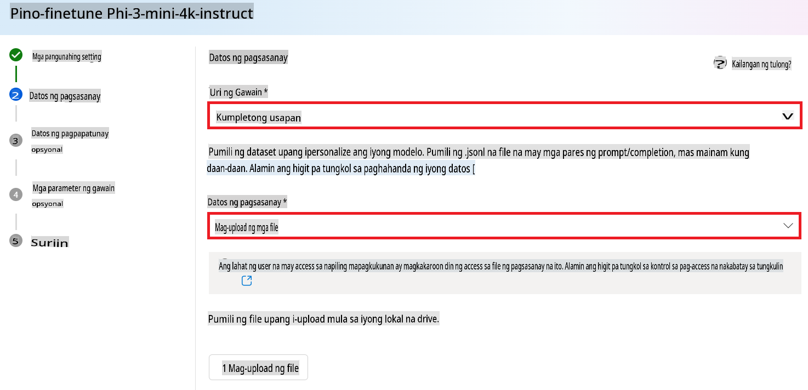

1. Piliin ang **Next**.

1. I-upload ang **Validation data** na nais mong gamitin, o piliin ang **Automatic split of training data**.

    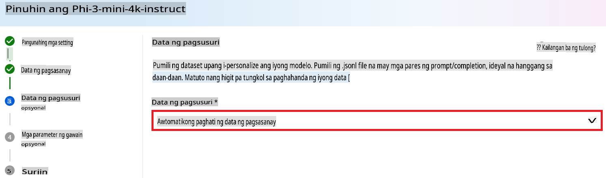

1. Piliin ang **Next**.

1. Gawin ang mga sumusunod:

    - Piliin ang **Batch size multiplier** na nais mong gamitin.
    - Piliin ang **Learning rate** na nais mong gamitin.
    - Piliin ang **Epochs** na nais mong gamitin.

    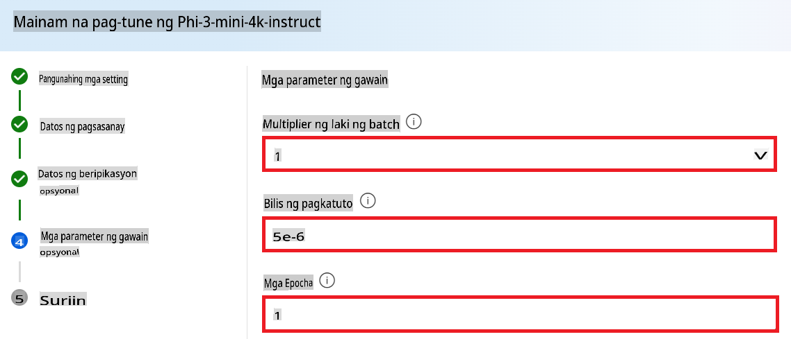

1. Piliin ang **Submit** upang simulan ang fine-tuning process.

    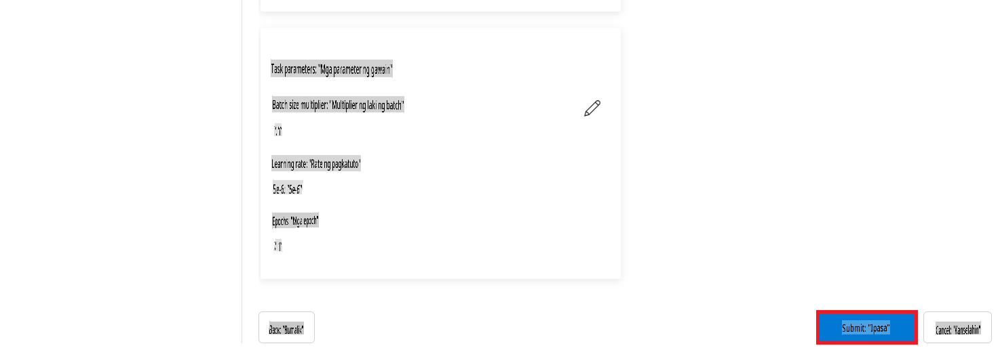

1. Kapag natapos ang fine-tuning ng iyong modelo, ang status nito ay ipapakita bilang **Completed**, tulad ng nasa larawan sa ibaba. Maaari mo na itong i-deploy at gamitin sa sarili mong aplikasyon, sa playground, o sa prompt flow. Para sa karagdagang impormasyon, tingnan ang [Paano mag-deploy ng Phi-3 family of small language models gamit ang Azure AI Foundry](https://learn.microsoft.com/azure/ai-studio/how-to/deploy-models-phi-3?tabs=phi-3-5&pivots=programming-language-python).

    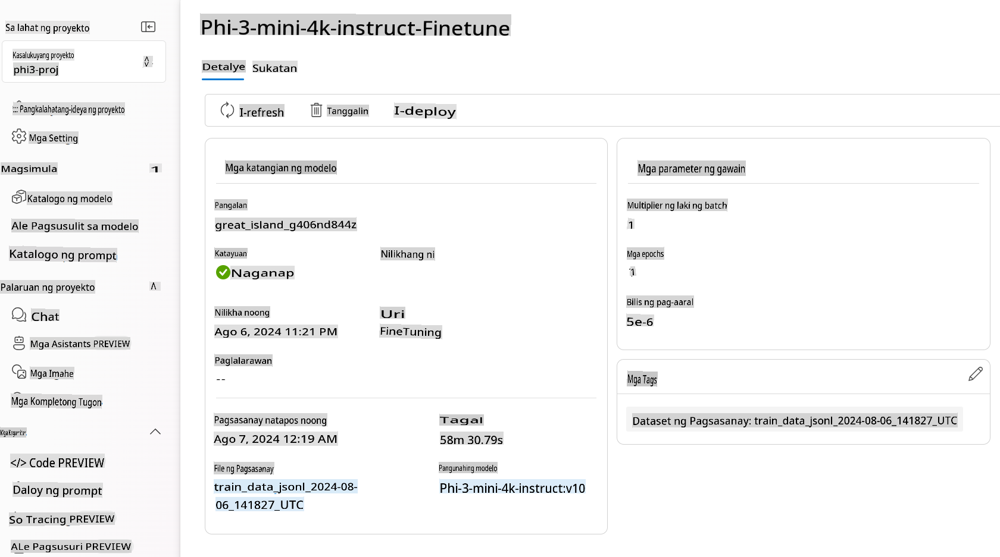

> [!NOTE]
> Para sa mas detalyadong impormasyon tungkol sa fine-tuning ng Phi-3, bisitahin ang [Fine-tune Phi-3 models in Azure AI Foundry](https://learn.microsoft.com/azure/ai-studio/how-to/fine-tune-phi-3?tabs=phi-3-mini).

## Paglilinis ng Fine-Tuned Models

Maaari mong tanggalin ang fine-tuned na modelo mula sa fine-tuning model list sa [Azure AI Foundry](https://ai.azure.com) o mula sa model details page. Piliin ang fine-tuned na modelo upang tanggalin mula sa Fine-tuning page, at pagkatapos ay piliin ang Delete button upang tanggalin ang modelo.

> [!NOTE]
> Hindi mo maaaring tanggalin ang isang custom na modelo kung mayroon itong umiiral na deployment. Kailangan mo munang tanggalin ang deployment bago mo ito tanggalin.

## Gastos at Quotas

### Mga Pagsasaalang-alang sa Gastos at Quota para sa Phi-3 Models na Fine-Tuned bilang Serbisyo

Ang Phi models na fine-tuned bilang serbisyo ay inaalok ng Microsoft at isinama sa Azure AI Foundry para magamit. Makikita mo ang pagpepresyo kapag [nag-deploy](https://learn.microsoft.com/azure/ai-studio/how-to/deploy-models-phi-3?tabs=phi-3-5&pivots=programming-language-python) o nag-fine-tune ng mga modelo sa ilalim ng Pricing and terms tab sa deployment wizard.

## Content Filtering

Ang mga modelong dineploy bilang serbisyo gamit ang pay-as-you-go ay protektado ng Azure AI Content Safety. Kapag dineploy sa real-time endpoints, maaari kang mag-opt out sa kakayahang ito. Sa Azure AI content safety na naka-enable, ang parehong prompt at completion ay dumadaan sa isang ensemble ng classification models na naglalayong tukuyin at pigilan ang paglabas ng mapanganib na nilalaman. Ang content filtering system ay tumutukoy at kumikilos sa mga partikular na kategorya ng potensyal na mapanganib na nilalaman sa parehong input prompts at output completions. Alamin pa ang tungkol sa [Azure AI Content Safety](https://learn.microsoft.com/azure/ai-studio/concepts/content-filtering).

**Fine-Tuning Configuration**

Hyperparameters: Tukuyin ang mga hyperparameters tulad ng learning rate, batch size, at bilang ng training epochs.

**Loss Function**

Pumili ng angkop na loss function para sa iyong gawain (e.g., cross-entropy).

**Optimizer**

Piliin ang optimizer (e.g., Adam) para sa gradient updates habang nagsasanay.

**Fine-Tuning Process**

- Load Pre-Trained Model: I-load ang Phi-3 Mini checkpoint.
- Magdagdag ng Custom Layers: Magdagdag ng task-specific layers (e.g., classification head para sa chat instructions).

**Train the Model**
I-finetune ang modelo gamit ang iyong inihandang dataset. Subaybayan ang progreso ng training at ayusin ang hyperparameters kung kinakailangan.

**Evaluation and Validation**

Validation Set: Hatiin ang iyong data sa training at validation sets.

**Evaluate Performance**

Gamitin ang mga metrics tulad ng accuracy, F1-score, o perplexity upang suriin ang performance ng modelo.

## I-save ang Fine-Tuned Model

**Checkpoint**
I-save ang fine-tuned na modelo para magamit sa hinaharap.

## Deployment

- I-deploy bilang Web Service: I-deploy ang iyong fine-tuned na modelo bilang web service sa Azure AI Foundry.
- Subukan ang Endpoint: Magpadala ng mga test query sa dineploy na endpoint upang tiyakin ang functionality nito.

## Iterasyon at Pagpapabuti

Iterate: Kung hindi sapat ang performance, mag-iterate sa pamamagitan ng pag-aadjust ng hyperparameters, pagdaragdag ng data, o pag-fine-tune para sa karagdagang epochs.

## Subaybayan at I-refine

Patuloy na subaybayan ang kilos ng modelo at i-refine kung kinakailangan.

## Pagpapasadya at Pagpapalawak

Custom Tasks: Maaaring i-fine-tune ang Phi-3 Mini para sa iba't ibang gawain lampas sa chat instructions. Tuklasin ang iba pang mga use case!
Mag-eksperimento: Subukan ang iba't ibang arkitektura, kombinasyon ng layers, at mga teknik upang mapahusay ang performance.

> [!NOTE]
> Ang fine-tuning ay isang iterative na proseso. Mag-eksperimento, matuto, at iakma ang iyong modelo upang makamit ang pinakamahusay na resulta para sa iyong partikular na gawain!

**Paunawa**:  
Ang dokumentong ito ay isinalin gamit ang mga serbisyong AI na nakabatay sa makina. Bagama't sinisikap naming maging tumpak, mangyaring tandaan na ang mga awtomatikong pagsasalin ay maaaring maglaman ng mga pagkakamali o hindi pagkakatugma. Ang orihinal na dokumento sa orihinal nitong wika ang dapat ituring na opisyal na sanggunian. Para sa mahalagang impormasyon, inirerekomenda ang propesyonal na pagsasalin ng tao. Hindi kami mananagot sa anumang hindi pagkakaunawaan o maling interpretasyon na dulot ng paggamit ng pagsasaling ito.