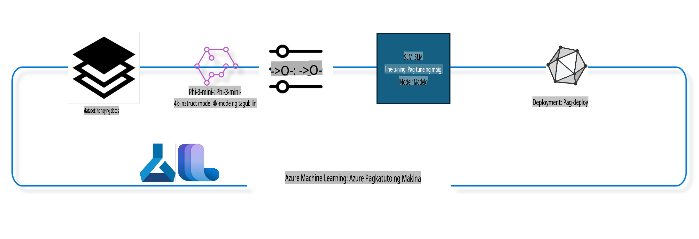

## Paano gamitin ang mga chat-completion na bahagi mula sa Azure ML system registry para i-fine-tune ang isang modelo

Sa halimbawang ito, gagawin natin ang fine-tuning ng Phi-3-mini-4k-instruct model upang tapusin ang isang pag-uusap sa pagitan ng dalawang tao gamit ang ultrachat_200k dataset.



Ipapakita ng halimbawa kung paano gawin ang fine-tuning gamit ang Azure ML SDK at Python, at pagkatapos ay i-deploy ang fine-tuned na modelo sa isang online endpoint para sa real-time na inference.

### Training Data

Gagamitin natin ang ultrachat_200k dataset. Ito ay isang mabigat na na-filter na bersyon ng UltraChat dataset na ginamit upang sanayin ang Zephyr-7B-β, isang state-of-the-art na 7B chat model.

### Modelo

Gagamitin natin ang Phi-3-mini-4k-instruct model upang ipakita kung paano maaaring i-finetune ng user ang isang modelo para sa chat-completion task. Kung binuksan mo ang notebook na ito mula sa isang partikular na model card, tandaan na palitan ang partikular na pangalan ng modelo.

### Mga Gawain

- Pumili ng modelong i-fine-tune.
- Pumili at suriin ang training data.
- I-configure ang fine-tuning job.
- Patakbuhin ang fine-tuning job.
- Suriin ang training at evaluation metrics.
- Irehistro ang fine-tuned na modelo.
- I-deploy ang fine-tuned na modelo para sa real-time inference.
- Linisin ang mga resources.

## 1. I-setup ang mga kinakailangan

- I-install ang mga dependencies.
- Kumonekta sa AzureML Workspace. Matuto pa sa set up SDK authentication. Palitan ang <WORKSPACE_NAME>, <RESOURCE_GROUP>, at <SUBSCRIPTION_ID> sa ibaba.
- Kumonekta sa azureml system registry.
- Magtakda ng opsyonal na pangalan para sa eksperimento.
- I-check o lumikha ng compute.

> [!NOTE]
> Ang isang node ng GPU ay maaaring may maraming GPU cards. Halimbawa, sa isang node ng Standard_NC24rs_v3, mayroong 4 na NVIDIA V100 GPUs, habang sa Standard_NC12s_v3, mayroong 2 NVIDIA V100 GPUs. Tingnan ang mga dokumento para sa impormasyong ito. Ang bilang ng GPU cards bawat node ay itinatakda sa param gpus_per_node sa ibaba. Ang tamang pagtatakda ng value na ito ay magtitiyak ng tamang paggamit ng lahat ng GPUs sa node. Ang mga inirerekomendang GPU compute SKUs ay matatagpuan dito at dito.

### Mga Library ng Python

I-install ang mga dependencies sa pamamagitan ng pagpapatakbo ng cell sa ibaba. Hindi ito opsyonal kung tumatakbo sa bagong environment.

```bash
pip install azure-ai-ml
pip install azure-identity
pip install datasets==2.9.0
pip install mlflow
pip install azureml-mlflow
```

### Pakikipag-ugnayan sa Azure ML

1. Ang Python script na ito ay ginagamit upang makipag-ugnayan sa Azure Machine Learning (Azure ML) service. Narito ang breakdown ng ginagawa nito:

    - Ini-import nito ang mga kinakailangang module mula sa azure.ai.ml, azure.identity, at azure.ai.ml.entities packages. Ini-import din nito ang time module.

    - Sinusubukan nitong mag-authenticate gamit ang DefaultAzureCredential(), na nagbibigay ng simpleng paraan ng authentication para mabilis na makapagsimula sa pag-develop ng mga application sa Azure cloud. Kung mabigo ito, lilipat ito sa InteractiveBrowserCredential(), na nagbibigay ng interactive na login prompt.

    - Sinusubukan nitong gumawa ng MLClient instance gamit ang from_config method, na nagbabasa ng configuration mula sa default config file (config.json). Kung mabigo ito, manu-manong gumagawa ito ng MLClient instance sa pamamagitan ng pagbibigay ng subscription_id, resource_group_name, at workspace_name.

    - Gumagawa ito ng isa pang MLClient instance, sa pagkakataong ito para sa Azure ML registry na tinatawag na "azureml". Ang registry na ito ay kung saan naka-store ang mga modelo, fine-tuning pipelines, at environments.

    - Itinatakda nito ang experiment_name sa "chat_completion_Phi-3-mini-4k-instruct".

    - Gumagawa ito ng natatanging timestamp sa pamamagitan ng pag-convert ng kasalukuyang oras (sa segundo mula noong epoch, bilang floating point number) sa integer at pagkatapos ay sa string. Ang timestamp na ito ay maaaring gamitin para sa paggawa ng natatanging mga pangalan at bersyon.

    ```python
    # Import necessary modules from Azure ML and Azure Identity
    from azure.ai.ml import MLClient
    from azure.identity import (
        DefaultAzureCredential,
        InteractiveBrowserCredential,
    )
    from azure.ai.ml.entities import AmlCompute
    import time  # Import time module
    
    # Try to authenticate using DefaultAzureCredential
    try:
        credential = DefaultAzureCredential()
        credential.get_token("https://management.azure.com/.default")
    except Exception as ex:  # If DefaultAzureCredential fails, use InteractiveBrowserCredential
        credential = InteractiveBrowserCredential()
    
    # Try to create an MLClient instance using the default config file
    try:
        workspace_ml_client = MLClient.from_config(credential=credential)
    except:  # If that fails, create an MLClient instance by manually providing the details
        workspace_ml_client = MLClient(
            credential,
            subscription_id="<SUBSCRIPTION_ID>",
            resource_group_name="<RESOURCE_GROUP>",
            workspace_name="<WORKSPACE_NAME>",
        )
    
    # Create another MLClient instance for the Azure ML registry named "azureml"
    # This registry is where models, fine-tuning pipelines, and environments are stored
    registry_ml_client = MLClient(credential, registry_name="azureml")
    
    # Set the experiment name
    experiment_name = "chat_completion_Phi-3-mini-4k-instruct"
    
    # Generate a unique timestamp that can be used for names and versions that need to be unique
    timestamp = str(int(time.time()))
    ```

## 2. Pumili ng foundation model para i-fine-tune

1. Ang Phi-3-mini-4k-instruct ay isang 3.8B parameters, lightweight, state-of-the-art open model na binuo gamit ang mga dataset na ginamit para sa Phi-2. Ang modelo ay kabilang sa Phi-3 model family, at ang Mini na bersyon ay may dalawang variant: 4K at 128K, na ang context length (sa tokens) na kaya nitong suportahan. Kailangan nating i-finetune ang modelo para sa ating partikular na layunin upang magamit ito. Maaari mong tingnan ang mga modelong ito sa Model Catalog sa AzureML Studio, gamit ang filter para sa chat-completion task. Sa halimbawang ito, ginagamit natin ang Phi-3-mini-4k-instruct model. Kung binuksan mo ang notebook na ito para sa ibang modelo, palitan ang pangalan at bersyon ng modelo nang naaayon.

    > [!NOTE]
    > ang model id property ng modelo. Ito ay ipapasa bilang input sa fine-tuning job. Makikita rin ito bilang Asset ID field sa model details page sa AzureML Studio Model Catalog.

2. Ang Python script na ito ay nakikipag-ugnayan sa Azure Machine Learning (Azure ML) service. Narito ang breakdown ng ginagawa nito:

    - Itinatakda nito ang model_name sa "Phi-3-mini-4k-instruct".

    - Ginagamit nito ang get method ng models property ng registry_ml_client object upang makuha ang pinakabagong bersyon ng modelo gamit ang pangalan na tinukoy mula sa Azure ML registry. Ang get method ay tinatawag gamit ang dalawang argumento: ang pangalan ng modelo at isang label na nagsasaad na ang pinakabagong bersyon ng modelo ang dapat makuha.

    - Nagpi-print ito ng mensahe sa console na nagpapahiwatig ng pangalan, bersyon, at id ng modelong gagamitin para sa fine-tuning. Ang format method ng string ay ginagamit upang ipasok ang pangalan, bersyon, at id ng modelo sa mensahe. Ang pangalan, bersyon, at id ng modelo ay ina-access bilang properties ng foundation_model object.

    ```python
    # Set the model name
    model_name = "Phi-3-mini-4k-instruct"
    
    # Get the latest version of the model from the Azure ML registry
    foundation_model = registry_ml_client.models.get(model_name, label="latest")
    
    # Print the model name, version, and id
    # This information is useful for tracking and debugging
    print(
        "\n\nUsing model name: {0}, version: {1}, id: {2} for fine tuning".format(
            foundation_model.name, foundation_model.version, foundation_model.id
        )
    )
    ```

## 3. Gumawa ng compute na gagamitin sa job

Ang fine-tune job ay GUMAGANA LAMANG gamit ang GPU compute. Ang laki ng compute ay nakadepende sa laki ng modelo, at sa karamihan ng mga kaso, mahirap tukuyin ang tamang compute para sa job. Sa cell na ito, ginagabayan ang user upang piliin ang tamang compute para sa job.

> [!NOTE]
> Ang mga compute na nakalista sa ibaba ay gumagana sa pinaka-optimize na configuration. Ang anumang pagbabago sa configuration ay maaaring magdulot ng Cuda Out Of Memory error. Sa ganitong mga kaso, subukang i-upgrade ang compute sa mas malaking compute size.

> [!NOTE]
> Habang pinipili ang compute_cluster_size sa ibaba, siguraduhing available ang compute sa iyong resource group. Kung ang partikular na compute ay hindi available, maaari kang mag-request na magkaroon ng access sa compute resources.

### Pag-check ng Model para sa Fine-Tuning Support

1. Ang Python script na ito ay nakikipag-ugnayan sa Azure Machine Learning (Azure ML) model. Narito ang breakdown ng ginagawa nito:

    - Ini-import nito ang ast module, na nagbibigay ng mga function upang iproseso ang mga puno ng Python abstract syntax grammar.

    - Sini-check nito kung ang foundation_model object (na kumakatawan sa isang modelo sa Azure ML) ay may tag na tinatawag na finetune_compute_allow_list. Ang mga tag sa Azure ML ay mga key-value pair na maaari mong gawin at gamitin upang i-filter at ayusin ang mga modelo.

    - Kung ang finetune_compute_allow_list tag ay naroroon, ginagamit nito ang ast.literal_eval function upang ligtas na i-parse ang value ng tag (isang string) sa isang Python list. Ang list na ito ay itinalaga sa computes_allow_list variable. Nagpi-print ito ng mensahe na nagsasabi na ang compute ay dapat gawin mula sa listahan.

    - Kung ang finetune_compute_allow_list tag ay wala, itinatakda nito ang computes_allow_list sa None at nagpi-print ng mensahe na nagsasabi na ang finetune_compute_allow_list tag ay hindi bahagi ng mga tag ng modelo.

    - Sa kabuuan, ang script na ito ay nagche-check para sa isang partikular na tag sa metadata ng modelo, kino-convert ang value ng tag sa isang list kung ito ay naroroon, at nagbibigay ng feedback sa user nang naaayon.

    ```python
    # Import the ast module, which provides functions to process trees of the Python abstract syntax grammar
    import ast
    
    # Check if the 'finetune_compute_allow_list' tag is present in the model's tags
    if "finetune_compute_allow_list" in foundation_model.tags:
        # If the tag is present, use ast.literal_eval to safely parse the tag's value (a string) into a Python list
        computes_allow_list = ast.literal_eval(
            foundation_model.tags["finetune_compute_allow_list"]
        )  # convert string to python list
        # Print a message indicating that a compute should be created from the list
        print(f"Please create a compute from the above list - {computes_allow_list}")
    else:
        # If the tag is not present, set computes_allow_list to None
        computes_allow_list = None
        # Print a message indicating that the 'finetune_compute_allow_list' tag is not part of the model's tags
        print("`finetune_compute_allow_list` is not part of model tags")
    ```

### Pag-check ng Compute Instance

1. Ang Python script na ito ay nakikipag-ugnayan sa Azure Machine Learning (Azure ML) service at nagsasagawa ng ilang pagsusuri sa isang compute instance. Narito ang breakdown ng ginagawa nito:

    - Sinusubukan nitong kunin ang compute instance gamit ang pangalan na naka-store sa compute_cluster mula sa Azure ML workspace. Kung ang provisioning state ng compute instance ay "failed", nagra-raise ito ng ValueError.

    - Sini-check nito kung ang computes_allow_list ay hindi None. Kung hindi ito None, kino-convert nito ang lahat ng compute sizes sa list sa lowercase at sini-check kung ang size ng kasalukuyang compute instance ay nasa listahan. Kung wala ito, nagra-raise ito ng ValueError.

    - Kung ang computes_allow_list ay None, sini-check nito kung ang size ng compute instance ay nasa listahan ng mga hindi suportadong GPU VM sizes. Kung nasa listahan ito, nagra-raise ito ng ValueError.

    - Kinukuha nito ang listahan ng lahat ng available na compute sizes sa workspace. Ini-iterate nito ang listahan, at para sa bawat compute size, sini-check nito kung ang pangalan nito ay tumutugma sa size ng kasalukuyang compute instance. Kung oo, kinukuha nito ang bilang ng GPUs para sa compute size na iyon at itinatakda ang gpu_count_found sa True.

    - Kung ang gpu_count_found ay True, nagpi-print ito ng bilang ng GPUs sa compute instance. Kung ang gpu_count_found ay False, nagra-raise ito ng ValueError.

    - Sa kabuuan, ang script na ito ay nagsasagawa ng ilang pagsusuri sa isang compute instance sa Azure ML workspace, kabilang ang pag-check sa provisioning state nito, ang size nito laban sa allow list o deny list, at ang bilang ng GPUs na mayroon ito.

    ```python
    # Print the exception message
    print(e)
    # Raise a ValueError if the compute size is not available in the workspace
    raise ValueError(
        f"WARNING! Compute size {compute_cluster_size} not available in workspace"
    )
    
    # Retrieve the compute instance from the Azure ML workspace
    compute = workspace_ml_client.compute.get(compute_cluster)
    # Check if the provisioning state of the compute instance is "failed"
    if compute.provisioning_state.lower() == "failed":
        # Raise a ValueError if the provisioning state is "failed"
        raise ValueError(
            f"Provisioning failed, Compute '{compute_cluster}' is in failed state. "
            f"please try creating a different compute"
        )
    
    # Check if computes_allow_list is not None
    if computes_allow_list is not None:
        # Convert all compute sizes in computes_allow_list to lowercase
        computes_allow_list_lower_case = [x.lower() for x in computes_allow_list]
        # Check if the size of the compute instance is in computes_allow_list_lower_case
        if compute.size.lower() not in computes_allow_list_lower_case:
            # Raise a ValueError if the size of the compute instance is not in computes_allow_list_lower_case
            raise ValueError(
                f"VM size {compute.size} is not in the allow-listed computes for finetuning"
            )
    else:
        # Define a list of unsupported GPU VM sizes
        unsupported_gpu_vm_list = [
            "standard_nc6",
            "standard_nc12",
            "standard_nc24",
            "standard_nc24r",
        ]
        # Check if the size of the compute instance is in unsupported_gpu_vm_list
        if compute.size.lower() in unsupported_gpu_vm_list:
            # Raise a ValueError if the size of the compute instance is in unsupported_gpu_vm_list
            raise ValueError(
                f"VM size {compute.size} is currently not supported for finetuning"
            )
    
    # Initialize a flag to check if the number of GPUs in the compute instance has been found
    gpu_count_found = False
    # Retrieve a list of all available compute sizes in the workspace
    workspace_compute_sku_list = workspace_ml_client.compute.list_sizes()
    available_sku_sizes = []
    # Iterate over the list of available compute sizes
    for compute_sku in workspace_compute_sku_list:
        available_sku_sizes.append(compute_sku.name)
        # Check if the name of the compute size matches the size of the compute instance
        if compute_sku.name.lower() == compute.size.lower():
            # If it does, retrieve the number of GPUs for that compute size and set gpu_count_found to True
            gpus_per_node = compute_sku.gpus
            gpu_count_found = True
    # If gpu_count_found is True, print the number of GPUs in the compute instance
    if gpu_count_found:
        print(f"Number of GPU's in compute {compute.size}: {gpus_per_node}")
    else:
        # If gpu_count_found is False, raise a ValueError
        raise ValueError(
            f"Number of GPU's in compute {compute.size} not found. Available skus are: {available_sku_sizes}."
            f"This should not happen. Please check the selected compute cluster: {compute_cluster} and try again."
        )
    ```

## 4. Pumili ng dataset para i-fine-tune ang modelo

1. Ginagamit natin ang ultrachat_200k dataset. Ang dataset ay may apat na splits, na angkop para sa Supervised fine-tuning (sft).
Generation ranking (gen). Ang bilang ng mga halimbawa bawat split ay ipinapakita tulad ng sumusunod:

    ```bash
    train_sft test_sft  train_gen  test_gen
    207865  23110  256032  28304
    ```

1. Ang mga sumusunod na cell ay nagpapakita ng basic na paghahanda ng data para sa fine-tuning:

### I-visualize ang ilang data rows

Gusto nating mabilis na patakbuhin ang sample na ito, kaya't i-save ang train_sft, test_sft files na naglalaman ng 5% ng mga na-trim na rows. Nangangahulugan ito na ang fine-tuned na modelo ay magkakaroon ng mas mababang accuracy, kaya't hindi ito dapat gamitin sa totoong mundo.
Ang download-dataset.py ay ginagamit upang i-download ang ultrachat_200k dataset at i-transform ang dataset sa format na maaaring magamit ng fine-tune pipeline component. Dahil ang dataset ay malaki, dito ay bahagi lamang ng dataset ang ginagamit.

1. Ang pagpapatakbo ng script sa ibaba ay nagda-download lamang ng 5% ng data. Maaari itong dagdagan sa pamamagitan ng pagbabago ng dataset_split_pc parameter sa nais na porsyento.

    > [!NOTE]
    > Ang ilang mga language model ay may iba't ibang language codes kaya't ang mga pangalan ng column sa dataset ay dapat tumutugma sa mga ito.

1. Narito ang isang halimbawa kung paano dapat magmukha ang data:
Ang chat-completion dataset ay naka-store sa parquet format, kung saan ang bawat entry ay sumusunod sa schema na ito:

    - Isang JSON (JavaScript Object Notation) document, na isang popular na format para sa pagpapalitan ng data. Narito ang breakdown ng istruktura nito:

    - "prompt": Naglalaman ng string na nagsasaad ng isang gawain o tanong na ibinibigay sa AI assistant.

    - "messages": Naglalaman ng array ng mga object. Bawat object ay kumakatawan sa isang mensahe sa pag-uusap sa pagitan ng isang user at AI assistant. Ang bawat message object ay may dalawang key:

    - "content": Naglalaman ng string na nagsasaad ng nilalaman ng mensahe.
    - "role": Naglalaman ng string na nagsasaad ng papel ng nagpadala ng mensahe. Maaari itong "user" o "assistant".
    - "prompt_id": Naglalaman ng string na nagsasaad ng natatanging identifier para sa prompt.

1. Sa partikular na JSON document na ito, isang pag-uusap ang kinakatawan kung saan humihiling ang user sa AI assistant na lumikha ng isang bida para sa isang dystopian na kwento. Tumutugon ang assistant, at pagkatapos ay humihiling ang user ng higit pang detalye. Pumapayag ang assistant na magbigay ng higit pang detalye. Ang buong pag-uusap ay nauugnay sa isang partikular na prompt id.

    ```python
    {
        // The task or question posed to an AI assistant
        "prompt": "Create a fully-developed protagonist who is challenged to survive within a dystopian society under the rule of a tyrant. ...",
        
        // An array of objects, each representing a message in a conversation between a user and an AI assistant
        "messages":[
            {
                // The content of the user's message
                "content": "Create a fully-developed protagonist who is challenged to survive within a dystopian society under the rule of a tyrant. ...",
                // The role of the entity that sent the message
                "role": "user"
            },
            {
                // The content of the assistant's message
                "content": "Name: Ava\n\n Ava was just 16 years old when the world as she knew it came crashing down. The government had collapsed, leaving behind a chaotic and lawless society. ...",
                // The role of the entity that sent the message
                "role": "assistant"
            },
            {
                // The content of the user's message
                "content": "Wow, Ava's story is so intense and inspiring! Can you provide me with more details.  ...",
                // The role of the entity that sent the message
                "role": "user"
            }, 
            {
                // The content of the assistant's message
                "content": "Certainly! ....",
                // The role of the entity that sent the message
                "role": "assistant"
            }
        ],
        
        // A unique identifier for the prompt
        "prompt_id": "d938b65dfe31f05f80eb8572964c6673eddbd68eff3db6bd234d7f1e3b86c2af"
    }
    ```

### I-download ang Data

1. Ang Python script na ito ay ginagamit upang mag-download ng dataset gamit ang helper script na download-dataset.py. Narito ang breakdown ng ginagawa nito:

    - Ini-import nito ang os module, na nagbibigay ng portable na paraan ng paggamit ng operating system dependent functionality.

    - Ginagamit nito ang os.system function upang patakbuhin ang download-dataset.py script sa shell gamit ang mga partikular na command-line arguments. Ang mga argumento ay nagsasaad ng dataset na ida-download (HuggingFaceH4/ultrachat_200k), ang directory kung saan ito ida-download (ultrachat_200k_dataset), at ang porsyento ng dataset na isusplit (5). Ang os.system function ay nagbabalik ng exit status ng command na na-execute; ang status na ito ay naka-store sa exit_status variable.

    - Sini-check nito kung ang exit_status ay hindi 0. Sa Unix-like operating systems, ang exit status na 0 ay karaniwang nagsasaad na ang command ay matagumpay, habang ang anumang ibang numero ay nagsasaad ng error. Kung ang exit_status ay hindi 0, nagra-raise ito ng Exception na may mensaheng nagsasaad na may error sa pag-download ng dataset.

    - Sa kabuuan, ang script na ito ay nagpapatakbo ng command upang mag-download ng dataset gamit ang helper script, at nagra-raise ng exception kung mabigo ang command.

    ```python
    # Import the os module, which provides a way of using operating system dependent functionality
    import os
    
    # Use the os.system function to run the download-dataset.py script in the shell with specific command-line arguments
    # The arguments specify the dataset to download (HuggingFaceH4/ultrachat_200k), the directory to download it to (ultrachat_200k_dataset), and the percentage of the dataset to split (5)
    # The os.system function returns the exit status of the command it executed; this status is stored in the exit_status variable
    exit_status = os.system(
        "python ./download-dataset.py --dataset HuggingFaceH4/ultrachat_200k --download_dir ultrachat_200k_dataset --dataset_split_pc 5"
    )
    
    # Check if exit_status is not 0
    # In Unix-like operating systems, an exit status of 0 usually indicates that a command has succeeded, while any other number indicates an error
    # If exit_status is not 0, raise an Exception with a message indicating that there was an error downloading the dataset
    if exit_status != 0:
        raise Exception("Error downloading dataset")
    ```

### Pag-load ng Data sa isang DataFrame

1. Ang Python script na ito ay naglo-load ng JSON Lines file sa isang pandas DataFrame at ipinapakita ang unang 5 rows. Narito ang breakdown ng ginagawa nito:

    - Ini-import nito ang pandas library, na isang makapangyarihang library para sa data manipulation at analysis.

    - Itinatakda nito ang maximum na lapad ng column para sa pandas' display options sa 0. Nangangahulugan ito na ang buong text ng bawat column ay ipapakita nang walang truncation kapag na-print ang DataFrame.

    - Ginagamit nito ang pd.read_json function upang i-load ang train_sft.jsonl file mula sa ultrachat_200k_dataset directory papunta sa isang DataFrame. Ang lines=True argument ay nagsasaad na ang file ay nasa JSON Lines format, kung saan ang bawat linya ay isang hiwalay na JSON object.

    - Ginagamit nito ang head method upang ipakita ang unang 5 rows ng DataFrame. Kung ang DataFrame ay may mas kaunti sa 5 rows, ipapakita nito ang lahat ng ito.

    - Sa kabuuan, ang script na ito ay naglo-load ng JSON Lines file sa isang DataFrame at ipinapakita ang unang 5 rows na may buong text ng column.

    ```python
    # Import the pandas library, which is a powerful data manipulation and analysis library
    import pandas as pd
    
    # Set the maximum column width for pandas' display options to 0
    # This means that the full text of each column will be displayed without truncation when the DataFrame is printed
    pd.set_option("display.max_colwidth", 0)
    
    # Use the pd.read_json function to load the train_sft.jsonl file from the ultrachat_200k_dataset directory into a DataFrame
    # The lines=True argument indicates that the file is in JSON Lines format, where each line is a separate JSON object
    df = pd.read_json("./ultrachat_200k_dataset/train_sft.jsonl", lines=True)
    
    # Use the head method to display the first 5 rows of the DataFrame
    # If the DataFrame has less than 5 rows, it will display all of them
    df.head()
    ```

## 5. I-submit ang fine-tuning job gamit ang model at data bilang inputs

Gumawa ng job na gumagamit ng chat-completion pipeline component. Matuto pa tungkol sa lahat ng mga parameter na sinusuportahan para sa fine-tuning.

### Tukuyin ang fine-tune parameters

1. Ang fine-tune parameters ay maaaring hatiin sa 2 kategorya - training parameters, optimization parameters.

1. Ang training parameters ay tumutukoy sa mga aspeto ng training tulad ng:

    - Ang optimizer, scheduler na gagamitin.
    - Ang metric na i-o-optimize sa fine-tune.
    - Bilang ng training steps, batch size, at iba pa.

1. Ang optimization parameters ay tumutulong sa pag-optimize ng GPU memory at epektibong paggamit ng compute resources.

1. Narito ang ilan sa mga parameter na kabilang sa kategoryang ito. Ang optimization parameters ay nagkakaiba para sa bawat modelo at naka-package sa modelo upang hawakan ang mga pagkakaibang ito.

    - Paganahin ang deepspeed at LoRA.
    - Paganahin ang mixed precision training.
    - Paganahin ang multi-node training.

> [!NOTE]
> Ang supervised fine-tuning ay maaaring magdulot ng pagkawala ng alignment o catastrophic forgetting. Inirerekomenda naming i-check ang isyung ito at magsagawa ng alignment stage pagkatapos ng fine-tuning.

### Fine Tuning Parameters

1. Ang Python script na ito ay nagse-set up ng parameters para sa fine-tuning ng machine learning model. Narito ang breakdown ng ginagawa nito:

    - Itinatakda nito ang default na training parameters tulad ng bilang ng training epochs, batch sizes para sa training at evaluation, learning rate, at learning rate scheduler type.

    - Itinatakda nito ang default na optimization parameters tulad ng kung gagamit ng Layer-wise Relevance Propagation (LoRa) at DeepSpeed, at ang DeepSpeed stage.

    - Pinagsasama nito ang training at optimization parameters sa isang dictionary na tinatawag na finetune_parameters.

   
### Pipeline ng Pagsasanay
Ang script na ito ay nagse-set up ng pipeline ng pagsasanay batay sa iba't ibang parameter, at pagkatapos ay ipinapakita ang display name. ```python
    # Define a function to generate a display name for the training pipeline
    def get_pipeline_display_name():
        # Calculate the total batch size by multiplying the per-device batch size, the number of gradient accumulation steps, the number of GPUs per node, and the number of nodes used for fine-tuning
        batch_size = (
            int(finetune_parameters.get("per_device_train_batch_size", 1))
            * int(finetune_parameters.get("gradient_accumulation_steps", 1))
            * int(gpus_per_node)
            * int(finetune_parameters.get("num_nodes_finetune", 1))
        )
        # Retrieve the learning rate scheduler type
        scheduler = finetune_parameters.get("lr_scheduler_type", "linear")
        # Retrieve whether DeepSpeed is applied
        deepspeed = finetune_parameters.get("apply_deepspeed", "false")
        # Retrieve the DeepSpeed stage
        ds_stage = finetune_parameters.get("deepspeed_stage", "2")
        # If DeepSpeed is applied, include "ds" followed by the DeepSpeed stage in the display name; if not, include "nods"
        if deepspeed == "true":
            ds_string = f"ds{ds_stage}"
        else:
            ds_string = "nods"
        # Retrieve whether Layer-wise Relevance Propagation (LoRa) is applied
        lora = finetune_parameters.get("apply_lora", "false")
        # If LoRa is applied, include "lora" in the display name; if not, include "nolora"
        if lora == "true":
            lora_string = "lora"
        else:
            lora_string = "nolora"
        # Retrieve the limit on the number of model checkpoints to keep
        save_limit = finetune_parameters.get("save_total_limit", -1)
        # Retrieve the maximum sequence length
        seq_len = finetune_parameters.get("max_seq_length", -1)
        # Construct the display name by concatenating all these parameters, separated by hyphens
        return (
            model_name
            + "-"
            + "ultrachat"
            + "-"
            + f"bs{batch_size}"
            + "-"
            + f"{scheduler}"
            + "-"
            + ds_string
            + "-"
            + lora_string
            + f"-save_limit{save_limit}"
            + f"-seqlen{seq_len}"
        )
    
    # Call the function to generate the display name
    pipeline_display_name = get_pipeline_display_name()
    # Print the display name
    print(f"Display name used for the run: {pipeline_display_name}")
    ```

### Pag-configure ng Pipeline
Ang Python script na ito ay nagde-define at nagko-configure ng isang machine learning pipeline gamit ang Azure Machine Learning SDK. Narito ang buod ng ginagawa nito:

1. Ina-import nito ang mga kinakailangang module mula sa Azure AI ML SDK.
2. Kinukuha nito ang isang pipeline component na tinatawag na "chat_completion_pipeline" mula sa registry.
3. Nagde-define ito ng isang pipeline job gamit ang `@pipeline` decorator and the function `create_pipeline`. The name of the pipeline is set to `pipeline_display_name`.

1. Inside the `create_pipeline` function, it initializes the fetched pipeline component with various parameters, including the model path, compute clusters for different stages, dataset splits for training and testing, the number of GPUs to use for fine-tuning, and other fine-tuning parameters.

1. It maps the output of the fine-tuning job to the output of the pipeline job. This is done so that the fine-tuned model can be easily registered, which is required to deploy the model to an online or batch endpoint.

1. It creates an instance of the pipeline by calling the `create_pipeline` function.

1. It sets the `force_rerun` setting of the pipeline to `True`, meaning that cached results from previous jobs will not be used.

1. It sets the `continue_on_step_failure` setting of the pipeline to `False`, ibig sabihin, titigil ang pipeline kapag may nabigong hakbang.
4. Sa kabuuan, ang script na ito ay nagde-define at nagko-configure ng isang machine learning pipeline para sa isang chat completion task gamit ang Azure Machine Learning SDK. 

```python
    # Import necessary modules from the Azure AI ML SDK
    from azure.ai.ml.dsl import pipeline
    from azure.ai.ml import Input
    
    # Fetch the pipeline component named "chat_completion_pipeline" from the registry
    pipeline_component_func = registry_ml_client.components.get(
        name="chat_completion_pipeline", label="latest"
    )
    
    # Define the pipeline job using the @pipeline decorator and the function create_pipeline
    # The name of the pipeline is set to pipeline_display_name
    @pipeline(name=pipeline_display_name)
    def create_pipeline():
        # Initialize the fetched pipeline component with various parameters
        # These include the model path, compute clusters for different stages, dataset splits for training and testing, the number of GPUs to use for fine-tuning, and other fine-tuning parameters
        chat_completion_pipeline = pipeline_component_func(
            mlflow_model_path=foundation_model.id,
            compute_model_import=compute_cluster,
            compute_preprocess=compute_cluster,
            compute_finetune=compute_cluster,
            compute_model_evaluation=compute_cluster,
            # Map the dataset splits to parameters
            train_file_path=Input(
                type="uri_file", path="./ultrachat_200k_dataset/train_sft.jsonl"
            ),
            test_file_path=Input(
                type="uri_file", path="./ultrachat_200k_dataset/test_sft.jsonl"
            ),
            # Training settings
            number_of_gpu_to_use_finetuning=gpus_per_node,  # Set to the number of GPUs available in the compute
            **finetune_parameters
        )
        return {
            # Map the output of the fine tuning job to the output of pipeline job
            # This is done so that we can easily register the fine tuned model
            # Registering the model is required to deploy the model to an online or batch endpoint
            "trained_model": chat_completion_pipeline.outputs.mlflow_model_folder
        }
    
    # Create an instance of the pipeline by calling the create_pipeline function
    pipeline_object = create_pipeline()
    
    # Don't use cached results from previous jobs
    pipeline_object.settings.force_rerun = True
    
    # Set continue on step failure to False
    # This means that the pipeline will stop if any step fails
    pipeline_object.settings.continue_on_step_failure = False
    ```

### I-submit ang Trabaho
1. Ang Python script na ito ay nagsu-submit ng isang machine learning pipeline job sa isang Azure Machine Learning workspace at naghihintay na matapos ang trabaho. Narito ang buod ng ginagawa nito:

   - Tinatawag nito ang `create_or_update` method ng jobs object sa `workspace_ml_client` upang i-submit ang pipeline job. Ang pipeline na tatakbo ay tinutukoy ng `pipeline_object`, at ang eksperimento kung saan tatakbo ang trabaho ay tinutukoy ng `experiment_name`.
   - Tinatawag nito ang `stream` method ng jobs object sa `workspace_ml_client` upang hintayin ang pipeline job na matapos. Ang trabahong hihintayin ay tinutukoy ng `name` attribute ng `pipeline_job` object.
   - Sa kabuuan, ang script na ito ay nagsu-submit ng isang machine learning pipeline job sa isang Azure Machine Learning workspace, at naghihintay na matapos ito.

```python
    # Submit the pipeline job to the Azure Machine Learning workspace
    # The pipeline to be run is specified by pipeline_object
    # The experiment under which the job is run is specified by experiment_name
    pipeline_job = workspace_ml_client.jobs.create_or_update(
        pipeline_object, experiment_name=experiment_name
    )
    
    # Wait for the pipeline job to complete
    # The job to wait for is specified by the name attribute of the pipeline_job object
    workspace_ml_client.jobs.stream(pipeline_job.name)
    ```

## 6. Irehistro ang fine-tuned na modelo sa workspace
Ire-rehistro natin ang modelo mula sa output ng fine-tuning job. Ito ay magtatala ng ugnayan sa pagitan ng fine-tuned na modelo at ng fine-tuning job. Ang fine-tuning job naman ay nagtatala ng ugnayan sa foundation model, data, at training code.

### Pagrehistro ng ML Model
1. Ang Python script na ito ay nagrerehistro ng isang machine learning model na sinanay sa isang Azure Machine Learning pipeline. Narito ang buod ng ginagawa nito:

   - Ina-import nito ang mga kinakailangang module mula sa Azure AI ML SDK.
   - Sinusuri nito kung available ang `trained_model` output mula sa pipeline job sa pamamagitan ng pagtawag sa `get` method ng jobs object sa `workspace_ml_client` at pag-access sa `outputs` attribute nito.
   - Gumagawa ito ng path papunta sa trained model sa pamamagitan ng pag-format ng string gamit ang pangalan ng pipeline job at ang pangalan ng output ("trained_model").
   - Nagde-define ito ng pangalan para sa fine-tuned na modelo sa pamamagitan ng pagdagdag ng "-ultrachat-200k" sa orihinal na pangalan ng modelo at pagpapalit ng anumang slashes sa hyphens.
   - Naghahanda ito upang irehistro ang modelo sa pamamagitan ng paglikha ng isang `Model` object na may iba't ibang parameter, kabilang ang path sa modelo, uri ng modelo (MLflow model), pangalan at bersyon ng modelo, at isang paglalarawan ng modelo.
   - Ire-rehistro nito ang modelo sa pamamagitan ng pagtawag sa `create_or_update` method ng models object sa `workspace_ml_client` gamit ang `Model` object bilang argumento.
   - Ipinapakita nito ang rehistradong modelo.

   - Sa kabuuan, ang script na ito ay nagrerehistro ng isang machine learning model na sinanay sa isang Azure Machine Learning pipeline.

```python
    # Import necessary modules from the Azure AI ML SDK
    from azure.ai.ml.entities import Model
    from azure.ai.ml.constants import AssetTypes
    
    # Check if the `trained_model` output is available from the pipeline job
    print("pipeline job outputs: ", workspace_ml_client.jobs.get(pipeline_job.name).outputs)
    
    # Construct a path to the trained model by formatting a string with the name of the pipeline job and the name of the output ("trained_model")
    model_path_from_job = "azureml://jobs/{0}/outputs/{1}".format(
        pipeline_job.name, "trained_model"
    )
    
    # Define a name for the fine-tuned model by appending "-ultrachat-200k" to the original model name and replacing any slashes with hyphens
    finetuned_model_name = model_name + "-ultrachat-200k"
    finetuned_model_name = finetuned_model_name.replace("/", "-")
    
    print("path to register model: ", model_path_from_job)
    
    # Prepare to register the model by creating a Model object with various parameters
    # These include the path to the model, the type of the model (MLflow model), the name and version of the model, and a description of the model
    prepare_to_register_model = Model(
        path=model_path_from_job,
        type=AssetTypes.MLFLOW_MODEL,
        name=finetuned_model_name,
        version=timestamp,  # Use timestamp as version to avoid version conflict
        description=model_name + " fine tuned model for ultrachat 200k chat-completion",
    )
    
    print("prepare to register model: \n", prepare_to_register_model)
    
    # Register the model by calling the create_or_update method of the models object in the workspace_ml_client with the Model object as the argument
    registered_model = workspace_ml_client.models.create_or_update(
        prepare_to_register_model
    )
    
    # Print the registered model
    print("registered model: \n", registered_model)
    ```

## 7. I-deploy ang fine-tuned na modelo sa isang online endpoint
Ang mga online endpoint ay nagbibigay ng matibay na REST API na maaaring gamitin upang isama sa mga aplikasyon na kailangang gumamit ng modelo.

### Pamahalaan ang Endpoint
1. Ang Python script na ito ay lumilikha ng isang managed online endpoint sa Azure Machine Learning para sa isang rehistradong modelo. Narito ang buod ng ginagawa nito:

   - Ina-import nito ang mga kinakailangang module mula sa Azure AI ML SDK.
   - Nagde-define ito ng natatanging pangalan para sa online endpoint sa pamamagitan ng pagdagdag ng timestamp sa string na "ultrachat-completion-".
   - Naghahanda ito upang lumikha ng online endpoint sa pamamagitan ng paglikha ng isang `ManagedOnlineEndpoint` object na may iba't ibang parameter, kabilang ang pangalan ng endpoint, paglalarawan ng endpoint, at authentication mode ("key").
   - Lumilikha ito ng online endpoint sa pamamagitan ng pagtawag sa `begin_create_or_update` method ng `workspace_ml_client` gamit ang `ManagedOnlineEndpoint` object bilang argumento. Pagkatapos, naghihintay ito para makumpleto ang operasyon ng paglikha sa pamamagitan ng pagtawag sa `wait` method.

   - Sa kabuuan, ang script na ito ay lumilikha ng isang managed online endpoint sa Azure Machine Learning para sa isang rehistradong modelo.

```python
    # Import necessary modules from the Azure AI ML SDK
    from azure.ai.ml.entities import (
        ManagedOnlineEndpoint,
        ManagedOnlineDeployment,
        ProbeSettings,
        OnlineRequestSettings,
    )
    
    # Define a unique name for the online endpoint by appending a timestamp to the string "ultrachat-completion-"
    online_endpoint_name = "ultrachat-completion-" + timestamp
    
    # Prepare to create the online endpoint by creating a ManagedOnlineEndpoint object with various parameters
    # These include the name of the endpoint, a description of the endpoint, and the authentication mode ("key")
    endpoint = ManagedOnlineEndpoint(
        name=online_endpoint_name,
        description="Online endpoint for "
        + registered_model.name
        + ", fine tuned model for ultrachat-200k-chat-completion",
        auth_mode="key",
    )
    
    # Create the online endpoint by calling the begin_create_or_update method of the workspace_ml_client with the ManagedOnlineEndpoint object as the argument
    # Then wait for the creation operation to complete by calling the wait method
    workspace_ml_client.begin_create_or_update(endpoint).wait()
    ```

> [!NOTE]
> Maaari mong makita dito ang listahan ng mga SKU na sinusuportahan para sa deployment - [Managed online endpoints SKU list](https://learn.microsoft.com/azure/machine-learning/reference-managed-online-endpoints-vm-sku-list)

### Pag-deploy ng ML Model
1. Ang Python script na ito ay nagde-deploy ng isang rehistradong machine learning model sa isang managed online endpoint sa Azure Machine Learning. Narito ang buod ng ginagawa nito:

   - Ina-import nito ang `ast` module, na nagbibigay ng mga function upang magproseso ng syntax trees ng Python grammar.
   - Itinatakda nito ang uri ng instance para sa deployment sa "Standard_NC6s_v3".
   - Sinusuri nito kung ang `inference_compute_allow_list` tag ay naroroon sa foundation model. Kung naroroon, kino-convert nito ang tag value mula sa string patungo sa Python list at itinatakda ito sa `inference_computes_allow_list`. Kung wala, itinatakda ito sa `None`.
   - Sinusuri nito kung ang tinukoy na uri ng instance ay nasa allow list. Kung wala, nagpi-print ito ng mensahe na hinihiling sa user na pumili ng uri ng instance mula sa allow list.
   - Naghahanda ito upang lumikha ng deployment sa pamamagitan ng paglikha ng isang `ManagedOnlineDeployment` object na may iba't ibang parameter, kabilang ang pangalan ng deployment, pangalan ng endpoint, ID ng modelo, uri at bilang ng instance, liveness probe settings, at request settings.
   - Lumilikha ito ng deployment sa pamamagitan ng pagtawag sa `begin_create_or_update` method ng `workspace_ml_client` gamit ang `ManagedOnlineDeployment` object bilang argumento. Pagkatapos, naghihintay ito para makumpleto ang operasyon ng paglikha sa pamamagitan ng pagtawag sa `wait` method.
   - Itinatakda nito ang traffic ng endpoint upang idirekta ang 100% ng traffic sa "demo" deployment.
   - Ina-update nito ang endpoint sa pamamagitan ng pagtawag sa `begin_create_or_update` method ng `workspace_ml_client` gamit ang endpoint object bilang argumento. Pagkatapos, naghihintay ito para makumpleto ang update operation sa pamamagitan ng pagtawag sa `result` method.

   - Sa kabuuan, ang script na ito ay nagde-deploy ng isang rehistradong machine learning model sa isang managed online endpoint sa Azure Machine Learning.

```python
    # Import the ast module, which provides functions to process trees of the Python abstract syntax grammar
    import ast
    
    # Set the instance type for the deployment
    instance_type = "Standard_NC6s_v3"
    
    # Check if the `inference_compute_allow_list` tag is present in the foundation model
    if "inference_compute_allow_list" in foundation_model.tags:
        # If it is, convert the tag value from a string to a Python list and assign it to `inference_computes_allow_list`
        inference_computes_allow_list = ast.literal_eval(
            foundation_model.tags["inference_compute_allow_list"]
        )
        print(f"Please create a compute from the above list - {computes_allow_list}")
    else:
        # If it's not, set `inference_computes_allow_list` to `None`
        inference_computes_allow_list = None
        print("`inference_compute_allow_list` is not part of model tags")
    
    # Check if the specified instance type is in the allow list
    if (
        inference_computes_allow_list is not None
        and instance_type not in inference_computes_allow_list
    ):
        print(
            f"`instance_type` is not in the allow listed compute. Please select a value from {inference_computes_allow_list}"
        )
    
    # Prepare to create the deployment by creating a `ManagedOnlineDeployment` object with various parameters
    demo_deployment = ManagedOnlineDeployment(
        name="demo",
        endpoint_name=online_endpoint_name,
        model=registered_model.id,
        instance_type=instance_type,
        instance_count=1,
        liveness_probe=ProbeSettings(initial_delay=600),
        request_settings=OnlineRequestSettings(request_timeout_ms=90000),
    )
    
    # Create the deployment by calling the `begin_create_or_update` method of the `workspace_ml_client` with the `ManagedOnlineDeployment` object as the argument
    # Then wait for the creation operation to complete by calling the `wait` method
    workspace_ml_client.online_deployments.begin_create_or_update(demo_deployment).wait()
    
    # Set the traffic of the endpoint to direct 100% of the traffic to the "demo" deployment
    endpoint.traffic = {"demo": 100}
    
    # Update the endpoint by calling the `begin_create_or_update` method of the `workspace_ml_client` with the `endpoint` object as the argument
    # Then wait for the update operation to complete by calling the `result` method
    workspace_ml_client.begin_create_or_update(endpoint).result()
    ```

## 8. Subukan ang endpoint gamit ang sample data
Kukuha tayo ng sample data mula sa test dataset at isusumite ito sa online endpoint para sa inference. Ipapakita natin ang mga na-score na label kasabay ng mga ground truth label.

### Pagbasa ng mga resulta
1. Ang Python script na ito ay nagbabasa ng isang JSON Lines file sa isang pandas DataFrame, kumukuha ng random sample, at nire-reset ang index. Narito ang buod ng ginagawa nito:

   - Binabasa nito ang file na `./ultrachat_200k_dataset/test_gen.jsonl` sa isang pandas DataFrame. Ginagamit ang `read_json` function na may argumentong `lines=True` dahil ang file ay nasa JSON Lines format, kung saan bawat linya ay isang hiwalay na JSON object.
   - Kumukuha ito ng random sample ng 1 row mula sa DataFrame. Ginagamit ang `sample` function na may argumentong `n=1` upang tukuyin ang bilang ng random rows na pipiliin.
   - Nire-reset nito ang index ng DataFrame. Ginagamit ang `reset_index` function na may argumentong `drop=True` upang tanggalin ang orihinal na index at palitan ito ng bagong index na may default na integer values.
   - Ipinapakita nito ang unang 2 rows ng DataFrame gamit ang `head` function na may argumentong 2. Gayunpaman, dahil ang DataFrame ay naglalaman lamang ng isang row pagkatapos ng sampling, ito lamang ang ipapakita.

   - Sa kabuuan, ang script na ito ay nagbabasa ng isang JSON Lines file sa isang pandas DataFrame, kumukuha ng random sample ng 1 row, nire-reset ang index, at ipinapakita ang unang row.

```python
    # Import pandas library
    import pandas as pd
    
    # Read the JSON Lines file './ultrachat_200k_dataset/test_gen.jsonl' into a pandas DataFrame
    # The 'lines=True' argument indicates that the file is in JSON Lines format, where each line is a separate JSON object
    test_df = pd.read_json("./ultrachat_200k_dataset/test_gen.jsonl", lines=True)
    
    # Take a random sample of 1 row from the DataFrame
    # The 'n=1' argument specifies the number of random rows to select
    test_df = test_df.sample(n=1)
    
    # Reset the index of the DataFrame
    # The 'drop=True' argument indicates that the original index should be dropped and replaced with a new index of default integer values
    # The 'inplace=True' argument indicates that the DataFrame should be modified in place (without creating a new object)
    test_df.reset_index(drop=True, inplace=True)
    
    # Display the first 2 rows of the DataFrame
    # However, since the DataFrame only contains one row after the sampling, this will only display that one row
    test_df.head(2)
    ```

### Gumawa ng JSON Object
1. Ang Python script na ito ay gumagawa ng isang JSON object na may partikular na mga parameter at sine-save ito sa isang file. Narito ang buod ng ginagawa nito:

   - Ina-import nito ang `json` module, na nagbibigay ng mga function upang magtrabaho gamit ang JSON data.
   - Gumagawa ito ng isang dictionary na `parameters` na may mga key at value na kumakatawan sa mga parameter para sa isang machine learning model. Ang mga key ay "temperature", "top_p", "do_sample", at "max_new_tokens", at ang kanilang mga kaukulang value ay 0.6, 0.9, True, at 200.
   - Gumagawa ito ng isa pang dictionary na `test_json` na may dalawang key: "input_data" at "params". Ang value ng "input_data" ay isa pang dictionary na may mga key na "input_string" at "parameters". Ang value ng "input_string" ay isang listahan na naglalaman ng unang mensahe mula sa `test_df` DataFrame. Ang value ng "parameters" ay ang `parameters` dictionary na ginawa kanina. Ang value ng "params" ay isang empty dictionary.
   - Binubuksan nito ang isang file na pinangalanang `sample_score.json`.

```python
    # Import the json module, which provides functions to work with JSON data
    import json
    
    # Create a dictionary `parameters` with keys and values that represent parameters for a machine learning model
    # The keys are "temperature", "top_p", "do_sample", and "max_new_tokens", and their corresponding values are 0.6, 0.9, True, and 200 respectively
    parameters = {
        "temperature": 0.6,
        "top_p": 0.9,
        "do_sample": True,
        "max_new_tokens": 200,
    }
    
    # Create another dictionary `test_json` with two keys: "input_data" and "params"
    # The value of "input_data" is another dictionary with keys "input_string" and "parameters"
    # The value of "input_string" is a list containing the first message from the `test_df` DataFrame
    # The value of "parameters" is the `parameters` dictionary created earlier
    # The value of "params" is an empty dictionary
    test_json = {
        "input_data": {
            "input_string": [test_df["messages"][0]],
            "parameters": parameters,
        },
        "params": {},
    }
    
    # Open a file named `sample_score.json` in the `./ultrachat_200k_dataset` directory in write mode
    with open("./ultrachat_200k_dataset/sample_score.json", "w") as f:
        # Write the `test_json` dictionary to the file in JSON format using the `json.dump` function
        json.dump(test_json, f)
    ```

### Pag-invoke ng Endpoint
1. Ang Python script na ito ay nag-iinvoke ng isang online endpoint sa Azure Machine Learning upang mag-score ng isang JSON file. Narito ang buod ng ginagawa nito:

   - Tinatawag nito ang `invoke` method ng `online_endpoints` property ng `workspace_ml_client` object. Ang method na ito ay ginagamit upang magpadala ng request sa isang online endpoint at makakuha ng response.
   - Tinutukoy nito ang pangalan ng endpoint at ng deployment gamit ang `endpoint_name` at `deployment_name` arguments. Sa kasong ito, ang pangalan ng endpoint ay naka-imbak sa `online_endpoint_name` variable at ang pangalan ng deployment ay "demo".
   - Tinutukoy nito ang path sa JSON file na ise-score gamit ang `request_file` argument. Sa kasong ito, ang file ay `./ultrachat_200k_dataset/sample_score.json`.
   - Iniimbak nito ang response mula sa endpoint sa `response` variable.
   - Ipinapakita nito ang raw response.

   - Sa kabuuan, ang script na ito ay nag-iinvoke ng isang online endpoint sa Azure Machine Learning upang mag-score ng isang JSON file at ipinapakita ang response.

```python
    # Invoke the online endpoint in Azure Machine Learning to score the `sample_score.json` file
    # The `invoke` method of the `online_endpoints` property of the `workspace_ml_client` object is used to send a request to an online endpoint and get a response
    # The `endpoint_name` argument specifies the name of the endpoint, which is stored in the `online_endpoint_name` variable
    # The `deployment_name` argument specifies the name of the deployment, which is "demo"
    # The `request_file` argument specifies the path to the JSON file to be scored, which is `./ultrachat_200k_dataset/sample_score.json`
    response = workspace_ml_client.online_endpoints.invoke(
        endpoint_name=online_endpoint_name,
        deployment_name="demo",
        request_file="./ultrachat_200k_dataset/sample_score.json",
    )
    
    # Print the raw response from the endpoint
    print("raw response: \n", response, "\n")
    ```

## 9. Tanggalin ang online endpoint
1. Huwag kalimutang tanggalin ang online endpoint, kung hindi, maiiwan ang billing meter na tumatakbo para sa compute na ginamit ng endpoint. Ang linyang ito ng Python code ay nagtatanggal ng isang online endpoint sa Azure Machine Learning. Narito ang buod ng ginagawa nito:

   - Tinatawag nito ang `begin_delete` method ng `online_endpoints` property ng `workspace_ml_client` object. Ang method na ito ay ginagamit upang simulan ang pagtanggal ng isang online endpoint.
   - Tinutukoy nito ang pangalan ng endpoint na tatanggalin gamit ang `name` argument. Sa kasong ito, ang pangalan ng endpoint ay naka-imbak sa `online_endpoint_name` variable.
   - Tinatawag nito ang `wait` method upang hintayin ang pagtapos ng operasyon ng pagtanggal. Ito ay isang blocking operation, ibig sabihin, pipigilan nito ang script na magpatuloy hangga't hindi natatapos ang pagtanggal.

   - Sa kabuuan, ang linyang ito ng code ay nagsisimula ng pagtanggal ng isang online endpoint sa Azure Machine Learning at naghihintay para makumpleto ang operasyon.

```python
    # Delete the online endpoint in Azure Machine Learning
    # The `begin_delete` method of the `online_endpoints` property of the `workspace_ml_client` object is used to start the deletion of an online endpoint
    # The `name` argument specifies the name of the endpoint to be deleted, which is stored in the `online_endpoint_name` variable
    # The `wait` method is called to wait for the deletion operation to complete. This is a blocking operation, meaning that it will prevent the script from continuing until the deletion is finished
    workspace_ml_client.online_endpoints.begin_delete(name=online_endpoint_name).wait()
    ```

**Paunawa**:  
Ang dokumentong ito ay isinalin gamit ang mga serbisyo ng AI na batay sa makina. Bagama't aming pinagsisikapan ang kawastuhan, pakatandaan na ang mga awtomatikong salin ay maaaring maglaman ng mga pagkakamali o hindi tumpak na impormasyon. Ang orihinal na dokumento sa likas nitong wika ang dapat ituring na pangunahing pinagmulan. Para sa mahalagang impormasyon, inirerekomenda ang propesyonal na salin ng tao. Hindi kami mananagot sa anumang maling pagkaunawa o maling interpretasyon na dulot ng paggamit ng saling ito.