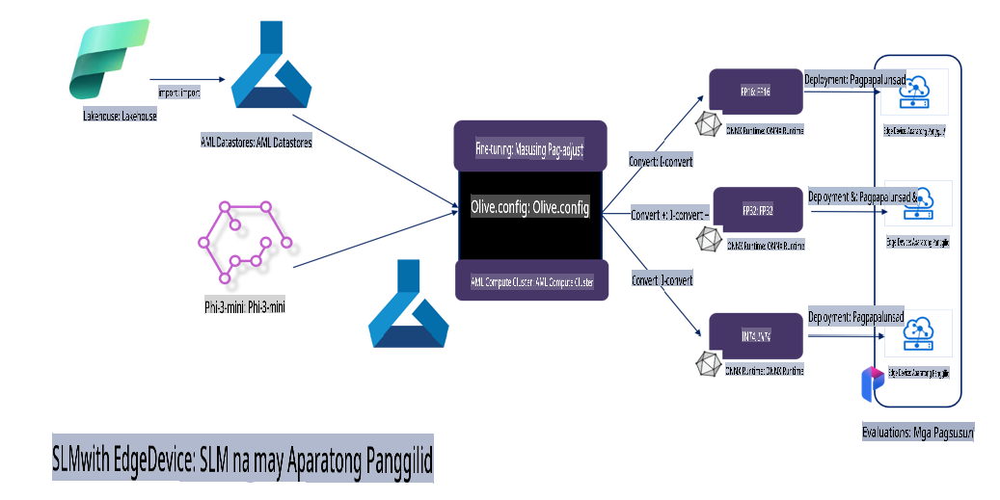

# **Pag-fine-tune ng Phi-3 gamit ang Microsoft Olive**

[Olive](https://github.com/microsoft/OLive?WT.mc_id=aiml-138114-kinfeylo) ay isang madaling gamiting tool para sa hardware-aware na pag-optimize ng modelo na pinagsasama ang mga nangungunang teknolohiya sa industriya para sa model compression, optimization, at compilation.

Idinisenyo ito upang gawing mas madali ang proseso ng pag-optimize ng mga machine learning na modelo, nang masigurong magagamit nila ang hardware architecture nang mahusay.

Kung nagtatrabaho ka man sa mga cloud-based na aplikasyon o mga edge device, pinapadali at pinapahusay ng Olive ang pag-optimize ng iyong mga modelo.

## Mga Pangunahing Katangian:
- Ang Olive ay pinagsasama-sama at ina-automate ang mga optimization technique para sa mga nais na hardware target.
- Walang iisang optimization technique na angkop sa lahat ng sitwasyon, kaya't ang Olive ay nagbibigay ng extensibility upang ang mga eksperto sa industriya ay makapagdagdag ng kanilang mga inobasyon sa optimization.

## Bawasan ang Pagsisikap sa Engineering:
- Madalas na kailangang matutunan at gamitin ng mga developer ang iba't ibang toolchain na partikular sa hardware vendor upang maihanda at ma-optimize ang mga trained na modelo para sa deployment.
- Pinapadali ng Olive ang prosesong ito sa pamamagitan ng pag-automate ng mga optimization technique para sa nais na hardware.

## Handa nang Gamitin na End-to-End Optimization Solution:

Sa pamamagitan ng pagsasama-sama at pag-aayos ng mga integrated na teknolohiya, nag-aalok ang Olive ng isang unified solution para sa end-to-end optimization.
Isinasaalang-alang nito ang mga constraint tulad ng accuracy at latency habang ini-optimize ang mga modelo.

## Paggamit ng Microsoft Olive para sa Fine-Tuning

Ang Microsoft Olive ay isang napakadaling gamitin na open source na tool para sa pag-optimize ng modelo na maaaring sumaklaw sa parehong fine-tuning at reference sa larangan ng generative artificial intelligence. Sa simpleng configuration lamang, kasabay ng paggamit ng open source na mga small language model at kaugnay na runtime environment (AzureML / lokal na GPU, CPU, DirectML), maaari mong makumpleto ang fine-tuning o reference ng modelo sa pamamagitan ng awtomatikong pag-optimize, at mahanap ang pinakamainam na modelo upang i-deploy sa cloud o sa mga edge device. Pinapahintulutan nito ang mga negosyo na bumuo ng sarili nilang industry vertical models on-premises at sa cloud.


## Pag-fine-tune ng Phi-3 gamit ang Microsoft Olive 



## Halimbawa ng Phi-3 Olive Code at Gamit
Sa halimbawang ito, gagamitin mo ang Olive upang:

- I-fine-tune ang isang LoRA adapter upang i-classify ang mga parirala bilang Sad, Joy, Fear, Surprise.
- I-merge ang adapter weights sa base model.
- I-optimize at i-quantize ang modelo sa int4.

[Halimbawa ng Code](../../code/03.Finetuning/olive-ort-example/README.md)

### Pag-setup ng Microsoft Olive

Ang pag-install ng Microsoft Olive ay napakasimple at maaaring i-install para sa CPU, GPU, DirectML, at Azure ML

```bash
pip install olive-ai
```

Kung nais mong magpatakbo ng isang ONNX model gamit ang CPU, maaari mong gamitin

```bash
pip install olive-ai[cpu]
```

Kung nais mong magpatakbo ng isang ONNX model gamit ang GPU, maaari mong gamitin

```python
pip install olive-ai[gpu]
```

Kung nais mong gumamit ng Azure ML, gamitin

```python
pip install git+https://github.com/microsoft/Olive#egg=olive-ai[azureml]
```

**Tandaan**
Kailangan ng OS: Ubuntu 20.04 / 22.04 

### **Config.json ng Microsoft Olive**

Matapos ang pag-install, maaari mong i-configure ang iba't ibang mga setting na partikular sa modelo sa pamamagitan ng Config file, kabilang ang data, computing, training, deployment, at model generation.

**1. Data**

Sa Microsoft Olive, suportado ang training sa local data at cloud data, at maaaring i-configure sa mga setting.

*Mga Setting ng Lokal na Data*

Maaari mong i-setup nang simple ang dataset na kailangang i-train para sa fine-tuning, karaniwang nasa json format, at i-adapt ito gamit ang data template. Kailangang i-adjust ito batay sa mga kinakailangan ng modelo (halimbawa, i-adapt ito sa format na kinakailangan ng Microsoft Phi-3-mini. Kung mayroon kang ibang modelo, mangyaring sumangguni sa mga kinakailangang fine-tuning format ng ibang mga modelo para sa pagproseso)

```json

    "data_configs": [
        {
            "name": "dataset_default_train",
            "type": "HuggingfaceContainer",
            "load_dataset_config": {
                "params": {
                    "data_name": "json", 
                    "data_files":"dataset/dataset-classification.json",
                    "split": "train"
                }
            },
            "pre_process_data_config": {
                "params": {
                    "dataset_type": "corpus",
                    "text_cols": [
                            "phrase",
                            "tone"
                    ],
                    "text_template": "### Text: {phrase}\n### The tone is:\n{tone}",
                    "corpus_strategy": "join",
                    "source_max_len": 2048,
                    "pad_to_max_len": false,
                    "use_attention_mask": false
                }
            }
        }
    ],
```

**Mga Setting ng Cloud Data Source**

Sa pamamagitan ng pag-link sa datastore ng Azure AI Studio/Azure Machine Learning Service upang maiugnay ang data sa cloud, maaari kang pumili na magpakilala ng iba't ibang mga data source sa Azure AI Studio/Azure Machine Learning Service sa pamamagitan ng Microsoft Fabric at Azure Data bilang suporta sa fine-tuning ng data.

```json

    "data_configs": [
        {
            "name": "dataset_default_train",
            "type": "HuggingfaceContainer",
            "load_dataset_config": {
                "params": {
                    "data_name": "json", 
                    "data_files": {
                        "type": "azureml_datastore",
                        "config": {
                            "azureml_client": {
                                "subscription_id": "Your Azure Subscrition ID",
                                "resource_group": "Your Azure Resource Group",
                                "workspace_name": "Your Azure ML Workspaces name"
                            },
                            "datastore_name": "workspaceblobstore",
                            "relative_path": "Your train_data.json Azure ML Location"
                        }
                    },
                    "split": "train"
                }
            },
            "pre_process_data_config": {
                "params": {
                    "dataset_type": "corpus",
                    "text_cols": [
                            "Question",
                            "Best Answer"
                    ],
                    "text_template": "<|user|>\n{Question}<|end|>\n<|assistant|>\n{Best Answer}\n<|end|>",
                    "corpus_strategy": "join",
                    "source_max_len": 2048,
                    "pad_to_max_len": false,
                    "use_attention_mask": false
                }
            }
        }
    ],
    
```

**2. Computing Configuration**

Kung kailangan mo ng lokal na operasyon, maaari mong direktang gamitin ang mga local data resources. Kung kailangan mong gamitin ang mga resources ng Azure AI Studio / Azure Machine Learning Service, kailangang i-configure ang mga kaugnay na Azure parameters, pangalan ng computing power, at iba pa.

```json

    "systems": {
        "aml": {
            "type": "AzureML",
            "config": {
                "accelerators": ["gpu"],
                "hf_token": true,
                "aml_compute": "Your Azure AI Studio / Azure Machine Learning Service Compute Name",
                "aml_docker_config": {
                    "base_image": "Your Azure AI Studio / Azure Machine Learning Service docker",
                    "conda_file_path": "conda.yaml"
                }
            }
        },
        "azure_arc": {
            "type": "AzureML",
            "config": {
                "accelerators": ["gpu"],
                "aml_compute": "Your Azure AI Studio / Azure Machine Learning Service Compute Name",
                "aml_docker_config": {
                    "base_image": "Your Azure AI Studio / Azure Machine Learning Service docker",
                    "conda_file_path": "conda.yaml"
                }
            }
        }
    },
```

***Tandaan***

Dahil ito ay pinapatakbo sa pamamagitan ng container sa Azure AI Studio/Azure Machine Learning Service, kailangang i-configure ang kinakailangang environment. Ito ay naka-configure sa conda.yaml environment.

```yaml

name: project_environment
channels:
  - defaults
dependencies:
  - python=3.8.13
  - pip=22.3.1
  - pip:
      - einops
      - accelerate
      - azure-keyvault-secrets
      - azure-identity
      - bitsandbytes
      - datasets
      - huggingface_hub
      - peft
      - scipy
      - sentencepiece
      - torch>=2.2.0
      - transformers
      - git+https://github.com/microsoft/Olive@jiapli/mlflow_loading_fix#egg=olive-ai[gpu]
      - --extra-index-url https://aiinfra.pkgs.visualstudio.com/PublicPackages/_packaging/ORT-Nightly/pypi/simple/ 
      - ort-nightly-gpu==1.18.0.dev20240307004
      - --extra-index-url https://aiinfra.pkgs.visualstudio.com/PublicPackages/_packaging/onnxruntime-genai/pypi/simple/
      - onnxruntime-genai-cuda

    

```

**3. Piliin ang Iyong SLM**

Maaari mong direktang gamitin ang modelo mula sa Hugging Face, o maaari mong direktang pagsamahin ito sa Model Catalog ng Azure AI Studio / Azure Machine Learning upang piliin ang modelo na gagamitin. Sa halimbawa ng code sa ibaba, gagamitin natin ang Microsoft Phi-3-mini bilang halimbawa.

Kung mayroon kang modelo nang lokal, maaari mong gamitin ang paraang ito

```json

    "input_model":{
        "type": "PyTorchModel",
        "config": {
            "hf_config": {
                "model_name": "model-cache/microsoft/phi-3-mini",
                "task": "text-generation",
                "model_loading_args": {
                    "trust_remote_code": true
                }
            }
        }
    },
```

Kung nais mong gumamit ng modelo mula sa Azure AI Studio / Azure Machine Learning Service, maaari mong gamitin ang paraang ito

```json

    "input_model":{
        "type": "PyTorchModel",
        "config": {
            "model_path": {
                "type": "azureml_registry_model",
                "config": {
                    "name": "microsoft/Phi-3-mini-4k-instruct",
                    "registry_name": "azureml-msr",
                    "version": "11"
                }
            },
             "model_file_format": "PyTorch.MLflow",
             "hf_config": {
                "model_name": "microsoft/Phi-3-mini-4k-instruct",
                "task": "text-generation",
                "from_pretrained_args": {
                    "trust_remote_code": true
                }
            }
        }
    },
```

**Tandaan:**
Kailangan nating mag-integrate sa Azure AI Studio / Azure Machine Learning Service, kaya't kapag nagse-set up ng modelo, mangyaring sumangguni sa version number at kaugnay na naming.

Lahat ng mga modelo sa Azure ay kailangang itakda sa PyTorch.MLflow

Kailangan mong magkaroon ng Hugging Face account at i-bind ang key sa Key value ng Azure AI Studio / Azure Machine Learning

**4. Algorithm**

Ang Microsoft Olive ay mahusay na naka-encapsulate ng Lora at QLora fine-tuning algorithms. Ang kailangan mo lamang i-configure ay ang ilang mga kaugnay na parameter. Narito, gagamitin ko ang QLora bilang halimbawa.

```json
        "lora": {
            "type": "LoRA",
            "config": {
                "target_modules": [
                    "o_proj",
                    "qkv_proj"
                ],
                "double_quant": true,
                "lora_r": 64,
                "lora_alpha": 64,
                "lora_dropout": 0.1,
                "train_data_config": "dataset_default_train",
                "eval_dataset_size": 0.3,
                "training_args": {
                    "seed": 0,
                    "data_seed": 42,
                    "per_device_train_batch_size": 1,
                    "per_device_eval_batch_size": 1,
                    "gradient_accumulation_steps": 4,
                    "gradient_checkpointing": false,
                    "learning_rate": 0.0001,
                    "num_train_epochs": 3,
                    "max_steps": 10,
                    "logging_steps": 10,
                    "evaluation_strategy": "steps",
                    "eval_steps": 187,
                    "group_by_length": true,
                    "adam_beta2": 0.999,
                    "max_grad_norm": 0.3
                }
            }
        },
```

Kung nais mo ng quantization conversion, ang pangunahing branch ng Microsoft Olive ay sumusuporta na sa onnxruntime-genai method. Maaari mo itong itakda ayon sa iyong pangangailangan:

1. I-merge ang adapter weights sa base model
2. I-convert ang modelo sa onnx model na may kinakailangang precision gamit ang ModelBuilder

halimbawa, pag-convert sa quantized INT4

```json

        "merge_adapter_weights": {
            "type": "MergeAdapterWeights"
        },
        "builder": {
            "type": "ModelBuilder",
            "config": {
                "precision": "int4"
            }
        }
```

**Tandaan** 
- Kung gagamitin mo ang QLoRA, hindi pa suportado ang quantization conversion ng ONNXRuntime-genai.

- Dapat tandaan dito na maaari mong itakda ang mga hakbang sa itaas ayon sa iyong sariling pangangailangan. Hindi kinakailangang ganap na i-configure ang lahat ng mga hakbang na ito. Depende sa iyong pangangailangan, maaari mong direktang gamitin ang mga hakbang ng algorithm nang hindi nagfa-fine-tune. Sa wakas, kailangan mong i-configure ang mga kaugnay na engine.

```json

    "engine": {
        "log_severity_level": 0,
        "host": "aml",
        "target": "aml",
        "search_strategy": false,
        "execution_providers": ["CUDAExecutionProvider"],
        "cache_dir": "../model-cache/models/phi3-finetuned/cache",
        "output_dir" : "../model-cache/models/phi3-finetuned"
    }
```

**5. Tapos na ang Fine-Tuning**

Sa command line, i-execute sa directory ng olive-config.json

```bash
olive run --config olive-config.json  
```

**Paunawa**:  
Ang dokumentong ito ay isinalin gamit ang mga serbisyo ng AI na batay sa makina. Bagamat pinagsisikapan naming maging wasto, pakatandaan na ang mga awtomatikong pagsasalin ay maaaring maglaman ng mga pagkakamali o hindi tumpak na impormasyon. Ang orihinal na dokumento sa kanyang katutubong wika ang dapat ituring na opisyal na sanggunian. Para sa mahalagang impormasyon, inirerekomenda ang propesyonal na pagsasalin ng tao. Hindi kami mananagot sa anumang hindi pagkakaunawaan o maling interpretasyon na dulot ng paggamit ng pagsasaling ito.