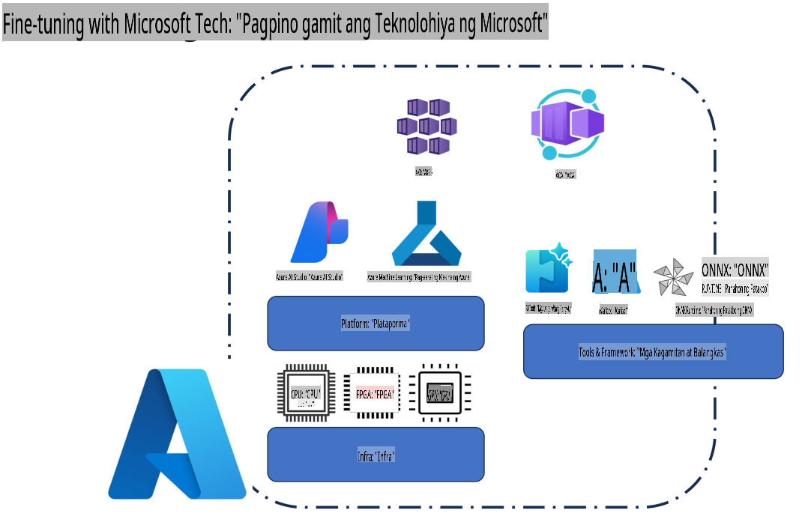
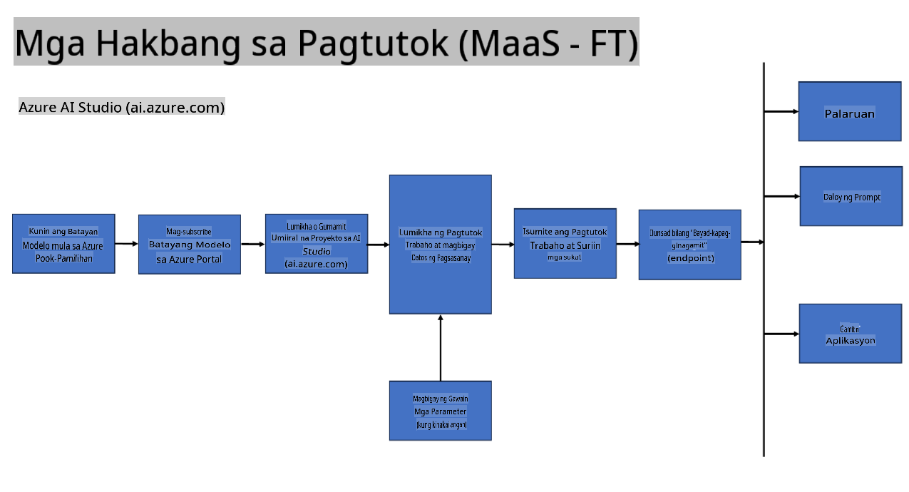
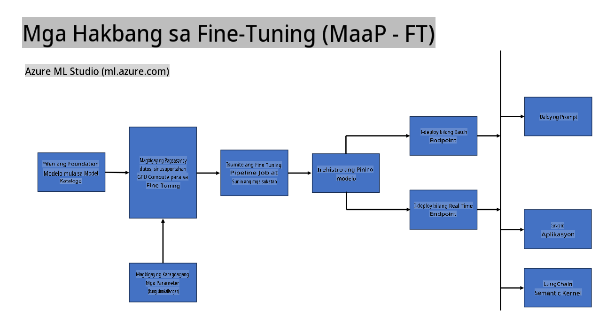
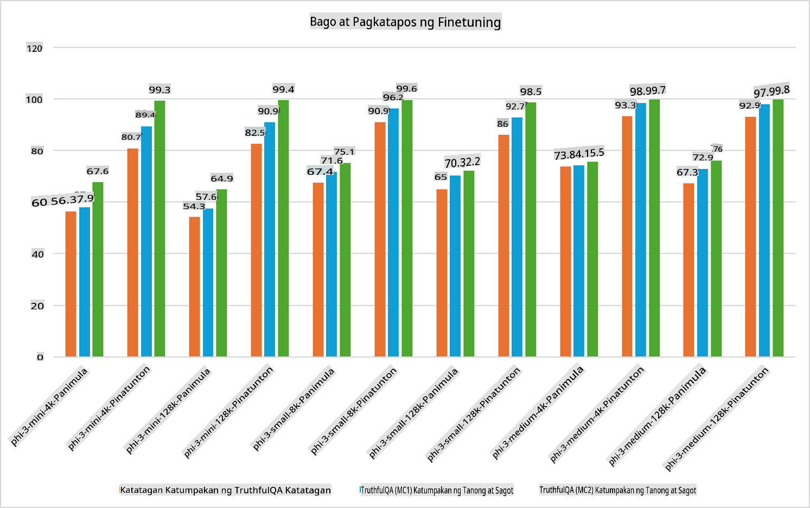

## Mga Senaryo ng Fine Tuning

**Platform** Kasama dito ang iba't ibang teknolohiya tulad ng Azure AI Foundry, Azure Machine Learning, AI Tools, Kaito, at ONNX Runtime.

**Infrastructure** Kasama dito ang CPU at FPGA, na mahalaga sa proseso ng fine-tuning. Ipakikita ko ang mga icon para sa bawat isa sa mga teknolohiyang ito.

**Tools & Framework** Kasama dito ang ONNX Runtime at ONNX Runtime. Ipakikita ko ang mga icon para sa bawat isa sa mga teknolohiyang ito.  
[Maglagay ng mga icon para sa ONNX Runtime at ONNX Runtime]

Ang proseso ng fine-tuning gamit ang mga teknolohiya ng Microsoft ay binubuo ng iba't ibang bahagi at kasangkapan. Sa pamamagitan ng pag-unawa at paggamit ng mga teknolohiyang ito, maaari nating epektibong i-fine-tune ang ating mga aplikasyon at lumikha ng mas magagandang solusyon.

## Model bilang Serbisyo

I-fine-tune ang modelo gamit ang hosted fine-tuning nang hindi kailangang mag-set up at mag-manage ng compute.

Ang serverless fine-tuning ay magagamit para sa Phi-3-mini at Phi-3-medium na mga modelo, na nagpapahintulot sa mga developer na mabilis at madaling i-customize ang mga modelo para sa cloud at edge scenarios nang hindi kinakailangang mag-ayos ng compute. Inanunsyo rin namin na ang Phi-3-small ay magagamit na ngayon sa pamamagitan ng aming Models-as-a-Service offering upang ang mga developer ay mabilis at madaling makapagsimula sa AI development nang hindi kailangang i-manage ang underlying infrastructure.

## Model bilang Platforma

Ang mga gumagamit ang nagma-manage ng kanilang sariling compute upang i-fine-tune ang kanilang mga modelo.

[Fine Tuning Sample](https://github.com/Azure/azureml-examples/blob/main/sdk/python/foundation-models/system/finetune/chat-completion/chat-completion.ipynb)

## Mga Senaryo ng Fine Tuning

| | | | | | | |
|-|-|-|-|-|-|-|
|Senaryo|LoRA|QLoRA|PEFT|DeepSpeed|ZeRO|DORA|
|Pag-aangkop ng mga pre-trained LLMs sa mga partikular na gawain o domain|Oo|Oo|Oo|Oo|Oo|Oo|
|Fine-tuning para sa mga NLP na gawain tulad ng text classification, named entity recognition, at machine translation|Oo|Oo|Oo|Oo|Oo|Oo|
|Fine-tuning para sa QA tasks|Oo|Oo|Oo|Oo|Oo|Oo|
|Fine-tuning para sa pagbuo ng human-like na tugon sa chatbots|Oo|Oo|Oo|Oo|Oo|Oo|
|Fine-tuning para sa paglikha ng musika, sining, o iba pang anyo ng pagkamalikhain|Oo|Oo|Oo|Oo|Oo|Oo|
|Pagbabawas ng computational at financial na gastos|Oo|Oo|Hindi|Oo|Oo|Hindi|
|Pagbabawas ng paggamit ng memorya|Hindi|Oo|Hindi|Oo|Oo|Oo|
|Paggamit ng mas kaunting parameter para sa mas epektibong fine-tuning|Hindi|Oo|Oo|Hindi|Hindi|Oo|
|Memory-efficient na anyo ng data parallelism na nagbibigay ng access sa kabuuang GPU memory ng lahat ng magagamit na GPU devices|Hindi|Hindi|Hindi|Oo|Oo|Oo|

## Mga Halimbawa ng Fine Tuning Performance

**Paunawa**:  
Ang dokumentong ito ay isinalin gamit ang mga serbisyo ng AI na nakabatay sa makina. Bagama't sinisikap naming maging tumpak, pakitandaan na ang mga awtomatikong pagsasalin ay maaaring maglaman ng mga pagkakamali o hindi pagkakatugma. Ang orihinal na dokumento sa sariling wika nito ang dapat ituring na opisyal na sanggunian. Para sa mahalagang impormasyon, inirerekomenda ang propesyonal na pagsasaling-wika ng tao. Hindi kami mananagot sa anumang hindi pagkakaunawaan o maling interpretasyon na dulot ng paggamit ng pagsasaling ito.