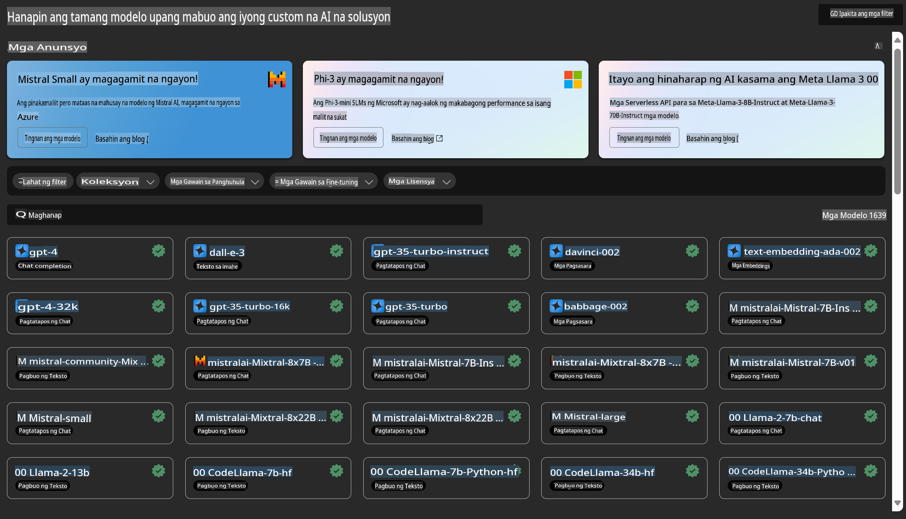

# **Ipakilala ang Azure Machine Learning Service**

Ang [Azure Machine Learning](https://ml.azure.com?WT.mc_id=aiml-138114-kinfeylo) ay isang cloud service na nagpapabilis at nag-aasikaso sa lifecycle ng mga proyekto sa machine learning (ML).

Maaaring gamitin ito ng mga ML professionals, data scientists, at engineers sa kanilang pang-araw-araw na mga gawain upang:

- Mag-train at mag-deploy ng mga modelo. 
- Pamahalaan ang mga operasyon sa machine learning (MLOps).
- Maaari kang lumikha ng modelo sa Azure Machine Learning o gumamit ng modelong gawa mula sa isang open-source platform, tulad ng PyTorch, TensorFlow, o scikit-learn.
- Ang mga tool ng MLOps ay tumutulong sa pag-monitor, pag-retrain, at muling pag-deploy ng mga modelo.

## Para Kanino ang Azure Machine Learning?

**Data Scientists at ML Engineers**

Maaari nilang gamitin ang mga tool upang mapabilis at ma-automate ang kanilang mga pang-araw-araw na gawain. 
Nagbibigay ang Azure ML ng mga feature para sa fairness, explainability, tracking, at auditability.

**Application Developers**

Maaari nilang isama ang mga modelo sa mga aplikasyon o serbisyo nang walang kahirap-hirap.

**Platform Developers**

May access sila sa isang matibay na hanay ng mga tool na suportado ng maaasahang Azure Resource Manager APIs. 
Ang mga tool na ito ay nagpapahintulot sa paggawa ng advanced na mga ML tool.

**Mga Negosyo**

Sa pamamagitan ng paggamit ng Microsoft Azure cloud, nakikinabang ang mga negosyo mula sa pamilyar na seguridad at role-based access control. 
Mag-set up ng mga proyekto upang kontrolin ang access sa protektadong data at mga partikular na operasyon.

## Produktibidad Para sa Bawat Miyembro ng Koponan

Kadalasang nangangailangan ang mga proyekto ng ML ng isang koponan na may magkakaibang kakayahan upang mabuo at mapanatili ito.

Nagbibigay ang Azure ML ng mga tool na nagbibigay-daan sa iyo na:
- Makipagtulungan sa iyong koponan gamit ang mga shared notebook, compute resources, serverless compute, data, at mga environment.
- Bumuo ng mga modelo na may fairness, explainability, tracking, at auditability upang matugunan ang mga pangangailangan sa lineage at audit compliance.
- Mag-deploy ng mga ML model nang mabilis at madali sa malawakang saklaw, at pamahalaan at kontrolin ang mga ito nang epektibo gamit ang MLOps.
- Patakbuhin ang mga workload ng machine learning kahit saan gamit ang built-in na governance, security, at compliance.

## Mga Cross-Compatible Platform Tools

Maaaring gamitin ng sinuman sa ML team ang kanilang mga paboritong tool upang magawa ang trabaho. 
Kung ikaw ay gumagawa ng mabilisang eksperimento, nagtu-tune ng hyperparameter, bumubuo ng mga pipeline, o namamahala ng mga inference, maaari mong gamitin ang mga pamilyar na interface tulad ng:
- Azure Machine Learning Studio
- Python SDK (v2)
- Azure CLI (v2)
- Azure Resource Manager REST APIs

Habang pinapahusay ang mga modelo at nakikipagtulungan sa buong development cycle, maaari mong ibahagi at hanapin ang mga asset, resource, at metrics sa loob ng Azure Machine Learning studio UI.

## **LLM/SLM sa Azure ML**

Nagdagdag ang Azure ML ng maraming LLM/SLM-related na mga function, pinagsasama ang LLMOps at SLMOps upang makabuo ng isang enterprise-wide generative artificial intelligence technology platform.

### **Model Catalog**

Maaaring mag-deploy ang mga enterprise user ng iba't ibang modelo ayon sa iba't ibang business scenarios sa pamamagitan ng Model Catalog, at magbigay ng serbisyo bilang Model as Service para ma-access ng mga enterprise developer o user.

Ang Model Catalog sa Azure Machine Learning studio ay ang sentro para matuklasan at magamit ang iba't ibang modelo na nagbibigay-daan sa iyong bumuo ng Generative AI applications. Ang model catalog ay nagtatampok ng daan-daang modelo mula sa mga model provider tulad ng Azure OpenAI service, Mistral, Meta, Cohere, Nvidia, Hugging Face, kabilang ang mga modelong sinanay ng Microsoft. Ang mga modelo mula sa mga provider bukod sa Microsoft ay itinuturing na Non-Microsoft Products, ayon sa depinisyon sa Microsoft's Product Terms, at sakop ng mga term na kasama ng modelo.

### **Job Pipeline**

Ang pangunahing layunin ng isang machine learning pipeline ay hatiin ang isang kumpletong machine learning task sa isang multistep workflow. Ang bawat hakbang ay isang maayos na bahagi na maaaring i-develop, i-optimize, i-configure, at i-automate nang paisa-isa. Ang mga hakbang ay konektado sa pamamagitan ng mga malinaw na interface. Ang Azure Machine Learning pipeline service ay awtomatikong nag-o-orchestrate ng lahat ng dependencies sa pagitan ng mga pipeline step.

Sa fine-tuning ng SLM / LLM, maaari nating pamahalaan ang ating data, training, at generation processes sa pamamagitan ng Pipeline.

### **Prompt flow**

**Mga Benepisyo ng Paggamit ng Azure Machine Learning Prompt Flow**

Nag-aalok ang Azure Machine Learning prompt flow ng iba't ibang benepisyo na tumutulong sa mga user mula sa ideation hanggang experimentation at, sa huli, sa production-ready na mga LLM-based application:

**Agility sa Prompt Engineering**

- Interactive authoring experience: Nagbibigay ang Azure Machine Learning prompt flow ng visual representation ng istruktura ng flow, na nagpapadali sa mga user na maunawaan at ma-navigate ang kanilang mga proyekto. Nag-aalok din ito ng notebook-like coding experience para sa mas epektibong flow development at debugging.
- Variants para sa prompt tuning: Maaaring lumikha at maghambing ng maraming prompt variant ang mga user, na nagpapadali sa iterative refinement process.
- Evaluation: Ang built-in evaluation flows ay nagbibigay-daan sa mga user na masuri ang kalidad at bisa ng kanilang mga prompt at flow.
- Comprehensive resources: Kasama sa Azure Machine Learning prompt flow ang isang library ng mga built-in na tool, sample, at template na nagsisilbing panimulang punto para sa pag-develop, nagpapalakas ng creativity, at nagpapabilis sa proseso.

**Enterprise Readiness para sa LLM-based Applications**

- Collaboration: Sinusuportahan ng Azure Machine Learning prompt flow ang team collaboration, na nagpapahintulot sa maraming user na magtulungan sa mga prompt engineering project, magbahagi ng kaalaman, at mapanatili ang version control.
- All-in-one platform: Pinapasimple ng Azure Machine Learning prompt flow ang buong proseso ng prompt engineering, mula sa development at evaluation hanggang sa deployment at monitoring. Maaaring i-deploy ng mga user ang kanilang mga flow bilang Azure Machine Learning endpoints at i-monitor ang kanilang performance nang real-time, na tinitiyak ang optimal na operasyon at tuloy-tuloy na pagpapabuti.
- Azure Machine Learning Enterprise Readiness Solutions: Ginagamit ng Prompt flow ang matibay na enterprise readiness solutions ng Azure Machine Learning, na nagbibigay ng secure, scalable, at maaasahang pundasyon para sa pag-develop, experimentation, at deployment ng mga flow.

Sa Azure Machine Learning prompt flow, maaaring palakasin ng mga user ang kanilang prompt engineering agility, epektibong makipagtulungan, at magamit ang enterprise-grade solutions para sa matagumpay na pag-develop at pag-deploy ng mga LLM-based application.

Sa pamamagitan ng pinagsamang computing power, data, at iba't ibang bahagi ng Azure ML, madali para sa mga enterprise developer na bumuo ng kanilang sariling mga artificial intelligence application.

**Paunawa**:  
Ang dokumentong ito ay isinalin gamit ang mga serbisyo ng AI na nakabatay sa makina. Bagama't sinisikap naming maging tumpak, mangyaring tandaan na ang mga awtomatikong pagsasalin ay maaaring maglaman ng mga pagkakamali o hindi pagkakatugma. Ang orihinal na dokumento sa orihinal nitong wika ang dapat ituring na pangunahing sanggunian. Para sa mahalagang impormasyon, inirerekomenda ang propesyonal na pagsasalin ng tao. Hindi kami mananagot sa anumang hindi pagkakaunawaan o maling interpretasyon na dulot ng paggamit ng pagsasaling ito.