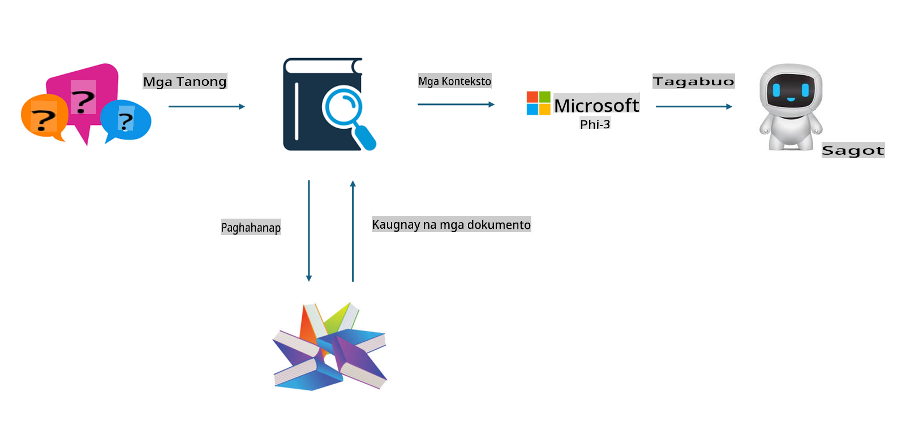
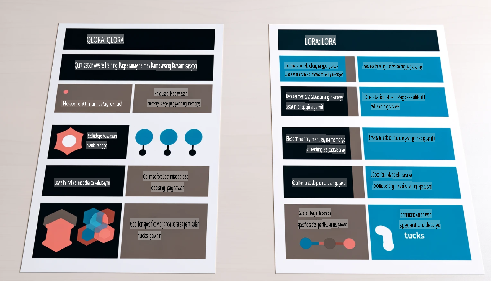

# **Gawing Eksperto sa Industriya ang Phi-3**

Upang mailagay ang Phi-3 model sa isang industriya, kailangang idagdag ang datos ng negosyo mula sa industriya sa Phi-3 model. Mayroon tayong dalawang opsyon: una, ang RAG (Retrieval Augmented Generation), at pangalawa, ang Fine-Tuning.

## **RAG vs Fine-Tuning**

### **Retrieval Augmented Generation**

Ang RAG ay pinagsamang data retrieval at text generation. Ang structured at unstructured data ng isang negosyo ay iniimbak sa vector database. Kapag naghahanap ng kaugnay na nilalaman, hinahanap ang kaugnay na buod at nilalaman upang makabuo ng konteksto, at pinagsasama ito sa kakayahan ng LLM/SLM sa text completion upang makabuo ng output.

### **Fine-tuning**

Ang Fine-tuning ay isang pagpapabuti sa isang partikular na modelo. Hindi kinakailangang magsimula mula sa algorithm ng modelo, ngunit kailangang patuloy na mag-imbak ng datos. Kung nais ng mas eksaktong terminolohiya at wika para sa aplikasyon sa industriya, ang Fine-tuning ang mas mainam na opsyon. Subalit kung madalas magbago ang datos, maaaring maging masalimuot ang Fine-tuning.

### **Paano Pumili**

1. Kung kailangan ng sagot na gumagamit ng panlabas na datos, RAG ang pinakamainam na opsyon.

2. Kung kailangan ng matatag at eksaktong kaalaman sa industriya, ang Fine-tuning ang magandang opsyon. Mas inuuna ng RAG ang pagkuha ng kaugnay na nilalaman ngunit maaaring hindi laging tumama sa mga espesyal na nuances.

3. Ang Fine-tuning ay nangangailangan ng mataas na kalidad na data set, at kung maliit lang ang saklaw ng datos, hindi ito gaanong makakaapekto. Mas flexible ang RAG.

4. Ang Fine-tuning ay parang isang "black box," mahirap maunawaan ang mekanismo nito. Ngunit mas madaling makita sa RAG ang pinagmulan ng datos, kaya mas madaling ayusin ang mga maling interpretasyon o error sa nilalaman at nagbibigay ito ng mas malinaw na transparency.

### **Mga Senaryo**

1. Kung ang industriya ay nangangailangan ng tiyak na bokabularyo at ekspresyon, ***Fine-tuning*** ang pinakamainam na opsyon.

2. Para sa QA system na nangangailangan ng synthesis ng iba't ibang kaalaman, ***RAG*** ang pinakamainam na opsyon.

3. Para sa kombinasyon ng automated na daloy ng negosyo, ***RAG + Fine-tuning*** ang pinakamainam na opsyon.

## **Paano Gamitin ang RAG**

Ang vector database ay koleksyon ng datos na iniimbak sa anyong matematikal. Pinapadali ng vector databases ang pag-alala ng machine learning models sa mga nakaraang input, na nagbibigay-daan sa paggamit ng machine learning para sa mga use case tulad ng search, rekomendasyon, at text generation. Ang datos ay maaaring matukoy batay sa metrics ng pagkakatulad sa halip na eksaktong tugma, kaya't nauunawaan ng computer models ang konteksto ng datos.

Ang vector database ang susi sa pag-realize ng RAG. Maaari nating i-convert ang datos sa vector storage gamit ang vector models tulad ng text-embedding-3, jina-ai-embedding, at iba pa.

Alamin pa ang tungkol sa paggawa ng RAG application [https://github.com/microsoft/Phi-3CookBook](https://github.com/microsoft/Phi-3CookBook?WT.mc_id=aiml-138114-kinfeylo)

## **Paano Gamitin ang Fine-tuning**

Ang karaniwang ginagamit na mga algorithm sa Fine-tuning ay ang Lora at QLora. Paano pumili?
- [Matuto pa gamit ang sample notebook na ito](../../../../code/04.Finetuning/Phi_3_Inference_Finetuning.ipynb)
- [Halimbawa ng Python FineTuning Sample](../../../../code/04.Finetuning/FineTrainingScript.py)

### **Lora at QLora**

Ang LoRA (Low-Rank Adaptation) at QLoRA (Quantized Low-Rank Adaptation) ay parehong mga teknik na ginagamit upang i-fine-tune ang malalaking language models (LLMs) gamit ang Parameter Efficient Fine Tuning (PEFT). Ang mga PEFT techniques ay dinisenyo upang mas mapabilis ang training ng mga modelo kumpara sa tradisyonal na paraan.  
Ang LoRA ay isang standalone na fine-tuning technique na nagpapababa ng memory footprint sa pamamagitan ng low-rank approximation sa weight update matrix. Nag-aalok ito ng mabilis na training times at nananatiling malapit ang performance sa tradisyonal na fine-tuning methods.

Ang QLoRA ay isang pinalawak na bersyon ng LoRA na gumagamit ng quantization techniques upang higit pang bawasan ang paggamit ng memorya. Ang QLoRA ay nagku-quantize ng precision ng weight parameters sa pre-trained LLM sa 4-bit precision, na mas memory-efficient kumpara sa LoRA. Gayunpaman, ang training ng QLoRA ay humigit-kumulang 30% na mas mabagal kaysa sa LoRA dahil sa karagdagang quantization at dequantization steps.

Ginagamit ng QLoRA ang LoRA bilang karagdagang mekanismo upang ayusin ang mga error na dulot ng quantization. Pinapahintulutan ng QLoRA ang fine-tuning ng napakalaking modelo na may bilyun-bilyong parameters gamit ang mas maliit at madaling ma-access na GPUs. Halimbawa, maaaring i-fine-tune ng QLoRA ang isang 70B parameter model na karaniwang nangangailangan ng 36 GPUs gamit lamang ang 2.

**Paunawa**:  
Ang dokumentong ito ay isinalin gamit ang mga serbisyong AI na nakabatay sa makina. Bagama't sinisikap naming maging wasto, pakitandaan na ang mga awtomatikong pagsasalin ay maaaring maglaman ng mga pagkakamali o hindi tumpak na impormasyon. Ang orihinal na dokumento sa sariling wika nito ang dapat ituring na opisyal na sanggunian. Para sa mahalagang impormasyon, inirerekomenda ang propesyonal na pagsasaling-wika ng tao. Hindi kami mananagot para sa anumang hindi pagkakaunawaan o maling interpretasyon na dulot ng paggamit ng pagsasaling ito.