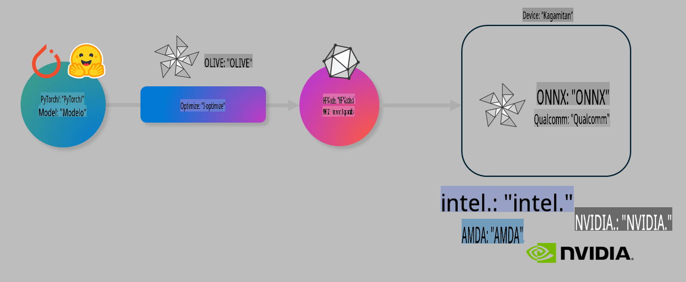

# Lab. I-optimize ang AI models para sa on-device inference

## Panimula 

> [!IMPORTANT]
> Ang lab na ito ay nangangailangan ng **Nvidia A10 o A100 GPU** na may mga kaukulang driver at naka-install na CUDA toolkit (bersyon 12 pataas).

> [!NOTE]
> Ang lab na ito ay tatagal ng **35 minuto** at magbibigay sa iyo ng praktikal na kaalaman sa mga pangunahing konsepto ng pag-optimize ng mga modelo para sa on-device inference gamit ang OLIVE.

## Mga Layunin sa Pagkatuto

Sa pagtatapos ng lab na ito, magagamit mo ang OLIVE upang:

- I-quantize ang isang AI Model gamit ang AWQ quantization method.
- I-fine-tune ang isang AI model para sa isang partikular na gawain.
- Bumuo ng LoRA adapters (fine-tuned model) para sa mas epektibong on-device inference gamit ang ONNX Runtime.

### Ano ang Olive

Ang Olive (*O*NNX *live*) ay isang model optimization toolkit na may kasamang CLI na nagpapahintulot sa iyo na mag-deploy ng mga modelo para sa ONNX runtime +++https://onnxruntime.ai+++ na may mataas na kalidad at performance.



Ang input sa Olive ay karaniwang isang PyTorch o Hugging Face model, at ang output ay isang optimized ONNX model na tumatakbo sa isang device (deployment target) gamit ang ONNX runtime. Ina-optimize ng Olive ang modelo para sa AI accelerator (NPU, GPU, CPU) ng deployment target na ibinibigay ng mga hardware vendor tulad ng Qualcomm, AMD, Nvidia, o Intel.

Ang Olive ay nagsasagawa ng isang *workflow*, na isang maayos na pagkakasunod-sunod ng mga indibidwal na gawain sa pag-optimize ng modelo na tinatawag na *passes* - halimbawa ng mga passes ay: model compression, graph capture, quantization, graph optimization. Ang bawat pass ay may hanay ng mga parameter na maaaring i-tune upang makamit ang pinakamahusay na mga sukatan tulad ng accuracy at latency, na sinusuri ng kaukulang evaluator. Gumagamit ang Olive ng search strategy na gumagamit ng search algorithm upang awtomatikong i-tune ang bawat pass isa-isa o grupo ng mga passes nang sabay-sabay.

#### Mga Benepisyo ng Olive

- **Bawasan ang pagkabahala at oras** ng trial-and-error sa manu-manong eksperimento sa iba't ibang teknolohiya para sa graph optimization, compression, at quantization. Tukuyin ang iyong mga kalidad at performance constraints at hayaang hanapin ng Olive ang pinakamahusay na modelo para sa iyo.
- **40+ built-in na model optimization components** na sumasaklaw sa mga makabagong teknolohiya sa quantization, compression, graph optimization, at finetuning.
- **Madaling gamiting CLI** para sa mga karaniwang gawain sa pag-optimize ng modelo. Halimbawa: olive quantize, olive auto-opt, olive finetune.
- Kasama na ang model packaging at deployment.
- Sinusuportahan ang pagbuo ng mga modelo para sa **Multi LoRA serving**.
- Gumamit ng YAML/JSON upang bumuo ng workflows para sa pag-orchestrate ng mga gawain sa pag-optimize at deployment ng modelo.
- **Hugging Face** at **Azure AI** Integration.
- Built-in na **caching** mechanism upang **makatipid sa gastos**.

## Mga Instruksyon sa Lab
> [!NOTE]
> Siguraduhing na-setup mo na ang iyong Azure AI Hub at Project at ang A100 compute gaya ng nakasaad sa Lab 1.

### Hakbang 0: Kumonekta sa iyong Azure AI Compute

Kakonekta ka sa Azure AI compute gamit ang remote feature sa **VS Code.**

1. Buksan ang iyong **VS Code** desktop application:
1. Buksan ang **command palette** gamit ang **Shift+Ctrl+P**.
1. Sa command palette, hanapin ang **AzureML - remote: Connect to compute instance in New Window**.
1. Sundin ang mga tagubilin sa screen upang kumonekta sa Compute. Kasama rito ang pagpili ng iyong Azure Subscription, Resource Group, Project, at Compute name na na-setup mo sa Lab 1.
1. Kapag nakakonekta ka na sa iyong Azure ML Compute node, makikita ito sa **kanang ibaba ng Visual Code** `><Azure ML: Compute Name`.

### Hakbang 1: I-clone ang repo na ito

Sa VS Code, maaari kang magbukas ng bagong terminal gamit ang **Ctrl+J** at i-clone ang repo na ito:

Sa terminal, dapat mong makita ang prompt:

```
azureuser@computername:~/cloudfiles/code$ 
```
I-clone ang solution:

```bash
cd ~/localfiles
git clone https://github.com/microsoft/phi-3cookbook.git
```

### Hakbang 2: Buksan ang Folder sa VS Code

Upang buksan ang VS Code sa kaukulang folder, isagawa ang sumusunod na command sa terminal, na magbubukas ng bagong window:

```bash
code phi-3cookbook/code/04.Finetuning/Olive-lab
```

O maaari mong buksan ang folder sa pamamagitan ng pagpili ng **File** > **Open Folder**.

### Hakbang 3: Mga Dependencies

Magbukas ng terminal window sa VS Code sa iyong Azure AI Compute Instance (tip: **Ctrl+J**) at isagawa ang mga sumusunod na command upang i-install ang mga dependencies:

```bash
conda create -n olive-ai python=3.11 -y
conda activate olive-ai
pip install -r requirements.txt
az extension remove -n azure-cli-ml
az extension add -n ml
```

> [!NOTE]
> Aabutin ito ng ~5 minuto upang mai-install ang lahat ng dependencies.

Sa lab na ito, magda-download at mag-a-upload ka ng mga modelo sa Azure AI Model catalog. Upang ma-access ang model catalog, kakailanganin mong mag-login sa Azure gamit ang:

```bash
az login
```

> [!NOTE]
> Sa oras ng pag-login, hihilingin sa iyong piliin ang iyong subscription. Siguraduhing piliin ang subscription na ibinigay para sa lab na ito.

### Hakbang 4: Isagawa ang Olive commands

Magbukas ng terminal window sa VS Code sa iyong Azure AI Compute Instance (tip: **Ctrl+J**) at tiyaking ang `olive-ai` conda environment ay naka-activate:

```bash
conda activate olive-ai
```

Pagkatapos, isagawa ang mga sumusunod na Olive commands sa command line.

1. **I-inspect ang data:** Sa halimbawa na ito, i-fine-tune mo ang Phi-3.5-Mini model upang ito ay maging espesyalista sa pagsagot sa mga tanong tungkol sa paglalakbay. Ang code sa ibaba ay nagpapakita ng unang ilang tala ng dataset, na nasa JSON lines format:

    ```bash
    head data/data_sample_travel.jsonl
    ```
1. **I-quantize ang modelo:** Bago i-train ang modelo, i-quantize muna ito gamit ang sumusunod na command na gumagamit ng isang teknolohiya na tinatawag na Active Aware Quantization (AWQ) +++https://arxiv.org/abs/2306.00978+++. Ang AWQ ay nag-quantize ng mga weights ng modelo sa pamamagitan ng pagsasaalang-alang sa mga activations na nabubuo sa panahon ng inference. Ito ay nangangahulugan na ang proseso ng quantization ay isinasaalang-alang ang aktwal na distribusyon ng data sa activations, na nagreresulta sa mas mahusay na pagpapanatili ng accuracy ng modelo kumpara sa tradisyunal na mga paraan ng weight quantization.

    ```bash
    olive quantize \
       --model_name_or_path microsoft/Phi-3.5-mini-instruct \
       --trust_remote_code \
       --algorithm awq \
       --output_path models/phi/awq \
       --log_level 1
    ```
    
    Tumatagal ito ng **~8 minuto** upang makumpleto ang AWQ quantization, na magbabawas ng laki ng modelo mula **~7.5GB hanggang ~2.5GB**.

   Sa lab na ito, ipinapakita namin kung paano mag-input ng mga modelo mula sa Hugging Face (halimbawa: `microsoft/Phi-3.5-mini-instruct`). However, Olive also allows you to input models from the Azure AI catalog by updating the `model_name_or_path` argument to an Azure AI asset ID (for example:  `azureml://registries/azureml/models/Phi-3.5-mini-instruct/versions/4`). 

1. **Train the model:** Next, the `olive finetune` command na i-fine-tune ang na-quantize na modelo. Ang pag-quantize ng modelo *bago* ang fine-tuning sa halip na pagkatapos nito ay nagbibigay ng mas mahusay na accuracy dahil ang proseso ng fine-tuning ay nakakabawi sa ilang pagkawala mula sa quantization.

    ```bash
    olive finetune \
        --method lora \
        --model_name_or_path models/phi/awq \
        --data_files "data/data_sample_travel.jsonl" \
        --data_name "json" \
        --text_template "<|user|>\n{prompt}<|end|>\n<|assistant|>\n{response}<|end|>" \
        --max_steps 100 \
        --output_path ./models/phi/ft \
        --log_level 1
    ```
    
    Tumatagal ito ng **~6 minuto** upang makumpleto ang Fine-tuning (na may 100 steps).

1. **I-optimize:** Kapag na-train na ang modelo, i-optimize ito gamit ang `auto-opt` command, which will capture the ONNX graph and automatically perform a number of optimizations to improve the model performance for CPU by compressing the model and doing fusions. It should be noted, that you can also optimize for other devices such as NPU or GPU by just updating the `--device` and `--provider` arguments ng Olive - ngunit para sa layunin ng lab na ito, gagamit tayo ng CPU.

    ```bash
    olive auto-opt \
       --model_name_or_path models/phi/ft/model \
       --adapter_path models/phi/ft/adapter \
       --device cpu \
       --provider CPUExecutionProvider \
       --use_ort_genai \
       --output_path models/phi/onnx-ao \
       --log_level 1
    ```
    
    Tumatagal ito ng **~5 minuto** upang makumpleto ang optimization.

### Hakbang 5: Mabilisang pagsubok ng Model Inference

Upang subukan ang inferencing ng modelo, gumawa ng isang Python file sa iyong folder na tinatawag na **app.py** at i-copy-paste ang sumusunod na code:

```python
import onnxruntime_genai as og
import numpy as np

print("loading model and adapters...", end="", flush=True)
model = og.Model("models/phi/onnx-ao/model")
adapters = og.Adapters(model)
adapters.load("models/phi/onnx-ao/model/adapter_weights.onnx_adapter", "travel")
print("DONE!")

tokenizer = og.Tokenizer(model)
tokenizer_stream = tokenizer.create_stream()

params = og.GeneratorParams(model)
params.set_search_options(max_length=100, past_present_share_buffer=False)
user_input = "what is the best thing to see in chicago"
params.input_ids = tokenizer.encode(f"<|user|>\n{user_input}<|end|>\n<|assistant|>\n")

generator = og.Generator(model, params)

generator.set_active_adapter(adapters, "travel")

print(f"{user_input}")

while not generator.is_done():
    generator.compute_logits()
    generator.generate_next_token()

    new_token = generator.get_next_tokens()[0]
    print(tokenizer_stream.decode(new_token), end='', flush=True)

print("\n")
```

Isagawa ang code gamit ang:

```bash
python app.py
```

### Hakbang 6: I-upload ang modelo sa Azure AI

Ang pag-upload ng modelo sa Azure AI model repository ay ginagawang maibabahagi ang modelo sa ibang miyembro ng iyong development team at nagbibigay din ng version control para sa modelo. Upang i-upload ang modelo, isagawa ang sumusunod na command:

> [!NOTE]
> I-update ang `{}` placeholders with the name of your resource group and Azure AI Project Name. 

To find your resource group `"resourceGroup"` at pangalan ng Azure AI Project, at isagawa ang sumusunod na command:

```
az ml workspace show
```

O sa pamamagitan ng pagpunta sa +++ai.azure.com+++ at pagpili ng **management center** > **project** > **overview**.

I-update ang `{}` placeholders gamit ang pangalan ng iyong resource group at Azure AI Project Name.

```bash
az ml model create \
    --name ft-for-travel \
    --version 1 \
    --path ./models/phi/onnx-ao \
    --resource-group {RESOURCE_GROUP_NAME} \
    --workspace-name {PROJECT_NAME}
```
Makikita mo na ngayon ang iyong na-upload na modelo at maaari mo itong i-deploy sa https://ml.azure.com/model/list

**Paunawa**:  
Ang dokumentong ito ay isinalin gamit ang mga serbisyo ng AI na batay sa makina. Bagama't pinagsisikapan naming maging tumpak, pakitandaan na ang mga awtomatikong salin ay maaaring maglaman ng mga pagkakamali o hindi pagkakatugma. Ang orihinal na dokumento sa sarili nitong wika ang dapat ituring na opisyal na sanggunian. Para sa mahalagang impormasyon, inirerekomenda ang propesyonal na pagsasalin ng tao. Hindi kami mananagot para sa anumang hindi pagkakaunawaan o maling interpretasyon na dulot ng paggamit ng salin na ito.