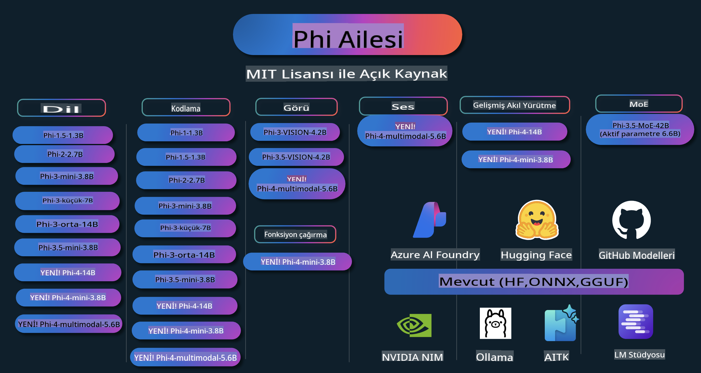

# Phi Yemek Kitabı: Microsoft'un Phi Modelleriyle Uygulamalı Örnekler

  

  
  
  

  
  

Phi, Microsoft tarafından geliştirilen açık kaynaklı bir dizi yapay zeka modelidir.

Phi, çoklu dil, akıl yürütme, metin/sohbet üretimi, kodlama, görseller, ses ve diğer senaryolarda oldukça iyi sonuçlar sunan, şu anda en güçlü ve maliyet etkin küçük dil modeli (SLM) olarak öne çıkmaktadır.

Phi'yi buluta veya uç cihazlara dağıtabilir ve sınırlı işlem gücüyle kolayca üretken yapay zeka uygulamaları geliştirebilirsiniz.

Bu kaynakları kullanmaya başlamak için şu adımları izleyin:  
1. **Depoyu Çatallayın**: Tıklayın   
2. **Depoyu Klonlayın**: `git clone https://github.com/microsoft/PhiCookBook.git`  
3. [**Microsoft AI Discord Topluluğuna Katılın ve uzmanlarla ve diğer geliştiricilerle tanışın**](https://discord.com/invite/ByRwuEEgH4?WT.mc_id=aiml-137032-kinfeylo)

## İçindekiler

- Giriş  
  - [Phi Ailesine Hoş Geldiniz](./md/01.Introduction/01/01.PhiFamily.md)  
  - [Ortamınızı Ayarlama](./md/01.Introduction/01/01.EnvironmentSetup.md)  
  - [Temel Teknolojileri Anlama](./md/01.Introduction/01/01.Understandingtech.md)  
  - [Phi Modelleri için Yapay Zeka Güvenliği](./md/01.Introduction/01/01.AISafety.md)  
  - [Phi Donanım Desteği](./md/01.Introduction/01/01.Hardwaresupport.md)  
  - [Phi Modelleri ve Platformlar Arası Kullanılabilirlik](./md/01.Introduction/01/01.Edgeandcloud.md)  
  - [Guidance-ai ve Phi Kullanımı](./md/01.Introduction/01/01.Guidance.md)  
  - [GitHub Marketplace Modelleri](https://github.com/marketplace/models)  
  - [Azure AI Model Kataloğu](https://ai.azure.com)  

- Farklı Ortamlarda Phi Çıkarımı  
    - [Hugging Face](./md/01.Introduction/02/01.HF.md)  
    - [GitHub Modelleri](./md/01.Introduction/02/02.GitHubModel.md)  
    - [Azure AI Foundry Model Kataloğu](./md/01.Introduction/02/03.AzureAIFoundry.md)  
    - [Ollama](./md/01.Introduction/02/04.Ollama.md)  
    - [AI Toolkit VSCode (AITK)](./md/01.Introduction/02/05.AITK.md)  
    - [NVIDIA NIM](./md/01.Introduction/02/06.NVIDIA.md)  

- Phi Ailesinde Çıkarım  
    - [iOS'ta Phi Çıkarımı](./md/01.Introduction/03/iOS_Inference.md)  
    - [Android'de Phi Çıkarımı](./md/01.Introduction/03/Android_Inference.md)  
- [Jetson'da Phi Çıkarımı](./md/01.Introduction/03/Jetson_Inference.md)
    - [AI PC'de Phi Çıkarımı](./md/01.Introduction/03/AIPC_Inference.md)
    - [Apple MLX Framework ile Phi Çıkarımı](./md/01.Introduction/03/MLX_Inference.md)
    - [Yerel Sunucuda Phi Çıkarımı](./md/01.Introduction/03/Local_Server_Inference.md)
    - [AI Toolkit kullanarak Uzaktan Sunucuda Phi Çıkarımı](./md/01.Introduction/03/Remote_Interence.md)
    - [Rust ile Phi Çıkarımı](./md/01.Introduction/03/Rust_Inference.md)
    - [Yerelde Phi--Vision Çıkarımı](./md/01.Introduction/03/Vision_Inference.md)
    - [Kaito AKS, Azure Containers (resmi destek) ile Phi Çıkarımı](./md/01.Introduction/03/Kaito_Inference.md)
- [Phi Ailesini Sayısallaştırma](./md/01.Introduction/04/QuantifyingPhi.md)
    - [Llama.cpp kullanarak Phi-3.5 / 4'ü Sayısallaştırma](./md/01.Introduction/04/UsingLlamacppQuantifyingPhi.md)
    - [Onnxruntime için Generative AI uzantılarını kullanarak Phi-3.5 / 4'ü Sayısallaştırma](./md/01.Introduction/04/UsingORTGenAIQuantifyingPhi.md)
    - [Intel OpenVINO kullanarak Phi-3.5 / 4'ü Sayısallaştırma](./md/01.Introduction/04/UsingIntelOpenVINOQuantifyingPhi.md)
    - [Apple MLX Framework kullanarak Phi-3.5 / 4'ü Sayısallaştırma](./md/01.Introduction/04/UsingAppleMLXQuantifyingPhi.md)

- Phi Değerlendirme
    - [Sorumlu AI](./md/01.Introduction/05/ResponsibleAI.md)
    - [Değerlendirme için Azure AI Foundry](./md/01.Introduction/05/AIFoundry.md)
    - [Değerlendirme için Promptflow Kullanımı](./md/01.Introduction/05/Promptflow.md)
 
- Azure AI Search ile RAG
    - [Phi-4-mini ve Phi-4-multimodal (RAG) ile Azure AI Search Nasıl Kullanılır](https://github.com/microsoft/PhiCookBook/blob/main/code/06.E2E/E2E_Phi-4-RAG-Azure-AI-Search.ipynb)

- Phi uygulama geliştirme örnekleri
  - Metin ve Sohbet Uygulamaları
    - Phi-4 Örnekleri 🆕
      - [📓] [Phi-4-mini ONNX Model ile Sohbet](./md/02.Application/01.TextAndChat/Phi4/ChatWithPhi4ONNX/README.md)
      - [Phi-4 yerel ONNX Model ile .NET Sohbet](../../md/04.HOL/dotnet/src/LabsPhi4-Chat-01OnnxRuntime)
      - [Sementic Kernel kullanarak Phi-4 ONNX ile .NET Konsol Uygulaması Sohbeti](../../md/04.HOL/dotnet/src/LabsPhi4-Chat-02SK)
    - Phi-3 / 3.5 Örnekleri
      - [Phi3, ONNX Runtime Web ve WebGPU kullanarak tarayıcıda yerel sohbet botu](https://github.com/microsoft/onnxruntime-inference-examples/tree/main/js/chat)
      - [OpenVino Sohbet](./md/02.Application/01.TextAndChat/Phi3/E2E_OpenVino_Chat.md)
      - [Çoklu Model - Phi-3-mini ve OpenAI Whisper ile Etkileşimli](./md/02.Application/01.TextAndChat/Phi3/E2E_Phi-3-mini_with_whisper.md)
      - [MLFlow - Phi-3 ile bir sarmalayıcı oluşturma ve kullanma](./md//02.Application/01.TextAndChat/Phi3/E2E_Phi-3-MLflow.md)
      - [Model Optimizasyonu - Olive ile Phi-3-mini modelini ONNX Runtime Web için optimize etme](https://github.com/microsoft/Olive/tree/main/examples/phi3)
      - [Phi-3 mini-4k-instruct-onnx ile WinUI3 Uygulaması](https://github.com/microsoft/Phi3-Chat-WinUI3-Sample/)
      - [WinUI3 Çoklu Model Yapay Zeka Destekli Notlar Uygulama Örneği](https://github.com/microsoft/ai-powered-notes-winui3-sample)
      - [Phi-3 modellerini ince ayar yapma ve Prompt flow ile entegre etme](./md/02.Application/01.TextAndChat/Phi3/E2E_Phi-3-FineTuning_PromptFlow_Integration.md)
      - [Azure AI Foundry'de Phi-3 modellerini ince ayar yapma ve Prompt flow ile entegre etme](./md/02.Application/01.TextAndChat/Phi3/E2E_Phi-3-FineTuning_PromptFlow_Integration_AIFoundry.md)
      - [Microsoft'un Sorumlu AI İlkelerine Odaklanarak Azure AI Foundry'de İnce Ayar Yapılmış Phi-3 / Phi-3.5 Modelini Değerlendirme](./md/02.Application/01.TextAndChat/Phi3/E2E_Phi-3-Evaluation_AIFoundry.md)
- [📓] [Phi-3.5-mini-instruct dil tahmini örneği (Çince/İngilizce)](../../md/02.Application/01.TextAndChat/Phi3/phi3-instruct-demo.ipynb)
      - [Phi-3.5-Instruct WebGPU RAG Sohbet Botu](./md/02.Application/01.TextAndChat/Phi3/WebGPUWithPhi35Readme.md)
      - [Windows GPU kullanarak Phi-3.5-Instruct ONNX ile Prompt Flow çözümü oluşturma](./md/02.Application/01.TextAndChat/Phi3/UsingPromptFlowWithONNX.md)
      - [Microsoft Phi-3.5 tflite kullanarak Android uygulaması oluşturma](./md/02.Application/01.TextAndChat/Phi3/UsingPhi35TFLiteCreateAndroidApp.md)
      - [Microsoft.ML.OnnxRuntime kullanarak yerel ONNX Phi-3 modeliyle Soru-Cevap .NET örneği](../../md/04.HOL/dotnet/src/LabsPhi301)
      - [Semantic Kernel ve Phi-3 ile Konsol sohbet .NET uygulaması](../../md/04.HOL/dotnet/src/LabsPhi302)

  - Azure AI Çıkarım SDK Kod Tabanlı Örnekler 
    - Phi-4 Örnekleri 🆕
      - [📓] [Phi-4-multimodal kullanarak proje kodu oluşturma](./md/02.Application/02.Code/Phi4/GenProjectCode/README.md)
    - Phi-3 / 3.5 Örnekleri
      - [Microsoft Phi-3 Ailesi ile kendi Visual Studio Code GitHub Copilot Sohbetinizi oluşturun](./md/02.Application/02.Code/Phi3/VSCodeExt/README.md)
      - [GitHub Modelleri ile Phi-3.5 kullanarak kendi Visual Studio Code Sohbet Copilot Ajanınızı oluşturun](/md/02.Application/02.Code/Phi3/CreateVSCodeChatAgentWithGitHubModels.md)

  - Gelişmiş Akıl Yürütme Örnekleri
    - Phi-4 Örnekleri 🆕
      - [📓] [Phi-4-mini Akıl Yürütme Örnekleri](./md/02.Application/03.AdvancedReasoning/Phi4/AdvancedResoningPhi4mini/README.md)
  
  - Demolar
      - [Hugging Face Spaces üzerinde barındırılan Phi-4-mini demoları](https://huggingface.co/spaces/microsoft/phi-4-mini?WT.mc_id=aiml-137032-kinfeylo)
      - [Hugging Face Spaces üzerinde barındırılan Phi-4-multimodal demoları](https://huggingface.co/spaces/microsoft/phi-4-multimodal?WT.mc_id=aiml-137032-kinfeylo)
  - Görsel Örnekler
    - Phi-4 Örnekleri 🆕
      - [📓] [Phi-4-multimodal kullanarak görselleri okuyup kod üretme](./md/02.Application/04.Vision/Phi4/CreateFrontend/README.md) 
    - Phi-3 / 3.5 Örnekleri
      -  [📓][Phi-3-vision-Görsel metni metne çevirme](../../md/02.Application/04.Vision/Phi3/E2E_Phi-3-vision-image-text-to-text-online-endpoint.ipynb)
      - [Phi-3-vision-ONNX](https://onnxruntime.ai/docs/genai/tutorials/phi3-v.html)
      - [📓][Phi-3-vision CLIP Gömme](../../md/02.Application/04.Vision/Phi3/E2E_Phi-3-vision-image-text-to-text-online-endpoint.ipynb)
      - [DEMO: Phi-3 Geri Dönüşüm](https://github.com/jennifermarsman/PhiRecycling/)
      - [Phi-3-vision - Görsel dil asistanı - Phi3-Vision ve OpenVINO ile](https://docs.openvino.ai/nightly/notebooks/phi-3-vision-with-output.html)
      - [Phi-3 Vision Nvidia NIM](./md/02.Application/04.Vision/Phi3/E2E_Nvidia_NIM_Vision.md)
      - [Phi-3 Vision OpenVino](./md/02.Application/04.Vision/Phi3/E2E_OpenVino_Phi3Vision.md)
      - [📓][Phi-3.5 Vision çoklu çerçeve veya çoklu görsel örneği](../../md/02.Application/04.Vision/Phi3/phi3-vision-demo.ipynb)
      - [Microsoft.ML.OnnxRuntime .NET kullanarak Phi-3 Vision Yerel ONNX Modeli](../../md/04.HOL/dotnet/src/LabsPhi303)
      - [Microsoft.ML.OnnxRuntime .NET kullanarak Menü tabanlı Phi-3 Vision Yerel ONNX Modeli](../../md/04.HOL/dotnet/src/LabsPhi304)

  - Ses Örnekleri
    - Phi-4 Örnekleri 🆕
      - [📓] [Phi-4-multimodal kullanarak ses transkriptleri çıkarma](./md/02.Application/05.Audio/Phi4/Transciption/README.md)
      - [📓] [Phi-4-multimodal Ses Örneği](../../md/02.Application/05.Audio/Phi4/Siri/demo.ipynb)
      - [📓] [Phi-4-multimodal Ses Çevirisi Örneği](../../md/02.Application/05.Audio/Phi4/Translate/demo.ipynb)
      - [.NET konsol uygulaması ile Phi-4-multimodal Ses kullanarak bir ses dosyasını analiz etme ve transkript oluşturma](../../md/04.HOL/dotnet/src/LabsPhi4-MultiModal-02Audio)

  - MOE Örnekleri
    - Phi-3 / 3.5 Örnekleri
      - [📓] [Phi-3.5 Mixture of Experts Modelleri (MoEs) Sosyal Medya Örneği](../../md/02.Application/06.MoE/Phi3/phi3_moe_demo.ipynb)
      - [📓] [NVIDIA NIM Phi-3 MOE, Azure AI Search ve LlamaIndex ile Bir Retrieval-Augmented Generation (RAG) Pipeline Oluşturma](../../md/02.Application/06.MoE/Phi3/azure-ai-search-nvidia-rag.ipynb)
  - Fonksiyon Çağırma Örnekleri
    - Phi-4 Örnekleri 🆕
      -  [📓] [Phi-4-mini ile Fonksiyon Çağırma Kullanımı](./md/02.Application/07.FunctionCalling/Phi4/FunctionCallingBasic/README.md)
  - Multimodal Karışım Örnekleri
    - Phi-4 Örnekleri 🆕
-  [📓] [Phi-4-multimodal kullanarak bir Teknoloji Gazetecisi olmak](../../md/02.Application/08.Multimodel/Phi4/TechJournalist/phi_4_mm_audio_text_publish_news.ipynb)
      - [.NET konsol uygulaması ile Phi-4-multimodal kullanarak görüntü analizi](../../md/04.HOL/dotnet/src/LabsPhi4-MultiModal-01Images)

- Phi Örneklerini İnce Ayar Yapma
  - [İnce Ayar Senaryoları](./md/03.FineTuning/FineTuning_Scenarios.md)
  - [İnce Ayar ve RAG Karşılaştırması](./md/03.FineTuning/FineTuning_vs_RAG.md)
  - [Phi-3’ü bir sektör uzmanına dönüştürmek için ince ayar](./md/03.FineTuning/LetPhi3gotoIndustriy.md)
  - [Phi-3’e VS Code için AI Toolkit ile ince ayar yapmak](./md/03.FineTuning/Finetuning_VSCodeaitoolkit.md)
  - [Phi-3’e Azure Machine Learning Service ile ince ayar yapmak](./md/03.FineTuning/Introduce_AzureML.md)
  - [Phi-3’e Lora ile ince ayar yapmak](./md/03.FineTuning/FineTuning_Lora.md)
  - [Phi-3’e QLora ile ince ayar yapmak](./md/03.FineTuning/FineTuning_Qlora.md)
  - [Phi-3’e Azure AI Foundry ile ince ayar yapmak](./md/03.FineTuning/FineTuning_AIFoundry.md)
  - [Phi-3’e Azure ML CLI/SDK ile ince ayar yapmak](./md/03.FineTuning/FineTuning_MLSDK.md)
  - [Microsoft Olive ile ince ayar yapmak](./md/03.FineTuning/FineTuning_MicrosoftOlive.md)
  - [Microsoft Olive Hands-On Lab ile ince ayar yapmak](./md/03.FineTuning/olive-lab/readme.md)
  - [Phi-3-vision’a Weights and Bias ile ince ayar yapmak](./md/03.FineTuning/FineTuning_Phi-3-visionWandB.md)
  - [Phi-3’e Apple MLX Framework ile ince ayar yapmak](./md/03.FineTuning/FineTuning_MLX.md)
  - [Phi-3-vision’a ince ayar yapmak (resmi destek)](./md/03.FineTuning/FineTuning_Vision.md)
  - [Phi-3 ve Kaito AKS, Azure Containers ile ince ayar yapmak (resmi destek)](./md/03.FineTuning/FineTuning_Kaito.md)
  - [Phi-3 ve 3.5 Vision’a ince ayar yapmak](https://github.com/2U1/Phi3-Vision-Finetune)

- Uygulamalı Laboratuvar
  - [Son teknoloji modelleri keşfetmek: LLM'ler, SLM'ler, yerel geliştirme ve daha fazlası](https://github.com/microsoft/aitour-exploring-cutting-edge-models)
  - [NLP Potansiyelini Açığa Çıkarmak: Microsoft Olive ile İnce Ayar](https://github.com/azure/Ignite_FineTuning_workshop)

- Akademik Araştırma Makaleleri ve Yayınlar
  - [Tek ihtiyacınız olan ders kitapları II: phi-1.5 teknik raporu](https://arxiv.org/abs/2309.05463)
  - [Phi-3 Teknik Raporu: Telefonunuzda Yerel Olarak Çalışan Yüksek Yetenekli Bir Dil Modeli](https://arxiv.org/abs/2404.14219)
  - [Phi-4 Teknik Raporu](https://arxiv.org/abs/2412.08905)
  - [Araç İçi Fonksiyon Çağrımı için Küçük Dil Modellerini Optimize Etme](https://arxiv.org/abs/2501.02342)
  - [(WhyPHI) PHI-3 için Çoktan Seçmeli Soru Cevaplama İnce Ayarı: Metodoloji, Sonuçlar ve Zorluklar](https://arxiv.org/abs/2501.01588)

## Phi Modellerini Kullanma

### Azure AI Foundry’de Phi

Microsoft Phi’yi nasıl kullanacağınızı ve farklı donanım cihazlarınızda uçtan uca çözümler nasıl oluşturacağınızı öğrenebilirsiniz. Phi’yi deneyimlemek için, modelleri deneyerek ve Phi’yi senaryolarınıza göre özelleştirerek başlayabilirsiniz. [Azure AI Foundry Azure AI Model Kataloğu](https://aka.ms/phi3-azure-ai) üzerinden daha fazla bilgi edinebilirsiniz. [Azure AI Foundry ile Başlarken](/md/02.QuickStart/AzureAIFoundry_QuickStart.md) sayfasını inceleyebilirsiniz.

**Oyun Alanı**
Her modelin, modeli test etmek için özel bir oyun alanı vardır: [Azure AI Playground](https://aka.ms/try-phi3).

### GitHub Modellerinde Phi

Microsoft Phi’yi nasıl kullanacağınızı ve farklı donanım cihazlarınızda uçtan uca çözümler nasıl oluşturacağınızı öğrenebilirsiniz. Phi’yi deneyimlemek için, modeli deneyerek ve Phi’yi senaryolarınıza göre özelleştirerek başlayabilirsiniz. [GitHub Model Kataloğu](https://github.com/marketplace/models?WT.mc_id=aiml-137032-kinfeylo) üzerinden daha fazla bilgi edinebilirsiniz. [GitHub Model Kataloğu ile Başlarken](/md/02.QuickStart/GitHubModel_QuickStart.md) sayfasını inceleyebilirsiniz.

**Oyun Alanı**
Her modelin [modeli test etmek için ayrılmış bir oyun alanı](/md/02.QuickStart/GitHubModel_QuickStart.md) vardır.

### Hugging Face Üzerinde Phi

Modeli [Hugging Face](https://huggingface.co/microsoft) üzerinde de bulabilirsiniz.

**Oyun Alanı**  
[Hugging Chat oyun alanı](https://huggingface.co/chat/models/microsoft/Phi-3-mini-4k-instruct)

## Sorumlu Yapay Zeka

Microsoft, müşterilerimizin yapay zeka ürünlerimizi sorumlu bir şekilde kullanmasına yardımcı olmaya, öğrendiklerimizi paylaşmaya ve şeffaflık notları ile etki değerlendirmeleri gibi araçlar aracılığıyla güvene dayalı ortaklıklar kurmaya kendini adamıştır. Bu kaynakların birçoğuna [https://aka.ms/RAI](https://aka.ms/RAI) adresinden ulaşabilirsiniz.  
Microsoft'un sorumlu yapay zeka yaklaşımı, adalet, güvenilirlik ve güvenlik, gizlilik ve güvenlik, kapsayıcılık, şeffaflık ve hesap verebilirlik gibi yapay zeka ilkelerimize dayanmaktadır.

Bu örnekte kullanılanlar gibi büyük ölçekli doğal dil, görüntü ve konuşma modelleri, adaletsiz, güvenilmez veya saldırgan davranışlarda bulunarak zarara yol açma potansiyeline sahiptir. Riskler ve sınırlamalar hakkında bilgi sahibi olmak için lütfen [Azure OpenAI hizmeti Şeffaflık Notu](https://learn.microsoft.com/legal/cognitive-services/openai/transparency-note?tabs=text)'na başvurun.

Bu riskleri azaltmanın önerilen yaklaşımı, zararlı davranışları tespit edip önleyebilecek bir güvenlik sistemi içermektir. [Azure AI İçerik Güvenliği](https://learn.microsoft.com/azure/ai-services/content-safety/overview), uygulamalarda ve hizmetlerde kullanıcı tarafından oluşturulan ve yapay zeka tarafından oluşturulan zararlı içeriği tespit edebilen bağımsız bir koruma katmanı sağlar. Azure AI İçerik Güvenliği, zararlı materyalleri tespit etmenize olanak tanıyan metin ve görüntü API'leri içerir. Azure AI Foundry içinde, İçerik Güvenliği hizmeti, farklı modlarda zararlı içeriği tespit etmek için örnek kodu görüntülemenize, keşfetmenize ve denemenize olanak tanır. [Hızlı başlangıç dokümantasyonu](https://learn.microsoft.com/azure/ai-services/content-safety/quickstart-text?tabs=visual-studio%2Clinux&pivots=programming-language-rest), hizmete nasıl istek yapacağınızı gösterir.

Dikkate alınması gereken bir diğer konu ise genel uygulama performansıdır. Çok modlu ve çok modelli uygulamalarda performansı, sistemin sizin ve kullanıcılarınızın beklentilerine uygun şekilde çalışması, zararlı çıktılar üretmemesi de dahil olmak üzere değerlendiriyoruz. Uygulamanızın genel performansını değerlendirmek için [Performans ve Kalite ve Risk ve Güvenlik değerlendirme araçları](https://learn.microsoft.com/azure/ai-studio/concepts/evaluation-metrics-built-in) kullanılabilir. Ayrıca [özel değerlendiriciler](https://learn.microsoft.com/azure/ai-studio/how-to/develop/evaluate-sdk#custom-evaluators) oluşturma ve değerlendirme imkânınız da vardır.

Yapay zeka uygulamanızı geliştirme ortamınızda [Azure AI Değerlendirme SDK'sı](https://microsoft.github.io/promptflow/index.html) kullanarak değerlendirebilirsiniz. Bir test veri seti veya bir hedef verildiğinde, jeneratif yapay zeka uygulamanızın çıktıları, seçtiğiniz yerleşik veya özel değerlendiricilerle nicel olarak ölçülür. Azure AI değerlendirme SDK'sı ile sisteminizi değerlendirmeye başlamak için [hızlı başlangıç rehberini](https://learn.microsoft.com/azure/ai-studio/how-to/develop/flow-evaluate-sdk) takip edebilirsiniz. Bir değerlendirme çalışması gerçekleştirdikten sonra, [sonuçları Azure AI Foundry'de görselleştirebilirsiniz](https://learn.microsoft.com/azure/ai-studio/how-to/evaluate-flow-results).

## Ticari Markalar

Bu proje, projeler, ürünler veya hizmetlere ait ticari markalar ya da logolar içerebilir. Microsoft ticari markalarının veya logolarının yetkili kullanımı, [Microsoft'un Ticari Marka ve Marka Yönergelerine](https://www.microsoft.com/legal/intellectualproperty/trademarks/usage/general) uygun olmalıdır.  
Bu projenin değiştirilmiş sürümlerinde Microsoft ticari markalarının veya logolarının kullanımı, kafa karışıklığına yol açmamalı veya Microsoft'un sponsorluğunu ima etmemelidir. Üçüncü taraf ticari markalarının veya logolarının kullanımı, ilgili üçüncü tarafların politikalarına tabidir.

**Feragatname**:  
Bu belge, makine tabanlı yapay zeka çeviri hizmetleri kullanılarak çevrilmiştir. Doğruluk için çaba göstersek de, otomatik çevirilerin hata veya yanlışlıklar içerebileceğini lütfen unutmayın. Orijinal belge, kendi dilindeki haliyle yetkili kaynak olarak kabul edilmelidir. Kritik bilgiler için profesyonel bir insan çevirisi önerilir. Bu çevirinin kullanımından kaynaklanan yanlış anlama veya yanlış yorumlamalardan sorumlu değiliz.