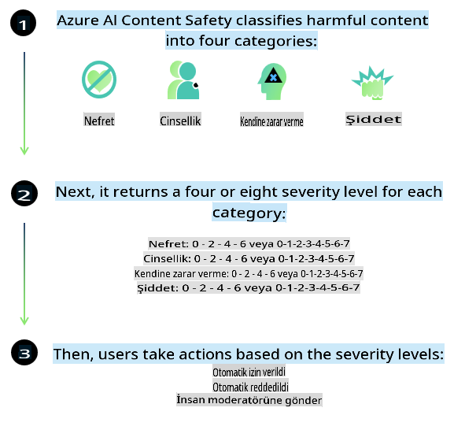
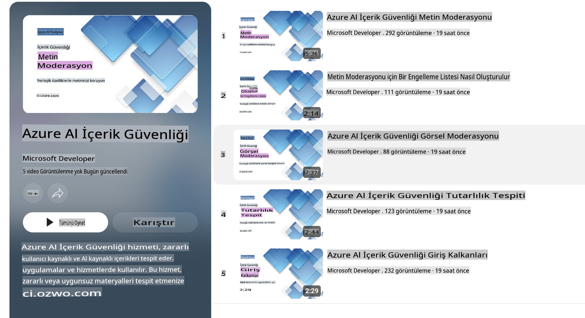

# Phi Modelleri için AI Güvenliği

Phi model ailesi, [Microsoft Sorumlu AI Standardı](https://query.prod.cms.rt.microsoft.com/cms/api/am/binary/RE5cmFl) doğrultusunda geliştirilmiştir. Bu standart, [Microsoft’un Sorumlu AI İlkeleri](https://www.microsoft.com/ai/responsible-ai) olan hesap verebilirlik, şeffaflık, adillik, güvenilirlik ve güvenlik, gizlilik ve güvenlik ile kapsayıcılık gibi altı temel prensibe dayalı şirket çapında bir gereklilik setidir.

Önceki Phi modellerinde olduğu gibi, çok yönlü bir güvenlik değerlendirme ve güvenlik sonrası eğitim yaklaşımı benimsenmiştir. Bu sürümün çok dilli yeteneklerini hesaba katmak için ek önlemler alınmıştır. Güvenlik eğitimi ve değerlendirmeye yönelik yaklaşımımız, birden fazla dil ve risk kategorisinde yapılan testleri içermektedir ve [Phi Güvenlik Sonrası Eğitim Makalesi](https://arxiv.org/abs/2407.13833) içinde açıklanmıştır. Phi modelleri bu yaklaşımdan fayda sağlasa da, geliştiriciler kendi özel kullanım senaryoları ve kültürel/dilsel bağlamlarına ilişkin riskleri haritalandırma, ölçme ve azaltma gibi sorumlu AI en iyi uygulamalarını uygulamalıdır.

## En İyi Uygulamalar

Diğer modellerde olduğu gibi, Phi model ailesi de adaletsiz, güvenilmez veya saldırgan davranışlar sergileyebilir.

Farkında olunması gereken SLM ve LLM'nin bazı sınırlayıcı davranışları şunlardır:

- **Hizmet Kalitesi:** Phi modelleri öncelikle İngilizce metinler üzerinde eğitilmiştir. İngilizce dışındaki dillerde performans daha düşük olabilir. Eğitim verilerinde daha az temsil edilen İngilizce çeşitlerinde performans, standart Amerikan İngilizcesine göre daha kötü olabilir.
- **Zararların Temsili ve Stereotiplerin Sürdürülmesi:** Bu modeller, insan gruplarını aşırı veya yetersiz temsil edebilir, bazı grupların temsillerini silebilir veya aşağılayıcı ya da olumsuz stereotipleri pekiştirebilir. Güvenlik sonrası eğitime rağmen, bu sınırlamalar farklı grupların temsil düzeylerindeki farklılıklar veya eğitim verilerindeki gerçek dünya kalıplarını ve toplumsal önyargıları yansıtan olumsuz stereotip örneklerinin yaygınlığı nedeniyle devam edebilir.
- **Uygunsuz veya Saldırgan İçerik:** Bu modeller, başka türde uygunsuz veya saldırgan içerik üretebilir ve bu da, ek bağlama özgü önlemler alınmadan hassas bağlamlarda kullanılmasını uygunsuz hale getirebilir.
- **Bilgi Güvenilirliği:** Dil modelleri, mantıksız içerik üretebilir veya makul görünebilecek ancak hatalı veya güncel olmayan içerikler uydurabilir.
- **Kod İçin Sınırlı Kapsam:** Phi-3 eğitim verilerinin çoğu Python'a dayalıdır ve "typing, math, random, collections, datetime, itertools" gibi yaygın paketleri kullanır. Model, başka paketler kullanan veya başka dillerdeki betikleri içeren Python betikleri oluşturursa, kullanıcıların tüm API kullanımlarını manuel olarak doğrulamalarını şiddetle öneririz.

Geliştiriciler, sorumlu AI en iyi uygulamalarını uygulamalı ve belirli bir kullanım senaryosunun ilgili yasa ve düzenlemelere (ör. gizlilik, ticaret vb.) uygun olmasını sağlamaktan sorumludur.

## Sorumlu AI Dikkate Alınması Gerekenler

Diğer dil modellerinde olduğu gibi, Phi serisi modeller de adaletsiz, güvenilmez veya saldırgan davranışlar sergileyebilir. Farkında olunması gereken bazı sınırlayıcı davranışlar şunlardır:

**Hizmet Kalitesi:** Phi modelleri öncelikle İngilizce metinler üzerinde eğitilmiştir. İngilizce dışındaki dillerde performans daha düşük olabilir. Eğitim verilerinde daha az temsil edilen İngilizce çeşitlerinde performans, standart Amerikan İngilizcesine göre daha kötü olabilir.

**Zararların Temsili ve Stereotiplerin Sürdürülmesi:** Bu modeller, insan gruplarını aşırı veya yetersiz temsil edebilir, bazı grupların temsillerini silebilir veya aşağılayıcı ya da olumsuz stereotipleri pekiştirebilir. Güvenlik sonrası eğitime rağmen, bu sınırlamalar farklı grupların temsil düzeylerindeki farklılıklar veya eğitim verilerindeki gerçek dünya kalıplarını ve toplumsal önyargıları yansıtan olumsuz stereotip örneklerinin yaygınlığı nedeniyle devam edebilir.

**Uygunsuz veya Saldırgan İçerik:** Bu modeller, başka türde uygunsuz veya saldırgan içerik üretebilir ve bu da, ek bağlama özgü önlemler alınmadan hassas bağlamlarda kullanılmasını uygunsuz hale getirebilir.

**Bilgi Güvenilirliği:** Dil modelleri, mantıksız içerik üretebilir veya makul görünebilecek ancak hatalı veya güncel olmayan içerikler uydurabilir.

**Kod İçin Sınırlı Kapsam:** Phi-3 eğitim verilerinin çoğu Python'a dayalıdır ve "typing, math, random, collections, datetime, itertools" gibi yaygın paketleri kullanır. Model, başka paketler kullanan veya başka dillerdeki betikleri içeren Python betikleri oluşturursa, kullanıcıların tüm API kullanımlarını manuel olarak doğrulamalarını şiddetle öneririz.

Geliştiriciler, sorumlu AI en iyi uygulamalarını uygulamalı ve belirli bir kullanım senaryosunun ilgili yasa ve düzenlemelere (ör. gizlilik, ticaret vb.) uygun olmasını sağlamaktan sorumludur. Dikkate alınması gereken önemli alanlar şunlardır:

**Dağılım:** Modeller, hukuki statü, kaynakların tahsisi veya yaşam fırsatları üzerinde önemli etkileri olabilecek senaryolar (ör. barınma, istihdam, kredi vb.) için ek değerlendirmeler ve ek önyargı azaltma teknikleri olmadan uygun olmayabilir.

**Yüksek Riskli Senaryolar:** Geliştiriciler, adaletsiz, güvenilmez veya saldırgan çıktılarının son derece maliyetli olabileceği veya zarara yol açabileceği yüksek riskli senaryolarda modellerin uygunluğunu değerlendirmelidir. Bu, doğruluk ve güvenilirliğin kritik olduğu hassas veya uzmanlık gerektiren alanlarda (ör. hukuki veya sağlık tavsiyeleri) danışmanlık verilmesini içerir. Dağıtım bağlamına göre uygulama seviyesinde ek önlemler uygulanmalıdır.

**Yanlış Bilgi:** Modeller yanlış bilgi üretebilir. Geliştiriciler, şeffaflık en iyi uygulamalarını izlemeli ve son kullanıcılara bir AI sistemiyle etkileşimde bulunduklarını bildirmelidir. Uygulama seviyesinde, geliştiriciler, yanıtları bağlama özgü ve kullanım senaryosuna uygun bilgilerle temellendiren geri bildirim mekanizmaları ve iş akışları oluşturabilir. Bu, Retrieval Augmented Generation (RAG) olarak bilinen bir tekniktir.

**Zararlı İçerik Üretimi:** Geliştiriciler, çıktıları bağlama göre değerlendirmeli ve kullanım senaryolarına uygun mevcut güvenlik sınıflandırıcılarını veya özel çözümleri kullanmalıdır.

**Kötüye Kullanım:** Dolandırıcılık, spam veya kötü amaçlı yazılım üretimi gibi diğer kötüye kullanım biçimleri mümkün olabilir ve geliştiriciler, uygulamalarının geçerli yasa ve düzenlemelere aykırı olmadığından emin olmalıdır.

### İnce Ayar ve AI İçerik Güvenliği

Bir modeli ince ayardan geçirdikten sonra, modellerin ürettiği içeriği izlemek, potansiyel riskleri, tehditleri ve kalite sorunlarını belirlemek ve engellemek için [Azure AI İçerik Güvenliği](https://learn.microsoft.com/azure/ai-services/content-safety/overview) önlemlerini kullanmanızı şiddetle öneririz.

[Azure AI İçerik Güvenliği](https://learn.microsoft.com/azure/ai-services/content-safety/overview), hem metin hem de görsel içerik için destek sağlar. Bulutta, bağlantısı kesilmiş konteynerlerde ve uç/yerleşik cihazlarda dağıtılabilir.

## Azure AI İçerik Güvenliği Genel Bakış

Azure AI İçerik Güvenliği, her duruma uyan bir çözüm değildir; işletmelerin özel politikalarına uyacak şekilde özelleştirilebilir. Ayrıca, çok dilli modelleri sayesinde birden fazla dili aynı anda anlayabilir.

- **Azure AI İçerik Güvenliği**
- **Microsoft Geliştirici**
- **5 video**

Azure AI İçerik Güvenliği hizmeti, uygulamalarda ve hizmetlerde zararlı kullanıcı tarafından oluşturulan ve AI tarafından oluşturulan içerikleri algılar. Zararlı veya uygunsuz materyalleri tespit etmenizi sağlayan metin ve görsel API'ler içerir.

[AI İçerik Güvenliği Oynatma Listesi](https://www.youtube.com/playlist?list=PLlrxD0HtieHjaQ9bJjyp1T7FeCbmVcPkQ)

**Feragatname**:  
Bu belge, yapay zeka tabanlı makine çeviri hizmetleri kullanılarak çevrilmiştir. Doğruluk için çaba göstersek de, otomatik çevirilerin hata veya yanlışlıklar içerebileceğini lütfen unutmayın. Orijinal belge, kendi ana dilinde yetkili kaynak olarak kabul edilmelidir. Kritik bilgiler için profesyonel bir insan çevirisi önerilir. Bu çevirinin kullanımından kaynaklanan yanlış anlamalar veya yanlış yorumlamalar konusunda sorumluluk kabul etmiyoruz.