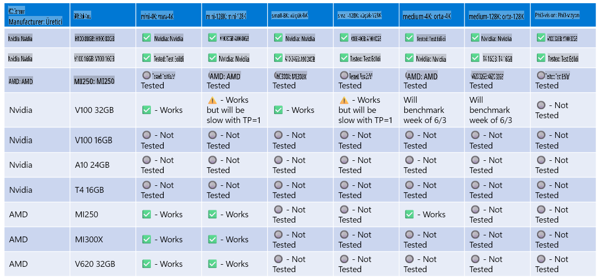

# Phi Donanım Desteği

Microsoft Phi, ONNX Runtime için optimize edilmiştir ve Windows DirectML'yi destekler. GPU'lar, CPU'lar ve hatta mobil cihazlar dahil olmak üzere çeşitli donanım türlerinde sorunsuz çalışır.

## Cihaz Donanımı  
Özellikle desteklenen donanımlar şunlardır:

- GPU SKU: RTX 4090 (DirectML)
- GPU SKU: 1 A100 80GB (CUDA)
- CPU SKU: Standard F64s v2 (64 vCPU, 128 GiB bellek)

## Mobil SKU

- Android - Samsung Galaxy S21
- Apple iPhone 14 veya üstü A16/A17 İşlemci

## Phi Donanım Özellikleri

- Gerekli Minimum Konfigürasyon.
- Windows: DirectX 12 uyumlu GPU ve en az 4GB birleşik RAM

CUDA: Hesaplama Yeteneği >= 7.02 olan NVIDIA GPU



## ONNXRuntime'ı birden fazla GPU'da çalıştırma

Şu anda mevcut olan Phi ONNX modelleri yalnızca 1 GPU için tasarlanmıştır. Phi modeli için çoklu GPU desteği sağlamak mümkün olsa da, 2 GPU ile ORT'nin, 2 ayrı ORT örneğine kıyasla daha fazla verim sağlayacağını garanti etmez. En son güncellemeler için lütfen [ONNX Runtime](https://onnxruntime.ai/) adresine bakın.

[Build 2024 GenAI ONNX Ekibi](https://youtu.be/WLW4SE8M9i8?si=EtG04UwDvcjunyfC), Phi modelleri için çoklu GPU yerine çoklu örneklemeyi etkinleştirdiklerini duyurdu.

Şu anda bu, aşağıdaki gibi CUDA_VISIBLE_DEVICES ortam değişkeni ile bir onnxruntime veya onnxruntime-genai örneğini çalıştırmanıza olanak tanır.

```Python
CUDA_VISIBLE_DEVICES=0 python infer.py
CUDA_VISIBLE_DEVICES=1 python infer.py
```

Phi hakkında daha fazlasını [Azure AI Foundry](https://ai.azure.com) adresinde keşfedebilirsiniz.

**Feragatname**:  
Bu belge, makine tabanlı yapay zeka çeviri hizmetleri kullanılarak çevrilmiştir. Doğruluk için çaba göstersek de, otomatik çevirilerin hata veya yanlışlıklar içerebileceğini lütfen unutmayın. Belgenin orijinal dilindeki hali yetkili kaynak olarak kabul edilmelidir. Kritik bilgiler için profesyonel insan çevirisi önerilir. Bu çevirinin kullanımından kaynaklanan herhangi bir yanlış anlama veya yorumlama için sorumluluk kabul edilmez.