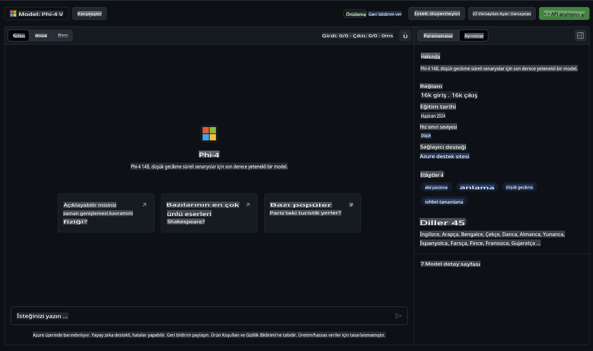

## GitHub Modellerindeki Phi Ailesi

[GitHub Modelleri](https://github.com/marketplace/models) platformuna hoş geldiniz! Azure AI üzerinde barındırılan yapay zeka modellerini keşfetmeye hazır olun.


GitHub Modelleri’nde mevcut olan modeller hakkında daha fazla bilgi için [GitHub Model Marketplace](https://github.com/marketplace/models) sayfasına göz atabilirsiniz.

## Mevcut Modeller

Her modelin kendine ait bir deneme alanı ve örnek kodları bulunmaktadır.



### GitHub Model Kataloğundaki Phi Ailesi

- [Phi-4](https://github.com/marketplace/models/azureml/Phi-4)

- [Phi-3.5-MoE instruct (128k)](https://github.com/marketplace/models/azureml/Phi-3-5-MoE-instruct)

- [Phi-3.5-vision instruct (128k)](https://github.com/marketplace/models/azureml/Phi-3-5-vision-instruct)

- [Phi-3.5-mini instruct (128k)](https://github.com/marketplace/models/azureml/Phi-3-5-mini-instruct)

- [Phi-3-Medium-128k-Instruct](https://github.com/marketplace/models/azureml/Phi-3-medium-128k-instruct)

- [Phi-3-medium-4k-instruct](https://github.com/marketplace/models/azureml/Phi-3-medium-4k-instruct)

- [Phi-3-mini-128k-instruct](https://github.com/marketplace/models/azureml/Phi-3-mini-128k-instruct)

- [Phi-3-mini-4k-instruct](https://github.com/marketplace/models/azureml/Phi-3-mini-4k-instruct)

- [Phi-3-small-128k-instruct](https://github.com/marketplace/models/azureml/Phi-3-small-128k-instruct)

- [Phi-3-small-8k-instruct](https://github.com/marketplace/models/azureml/Phi-3-small-8k-instruct)

## Başlarken

Hemen çalıştırabileceğiniz birkaç temel örnek hazır durumda. Bu örnekleri örnekler dizininde bulabilirsiniz. Eğer doğrudan favori programlama dilinize geçmek isterseniz, aşağıdaki dillerde örnekler mevcuttur:

- Python  
- JavaScript  
- C#  
- Java  
- cURL  

Örnekleri ve modelleri çalıştırmak için özel bir Codespaces Ortamı da bulunmaktadır.


## Örnek Kod 

Aşağıda birkaç kullanım durumu için örnek kod parçacıkları bulunmaktadır. Azure AI Inference SDK hakkında daha fazla bilgi için tam dokümantasyona ve örneklere göz atabilirsiniz.

## Kurulum 

1. Kişisel erişim belirteci oluşturun  
Belirteç için herhangi bir izin vermeniz gerekmez. Ancak, belirtecin bir Microsoft hizmetine gönderileceğini unutmayın.

Aşağıdaki kod parçacıklarını kullanmak için, belirtecinizi istemci kodu için anahtar olarak ayarlamak üzere bir ortam değişkeni oluşturun.

Eğer bash kullanıyorsanız:  
```
export GITHUB_TOKEN="<your-github-token-goes-here>"
```  
Eğer powershell kullanıyorsanız:  

```
$Env:GITHUB_TOKEN="<your-github-token-goes-here>"
```  

Eğer Windows komut istemcisini kullanıyorsanız:  

```
set GITHUB_TOKEN=<your-github-token-goes-here>
```  

## Python Örneği  

### Bağımlılıkları yükleyin  
Azure AI Inference SDK'yı pip ile yükleyin (Gereksinim: Python >=3.8):  

```
pip install azure-ai-inference
```  

### Temel bir kod örneği çalıştırın  

Bu örnek, sohbet tamamlama API'sine temel bir çağrıyı göstermektedir. GitHub AI model çıkarım uç noktasını ve GitHub belirtecinizi kullanır. Çağrı senkronize şekilde gerçekleştirilir.  

```python
import os
from azure.ai.inference import ChatCompletionsClient
from azure.ai.inference.models import SystemMessage, UserMessage
from azure.core.credentials import AzureKeyCredential

endpoint = "https://models.inference.ai.azure.com"
model_name = "Phi-4"
token = os.environ["GITHUB_TOKEN"]

client = ChatCompletionsClient(
    endpoint=endpoint,
    credential=AzureKeyCredential(token),
)

response = client.complete(
    messages=[
        UserMessage(content="I have $20,000 in my savings account, where I receive a 4% profit per year and payments twice a year. Can you please tell me how long it will take for me to become a millionaire? Also, can you please explain the math step by step as if you were explaining it to an uneducated person?"),
    ],
    temperature=0.4,
    top_p=1.0,
    max_tokens=2048,
    model=model_name
)

print(response.choices[0].message.content)
```  

### Çok adımlı bir konuşma gerçekleştirin  

Bu örnek, sohbet tamamlama API'siyle çok adımlı bir konuşmayı göstermektedir. Sohbet uygulaması için modeli kullanırken, konuşma geçmişini yönetmeniz ve en son mesajları modele göndermeniz gerekir.  

```
import os
from azure.ai.inference import ChatCompletionsClient
from azure.ai.inference.models import AssistantMessage, SystemMessage, UserMessage
from azure.core.credentials import AzureKeyCredential

token = os.environ["GITHUB_TOKEN"]
endpoint = "https://models.inference.ai.azure.com"
# Replace Model_Name
model_name = "Phi-4"

client = ChatCompletionsClient(
    endpoint=endpoint,
    credential=AzureKeyCredential(token),
)

messages = [
    SystemMessage(content="You are a helpful assistant."),
    UserMessage(content="What is the capital of France?"),
    AssistantMessage(content="The capital of France is Paris."),
    UserMessage(content="What about Spain?"),
]

response = client.complete(messages=messages, model=model_name)

print(response.choices[0].message.content)
```  

### Çıktıyı akış şeklinde alın  

Daha iyi bir kullanıcı deneyimi için, modelin yanıtını akış şeklinde almak isteyebilirsiniz. Böylece ilk token erken gösterilir ve uzun yanıtlar için beklemezsiniz.  

```
import os
from azure.ai.inference import ChatCompletionsClient
from azure.ai.inference.models import SystemMessage, UserMessage
from azure.core.credentials import AzureKeyCredential

token = os.environ["GITHUB_TOKEN"]
endpoint = "https://models.inference.ai.azure.com"
# Replace Model_Name
model_name = "Phi-4"

client = ChatCompletionsClient(
    endpoint=endpoint,
    credential=AzureKeyCredential(token),
)

response = client.complete(
    stream=True,
    messages=[
        SystemMessage(content="You are a helpful assistant."),
        UserMessage(content="Give me 5 good reasons why I should exercise every day."),
    ],
    model=model_name,
)

for update in response:
    if update.choices:
        print(update.choices[0].delta.content or "", end="")

client.close()
```  

## GitHub Modelleri için ÜCRETSİZ Kullanım ve Hız Sınırları  


[Deneme alanı ve ücretsiz API kullanımı için hız sınırları](https://docs.github.com/en/github-models/prototyping-with-ai-models#rate-limits), modelleri deneyimlemenize ve yapay zeka uygulamanızın prototipini oluşturmanıza yardımcı olmak için tasarlanmıştır. Bu sınırların ötesinde kullanım ve uygulamanızı ölçeklendirmek için bir Azure hesabından kaynak ayırmanız ve oradan kimlik doğrulaması yapmanız gerekmektedir. Kodunuzda başka bir değişiklik yapmanıza gerek yoktur. Azure AI’da ücretsiz katman sınırlarının ötesine geçmenin yollarını keşfetmek için bu bağlantıyı kullanın.

### Bildirimler  

Bir modelle etkileşimde bulunurken, yapay zeka ile deneyim yaptığınızı unutmayın; bu nedenle içerik hataları mümkün olabilir.

Bu özellik, çeşitli sınırlamalara (dakikadaki istekler, günlük istekler, istek başına token sayısı ve eşzamanlı istekler dahil) tabidir ve üretim kullanım durumları için tasarlanmamıştır.

GitHub Modelleri, Azure AI İçerik Güvenliği kullanır. Bu filtreler, GitHub Modelleri deneyiminin bir parçası olarak devre dışı bırakılamaz. Eğer modelleri ücretli bir hizmet aracılığıyla kullanmayı seçerseniz, içerik filtrelerinizi gereksinimlerinize göre yapılandırabilirsiniz.

Bu hizmet, GitHub’ın Ön Sürüm Koşulları kapsamındadır.

**Feragatname**:  
Bu belge, yapay zeka tabanlı makine çeviri hizmetleri kullanılarak çevrilmiştir. Doğruluk için çaba göstersek de, otomatik çevirilerin hata veya yanlışlıklar içerebileceğini lütfen unutmayın. Orijinal belge, kendi ana dilinde yetkili kaynak olarak kabul edilmelidir. Kritik bilgiler için profesyonel insan çevirisi önerilir. Bu çevirinin kullanımından kaynaklanan herhangi bir yanlış anlama veya yanlış yorumlamadan sorumlu değiliz.