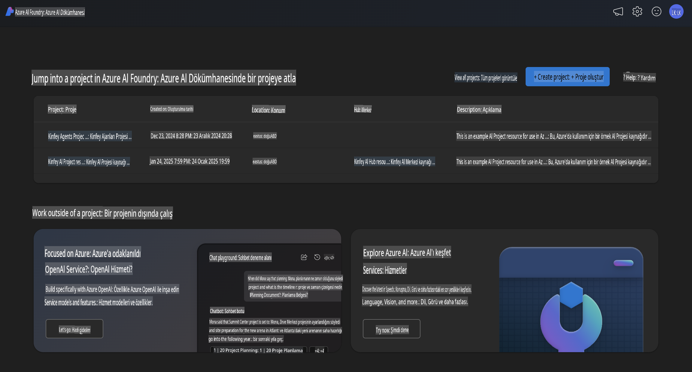
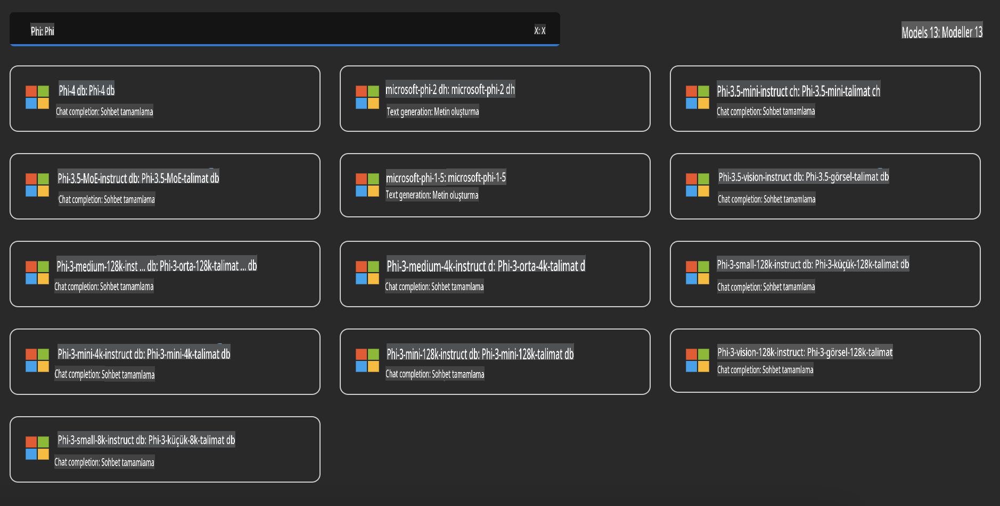
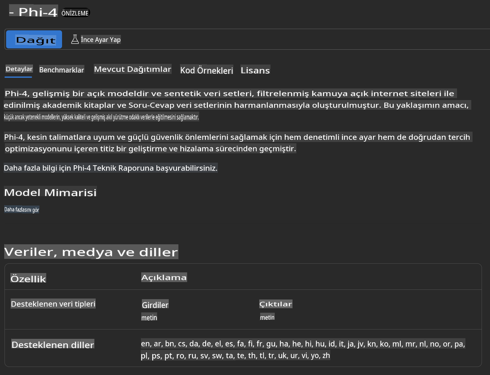
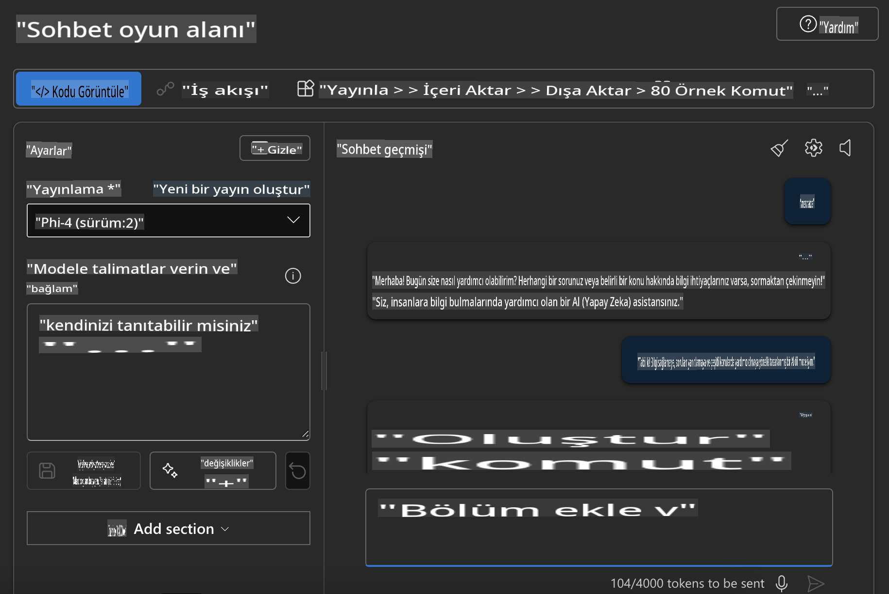

## Azure AI Foundry'de Phi Ailesi

[Azure AI Foundry](https://ai.azure.com), geliştiricilere güvenli, emniyetli ve sorumlu bir şekilde yapay zeka ile yenilik yapma ve geleceği şekillendirme gücü veren güvenilir bir platformdur.

[Azure AI Foundry](https://ai.azure.com) geliştiriciler için şu amaçlarla tasarlanmıştır:

- Kurumsal düzeyde bir platformda üretken yapay zeka uygulamaları oluşturmak.
- Sorumlu yapay zeka uygulamaları temelinde en yeni yapay zeka araçlarını ve ML modellerini keşfetmek, oluşturmak, test etmek ve dağıtmak.
- Uygulama geliştirme yaşam döngüsünün tamamında bir ekiple iş birliği yapmak.

Azure AI Foundry ile hedeflerinize en uygun yapay zeka uygulamalarını oluşturmak için çok çeşitli modelleri, hizmetleri ve yetenekleri keşfedebilirsiniz. Azure AI Foundry platformu, kavram kanıtlarını kolayca tam teşekküllü üretim uygulamalarına dönüştürmek için ölçeklenebilirlik sağlar. Sürekli izleme ve iyileştirme, uzun vadeli başarıyı destekler.



Azure AI Foundry'de Azure AOAI Service kullanmanın yanı sıra, Azure AI Foundry Model Catalog'da üçüncü taraf modelleri de kullanabilirsiniz. Bu, Azure AI Foundry'yi yapay zeka çözüm platformunuz olarak kullanmak istediğinizde iyi bir seçimdir.

Azure AI Foundry Model Catalog üzerinden Phi Ailesi Modellerini hızlı bir şekilde dağıtabiliriz.



### **Azure AI Foundry'de Phi-4'ü Dağıtma**



### **Azure AI Foundry Playground'da Phi-4'ü Test Etme**



### **Azure AI Foundry Phi-4'ü Çağırmak için Python Kodunu Çalıştırma**

```python

import os  
import base64
from openai import AzureOpenAI  
from azure.identity import DefaultAzureCredential, get_bearer_token_provider  
        
endpoint = os.getenv("ENDPOINT_URL", "Your Azure AOAI Service Endpoint")  
deployment = os.getenv("DEPLOYMENT_NAME", "Phi-4")  
      
token_provider = get_bearer_token_provider(  
    DefaultAzureCredential(),  
    "https://cognitiveservices.azure.com/.default"  
)  
  
client = AzureOpenAI(  
    azure_endpoint=endpoint,  
    azure_ad_token_provider=token_provider,  
    api_version="2024-05-01-preview",  
)  
  

chat_prompt = [
    {
        "role": "system",
        "content": "You are an AI assistant that helps people find information."
    },
    {
        "role": "user",
        "content": "can you introduce yourself"
    }
] 
    
# Include speech result if speech is enabled  
messages = chat_prompt 

completion = client.chat.completions.create(  
    model=deployment,  
    messages=messages,
    max_tokens=800,  
    temperature=0.7,  
    top_p=0.95,  
    frequency_penalty=0,  
    presence_penalty=0,
    stop=None,  
    stream=False  
)  
  
print(completion.to_json())  

```

**Feragatname**:  
Bu belge, yapay zeka tabanlı makine çeviri hizmetleri kullanılarak çevrilmiştir. Doğruluk için çaba göstersek de, otomatik çevirilerin hata veya yanlışlıklar içerebileceğini lütfen unutmayın. Belgenin orijinal dilindeki hali, bağlayıcı kaynak olarak kabul edilmelidir. Kritik bilgiler için profesyonel insan çevirisi önerilir. Bu çevirinin kullanımından kaynaklanan herhangi bir yanlış anlama veya yanlış yorumlama konusunda sorumluluk kabul edilmez.