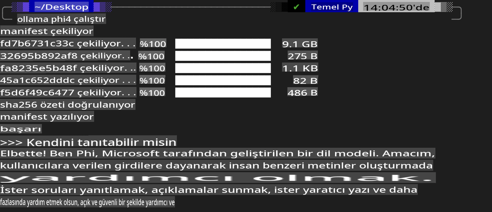
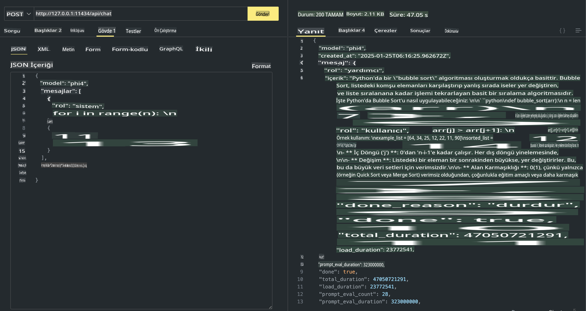

## Phi Ailesi Ollama'da

[Ollama](https://ollama.com), basit betikler aracılığıyla daha fazla kişinin açık kaynaklı LLM veya SLM'leri doğrudan dağıtmasına olanak tanır ve yerel Copilot uygulama senaryolarına yardımcı olacak API'ler oluşturabilir.

## **1. Kurulum**

Ollama, Windows, macOS ve Linux'ta çalışmayı destekler. Ollama'yı bu bağlantıdan ([https://ollama.com/download](https://ollama.com/download)) indirebilirsiniz. Başarılı bir kurulumdan sonra, bir terminal penceresi aracılığıyla Phi-3'ü çağırmak için Ollama betiğini doğrudan kullanabilirsiniz. Ollama'daki [mevcut kütüphanelerin tümünü buradan görebilirsiniz](https://ollama.com/library). Bu depoyu bir Codespace içinde açarsanız, Ollama zaten yüklü olacaktır.

```bash

ollama run phi4

```

> [!NOTE]
> İlk kez çalıştırdığınızda model indirilecektir. Elbette, önceden indirilmiş Phi-4 modelini doğrudan belirtebilirsiniz. Komutu çalıştırmak için WSL'yi bir örnek olarak ele alıyoruz. Model başarıyla indirildikten sonra, terminalde doğrudan etkileşimde bulunabilirsiniz.



## **2. Ollama'dan phi-4 API'sini çağırma**

Eğer Ollama tarafından oluşturulan Phi-4 API'sini çağırmak istiyorsanız, Ollama sunucusunu başlatmak için terminalde bu komutu kullanabilirsiniz.

```bash

ollama serve

```

> [!NOTE]
> Eğer macOS veya Linux kullanıyorsanız, **"Error: listen tcp 127.0.0.1:11434: bind: address already in use"** hatasıyla karşılaşabilirsiniz. Bu hatayı komutu çalıştırırken alabilirsiniz. Bu hatayı genellikle sunucunun zaten çalıştığını gösterdiği için görmezden gelebilir ya da Ollama'yı durdurup yeniden başlatabilirsiniz:

**macOS**

```bash

brew services restart ollama

```

**Linux**

```bash

sudo systemctl stop ollama

```

Ollama, iki API'yi destekler: generate ve chat. Ollama tarafından sağlanan model API'sini, ihtiyaçlarınıza göre, 11434 portunda çalışan yerel servise istek göndererek çağırabilirsiniz.

**Chat**

```bash

curl http://127.0.0.1:11434/api/chat -d '{
  "model": "phi3",
  "messages": [
    {
      "role": "system",
      "content": "Your are a python developer."
    },
    {
      "role": "user",
      "content": "Help me generate a bubble algorithm"
    }
  ],
  "stream": false
  
}'

This is the result in Postman



## Additional Resources

Check the list of available models in Ollama in [their library](https://ollama.com/library).

Pull your model from the Ollama server using this command

```bash
ollama pull phi4
```

Run the model using this command

```bash
ollama run phi4
```

***Note:*** Visit this link [https://github.com/ollama/ollama/blob/main/docs/api.md](https://github.com/ollama/ollama/blob/main/docs/api.md) to learn more

## Calling Ollama from Python

You can use `requests` or `urllib3` to make requests to the local server endpoints used above. However, a popular way to use Ollama in Python is via the [openai](https://pypi.org/project/openai/) SDK, since Ollama provides OpenAI-compatible server endpoints as well.

Here is an example for phi3-mini:

```python
import openai

client = openai.OpenAI(
    base_url="http://localhost:11434/v1",
    api_key="nokeyneeded",
)

response = client.chat.completions.create(
    model="phi4",
    temperature=0.7,
    n=1,
    messages=[
        {"role": "system", "content": "You are a helpful assistant."},
        {"role": "user", "content": "Write a haiku about a hungry cat"},
    ],
)

print("Response:")
print(response.choices[0].message.content)
```

## Calling Ollama from JavaScript 

```javascript
// Phi-4 ile bir dosyayı özetleme örneği
script({
    model: "ollama:phi4",
    title: "Phi-4 ile Özetleme",
    system: ["system"],
})

// Özetleme örneği
const file = def("FILE", env.files)
$`Summarize ${file} in a single paragraph.`
```

## Calling Ollama from C#

Create a new C# Console application and add the following NuGet package:

```bash
dotnet add package Microsoft.SemanticKernel --version 1.34.0
```

Then replace this code in the `Program.cs` file

```csharp
using Microsoft.SemanticKernel;
using Microsoft.SemanticKernel.ChatCompletion;

// yerel ollama sunucu uç noktasını kullanarak sohbet tamamlama servisi ekle
#pragma warning disable SKEXP0001, SKEXP0003, SKEXP0010, SKEXP0011, SKEXP0050, SKEXP0052
builder.AddOpenAIChatCompletion(
    modelId: "phi4",
    endpoint: new Uri("http://localhost:11434/"),
    apiKey: "non required");

// sohbet servisine basit bir istem gönder
string prompt = "Write a joke about kittens";
var response = await kernel.InvokePromptAsync(prompt);
Console.WriteLine(response.GetValue<string>());
```

Run the app with the command:

```bash
dotnet run

**Feragatname**:  
Bu belge, yapay zeka tabanlı makine çeviri hizmetleri kullanılarak çevrilmiştir. Doğruluk için çaba göstersek de, otomatik çevirilerin hata veya yanlışlıklar içerebileceğini lütfen unutmayın. Orijinal belgenin kendi dilindeki hali, bağlayıcı kaynak olarak kabul edilmelidir. Kritik bilgiler için profesyonel insan çevirisi önerilir. Bu çevirinin kullanımından kaynaklanan herhangi bir yanlış anlama veya yanlış yorumlama durumunda sorumluluk kabul edilmez.