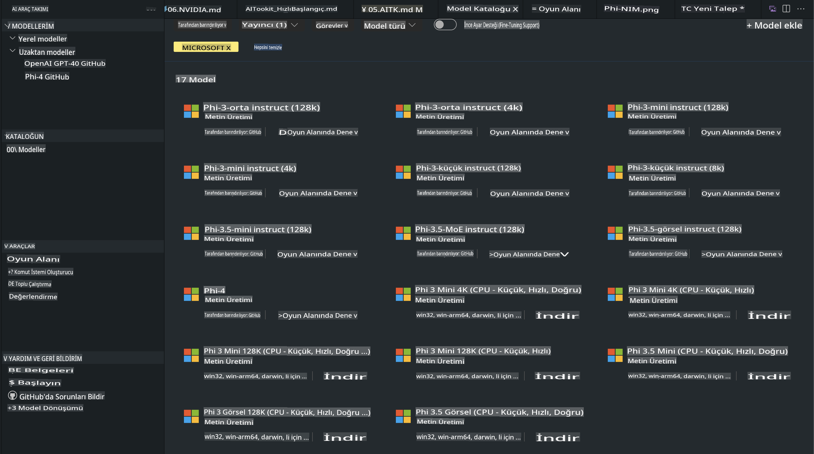
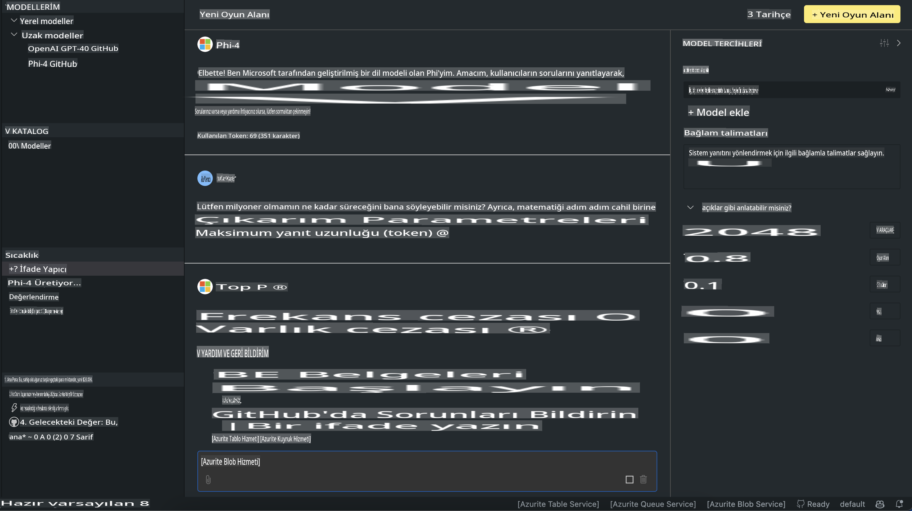

# AITK'deki Phi Ailesi

[VS Code için AI Toolkit](https://marketplace.visualstudio.com/items?itemName=ms-windows-ai-studio.windows-ai-studio), Azure AI Foundry Kataloğu ve Hugging Face gibi diğer kataloglardan gelen en yeni AI geliştirme araçlarını ve modellerini bir araya getirerek üretken yapay zeka uygulamaları geliştirmeyi kolaylaştırır. GitHub Modelleri ve Azure AI Foundry Model Kataloğu tarafından desteklenen AI modelleri kataloğunu inceleyebilir, bu modelleri yerel veya uzaktan indirip, ince ayar yapabilir, test edebilir ve uygulamanızda kullanabilirsiniz.

AI Toolkit Önizlemesi yerel olarak çalışacaktır. Yerel çıkarım veya ince ayar, seçtiğiniz modele bağlıdır ve NVIDIA CUDA GPU gibi bir GPU'ya ihtiyacınız olabilir. GitHub Modellerini AITK ile doğrudan çalıştırabilirsiniz.

## Başlarken

[Windows için Linux alt sistemini nasıl kuracağınızı öğrenin](https://learn.microsoft.com/windows/wsl/install?WT.mc_id=aiml-137032-kinfeylo)

ve [varsayılan dağıtımı değiştirme](https://learn.microsoft.com/windows/wsl/install#change-the-default-linux-distribution-installed).

[AI Toolkit GitHub Repo](https://github.com/microsoft/vscode-ai-toolkit/)

- Windows, Linux, macOS
  
- Hem Windows hem de Linux'ta ince ayar yapmak için Nvidia GPU'ya ihtiyacınız olacak. Ayrıca, **Windows** için Ubuntu 18.4 veya daha yeni bir dağıtımla Linux alt sistemi gereklidir. [Windows için Linux alt sistemini nasıl kuracağınızı öğrenin](https://learn.microsoft.com/windows/wsl/install) ve [varsayılan dağıtımı değiştirme](https://learn.microsoft.com/windows/wsl/install#change-the-default-linux-distribution-installed).

### AI Toolkit'i Yükleyin

AI Toolkit, bir [Visual Studio Code Uzantısı](https://code.visualstudio.com/docs/setup/additional-components#_vs-code-extensions) olarak sunulmaktadır, bu nedenle önce [VS Code](https://code.visualstudio.com/docs/setup/windows?WT.mc_id=aiml-137032-kinfeylo) kurmanız ve ardından AI Toolkit'i [VS Marketplace](https://marketplace.visualstudio.com/items?itemName=ms-windows-ai-studio.windows-ai-studio) üzerinden indirmeniz gerekmektedir.  
[AI Toolkit, Visual Studio Marketplace'te](https://marketplace.visualstudio.com/items?itemName=ms-windows-ai-studio.windows-ai-studio) mevcuttur ve diğer VS Code uzantıları gibi kurulabilir. 

VS Code uzantılarının nasıl kurulacağını bilmiyorsanız, şu adımları izleyin:

### Giriş Yapın

1. VS Code'daki Aktivite Çubuğunda **Extensions**'ı seçin.  
2. Uzantılar Arama çubuğuna "AI Toolkit" yazın.  
3. "AI Toolkit for Visual Studio code" seçeneğini seçin.  
4. **Install** düğmesine tıklayın.  

Artık uzantıyı kullanmaya hazırsınız!

GitHub'a giriş yapmanız istenecektir, bu yüzden devam etmek için "Allow" butonuna tıklayın. GitHub giriş sayfasına yönlendirileceksiniz.

Lütfen giriş yapın ve işlem adımlarını takip edin. Başarıyla tamamlandıktan sonra VS Code'a yönlendirileceksiniz.

Uzantı kurulduktan sonra, Aktivite Çubuğunuzda AI Toolkit simgesini göreceksiniz.

Haydi mevcut eylemleri keşfedelim!

### Mevcut Eylemler

AI Toolkit'in birincil kenar çubuğu şu şekilde düzenlenmiştir:

- **Modeller**
- **Kaynaklar**
- **Playground**
- **İnce Ayar**
- **Değerlendirme**

Kaynaklar bölümünde mevcuttur. Başlamak için **Model Kataloğu**'nu seçin.

### Katalogdan bir modeli indirin

VS Code kenar çubuğundan AI Toolkit'i başlattığınızda, şu seçeneklerden birini seçebilirsiniz:



- **Model Kataloğu**ndan desteklenen bir modeli bulun ve yerel olarak indirin.  
- **Model Playground**'da model çıkarımını test edin.  
- **Model Fine-tuning**'de modeli yerel veya uzaktan ince ayar yapın.  
- İnce ayarlı modelleri, AI Toolkit için komut paleti üzerinden buluta dağıtın.  
- Modelleri değerlendirin.  

> [!NOTE]
>
> **GPU ve CPU**
>
> Model kartlarında model boyutu, platform ve hızlandırıcı türü (CPU, GPU) gösterilecektir. **En az bir GPU'ya sahip Windows cihazlarında** optimize edilmiş performans için yalnızca Windows'u hedefleyen model sürümlerini seçin.
>
> Bu, DirectML hızlandırıcısı için optimize edilmiş bir modele sahip olmanızı sağlar.
>
> Model isimleri şu formatta olacaktır:
>
> - `{model_name}-{accelerator}-{quantization}-{format}`.
>
> Windows cihazınızda GPU olup olmadığını kontrol etmek için **Görev Yöneticisi**ni açın ve ardından **Performans** sekmesini seçin. GPU'larınız varsa, "GPU 0" veya "GPU 1" gibi isimlerle listelenecektir.

### Playground'da modeli çalıştırın

Tüm parametreler ayarlandıktan sonra, **Generate Project** butonuna tıklayın.

Modeliniz indirildikten sonra, katalogdaki model kartında **Load in Playground** seçeneğini seçin:

- Model indirmeyi başlatın.  
- Tüm ön koşulları ve bağımlılıkları yükleyin.  
- VS Code çalışma alanı oluşturun.  



### Uygulamanızda REST API'yi kullanın 

AI Toolkit, [OpenAI chat completions formatını](https://platform.openai.com/docs/api-reference/chat/create) kullanan **5272 portunda** bir yerel REST API web sunucusuyla birlikte gelir.

Bu, bir bulut AI modeli hizmetine bağımlı olmadan uygulamanızı yerel olarak test etmenizi sağlar. Örneğin, aşağıdaki JSON dosyası, isteğin gövdesini nasıl yapılandıracağınızı gösterir:

```json
{
    "model": "Phi-4",
    "messages": [
        {
            "role": "user",
            "content": "what is the golden ratio?"
        }
    ],
    "temperature": 0.7,
    "top_p": 1,
    "top_k": 10,
    "max_tokens": 100,
    "stream": true
}
```

REST API'yi (örneğin) [Postman](https://www.postman.com/) veya CURL (Client URL) aracı ile test edebilirsiniz:

```bash
curl -vX POST http://127.0.0.1:5272/v1/chat/completions -H 'Content-Type: application/json' -d @body.json
```

### Python için OpenAI istemci kütüphanesini kullanma

```python
from openai import OpenAI

client = OpenAI(
    base_url="http://127.0.0.1:5272/v1/", 
    api_key="x" # required for the API but not used
)

chat_completion = client.chat.completions.create(
    messages=[
        {
            "role": "user",
            "content": "what is the golden ratio?",
        }
    ],
    model="Phi-4",
)

print(chat_completion.choices[0].message.content)
```

### Azure OpenAI istemci kütüphanesini .NET için kullanma

Projenize NuGet kullanarak [Azure OpenAI istemci kütüphanesini .NET için](https://www.nuget.org/packages/Azure.AI.OpenAI/) ekleyin:

```bash
dotnet add {project_name} package Azure.AI.OpenAI --version 1.0.0-beta.17
```

Projenize **OverridePolicy.cs** adında bir C# dosyası ekleyin ve aşağıdaki kodu yapıştırın:

```csharp
// OverridePolicy.cs
using Azure.Core.Pipeline;
using Azure.Core;

internal partial class OverrideRequestUriPolicy(Uri overrideUri)
    : HttpPipelineSynchronousPolicy
{
    private readonly Uri _overrideUri = overrideUri;

    public override void OnSendingRequest(HttpMessage message)
    {
        message.Request.Uri.Reset(_overrideUri);
    }
}
```

Sonraki adımda, aşağıdaki kodu **Program.cs** dosyanıza yapıştırın:

```csharp
// Program.cs
using Azure.AI.OpenAI;

Uri localhostUri = new("http://localhost:5272/v1/chat/completions");

OpenAIClientOptions clientOptions = new();
clientOptions.AddPolicy(
    new OverrideRequestUriPolicy(localhostUri),
    Azure.Core.HttpPipelinePosition.BeforeTransport);
OpenAIClient client = new(openAIApiKey: "unused", clientOptions);

ChatCompletionsOptions options = new()
{
    DeploymentName = "Phi-4",
    Messages =
    {
        new ChatRequestSystemMessage("You are a helpful assistant. Be brief and succinct."),
        new ChatRequestUserMessage("What is the golden ratio?"),
    }
};

StreamingResponse<StreamingChatCompletionsUpdate> streamingChatResponse
    = await client.GetChatCompletionsStreamingAsync(options);

await foreach (StreamingChatCompletionsUpdate chatChunk in streamingChatResponse)
{
    Console.Write(chatChunk.ContentUpdate);
}
```

## AI Toolkit ile İnce Ayar

- Model keşfi ve playground ile başlayın.  
- Yerel bilgi işlem kaynaklarını kullanarak model ince ayarı ve çıkarım.  
- Azure kaynaklarını kullanarak uzaktan ince ayar ve çıkarım.  

[AI Toolkit ile İnce Ayar](../../03.FineTuning/Finetuning_VSCodeaitoolkit.md)

## AI Toolkit Soru-Cevap Kaynakları

En yaygın sorunlar ve çözümleri için lütfen [Soru-Cevap sayfamıza](https://github.com/microsoft/vscode-ai-toolkit/blob/main/archive/QA.md) bakın.  

**Feragatname**:  
Bu belge, yapay zeka tabanlı makine çeviri hizmetleri kullanılarak çevrilmiştir. Doğruluk için çaba göstersek de, otomatik çevirilerin hata veya yanlışlıklar içerebileceğini lütfen unutmayın. Belgenin orijinal diliyle yazılmış hali yetkili kaynak olarak kabul edilmelidir. Kritik bilgiler için profesyonel insan çevirisi önerilir. Bu çevirinin kullanımından kaynaklanan herhangi bir yanlış anlama veya yanlış yorumlama durumunda sorumluluk kabul edilmez.