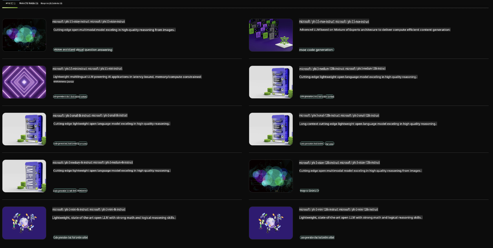

## NVIDIA NIM'de Phi Ailesi

NVIDIA NIM, bulut, veri merkezi ve iş istasyonlarında üretken yapay zeka modellerinin dağıtımını hızlandırmak için tasarlanmış, kullanımı kolay bir mikro hizmetler setidir. NIM'ler model ailesine ve modele göre kategorize edilir. Örneğin, büyük dil modelleri (LLM'ler) için NVIDIA NIM, son teknoloji LLM'lerin gücünü kurumsal uygulamalara getirerek eşsiz doğal dil işleme ve anlama yetenekleri sunar.

NIM, BT ve DevOps ekiplerinin büyük dil modellerini (LLM'ler) kendi yönetilen ortamlarında barındırmalarını kolaylaştırırken, geliştiricilere güçlü yardımcı araçlar, sohbet botları ve işletmelerini dönüştürebilecek yapay zeka asistanları oluşturmalarına olanak tanıyan endüstri standardı API'ler sağlar. NVIDIA’nın en son GPU hızlandırma teknolojisi ve ölçeklenebilir dağıtımıyla NIM, üstün performansla en hızlı çıkarım yolunu sunar.

NVIDIA NIM'i kullanarak Phi Ailesi Modelleri ile çıkarım yapabilirsiniz.



### **Örnekler - NVIDIA NIM'de Phi-3-Vision**

Elinizde bir resim (`demo.png`) olduğunu ve bu resmi işleyip yeni bir versiyonunu kaydeden bir Python kodu oluşturmak istediğinizi düşünün (`phi-3-vision.jpg`).

Yukarıdaki kod bu süreci şu şekilde otomatikleştirir:

1. Ortamı ve gerekli yapılandırmaları ayarlama.
2. Modelin gerekli Python kodunu üretmesini talep eden bir talimat oluşturma.
3. Talimatı modele gönderme ve oluşturulan kodu toplama.
4. Oluşturulan kodu çıkarma ve çalıştırma.
5. Orijinal ve işlenmiş resimleri görüntüleme.

Bu yaklaşım, görüntü işleme görevlerini otomatikleştirmek için yapay zeka gücünden yararlanır ve hedeflerinize daha hızlı ve kolay ulaşmanızı sağlar.

[Örnek Kod Çözümü](../../../../../code/06.E2E/E2E_Nvidia_NIM_Phi3_Vision.ipynb)

Kodun tamamının adım adım ne yaptığını inceleyelim:

1. **Gerekli Paketi Yükleyin**:
    ```python
    !pip install langchain_nvidia_ai_endpoints -U
    ```
    Bu komut, `langchain_nvidia_ai_endpoints` paketini en son sürümüyle yükler.

2. **Gerekli Modülleri İçe Aktarın**:
    ```python
    from langchain_nvidia_ai_endpoints import ChatNVIDIA
    import getpass
    import os
    import base64
    ```
    Bu içe aktarmalar, NVIDIA AI uç noktalarıyla etkileşim, şifrelerin güvenli bir şekilde yönetimi, işletim sistemiyle etkileşim ve verilerin base64 formatında kodlanması/çözülmesi için gerekli modülleri getirir.

3. **API Anahtarını Ayarlayın**:
    ```python
    if not os.getenv("NVIDIA_API_KEY"):
        os.environ["NVIDIA_API_KEY"] = getpass.getpass("Enter your NVIDIA API key: ")
    ```
    Bu kod, `NVIDIA_API_KEY` ortam değişkeninin ayarlanıp ayarlanmadığını kontrol eder. Eğer ayarlanmamışsa, kullanıcıdan API anahtarını güvenli bir şekilde girmesini ister.

4. **Modeli ve Görüntü Yolunu Tanımlayın**:
    ```python
    model = 'microsoft/phi-3-vision-128k-instruct'
    chat = ChatNVIDIA(model=model)
    img_path = './imgs/demo.png'
    ```
    Bu, kullanılacak modeli ayarlar, belirtilen modelle bir `ChatNVIDIA` örneği oluşturur ve görüntü dosyasının yolunu tanımlar.

5. **Metin Talimatı Oluşturun**:
    ```python
    text = "Please create Python code for image, and use plt to save the new picture under imgs/ and name it phi-3-vision.jpg."
    ```
    Bu, modelin bir görüntüyü işlemek için Python kodu oluşturmasını talep eden bir metin talimatı tanımlar.

6. **Görüntüyü Base64 Formatında Kodlayın**:
    ```python
    with open(img_path, "rb") as f:
        image_b64 = base64.b64encode(f.read()).decode()
    image = f''
    ```
    Bu kod, görüntü dosyasını okur, base64 formatında kodlar ve kodlanmış verilerle bir HTML görüntü etiketi oluşturur.

7. **Metin ve Görüntüyü Talimat Haline Getirin**:
    ```python
    prompt = f"{text} {image}"
    ```
    Bu, metin talimatını ve HTML görüntü etiketini tek bir dizeye birleştirir.

8. **ChatNVIDIA Kullanarak Kod Üretin**:
    ```python
    code = ""
    for chunk in chat.stream(prompt):
        print(chunk.content, end="")
        code += chunk.content
    ```
    Bu kod, talimatı `ChatNVIDIA` model and collects the generated code in chunks, printing and appending each chunk to the `code` dizisine gönderir.

9. **Üretilen İçerikten Python Kodunu Çıkarın**:
    ```python
    begin = code.index('```python') + 9
    code = code[begin:]
    end = code.index('```')
    code = code[:end]
    ```
    Bu, markdown biçimlendirmesini kaldırarak oluşturulan içeriğin içindeki gerçek Python kodunu çıkarır.

10. **Oluşturulan Kodu Çalıştırın**:
    ```python
    import subprocess
    result = subprocess.run(["python", "-c", code], capture_output=True)
    ```
    Bu, çıkarılan Python kodunu bir alt işlem olarak çalıştırır ve çıktısını yakalar.

11. **Görüntüleri Görüntüleyin**:
    ```python
    from IPython.display import Image, display
    display(Image(filename='./imgs/phi-3-vision.jpg'))
    display(Image(filename='./imgs/demo.png'))
    ```
    Bu satırlar, `IPython.display` modülünü kullanarak görüntüleri görüntüler.

**Feragatname**:  
Bu belge, yapay zeka tabanlı makine çeviri hizmetleri kullanılarak çevrilmiştir. Doğruluk için çaba göstersek de, otomatik çevirilerin hata veya yanlışlıklar içerebileceğini lütfen unutmayın. Belgenin orijinal dilindeki hali, yetkili kaynak olarak kabul edilmelidir. Kritik bilgiler için profesyonel insan çevirisi önerilir. Bu çevirinin kullanımından kaynaklanan yanlış anlama veya yanlış yorumlamalardan sorumlu değiliz.