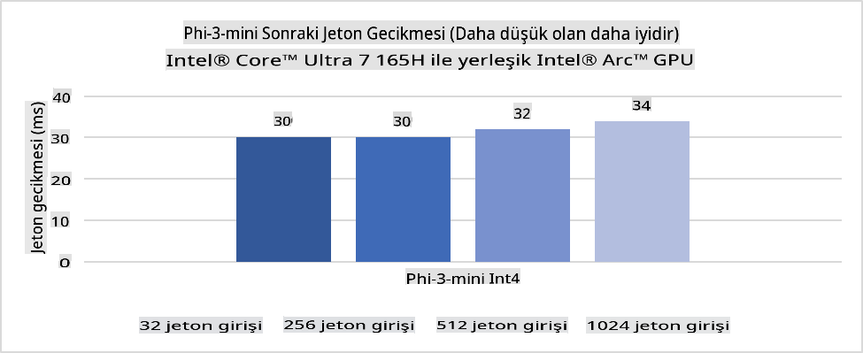
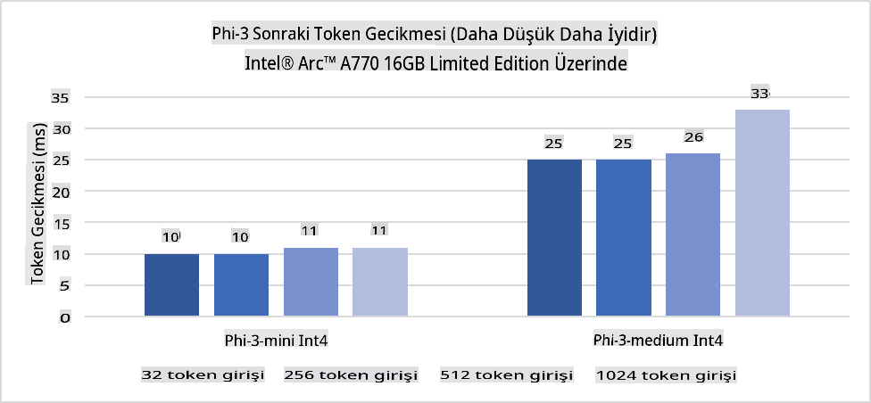
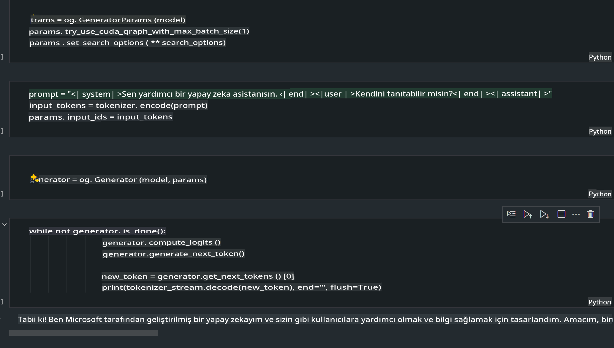
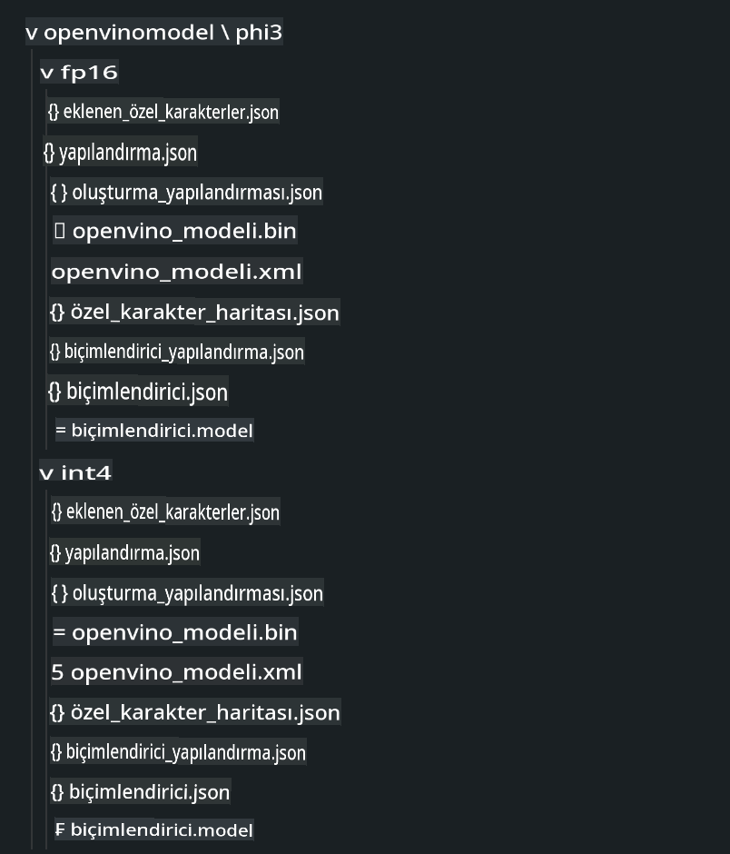
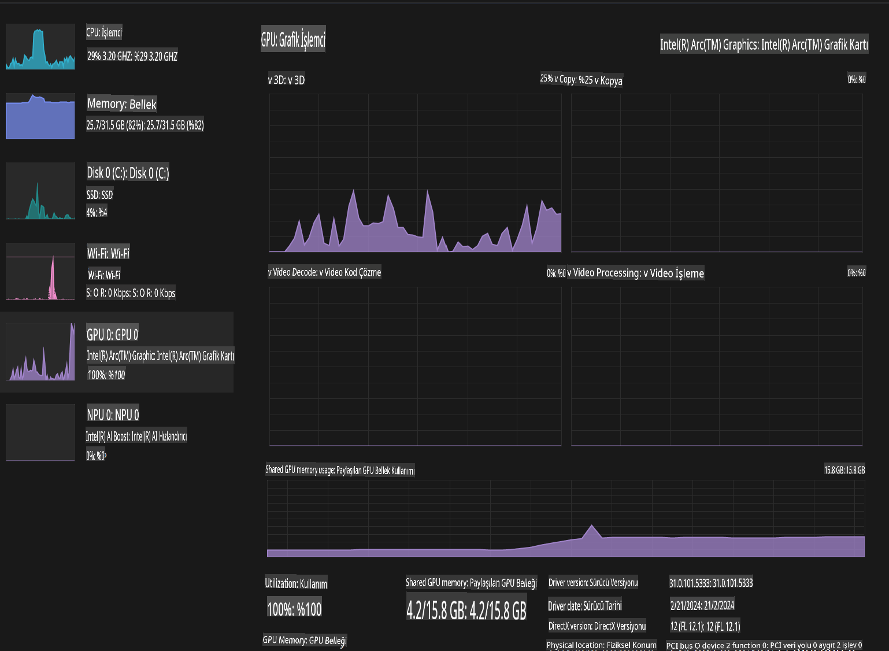

# **AI PC'de Phi-3 Çıkarımı**

Üretken yapay zekanın gelişimi ve uç cihaz donanımlarının yeteneklerinin artmasıyla birlikte, giderek daha fazla üretken yapay zeka modeli kullanıcıların Kendi Cihazını Getir (BYOD) cihazlarına entegre edilebiliyor. AI PC'ler bu modellerden biri olarak öne çıkıyor. 2024'ten itibaren Intel, AMD ve Qualcomm, PC üreticileriyle iş birliği yaparak, donanım değişiklikleriyle yerel üretken yapay zeka modellerinin uygulanmasını kolaylaştıran AI PC'leri tanıttı. Bu tartışmada Intel AI PC'lerine odaklanacağız ve Intel AI PC üzerinde Phi-3'ü nasıl dağıtabileceğimizi inceleyeceğiz.

### NPU Nedir?

Bir NPU (Sinir İşleme Birimi), daha büyük bir SoC üzerinde yer alan ve özellikle sinir ağı işlemleri ve yapay zeka görevlerini hızlandırmak için tasarlanmış özel bir işlemci veya işlem birimidir. Genel amaçlı CPU'lar ve GPU'lardan farklı olarak, NPUs veri odaklı paralel işlemeye optimize edilmiştir ve bu sayede videolar ve görüntüler gibi büyük multimedya verilerini işleme ve sinir ağları için veri işleme konusunda oldukça verimlidir. Konuşma tanıma, video görüşmelerinde arka plan bulanıklaştırma ve nesne algılama gibi fotoğraf veya video düzenleme işlemleri gibi yapay zeka ile ilgili görevlerde özellikle yeteneklidirler.

## NPU vs GPU

Birçok yapay zeka ve makine öğrenimi iş yükü GPU'larda çalışsa da, GPU'lar ve NPU'lar arasında önemli bir fark vardır.  
GPU'lar paralel işlem yetenekleriyle bilinir, ancak tüm GPU'lar grafik işlemenin ötesinde aynı derecede verimli değildir. Buna karşın, NPU'lar sinir ağı işlemlerindeki karmaşık hesaplamalar için özel olarak tasarlanmıştır ve yapay zeka görevlerinde son derece etkili hale gelir.

Özetle, NPUs yapay zeka hesaplamalarını hızlandıran matematik dehalarıdır ve AI PC'lerin yükselen çağında kilit bir rol oynarlar!

***Bu örnek Intel'in en yeni Intel Core Ultra İşlemcisi'ne dayanmaktadır.***

## **1. Phi-3 Modelini NPU ile Çalıştırmak**

Intel® NPU cihazı, Intel® Core™ Ultra nesil işlemcilerden (önceki adıyla Meteor Lake) başlayarak Intel istemci CPU'larına entegre edilmiş bir yapay zeka çıkarım hızlandırıcısıdır. Yapay sinir ağı görevlerinin enerji verimli bir şekilde gerçekleştirilmesini sağlar.





**Intel NPU Hızlandırma Kütüphanesi**

Intel NPU Hızlandırma Kütüphanesi [https://github.com/intel/intel-npu-acceleration-library](https://github.com/intel/intel-npu-acceleration-library), Intel Sinir İşleme Birimi'nin (NPU) gücünden yararlanarak uyumlu donanımda yüksek hızlı hesaplamalar gerçekleştiren uygulamalarınızın verimliliğini artırmak için tasarlanmış bir Python kütüphanesidir.

Intel® Core™ Ultra işlemciler tarafından desteklenen AI PC üzerinde Phi-3-mini örneği.


Python Kütüphanesini pip ile yükleyin

```bash

   pip install intel-npu-acceleration-library

```

***Not*** Proje hala geliştirilme aşamasında, ancak referans modeli zaten oldukça kapsamlı.

### **Intel NPU Hızlandırma Kütüphanesi ile Phi-3'ü Çalıştırmak**

Intel NPU hızlandırması kullanılarak, bu kütüphane geleneksel kodlama sürecini etkilemez. Sadece bu kütüphaneyi kullanarak orijinal Phi-3 modelini FP16, INT8, INT4 gibi formatlara dönüştürmeniz yeterlidir.

```python
from transformers import AutoTokenizer, pipeline,TextStreamer
from intel_npu_acceleration_library import NPUModelForCausalLM, int4
from intel_npu_acceleration_library.compiler import CompilerConfig
import warnings

model_id = "microsoft/Phi-3-mini-4k-instruct"

compiler_conf = CompilerConfig(dtype=int4)
model = NPUModelForCausalLM.from_pretrained(
    model_id, use_cache=True, config=compiler_conf, attn_implementation="sdpa"
).eval()

tokenizer = AutoTokenizer.from_pretrained(model_id)

text_streamer = TextStreamer(tokenizer, skip_prompt=True)
```

Dönüştürme başarılı olduktan sonra, Phi-3 modelini çalıştırmak için NPU'yu çağırmaya devam edebilirsiniz.

```python
generation_args = {
   "max_new_tokens": 1024,
   "return_full_text": False,
   "temperature": 0.3,
   "do_sample": False,
   "streamer": text_streamer,
}

pipe = pipeline(
   "text-generation",
   model=model,
   tokenizer=tokenizer,
)

query = "<|system|>You are a helpful AI assistant.<|end|><|user|>Can you introduce yourself?<|end|><|assistant|>"

with warnings.catch_warnings():
    warnings.simplefilter("ignore")
    pipe(query, **generation_args)
```

Kod çalıştırılırken Görev Yöneticisi üzerinden NPU'nun çalışma durumunu görebiliriz.


***Örnekler*** : [AIPC_NPU_DEMO.ipynb](../../../../../code/03.Inference/AIPC/AIPC_NPU_DEMO.ipynb)

## **2. Phi-3 Modelini DirectML + ONNX Runtime ile Çalıştırmak**

### **DirectML Nedir?**

[DirectML](https://github.com/microsoft/DirectML), makine öğrenimi için yüksek performanslı, donanım hızlandırmalı bir DirectX 12 kütüphanesidir. DirectML, AMD, Intel, NVIDIA ve Qualcomm gibi satıcılardan DirectX 12 uyumlu GPU'ları içeren geniş bir donanım ve sürücü yelpazesi üzerinde makine öğrenimi görevleri için GPU hızlandırması sağlar.

Bağımsız olarak kullanıldığında, DirectML API'si düşük seviyeli bir DirectX 12 kütüphanesidir ve çerçeveler, oyunlar ve diğer gerçek zamanlı uygulamalar gibi yüksek performanslı, düşük gecikmeli uygulamalar için uygundur. DirectML'nin Direct3D 12 ile sorunsuz etkileşimi, düşük yükü ve donanım genelinde uyumluluğu, yüksek performansın yanı sıra donanım genelinde güvenilirlik ve öngörülebilirlik gerektiren durumlarda makine öğrenimini hızlandırmak için idealdir.

***Not*** : En son DirectML, artık NPU'yu destekliyor (https://devblogs.microsoft.com/directx/introducing-neural-processor-unit-npu-support-in-directml-developer-preview/).

### DirectML ve CUDA'nın Yetenekleri ve Performansı Karşılaştırması:

**DirectML**, Microsoft tarafından geliştirilen bir makine öğrenimi kütüphanesidir. Windows cihazlar, masaüstü bilgisayarlar, dizüstü bilgisayarlar ve uç cihazlar dahil olmak üzere makine öğrenimi iş yüklerini hızlandırmak için tasarlanmıştır.
- DX12 Tabanlı: DirectML, geniş bir donanım desteği sağlayan DirectX 12 (DX12) üzerine inşa edilmiştir.
- Daha Geniş Destek: DX12'yi kullandığı için DirectML, DX12'yi destekleyen tüm GPU'larla çalışabilir, entegre GPU'lar dahil.
- Görüntü İşleme: DirectML, sinir ağlarını kullanarak görüntüleri ve diğer verileri işler; bu, görüntü tanıma, nesne algılama gibi görevler için uygundur.
- Kurulum Kolaylığı: DirectML'nin kurulumu basittir ve GPU üreticilerinin belirli SDK'larına veya kütüphanelerine ihtiyaç duymaz.
- Performans: Bazı durumlarda DirectML, belirli iş yüklerinde CUDA'dan daha hızlı olabilir.
- Sınırlamalar: Ancak, bazı durumlarda, özellikle float16 büyük toplu işlemler için, DirectML daha yavaş olabilir.

**CUDA**, NVIDIA'nın paralel hesaplama platformu ve programlama modelidir. NVIDIA GPU'larının gücünden yararlanarak genel amaçlı hesaplama, makine öğrenimi ve bilimsel simülasyonlar için kullanılır.
- NVIDIA'ya Özel: CUDA, NVIDIA GPU'larıyla sıkı bir şekilde entegre edilmiştir.
- Son Derece Optimize: GPU hızlandırmalı görevlerde, özellikle NVIDIA GPU'ları kullanıldığında mükemmel performans sağlar.
- Yaygın Kullanım: TensorFlow ve PyTorch gibi birçok makine öğrenimi çerçevesi ve kütüphanesi CUDA desteği sunar.
- Özelleştirme: Geliştiriciler, belirli görevler için CUDA ayarlarını ince ayar yapabilir ve bu da optimum performansa yol açabilir.
- Sınırlamalar: Ancak, CUDA'nın NVIDIA donanımına bağımlılığı, farklı GPU'lar arasında daha geniş bir uyumluluk istediğinizde sınırlayıcı olabilir.

### DirectML ve CUDA Arasında Seçim

DirectML ve CUDA arasında seçim yaparken, özel kullanım durumunuz, mevcut donanım ve tercihleriniz göz önünde bulundurulmalıdır.  
Daha geniş uyumluluk ve kurulum kolaylığı arıyorsanız, DirectML iyi bir seçenek olabilir. Ancak, NVIDIA GPU'larına sahipseniz ve yüksek düzeyde optimize edilmiş performansa ihtiyaç duyuyorsanız, CUDA güçlü bir adaydır. Özetle, her iki teknolojinin de güçlü ve zayıf yönleri vardır; bu nedenle karar verirken gereksinimlerinizi ve mevcut donanımınızı göz önünde bulundurun.

### **ONNX Runtime ile Üretken Yapay Zeka**

Yapay zeka çağında, yapay zeka modellerinin taşınabilirliği oldukça önemlidir. ONNX Runtime, eğitilmiş modelleri farklı cihazlara kolayca dağıtabilir. Geliştiriciler, çıkarım çerçevesine odaklanmadan tek bir API kullanarak model çıkarımını tamamlayabilir. Üretken yapay zeka çağında, ONNX Runtime ayrıca kod optimizasyonu gerçekleştirmiştir (https://onnxruntime.ai/docs/genai/). Optimize edilmiş ONNX Runtime sayesinde, kuantize edilmiş üretken yapay zeka modeli farklı terminallerde çıkarım yapılabilir. ONNX Runtime ile Üretken Yapay Zeka'da, yapay zeka model API'si Python, C#, C / C++ ile çalıştırılabilir. Tabii ki, iPhone'da C++'ın ONNX Runtime API'sini kullanarak dağıtım yapılabilir.

[Örnek Kod](https://github.com/Azure-Samples/Phi-3MiniSamples/tree/main/onnx)

***ONNX Runtime kütüphanesi ile üretken yapay zeka derleme***

```bash

winget install --id=Kitware.CMake  -e

git clone https://github.com/microsoft/onnxruntime.git

cd .\onnxruntime\

./build.bat --build_shared_lib --skip_tests --parallel --use_dml --config Release

cd ../

git clone https://github.com/microsoft/onnxruntime-genai.git

cd .\onnxruntime-genai\

mkdir ort

cd ort

mkdir include

mkdir lib

copy ..\onnxruntime\include\onnxruntime\core\providers\dml\dml_provider_factory.h ort\include

copy ..\onnxruntime\include\onnxruntime\core\session\onnxruntime_c_api.h ort\include

copy ..\onnxruntime\build\Windows\Release\Release\*.dll ort\lib

copy ..\onnxruntime\build\Windows\Release\Release\onnxruntime.lib ort\lib

python build.py --use_dml


```

**Kütüphaneyi yükleyin**

```bash

pip install .\onnxruntime_genai_directml-0.3.0.dev0-cp310-cp310-win_amd64.whl

```

Bu, çalışma sonucudur.



***Örnekler*** : [AIPC_DirectML_DEMO.ipynb](../../../../../code/03.Inference/AIPC/AIPC_DirectML_DEMO.ipynb)

## **3. Phi-3 Modelini Intel OpenVINO ile Çalıştırmak**

### **OpenVINO Nedir?**

[OpenVINO](https://github.com/openvinotoolkit/openvino), derin öğrenme modellerini optimize etmek ve dağıtmak için açık kaynaklı bir araç setidir. TensorFlow, PyTorch gibi popüler çerçevelerden gelen görsel, ses ve dil modelleri için artırılmış derin öğrenme performansı sağlar. OpenVINO, CPU ve GPU ile birlikte Phi-3 modelini çalıştırmak için de kullanılabilir.

***Not***: Şu anda, OpenVINO NPU'yu desteklememektedir.

### **OpenVINO Kütüphanesini Yükleyin**

```bash

 pip install git+https://github.com/huggingface/optimum-intel.git

 pip install git+https://github.com/openvinotoolkit/nncf.git

 pip install openvino-nightly

```

### **OpenVINO ile Phi-3'ü Çalıştırmak**

NPU gibi, OpenVINO da üretken yapay zeka modellerini çalıştırmak için kuantize edilmiş modelleri kullanır. Öncelikle Phi-3 modelini kuantize etmemiz ve optimum-cli aracılığıyla komut satırında model kuantizasyonunu tamamlamamız gerekir.

**INT4**

```bash

optimum-cli export openvino --model "microsoft/Phi-3-mini-4k-instruct" --task text-generation-with-past --weight-format int4 --group-size 128 --ratio 0.6  --sym  --trust-remote-code ./openvinomodel/phi3/int4

```

**FP16**

```bash

optimum-cli export openvino --model "microsoft/Phi-3-mini-4k-instruct" --task text-generation-with-past --weight-format fp16 --trust-remote-code ./openvinomodel/phi3/fp16

```

Dönüştürülmüş format, şu şekilde görünür:



Model yollarını (model_dir), ilgili yapılandırmaları (ov_config = {"PERFORMANCE_HINT": "LATENCY", "NUM_STREAMS": "1", "CACHE_DIR": ""}) ve donanım hızlandırmalı cihazları (GPU.0) OVModelForCausalLM aracılığıyla yükleyin.

```python

ov_model = OVModelForCausalLM.from_pretrained(
     model_dir,
     device='GPU.0',
     ov_config=ov_config,
     config=AutoConfig.from_pretrained(model_dir, trust_remote_code=True),
     trust_remote_code=True,
)

```

Kod çalıştırılırken, Görev Yöneticisi üzerinden GPU'nun çalışma durumunu görebiliriz.



***Örnekler*** : [AIPC_OpenVino_Demo.ipynb](../../../../../code/03.Inference/AIPC/AIPC_OpenVino_Demo.ipynb)

### ***Not*** : Yukarıdaki üç yöntemin her biri kendi avantajlarına sahiptir, ancak AI PC çıkarımı için NPU hızlandırmasının kullanılması önerilir.

**Feragatname**:  
Bu belge, makine tabanlı yapay zeka çeviri hizmetleri kullanılarak çevrilmiştir. Doğruluk için çaba göstersek de, otomatik çevirilerin hata veya yanlışlıklar içerebileceğini lütfen unutmayın. Orijinal belge, kendi dilindeki haliyle yetkili kaynak olarak kabul edilmelidir. Kritik bilgiler için profesyonel insan çevirisi önerilir. Bu çevirinin kullanımından kaynaklanabilecek yanlış anlama veya yanlış yorumlamalardan sorumlu değiliz.