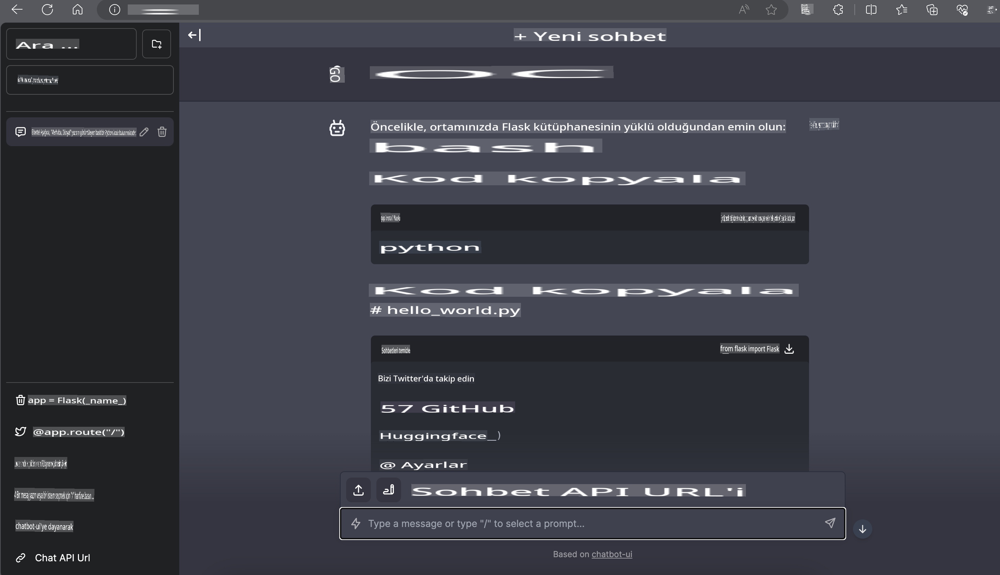

# **Nvidia Jetson'da Phi-3 Çıkarımı**

Nvidia Jetson, Nvidia'nın bir dizi gömülü bilgisayar kartıdır. Jetson TK1, TX1 ve TX2 modellerinin tamamı, Nvidia'nın ARM mimarisi merkezi işlem birimini (CPU) entegre eden Tegra işlemcisini (veya SoC) taşır. Jetson, düşük güç tüketimli bir sistemdir ve makine öğrenimi uygulamalarını hızlandırmak için tasarlanmıştır. Nvidia Jetson, tüm sektörlerde çığır açan yapay zeka ürünleri oluşturmak için profesyonel geliştiriciler tarafından, ayrıca öğrenciler ve meraklılar tarafından yapay zekayı deneyimlemek ve harika projeler üretmek için kullanılır. SLM, Jetson gibi uç cihazlara dağıtılır ve bu da endüstriyel üretken yapay zeka uygulama senaryolarının daha iyi uygulanmasını sağlar.

## NVIDIA Jetson Üzerinde Dağıtım:
Otonom robotik ve gömülü cihazlar üzerinde çalışan geliştiriciler, Phi-3 Mini'den yararlanabilir. Phi-3'ün nispeten küçük boyutu, onu uç dağıtımlar için ideal hale getirir. Eğitim sırasında parametreler titizlikle ayarlanmış olup, yanıtların yüksek doğruluğu sağlanmıştır.

### TensorRT-LLM Optimizasyonu:
NVIDIA'nın [TensorRT-LLM kütüphanesi](https://github.com/NVIDIA/TensorRT-LLM?WT.mc_id=aiml-138114-kinfeylo), büyük dil modeli çıkarımını optimize eder. Bu, Phi-3 Mini'nin uzun bağlam penceresini destekler ve hem verimliliği hem de gecikmeyi artırır. Optimizasyonlar arasında LongRoPE, FP8 ve uçuş sırasındaki toplu işleme gibi teknikler bulunur.

### Erişilebilirlik ve Dağıtım:
Geliştiriciler, 128K bağlam penceresiyle Phi-3 Mini'yi [NVIDIA'nın AI](https://www.nvidia.com/en-us/ai-data-science/generative-ai/) platformunda keşfedebilirler. Bu, standart bir API ile bir mikro hizmet olarak paketlenmiş olup her yerde dağıtılabilir. Ayrıca [GitHub'daki TensorRT-LLM uygulamalarına](https://github.com/NVIDIA/TensorRT-LLM) göz atabilirsiniz.

## **1. Hazırlık**

a. Jetson Orin NX / Jetson NX

b. JetPack 5.1.2+
   
c. Cuda 11.8
   
d. Python 3.8+

## **2. Jetson'da Phi-3'ü Çalıştırma**

[Ollama](https://ollama.com) veya [LlamaEdge](https://llamaedge.com) kullanabiliriz.

Eğer gguf'u hem bulutta hem de uç cihazlarda aynı anda kullanmak isterseniz, LlamaEdge, WasmEdge olarak anlaşılabilir (WasmEdge, bulut yerel, uç ve merkezi olmayan uygulamalar için uygun, hafif, yüksek performanslı ve ölçeklenebilir bir WebAssembly çalışma zamanı ortamıdır. Sunucusuz uygulamaları, gömülü işlevleri, mikro hizmetleri, akıllı sözleşmeleri ve IoT cihazlarını destekler. LlamaEdge aracılığıyla gguf'un nicel modelini uç cihazlara ve buluta dağıtabilirsiniz).


İşte kullanım adımları:

1. İlgili kütüphaneleri ve dosyaları yükleyin ve indirin

```bash

curl -sSf https://raw.githubusercontent.com/WasmEdge/WasmEdge/master/utils/install.sh | bash -s -- --plugin wasi_nn-ggml

curl -LO https://github.com/LlamaEdge/LlamaEdge/releases/latest/download/llama-api-server.wasm

curl -LO https://github.com/LlamaEdge/chatbot-ui/releases/latest/download/chatbot-ui.tar.gz

tar xzf chatbot-ui.tar.gz

```

**Not**: llama-api-server.wasm ve chatbot-ui aynı dizinde olmalıdır.

2. Terminalde komut dosyalarını çalıştırın

```bash

wasmedge --dir .:. --nn-preload default:GGML:AUTO:{Your gguf path} llama-api-server.wasm -p phi-3-chat

```

İşte çalıştırma sonucu:



***Örnek kod*** [Phi-3 Mini WASM Notebook Örneği](https://github.com/Azure-Samples/Phi-3MiniSamples/tree/main/wasm)

Sonuç olarak, Phi-3 Mini, dil modellemede verimlilik, bağlam farkındalığı ve NVIDIA'nın optimizasyon becerisini birleştirerek büyük bir adım ileriye taşır. İster robotlar ister uç uygulamalar geliştiriyor olun, Phi-3 Mini farkında olunması gereken güçlü bir araçtır.

**Feragatname**:  
Bu belge, yapay zeka tabanlı makine çeviri hizmetleri kullanılarak çevrilmiştir. Doğruluk için çaba göstersek de, otomatik çevirilerin hata veya yanlışlıklar içerebileceğini lütfen unutmayın. Belgenin orijinal dili, bağlayıcı ve otoriter kaynak olarak kabul edilmelidir. Kritik bilgiler için profesyonel insan çevirisi önerilir. Bu çevirinin kullanımından kaynaklanan yanlış anlamalar veya yanlış yorumlamalardan sorumlu değiliz.