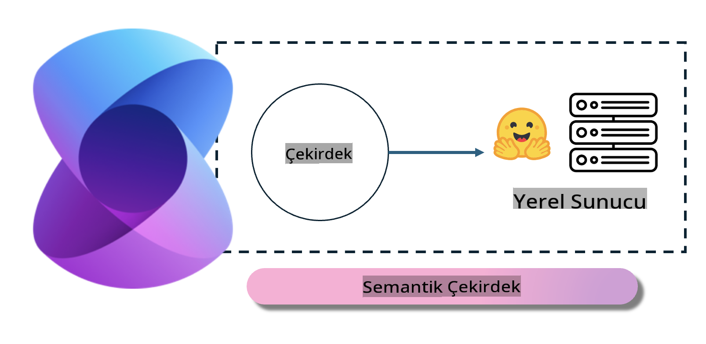
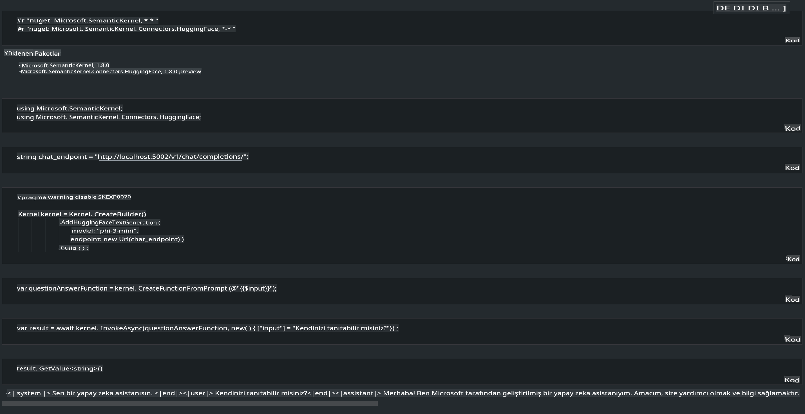

# **Yerel Sunucuda Phi-3 Çıkarımı**

Phi-3'ü bir yerel sunucuda dağıtabiliriz. Kullanıcılar [Ollama](https://ollama.com) veya [LM Studio](https://llamaedge.com) çözümlerini tercih edebilir ya da kendi kodlarını yazabilirler. Phi-3'ün yerel hizmetlerine [Semantic Kernel](https://github.com/microsoft/semantic-kernel?WT.mc_id=aiml-138114-kinfeylo) veya [Langchain](https://www.langchain.com/) aracılığıyla bağlanarak Copilot uygulamaları geliştirebilirsiniz.

## **Phi-3-mini'ye erişmek için Semantic Kernel kullanımı**

Copilot uygulamasında, uygulamaları Semantic Kernel / LangChain aracılığıyla oluşturuyoruz. Bu tür bir uygulama çerçevesi genellikle Azure OpenAI Service / OpenAI modelleriyle uyumludur ve aynı zamanda Hugging Face üzerindeki açık kaynaklı modelleri ve yerel modelleri de destekleyebilir. Peki, Phi-3-mini'ye erişmek için Semantic Kernel kullanmak istiyorsak ne yapmalıyız? .NET örneğini ele alırsak, bunu Semantic Kernel'deki Hugging Face Bağlayıcısı ile birleştirebiliriz. Varsayılan olarak, Hugging Face üzerindeki model kimliğiyle eşleşebilir (ilk kullanımda model Hugging Face'ten indirileceği için bu işlem uzun sürebilir). Ayrıca, yerel olarak oluşturulmuş hizmete de bağlanabilirsiniz. İkisi arasında karşılaştırma yaptığımızda, özellikle kurumsal uygulamalarda daha yüksek bir otonomi sunduğu için ikinci seçeneği kullanmanızı öneririz.

Şekilden de görüldüğü gibi, Semantic Kernel aracılığıyla yerel hizmetlere erişmek, kendi oluşturduğunuz Phi-3-mini model sunucusuna kolayca bağlanmanızı sağlar. İşte çalıştırma sonucu:

***Örnek Kod*** https://github.com/kinfey/Phi3MiniSamples/tree/main/semantickernel

**Feragatname**:  
Bu belge, yapay zeka tabanlı makine çeviri hizmetleri kullanılarak çevrilmiştir. Doğruluk için çaba göstersek de, otomatik çevirilerin hata veya yanlışlıklar içerebileceğini lütfen unutmayın. Belgenin orijinal dili, bağlayıcı kaynak olarak kabul edilmelidir. Kritik bilgiler için profesyonel insan çevirisi önerilir. Bu çevirinin kullanımından kaynaklanan yanlış anlama veya yanlış yorumlamalardan sorumlu değiliz.