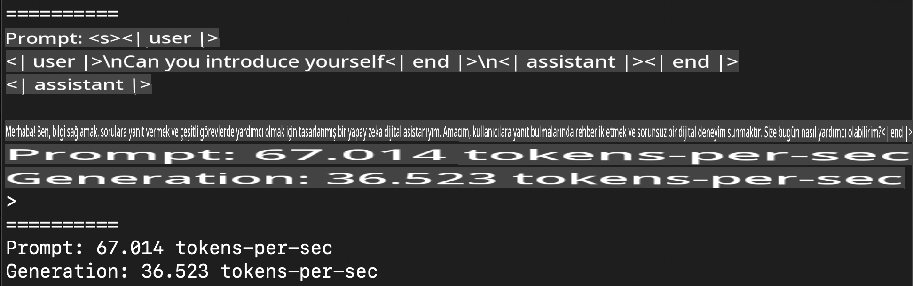
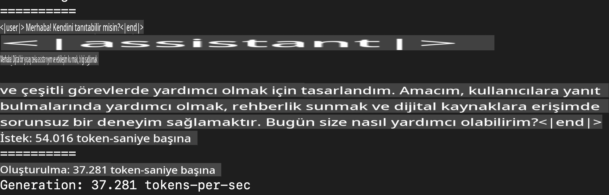
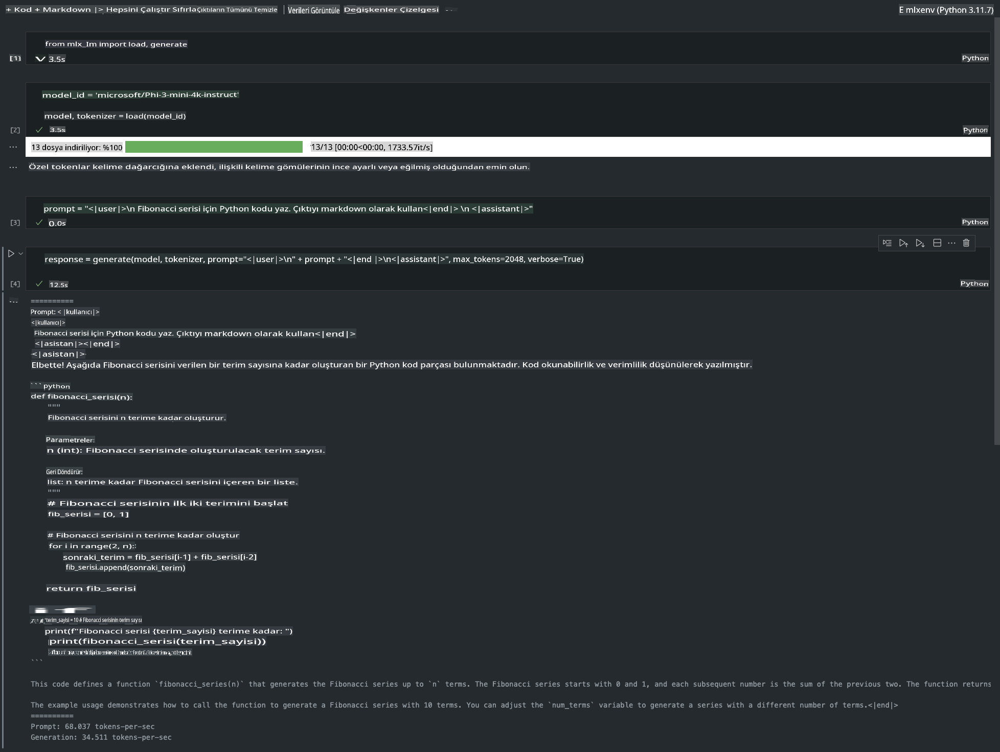

# **Apple MLX Framework ile Phi-3 Çıkarımı**

## **MLX Framework Nedir**

MLX, Apple silikon üzerinde makine öğrenimi araştırmaları için Apple makine öğrenimi araştırma ekibi tarafından sunulan bir dizi framework'tür.

MLX, makine öğrenimi araştırmacıları tarafından, makine öğrenimi araştırmacıları için tasarlanmıştır. Framework, kullanıcı dostu olacak şekilde tasarlanmış olsa da, modelleri eğitmek ve dağıtmak için hâlâ oldukça verimlidir. Framework'ün tasarımı da kavramsal olarak basittir. Araştırmacıların MLX'i kolayca genişletip geliştirmesini ve yeni fikirleri hızla keşfetmesini sağlamak amacıyla tasarlanmıştır.

Apple Silicon cihazlarında LLM'ler MLX aracılığıyla hızlandırılabilir ve modeller yerel olarak oldukça rahat bir şekilde çalıştırılabilir.

## **MLX Kullanarak Phi-3-mini Çıkarımı**

### **1. MLX ortamınızı kurun**

1. Python 3.11.x
2. MLX Kütüphanesini yükleyin

```bash

pip install mlx-lm

```

### **2. Terminalde MLX ile Phi-3-mini çalıştırma**

```bash

python -m mlx_lm.generate --model microsoft/Phi-3-mini-4k-instruct --max-token 2048 --prompt  "<|user|>\nCan you introduce yourself<|end|>\n<|assistant|>"

```

Sonuç (benim ortamım Apple M1 Max, 64GB) şu şekilde:



### **3. Terminalde MLX ile Phi-3-mini'yi Kuantize Etme**

```bash

python -m mlx_lm.convert --hf-path microsoft/Phi-3-mini-4k-instruct

```

***Not:*** Model, mlx_lm.convert aracılığıyla kuantize edilebilir ve varsayılan kuantizasyon INT4'tür. Bu örnek, Phi-3-mini'yi INT4'e kuantize eder.

Model, mlx_lm.convert aracılığıyla kuantize edilebilir ve varsayılan kuantizasyon INT4'tür. Bu örnek, Phi-3-mini'yi INT4'e kuantize eder. Kuantizasyondan sonra model varsayılan dizin olan ./mlx_model içinde saklanır.

MLX ile kuantize edilmiş modeli terminalden test edebiliriz.

```bash

python -m mlx_lm.generate --model ./mlx_model/ --max-token 2048 --prompt  "<|user|>\nCan you introduce yourself<|end|>\n<|assistant|>"

```

Sonuç şu şekildedir:



### **4. Jupyter Notebook ile MLX üzerinde Phi-3-mini çalıştırma**



***Not:*** Lütfen bu örneği okuyun [bu bağlantıya tıklayın](../../../../../code/03.Inference/MLX/MLX_DEMO.ipynb)

## **Kaynaklar**

1. Apple MLX Framework hakkında bilgi edinin [https://ml-explore.github.io](https://ml-explore.github.io/mlx/build/html/index.html)

2. Apple MLX GitHub Deposu [https://github.com/ml-explore](https://github.com/ml-explore)

**Feragatname**:  
Bu belge, makine tabanlı yapay zeka çeviri hizmetleri kullanılarak çevrilmiştir. Doğruluk için çaba göstersek de, otomatik çevirilerin hata veya yanlışlıklar içerebileceğini lütfen unutmayın. Belgenin orijinal dilindeki hali, yetkili kaynak olarak kabul edilmelidir. Kritik bilgiler için profesyonel bir insan çevirisi önerilir. Bu çevirinin kullanımından kaynaklanan herhangi bir yanlış anlama veya yanlış yorumlamadan sorumlu değiliz.