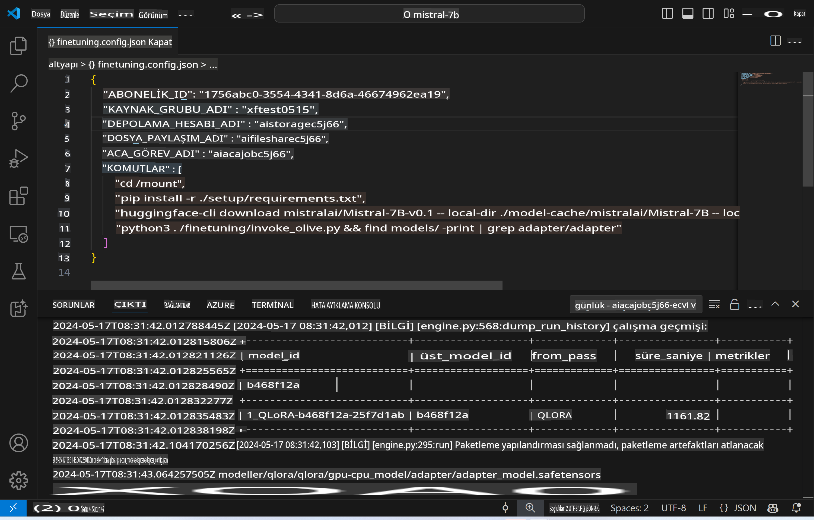
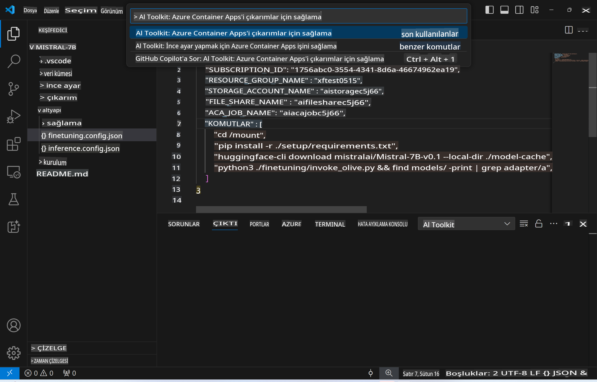
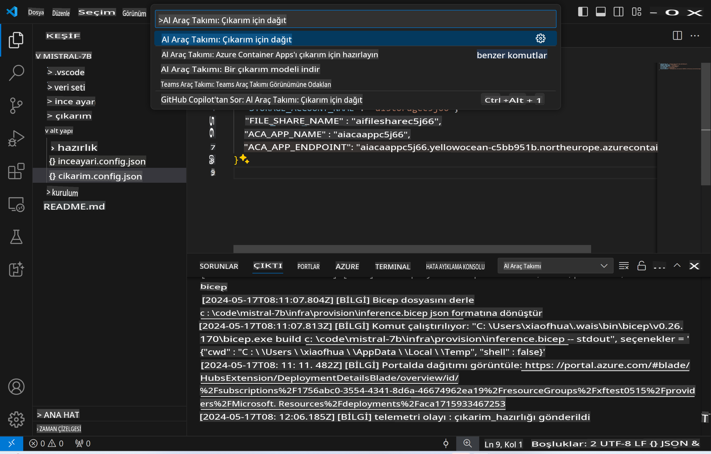

# İnce Ayarlı Model ile Uzaktan Çıkarım

Adaptörler uzaktan bir ortamda eğitildikten sonra, modelle etkileşim kurmak için basit bir Gradio uygulaması kullanabilirsiniz.



### Azure Kaynaklarını Hazırlama
Uzaktan çıkarım için Azure Kaynaklarını kurmanız gerekiyor. Bunun için komut paletinden `AI Toolkit: Provision Azure Container Apps for inference` komutunu çalıştırın. Bu işlem sırasında Azure Aboneliğinizi ve kaynak grubunuzu seçmeniz istenecek.  

   
Varsayılan olarak, çıkarım için kullanılan abonelik ve kaynak grubu, ince ayar için kullanılanlarla aynı olmalıdır. Çıkarım, aynı Azure Container App Environment'ını kullanacak ve ince ayar adımında oluşturulan Azure Files'ta depolanan model ve model adaptörüne erişecektir.

## AI Toolkit Kullanımı 

### Çıkarım için Dağıtım  
Eğer çıkarım kodunu güncellemek veya çıkarım modelini yeniden yüklemek isterseniz, `AI Toolkit: Deploy for inference` komutunu çalıştırın. Bu, en son kodunuzu ACA ile senkronize eder ve replikayı yeniden başlatır.  



Dağıtım başarıyla tamamlandıktan sonra model, bu uç noktayı kullanarak değerlendirmeye hazırdır.

### Çıkarım API'sine Erişim

Çıkarım API'sine, VSCode bildiriminde görüntülenen "*Çıkarım Uç Noktasına Git*" düğmesine tıklayarak erişebilirsiniz. Alternatif olarak, web API uç noktası `ACA_APP_ENDPOINT` altında, `./infra/inference.config.json` içinde ve çıktı panelinde bulunabilir.


> **Not:** Çıkarım uç noktasının tam olarak çalışır hale gelmesi birkaç dakika sürebilir.

## Şablonda Dahil Edilen Çıkarım Bileşenleri
 
| Klasör | İçerik |
| ------ |--------- |
| `infra` | Uzaktan işlemler için gerekli tüm yapılandırmaları içerir. |
| `infra/provision/inference.parameters.json` | Azure kaynaklarını sağlamak için kullanılan bicep şablonları için parametreleri barındırır. |
| `infra/provision/inference.bicep` | Azure kaynaklarını sağlamak için şablonları içerir. |
| `infra/inference.config.json` | `AI Toolkit: Provision Azure Container Apps for inference` komutuyla oluşturulan yapılandırma dosyası. Diğer uzaktan komut paletleri için giriş olarak kullanılır. |

### Azure Kaynak Sağlamayı Yapılandırmak için AI Toolkit Kullanımı
[AI Toolkit](https://marketplace.visualstudio.com/items?itemName=ms-windows-ai-studio.windows-ai-studio)'i yapılandırın.

Azure Container Apps'ı çıkarım için sağlamak` command.

You can find configuration parameters in `./infra/provision/inference.parameters.json` file. Here are the details:
| Parameter | Description |
| --------- |------------ |
| `defaultCommands` | This is the commands to initiate a web API. |
| `maximumInstanceCount` | This parameter sets the maximum capacity of GPU instances. |
| `location` | This is the location where Azure resources are provisioned. The default value is the same as the chosen resource group's location. |
| `storageAccountName`, `fileShareName` `acaEnvironmentName`, `acaEnvironmentStorageName`, `acaAppName`,  `acaLogAnalyticsName` | These parameters are used to name the Azure resources for provision. By default, they will be same to the fine-tuning resource name. You can input a new, unused resource name to create your own custom-named resources, or you can input the name of an already existing Azure resource if you'd prefer to use that. For details, refer to the section [Using existing Azure Resources](../../../../../md/01.Introduction/03). |

### Using Existing Azure Resources

By default, the inference provision use the same Azure Container App Environment, Storage Account, Azure File Share, and Azure Log Analytics that were used for fine-tuning. A separate Azure Container App is created solely for the inference API. 

If you have customized the Azure resources during the fine-tuning step or want to use your own existing Azure resources for inference, specify their names in the `./infra/inference.parameters.json` dosyasını kullanarak gerçekleştirilir. Ardından, komut paletinden `AI Toolkit: Provision Azure Container Apps for inference` komutunu çalıştırın. Bu, belirtilen kaynakları günceller ve eksik olanları oluşturur.

Örneğin, mevcut bir Azure konteyner ortamınız varsa, `./infra/finetuning.parameters.json` dosyanız şu şekilde görünmelidir:

```json
{
    "$schema": "https://schema.management.azure.com/schemas/2019-04-01/deploymentParameters.json#",
    "contentVersion": "1.0.0.0",
    "parameters": {
      ...
      "acaEnvironmentName": {
        "value": "<your-aca-env-name>"
      },
      "acaEnvironmentStorageName": {
        "value": null
      },
      ...
    }
  }
```

### Manuel Sağlama  
Azure kaynaklarını manuel olarak yapılandırmayı tercih ederseniz, `./infra/provision` folders. If you have already set up and configured all the Azure resources without using the AI Toolkit command palette, you can simply enter the resource names in the `inference.config.json` dosyasındaki sağlanan bicep dosyalarını kullanabilirsiniz.

Örneğin:

```json
{
  "SUBSCRIPTION_ID": "<your-subscription-id>",
  "RESOURCE_GROUP_NAME": "<your-resource-group-name>",
  "STORAGE_ACCOUNT_NAME": "<your-storage-account-name>",
  "FILE_SHARE_NAME": "<your-file-share-name>",
  "ACA_APP_NAME": "<your-aca-name>",
  "ACA_APP_ENDPOINT": "<your-aca-endpoint>"
}
```

**Feragatname**:  
Bu belge, makine tabanlı yapay zeka çeviri hizmetleri kullanılarak çevrilmiştir. Doğruluk için çaba göstersek de, otomatik çevirilerin hata veya yanlışlıklar içerebileceğini lütfen unutmayın. Belgenin orijinal dili, yetkili kaynak olarak kabul edilmelidir. Kritik bilgiler için profesyonel insan çevirisi önerilir. Bu çevirinin kullanımından kaynaklanan yanlış anlamalar veya yanlış yorumlamalar için sorumluluk kabul edilmez.