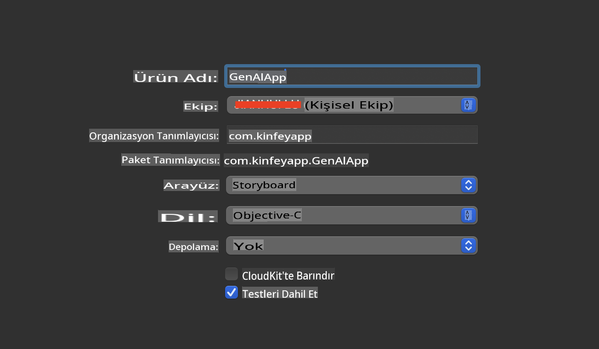
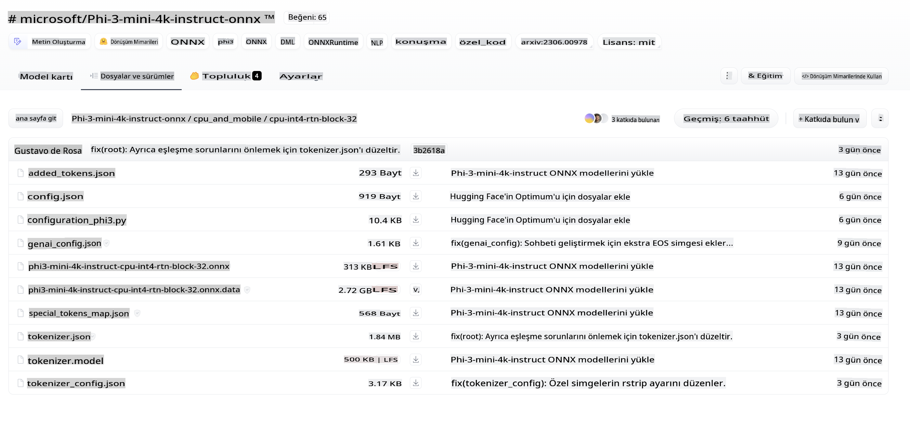
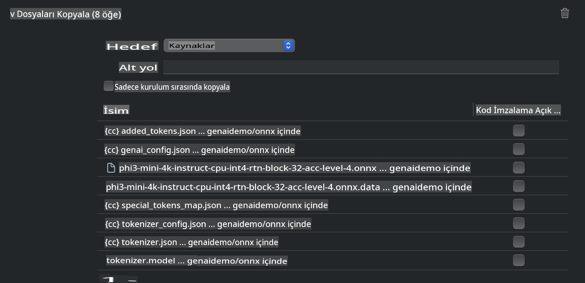
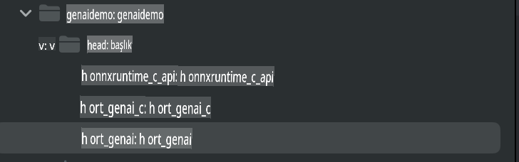
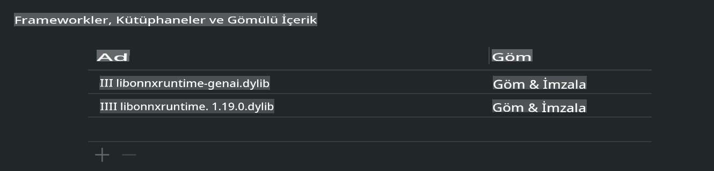
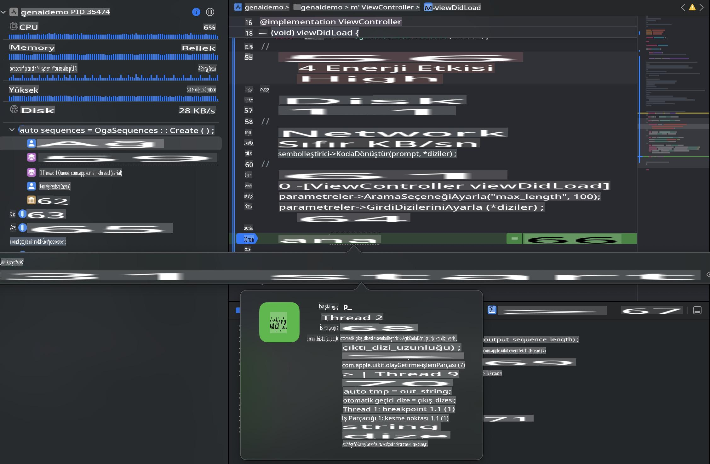

# **iOS'ta Phi-3 Çıkarımı**

Phi-3-mini, Microsoft'un Büyük Dil Modellerini (LLM'ler) uç cihazlar ve IoT cihazlarında çalıştırmayı mümkün kılan yeni bir model serisidir. Phi-3-mini, iOS, Android ve Uç Cihaz dağıtımları için kullanılabilir ve BYOD ortamlarında üretken yapay zekanın uygulanmasını sağlar. Aşağıdaki örnek, Phi-3-mini'nin iOS'ta nasıl dağıtılacağını göstermektedir.

## **1. Hazırlık**

- **a.** macOS 14+
- **b.** Xcode 15+
- **c.** iOS SDK 17.x (iPhone 14 A16 veya üstü)
- **d.** Python 3.10+ kurun (Conda önerilir)
- **e.** Python kütüphanesini yükleyin: `python-flatbuffers`
- **f.** CMake yükleyin

### Semantic Kernel ve Çıkarım

Semantic Kernel, Azure OpenAI Service, OpenAI modelleri ve yerel modellerle uyumlu uygulamalar oluşturmanıza olanak tanıyan bir uygulama çerçevesidir. Semantic Kernel aracılığıyla yerel hizmetlere erişmek, kendi barındırdığınız Phi-3-mini model sunucusuyla kolay entegrasyon sağlar.

### Ollama veya LlamaEdge ile Kuantize Modelleri Çağırma

Birçok kullanıcı, modelleri yerel olarak çalıştırmak için kuantize modelleri tercih eder. [Ollama](https://ollama.com) ve [LlamaEdge](https://llamaedge.com), farklı kuantize modelleri çağırmanıza olanak tanır:

#### **Ollama**

`ollama run phi3` modelini doğrudan çalıştırabilir veya çevrimdışı yapılandırabilirsiniz. `gguf` dosyanızın yolunu içeren bir Modelfile oluşturun. Phi-3-mini kuantize modelini çalıştırmak için örnek kod:

```gguf
FROM {Add your gguf file path}
TEMPLATE \"\"\"<|user|> .Prompt<|end|> <|assistant|>\"\"\"
PARAMETER stop <|end|>
PARAMETER num_ctx 4096
```

#### **LlamaEdge**

Eğer `gguf` modelini hem bulutta hem de uç cihazlarda aynı anda kullanmak istiyorsanız, LlamaEdge harika bir seçenektir.

## **2. iOS için ONNX Runtime Derleme**

```bash

git clone https://github.com/microsoft/onnxruntime.git

cd onnxruntime

./build.sh --build_shared_lib --ios --skip_tests --parallel --build_dir ./build_ios --ios --apple_sysroot iphoneos --osx_arch arm64 --apple_deploy_target 17.5 --cmake_generator Xcode --config Release

cd ../

```

### **Dikkat**

- **a.** Derlemeye başlamadan önce, Xcode'un doğru şekilde yapılandırıldığından emin olun ve terminalde aktif geliştirici dizini olarak ayarlayın:

    ```bash
    sudo xcode-select -switch /Applications/Xcode.app/Contents/Developer
    ```

- **b.** ONNX Runtime farklı platformlar için derlenmelidir. iOS için `arm64` or `x86_64` platformları için derleme yapabilirsiniz.

- **c.** Derleme için en son iOS SDK'yı kullanmanız önerilir. Ancak, önceki SDK'larla uyumluluk gerekiyorsa daha eski bir sürümü de kullanabilirsiniz.

## **3. iOS için ONNX Runtime ile Üretken Yapay Zekayı Derleme**

> **Not:** ONNX Runtime ile Üretken Yapay Zeka önizleme aşamasında olduğu için, potansiyel değişikliklere karşı dikkatli olun.

```bash

git clone https://github.com/microsoft/onnxruntime-genai
 
cd onnxruntime-genai
 
mkdir ort
 
cd ort
 
mkdir include
 
mkdir lib
 
cd ../
 
cp ../onnxruntime/include/onnxruntime/core/session/onnxruntime_c_api.h ort/include
 
cp ../onnxruntime/build_ios/Release/Release-iphoneos/libonnxruntime*.dylib* ort/lib
 
export OPENCV_SKIP_XCODEBUILD_FORCE_TRYCOMPILE_DEBUG=1
 
python3 build.py --parallel --build_dir ./build_ios --ios --ios_sysroot iphoneos --ios_arch arm64 --ios_deployment_target 17.5 --cmake_generator Xcode --cmake_extra_defines CMAKE_XCODE_ATTRIBUTE_CODE_SIGNING_ALLOWED=NO

```

## **4. Xcode'da bir App uygulaması oluşturma**

ONNX Runtime C++ API ile Üretken Yapay Zeka kullanırken, Objective-C'yi uygulama geliştirme yöntemi olarak seçtim, çünkü Objective-C daha iyi uyumluluk sağlıyor. Tabii ki, ilgili çağrıları Swift köprüsü aracılığıyla da tamamlayabilirsiniz.



## **5. ONNX kuantize INT4 modelini App uygulama projesine kopyalama**

ONNX formatında INT4 kuantizasyon modelini içe aktarmamız gerekiyor. Bunun için önce modeli indirmeniz gerekiyor.



İndirdikten sonra, projedeki Xcode'un Kaynaklar (Resources) dizinine eklemeniz gerekiyor.



## **6. ViewControllers'a C++ API'si ekleme**

> **Dikkat:**

- **a.** Projeye ilgili C++ başlık dosyalarını ekleyin.

  

- **b.** Objective-C++ desteğini etkinleştirmek için `onnxruntime-genai` dynamic library in Xcode.

  

- **c.** Use the C Samples code for testing. You can also add additional features like ChatUI for more functionality.

- **d.** Since you need to use C++ in your project, rename `ViewController.m` to `ViewController.mm` dosyasını dahil edin.

```objc

    NSString *llmPath = [[NSBundle mainBundle] resourcePath];
    char const *modelPath = llmPath.cString;

    auto model =  OgaModel::Create(modelPath);

    auto tokenizer = OgaTokenizer::Create(*model);

    const char* prompt = "<|system|>You are a helpful AI assistant.<|end|><|user|>Can you introduce yourself?<|end|><|assistant|>";

    auto sequences = OgaSequences::Create();
    tokenizer->Encode(prompt, *sequences);

    auto params = OgaGeneratorParams::Create(*model);
    params->SetSearchOption("max_length", 100);
    params->SetInputSequences(*sequences);

    auto output_sequences = model->Generate(*params);
    const auto output_sequence_length = output_sequences->SequenceCount(0);
    const auto* output_sequence_data = output_sequences->SequenceData(0);
    auto out_string = tokenizer->Decode(output_sequence_data, output_sequence_length);
    
    auto tmp = out_string;

```

## **7. Uygulamayı Çalıştırma**

Kurulum tamamlandıktan sonra, Phi-3-mini model çıkarım sonuçlarını görmek için uygulamayı çalıştırabilirsiniz.



Daha fazla örnek kod ve ayrıntılı talimatlar için [Phi-3 Mini Örnekleri deposunu](https://github.com/Azure-Samples/Phi-3MiniSamples/tree/main/ios) ziyaret edin.

**Feragatname**:  
Bu belge, makine tabanlı yapay zeka çeviri hizmetleri kullanılarak çevrilmiştir. Doğruluk için çaba göstersek de, otomatik çevirilerin hata veya yanlışlıklar içerebileceğini lütfen unutmayın. Orijinal belgenin kendi dilindeki versiyonu yetkili kaynak olarak kabul edilmelidir. Kritik bilgiler için profesyonel insan çevirisi önerilir. Bu çevirinin kullanımından kaynaklanan herhangi bir yanlış anlama veya yanlış yorumlama için sorumluluk kabul etmiyoruz.