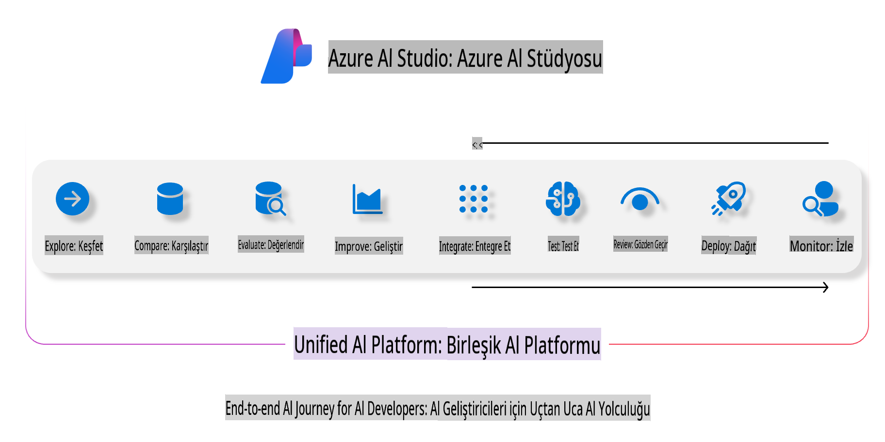
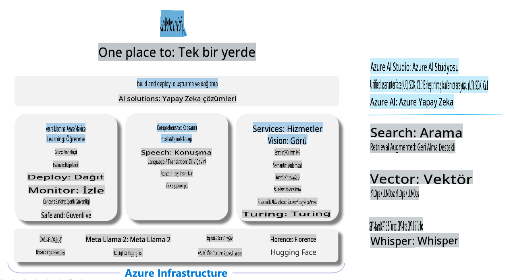

# **Azure AI Foundry ile Değerlendirme**

[Azure AI Foundry](https://ai.azure.com?WT.mc_id=aiml-138114-kinfeylo) kullanarak üretken yapay zeka uygulamanızı nasıl değerlendireceğinizi öğrenin. Tek yönlü veya çok yönlü konuşmaları değerlendiriyor olun, Azure AI Foundry model performansı ve güvenliği değerlendirmek için araçlar sunar.

## Azure AI Foundry ile Üretken Yapay Zeka Uygulamalarını Değerlendirme
Daha fazla ayrıntı için [Azure AI Foundry Belgeleri](https://learn.microsoft.com/azure/ai-studio/how-to/evaluate-generative-ai-app?WT.mc_id=aiml-138114-kinfeylo) sayfasına göz atın.

Başlamak için adımlar şunlardır:

## Azure AI Foundry'de Üretken Yapay Zeka Modellerini Değerlendirme

**Ön Koşullar**

- CSV veya JSON formatında bir test veri seti.
- Dağıtılmış bir üretken yapay zeka modeli (örneğin Phi-3, GPT 3.5, GPT 4 veya Davinci modelleri).
- Değerlendirme çalıştırmak için bir hesaplama örneği içeren bir çalışma zamanı.

## Yerleşik Değerlendirme Metrikleri

Azure AI Foundry, hem tek yönlü hem de karmaşık, çok yönlü konuşmaları değerlendirmenize olanak tanır.  
Modelin belirli verilere dayandığı Retrieval Augmented Generation (RAG) senaryolarında performansı yerleşik değerlendirme metrikleriyle ölçebilirsiniz.  
Ayrıca genel tek yönlü soru-cevap senaryolarını (RAG olmayan) da değerlendirebilirsiniz.

## Değerlendirme Çalıştırması Oluşturma

Azure AI Foundry arayüzünden, Evaluate sayfasına veya Prompt Flow sayfasına gidin.  
Değerlendirme oluşturma sihirbazını takip ederek bir değerlendirme çalıştırması oluşturun. Değerlendirme için isteğe bağlı bir ad sağlayabilirsiniz.  
Uygulamanızın hedefleriyle uyumlu olan senaryoyu seçin.  
Model çıktısını değerlendirmek için bir veya daha fazla değerlendirme metriği seçin.

## Özel Değerlendirme Akışı (Opsiyonel)

Daha fazla esneklik için özel bir değerlendirme akışı oluşturabilirsiniz. Değerlendirme sürecini belirli gereksinimlerinize göre özelleştirin.

## Sonuçları Görüntüleme

Değerlendirme çalıştırıldıktan sonra, Azure AI Foundry'de ayrıntılı değerlendirme metriklerini kaydedin, görüntüleyin ve analiz edin.  
Uygulamanızın yetenekleri ve sınırlamaları hakkında içgörüler elde edin.

**Not** Azure AI Foundry şu anda herkese açık önizlemede olduğundan, deney ve geliştirme amaçları için kullanın. Üretim iş yükleri için diğer seçenekleri değerlendirin. Daha fazla ayrıntı ve adım adım talimatlar için resmi [AI Foundry belgelerini](https://learn.microsoft.com/azure/ai-studio/?WT.mc_id=aiml-138114-kinfeylo) keşfedin.

**Feragatname**:  
Bu belge, yapay zeka tabanlı makine çeviri hizmetleri kullanılarak çevrilmiştir. Doğruluk için çaba göstersek de, otomatik çevirilerin hata veya yanlışlıklar içerebileceğini lütfen unutmayın. Belgenin orijinal dilindeki hali, yetkili kaynak olarak kabul edilmelidir. Kritik bilgiler için profesyonel insan çevirisi önerilir. Bu çevirinin kullanımından kaynaklanan yanlış anlama veya yanlış yorumlamalardan sorumlu değiliz.