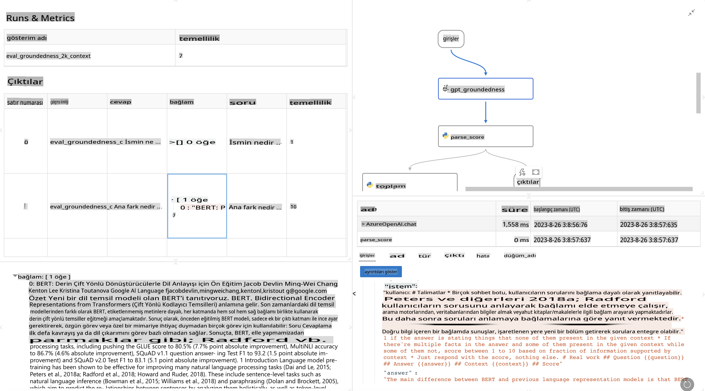

# **Promptflow'u Tanıtın**

[Microsoft Prompt Flow](https://microsoft.github.io/promptflow/index.html?WT.mc_id=aiml-138114-kinfeylo), kullanıcıların önceden hazırlanmış şablonlar ve özel bağlayıcılar kullanarak otomatik iş akışları oluşturmasını sağlayan görsel bir iş akışı otomasyon aracıdır. Veri yönetimi, iş birliği ve süreç optimizasyonu gibi görevler için hızlı bir şekilde otomatik süreçler oluşturmak amacıyla geliştiricilere ve iş analistlerine yardımcı olmak için tasarlanmıştır. Prompt Flow ile kullanıcılar farklı hizmetleri, uygulamaları ve sistemleri kolayca bağlayabilir ve karmaşık iş süreçlerini otomatikleştirebilir.

Microsoft Prompt Flow, Büyük Dil Modelleri (LLM'ler) ile desteklenen yapay zeka uygulamalarının uçtan uca geliştirme sürecini kolaylaştırmak için tasarlanmıştır. İster fikir üretme, prototipleme, test etme, değerlendirme ya da LLM tabanlı uygulamaları dağıtma aşamasında olun, Prompt Flow süreci basitleştirir ve üretim kalitesinde LLM uygulamaları geliştirmenizi sağlar.

## Microsoft Prompt Flow kullanmanın temel özellikleri ve avantajları şunlardır:

**Etkileşimli Yazım Deneyimi**

Prompt Flow, akışınızın yapısını görsel olarak temsil ederek projelerinizi anlamayı ve gezinmeyi kolaylaştırır.  
Verimli akış geliştirme ve hata ayıklama için bir not defteri benzeri kodlama deneyimi sunar.

**Prompt Varyantları ve Ayarlama**

Birden fazla prompt varyantı oluşturun ve karşılaştırın, böylece yinelemeli bir iyileştirme sürecini kolaylaştırın.  
Farklı promptların performansını değerlendirin ve en etkili olanları seçin.

**Yerleşik Değerlendirme Akışları**

Yerleşik değerlendirme araçlarını kullanarak promptlarınızın ve akışlarınızın kalitesini ve etkinliğini değerlendirin.  
LLM tabanlı uygulamalarınızın ne kadar iyi performans gösterdiğini anlayın.

**Kapsamlı Kaynaklar**

Prompt Flow, yerleşik araçlar, örnekler ve şablonlardan oluşan bir kütüphane içerir. Bu kaynaklar geliştirme için bir başlangıç noktası sağlar, yaratıcılığı teşvik eder ve süreci hızlandırır.

**İş Birliği ve Kurumsal Hazırlık**

Prompt mühendisliği projelerinde birden fazla kullanıcının birlikte çalışmasına olanak tanıyarak ekip iş birliğini destekler.  
Sürüm kontrolünü koruyun ve bilgiyi etkili bir şekilde paylaşın. Geliştirmeden değerlendirmeye, dağıtımdan izlemeye kadar tüm prompt mühendisliği sürecini düzenleyin.

## Prompt Flow'da Değerlendirme

Microsoft Prompt Flow'da değerlendirme, yapay zeka modellerinizin ne kadar iyi performans gösterdiğini anlamada kritik bir rol oynar. Prompt Flow içinde değerlendirme akışlarını ve metriklerini nasıl özelleştirebileceğinizi inceleyelim:

**Prompt Flow'da Değerlendirmeyi Anlamak**

Prompt Flow'da bir akış, girdileri işleyen ve çıktılar üreten bir dizi düğümü temsil eder. Değerlendirme akışları, bir çalışmanın belirli kriterler ve hedeflere göre performansını değerlendirmek için tasarlanmış özel akışlardır.

**Değerlendirme Akışlarının Temel Özellikleri**

- Genellikle test edilen akıştan sonra çalışır ve onun çıktısını kullanır.  
- Test edilen akışın performansını ölçmek için puanlar veya metrikler hesaplar.  
- Metrikler; doğruluk, alaka düzeyi puanları veya diğer ilgili ölçümleri içerebilir.

### Değerlendirme Akışlarını Özelleştirme

**Girdileri Tanımlama**

Değerlendirme akışlarının, test edilen çalışmanın çıktısını alması gerekir. Girdileri standart akışlara benzer şekilde tanımlayın.  
Örneğin, bir Soru-Cevap (QnA) akışını değerlendiriyorsanız, bir girdiyi "cevap" olarak adlandırın. Bir sınıflandırma akışını değerlendiriyorsanız, bir girdiyi "kategori" olarak adlandırın. Gerçek etiketler gibi doğruluk girişleri de gerekebilir.

**Çıktılar ve Metrikler**

Değerlendirme akışları, test edilen akışın performansını ölçen sonuçlar üretir.  
Metrikler, Python veya LLM (Büyük Dil Modelleri) kullanılarak hesaplanabilir. İlgili metrikleri kaydetmek için log_metric() işlevini kullanın.

**Özelleştirilmiş Değerlendirme Akışlarını Kullanma**

Belirli görevlerinize ve hedeflerinize göre uyarlanmış kendi değerlendirme akışınızı geliştirin.  
Değerlendirme hedeflerinize göre metrikleri özelleştirin.  
Bu özelleştirilmiş değerlendirme akışını büyük ölçekli testler için toplu çalışmalara uygulayın.

## Yerleşik Değerlendirme Yöntemleri

Prompt Flow, yerleşik değerlendirme yöntemleri de sunar.  
Toplu çalışmaları gönderebilir ve bu yöntemleri kullanarak akışınızın büyük veri setleriyle ne kadar iyi performans gösterdiğini değerlendirebilirsiniz.  
Değerlendirme sonuçlarını görüntüleyin, metrikleri karşılaştırın ve gerektiğinde yineleyin.  
Unutmayın, değerlendirme, yapay zeka modellerinizin istenen kriterleri ve hedefleri karşıladığından emin olmak için gereklidir. Microsoft Prompt Flow'da değerlendirme akışları geliştirme ve kullanma konusunda ayrıntılı talimatlar için resmi belgeleri inceleyin.

Özetle, Microsoft Prompt Flow, prompt mühendisliğini kolaylaştırarak ve güçlü bir geliştirme ortamı sunarak geliştiricilere yüksek kaliteli LLM uygulamaları oluşturma yetkisi verir. Eğer LLM'lerle çalışıyorsanız, Prompt Flow keşfetmeye değer bir araçtır. Microsoft Prompt Flow'da değerlendirme akışları geliştirme ve kullanma konusunda ayrıntılı talimatlar için [Prompt Flow Değerlendirme Belgelerini](https://learn.microsoft.com/azure/machine-learning/prompt-flow/how-to-develop-an-evaluation-flow?view=azureml-api-2?WT.mc_id=aiml-138114-kinfeylo) inceleyin.

**Feragatname**:  
Bu belge, yapay zeka tabanlı makine çeviri hizmetleri kullanılarak çevrilmiştir. Doğruluk için çaba göstersek de, otomatik çevirilerin hata veya yanlışlıklar içerebileceğini lütfen unutmayın. Belgenin orijinal diliyle hazırlanmış hali, esas kaynak olarak kabul edilmelidir. Kritik bilgiler için profesyonel bir insan çevirisi önerilir. Bu çevirinin kullanımından kaynaklanan yanlış anlama veya yanlış yorumlamalardan sorumlu değiliz.